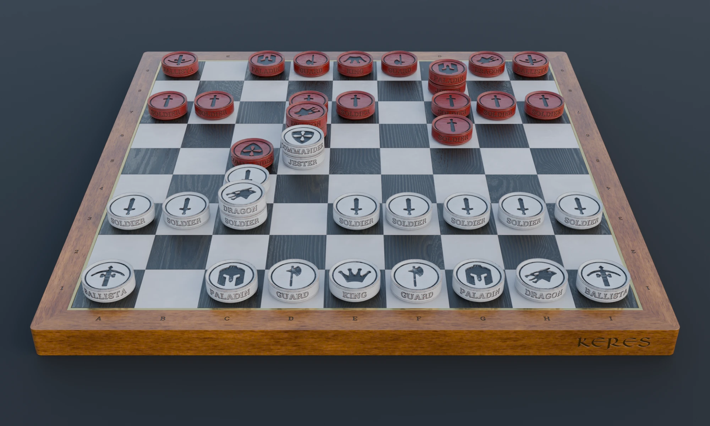

# Keres Platform


The web platform for **[Keres](https://playkeres.com)**, an original
abstract strategy game: user accounts, game sessions, and an SVG board
renderer, talking to the [Rust game engine](https://github.com/VincentChalnot/keres)
over a binary HTTP API. This platform is **game-agnostic by design** — it
never interprets game rules, it only stores and forwards what the engine
produces.

🎮 **[Play now at playkeres.com](https://playkeres.com)**



---

## Part of the Keres project

Keres is split across three repositories:

| Repo                                                                       | What                                    | License    |
|-----------------------------------------------------------------------------|------------------------------------------|------------|
| [keres](https://github.com/VincentChalnot/keres)                             | Rust game engine + Negamax AI            | GPLv3      |
| **keres-platform** (this repo)                                                | Symfony backend + TypeScript/SVG client  | Proprietary |
| [keres-website](https://github.com/VincentChalnot/keres-website)             | Hugo marketing site (playkeres.com)      | Proprietary |

## What makes this technically interesting

### The game engine is fully decoupled

Symfony never interprets game state — it stores and forwards raw
binary-serialized move sequences produced by the Rust engine. This means the
platform is game-agnostic by design: swapping in a different combinatorial
game would only require a new engine build speaking the same wire protocol,
not a rewrite of the platform. See `AGENTS.md` and the engine's
[`docs/PROTOCOL.md`](https://github.com/VincentChalnot/keres/blob/main/docs/PROTOCOL.md)
for the exact byte layout.

### Real-time via Mercure

Multiplayer updates are pushed server-side via [Mercure](https://mercure.rocks/),
embedded in FrankenPHP's Caddy. AI moves are computed asynchronously
(Symfony Messenger) and pushed to the client over SSE — no polling.

### SVG rendering pipeline

The board and pieces are rendered entirely in SVG, generated from
TypeScript (`assets/typescript/`). Rendering is optimized to update the DOM
minimally on each move. A Three.js renderer with custom glTF assets is in
development for a more immersive perspective view (`assets/typescript/src/views/ThreeJSBoardView.ts`,
currently inactive).

## Stack

| Layer       | Technology                      | Notes                                    |
|-------------|----------------------------------|--------------------------------------------|
| Backend     | Symfony 7.4 / PHP 8.4            | FrankenPHP + Caddy application server      |
| Database    | PostgreSQL                        | Doctrine ORM, migrations in `migrations/`  |
| Frontend    | TypeScript + SVG                  | Vite build, no framework                    |
| 3D renderer | Three.js + glTF                    | In development, inactive by default         |
| Real-time   | Mercure                            | Server-sent events                          |
| Async jobs  | Symfony Messenger                  | AI move computation                          |
| Engine      | External (Rust, separate repo)      | Binary HTTP API, see `BACKEND_API_URL`       |

## Development

Everything runs in Docker — never run PHP or npm on the host.

```bash
# Prereqs: external Traefik on a `proxy` network, *.local.playkeres.com → 127.0.0.1
cp .env.example .env
docker network create proxy 2>/dev/null || true
docker compose up --build -d
# https://app.local.playkeres.com       → Symfony / FrankenPHP
# https://vite.app.local.playkeres.com  → Vite HMR (WSS)
# https://mail.local.playkeres.com      → Mailpit UI
```

The `backend` service pulls the published engine image
(`ghcr.io/vincentchalnot/keres/backend`) rather than building the engine from
source — this repo does not vendor the engine. See `.env.example` for how to
point at a different engine build, and `AGENTS.md` for the full dev workflow
(PHP/TypeScript commands, code style, dev login bypass for browser testing).

To reproduce the production topology locally (static site + app on the same
domain), also run [keres-website](https://github.com/VincentChalnot/keres-website)'s
`compose.yaml` with the same `SERVER_NAME`.

Production deployment artifacts live in `deploy/`. See `deploy/README.md`
for ops details.

## License

Proprietary — see [`LICENSE`](LICENSE). All rights reserved.

*Solo project by [Vincent Chalnot](https://github.com/VincentChalnot).*
