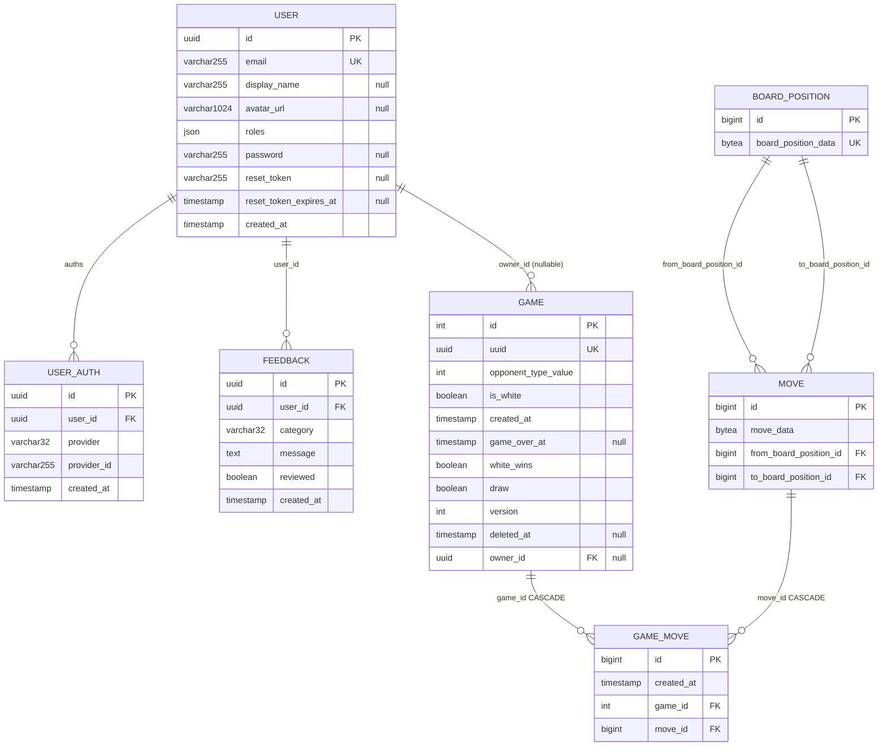
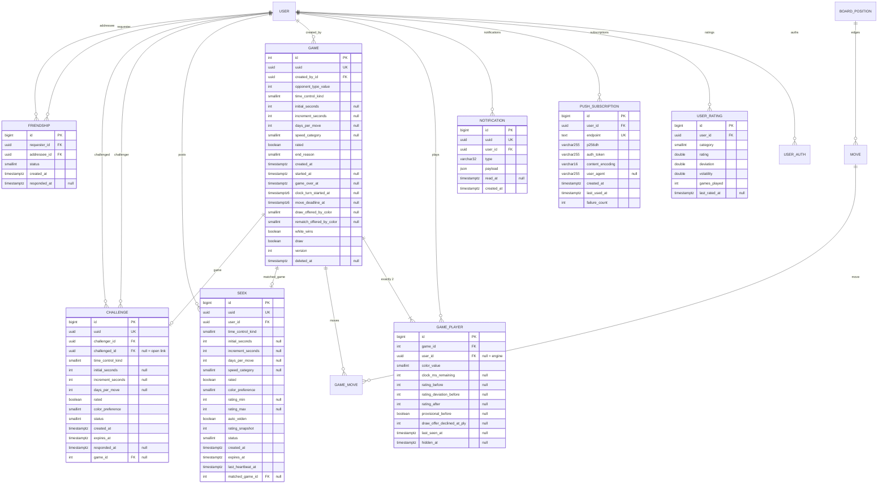

# Domain Model - entities, columns, indexes, migrations

> Elaborates `00-overview.md` sec. 4 (core model decisions), sec. 5 (phase-zero) and sec. 6
> (conventions). Where this file and the contract disagree, the contract wins.
> Sibling chapters own behaviour; this file owns *shape*. Clock semantics are in
> `03-time-control.md`, pairing in `04-matchmaking.md`, Glicko-2 in
> `06-rating.md`, routes in `09-api-reference.md`, migration sequencing across
> phases in `10-delivery-plan.md`.

---

## 1. Current schema, as built

### 1.1 Migration timeline

| # | File | Effect |
|---|---|---|
| 1 | `Version20260203141243` | Creates `board_position`, `game`, `game_move`, `move`; `game.id` is `INT GENERATED BY DEFAULT AS IDENTITY` (`:25`), the other three are `BIGINT` |
| 2 | `Version20260204095300` | Creates `messenger_messages` (`BIGSERIAL`, `:23`) with indexes on `queue_name`, `available_at`, `delivered_at` |
| 3 | `Version20260325150000` | `game.version INT NOT NULL DEFAULT 1` - optimistic lock (`:22`) |
| 4 | `Version20260325150001` | `game.deleted_at TIMESTAMP(0) WITHOUT TIME ZONE NULL` - soft delete (`:19`) |
| 5 | `Version20260327163300` | Creates `"user"` (UUID PK) with `provider`/`provider_id` inline (`:19`) |
| 6 | `Version20260327163301` | `game.owner_id UUID NULL` + FK + `IDX_232B318C7E3C61F9` (`:19-22`) |
| 7 | `Version20260428120000` | Creates `user_auth`, copies `provider`/`provider_id` across (`:33-34`), drops both columns from `"user"` (`:36-37`) |
| 8 | `Version20260713120000` | Creates `feedback` |
| 9 | `Version20260722201821` | `feedback.reviewed`; `"user".password`, `.reset_token`, `.reset_token_expires_at` |

Every timestamp column created so far is `TIMESTAMP(0) WITHOUT TIME ZONE` -
Doctrine's `datetime_immutable` on PostgreSQL
(`vendor/doctrine/dbal/src/Platforms/PostgreSQLPlatform.php:610-613`). The
values are UTC: `frankenphp/conf.d/10-app.ini:2` sets `date.timezone = UTC`, so
every `new \DateTimeImmutable()` in the codebase produces UTC. This fact is what
makes sec. 6.4's `AT TIME ZONE 'UTC'` conversion safe.

### 1.2 Today's tables



Indexes as built: `UNIQ_D6DBE74C70C3F7F9(board_position_data)`,
`UNIQ_232B318CD17F50A6(game.uuid)`, `IDX_232B318C7E3C61F9(game.owner_id)`,
`IDX_42B5B54E48FD905(game_move.game_id)`, `IDX_42B5B546DC541A8(game_move.move_id)`,
`move_unique_idx(move_data, from_board_position_id)`,
`UNIQ_8D93D649E7927C74("user".email)`, `uniq_user_auth_provider(user_id, provider)`,
`IDX_D2913DE2A76ED395(feedback.user_id)`.

### 1.3 Which assumptions break under two human players

| # | Assumption | Where it lives | Why it breaks |
|---|---|---|---|
| A1 | A game has one player | `Game::$owner` (`src/Entity/Game.php:54-56`), non-null in the constructor signature (`:71`) | Two humans need two distinct identities per game, plus a slot for "engine" |
| A2 | Colour is a boolean about the owner | `Game::$isWhite` (`:32-33`) | With two humans there is no privileged side; "is white" has no referent |
| A3 | Access == ownership | `GameVoter::voteOnAttribute()` returns `$user === $subject->getOwner()` (`src/Security/Voter/GameVoter.php:36`) | The opponent gets 403 on every endpoint. Also: a game with `owner_id IS NULL` is inaccessible to *everyone*, which sec. 6.2 exploits |
| A4 | Turn enforcement is AI-only | `SubmitMoveAction.php:68` gates on `OpponentType::AI === $game->getOpponentType()` | Either human could push both sides' moves |
| A5 | Owner-perspective outcome is computable in SQL | `AdminStatsRepository::getOutcomeDistribution()` (`:53-54`), `getUserStats()` (`:138-139`), `UserListAction.php:53-55` - all `(g.isWhite = true AND g.whiteWins = true) OR ...` | Both columns disappear; and "win from whose perspective" needs a join |
| A6 | Soft delete is per game | `game.deleted_at`, written by `DeleteGameAction.php:40` | One player hiding a game must not remove it from the opponent's list |
| A7 | Nothing on `game` changes per move | `GameEngine::applyMove()` hand-rolls `UPDATE game SET version = version + 1 ...` only when `Game` is *clean* (`src/Engine/GameEngine.php:66-76`) | A clock writes `game` on every move, making that branch dead. See `03-time-control.md` sec. 6 |
| A8 | `Game::getVersion()` is fresh after a move | The raw `UPDATE` at `src/Engine/GameEngine.php:68-71` never writes back to the entity, and `$version` has no setter (`src/Entity/Game.php:47-49,168-171`) | `GameStatePayload.seq` (== `Game.version`, contract sec. invariant 9) would be stale by one on every non-terminal move |
| A9 | Deleted games are still findable | `GameRepository::findByUuid()` omits `deletedAt IS NULL` (`src/Repository/GameRepository.php:23-30`) | A hidden game stays playable by UUID; fixed in P0.2 |
| A10 | `game.created_at` is a usable clock anchor | Only per-move timestamp is `game_move.created_at`, stamped in `GameMove::__construct()` (`src/Entity/GameMove.php:34`) which runs *after* `EngineApi::replayMoves()` returns (`src/Engine/GameEngine.php:38` then `:51`) | The untimed engine round trip is inside the measured interval |

---

## 2. Conventions this chapter follows

### 2.1 Enum backing - int column plus accessor

The codebase already has both spellings, one per backing type, and this spec
keeps them in their existing lanes rather than adding a third:

| Backing | Convention | Precedent |
|---|---|---|
| `int` | `#[ORM\Column(type: Types::SMALLINT)] private int $xValue;` plus `getX(): XEnum { return XEnum::from($this->xValue); }`. **No `enumType`.** | `Game::$opponentTypeValue` (`src/Entity/Game.php:29-30`) + `Game::getOpponentType()` (`:108-111`) |
| `string` | `#[ORM\Column(type: Types::STRING, length: 32, enumType: X::class)]` | `Feedback::$category` (`src/Entity/Feedback.php:21-22`) |

So `PieceColor`, `TimeControlKind`, `SpeedCategory`, `GameEndReason`,
`ColorPreference`, `ChallengeStatus`, `SeekStatus`, `FriendshipStatus` and
`OpponentType` are int columns with accessors; `NotificationType` (string-backed
per the contract) uses `enumType`. Its case values are the **lowercase
snake_case wire strings**: `NotificationType::CHALLENGE_RECEIVED = 'challenge_received'`,
so the stored column, the `UserEventPayload.type` field and the Web Push
`type` are one string with no mapping table (`02-realtime.md` sec. 4.0).

Two reasons the int lane is worth keeping, beyond consistency:

1. **Hydration is not a failure point.** With `enumType`, an out-of-range int in
   *any* selected row throws during hydration. With the accessor, an unknown
   value only fails when that specific field is read - which matters during a
   rolling deploy where a worker on the old image reads rows written by the new
   one.
2. **Raw SQL and DQL speak ints.** Every backfill in sec. 6, the partial-index
   predicates in sec. 5, and the surviving admin aggregates in sec. 7 compare against
   literal ints. `enumType` does not change the stored representation, but it
   makes the entity-side and SQL-side spellings diverge for no gain.

Storage width: `SMALLINT` for every new enum column (contract). `Game.opponent_type_value`
stays `INT` - it already exists and narrowing it is a table rewrite for two bytes.

### 2.2 Identifiers

Per contract sec. 6: `Uuid` for externally addressable rows, identity `BIGINT` for
internal rows. Concretely, three gotchas:

- **`game.id` is `INT`, not `BIGINT`** (`Version20260203141243.php:25`). Every FK
  pointing at it - `game_player.game_id`, `seek.matched_game_id`,
  `challenge.game_id` - must be declared `INT`. Only the *owning* ids of the new
  tables are 64-bit.
- **`"user".id` is `UUID`**, so every `user_id` FK is `UUID`.
- `config/packages/doctrine.yaml:17-18` pins
  `identity_generation_preferences: PostgreSQLPlatform: identity`, so new PKs are
  spelled `BIGINT GENERATED BY DEFAULT AS IDENTITY`, not `BIGSERIAL`. The
  contract's "BIGSERIAL" means "64-bit auto-increment"; `IDENTITY` is the
  repo's spelling of it.

### 2.3 Timestamps

New columns are `TIMESTAMP(0) WITH TIME ZONE` via `Types::DATETIMETZ_IMMUTABLE`
(`vendor/doctrine/dbal/src/Platforms/PostgreSQLPlatform.php:618-621`).

**Microsecond columns need a custom type.** `clock_turn_started_at` and
`move_deadline_at` are `timestamptz(6)` in the contract, and stock Doctrine
cannot express that:

- `getDateTimeTzTypeDeclarationSQL()` ignores its `$column` argument and hard-codes
  `(0)` (`:618-621`).
- `DateTimeTzImmutableType::convertToDatabaseValue()` formats with
  `$platform->getDateTimeTzFormatString()`
  (`vendor/doctrine/dbal/src/Types/DateTimeTzImmutableType.php:39`), which for
  PostgreSQL is `'Y-m-d H:i:sO'` (`PostgreSQLPlatform.php:680-683`) - **no `u`**,
  so microseconds never reach the database.
- The read path parses with the same format and throws `InvalidFormat` otherwise
  (`DateTimeTzImmutableType.php:62-72`), so a value written with microseconds by
  raw SQL does not round-trip. *[INFERENCE: `createFromFormat('Y-m-d H:i:sO', '... 00.123456+00')` returns `false` because `O` meets `.`; the truncation on write is not an inference.]*

`columnDefinition:` fixes only the DDL (ORM passes it through at
`vendor/doctrine/orm/src/Tools/SchemaTool.php:494-496`), not the conversion.
Therefore register one custom type, `App\Doctrine\Types\TimestampTzMicroType`
(new directory; `src/Doctrine/` does not exist yet):

```php
final class TimestampTzMicroType extends DateTimeTzImmutableType
{
    public const string NAME = 'timestamptz_micro';
    private const string FORMAT = 'Y-m-d H:i:s.uP';

    public function getSQLDeclaration(array $column, AbstractPlatform $platform): string
    {
        return 'TIMESTAMP(6) WITH TIME ZONE';
    }

    public function convertToDatabaseValue(mixed $value, AbstractPlatform $platform): ?string
    {
        return $value?->format(self::FORMAT);   // InvalidType guard as in the parent
    }

    public function convertToPHPValue(mixed $value, AbstractPlatform $platform): ?\DateTimeImmutable
    {
        // createFromFormat(self::FORMAT), falling back to the parent format so
        // rows written before this type existed still hydrate.
    }
}
```

Registered in `config/packages/doctrine.yaml` under
`dbal: types: { timestamptz_micro: App\Doctrine\Types\TimestampTzMicroType }`.
This is a prerequisite of migration sec. 6.4, not part of it.

### 2.4 Naming and index declaration

`naming_strategy: doctrine.orm.naming_strategy.underscore_number_aware`
(`config/packages/doctrine.yaml:16`) applies
`preg_replace('/(?<=[a-z0-9])([A-Z])/', '_$1', ...)` then lowercases
(`vendor/doctrine/orm/src/Mapping/UnderscoreNamingStrategy.php:98-107`). So
`clockMsRemaining` -> `clock_ms_remaining`, `p256dh` -> `p256dh` (no uppercase,
untouched), `daysPerMove` -> `days_per_move`.

Partial indexes are fully supported: `PostgreSQLPlatform::supportsPartialIndexes()`
returns `true` (`:142-145`), `AbstractPlatform::getPartialIndexSQL()` emits the
predicate from `options['where']` (`:1226-1232`), `Index::samePartialIndex()`
compares it in diffs (`vendor/doctrine/dbal/src/Schema/Index.php:715-726`), and
introspection reads it back via `pg_get_expr(indpred, indrelid)`
(`vendor/doctrine/dbal/src/Schema/PostgreSQLSchemaManager.php:432`). Declare them
as `#[ORM\Index(name: ..., columns: [...], options: ['where' => '...'])]`.

**Expression indexes are invisible to Doctrine.** `selectIndexColumns()` joins
`pg_attribute ON a.attnum = keys.attnum` (`PostgreSQLSchemaManager.php:440-442`);
an expression key has `indkey = 0`, which matches no `pg_attribute` row, so the
index yields no rows and never appears in a diff. *[INFERENCE, from the query
shape.]* This is why `LOWER(username)` and the `LEAST/GREATEST` friendship index
(sec. 5) are safe to create in raw SQL: `doctrine:migrations:diff` will neither
recreate nor drop them. They must be documented here because nothing else
records their existence.

**Workflow for every migration in sec. 6:** write the entity first, run
`bin/console doctrine:migrations:diff` to get canonical DDL (including Doctrine's
hashed `IDX_*`/`UNIQ_*` names for implicit FK indexes, as in
`Version20260327163301.php:22`), then hand-edit the generated file to insert the
backfill and the expression indexes. The DDL below is what that diff should
produce; readable index names are used wherever the entity declares the index
explicitly.

---

## 3. Value objects

### 3.1 `TimeControl` - `#[ORM\Embeddable]`

Four columns appear on `game`, `seek` and `challenge`. Declaring them three times
guarantees they drift. One embeddable, embedded with `columnPrefix: false`, gives
identical column names on all three tables - confirmed at
`vendor/doctrine/orm/src/Mapping/ClassMetadata.php:2665-2674`: when
`columnPrefix === false` the embeddable's own `name:` is used verbatim, with no
naming-strategy prefix.

```php
namespace App\Model;

#[ORM\Embeddable]
class TimeControl
{
    #[ORM\Column(name: 'time_control_kind', type: Types::SMALLINT, options: ['default' => 0])]
    private int $kindValue = 0;

    #[ORM\Column(name: 'initial_seconds', type: Types::INTEGER, nullable: true)]
    private ?int $initialSeconds = null;

    #[ORM\Column(name: 'increment_seconds', type: Types::INTEGER, nullable: true)]
    private ?int $incrementSeconds = null;

    #[ORM\Column(name: 'days_per_move', type: Types::INTEGER, nullable: true)]
    private ?int $daysPerMove = null;

    private function __construct() {}

    public static function unlimited(): self
    {
        return new self();
    }

    public static function realtime(int $initialSeconds, int $incrementSeconds): self
    {
        if ($initialSeconds < 0 || $incrementSeconds < 0 || ($initialSeconds + $incrementSeconds) <= 0) {
            throw new \InvalidArgumentException('Real-time control must allow at least one second of play.');
        }
        $tc = new self();
        $tc->kindValue = TimeControlKind::REALTIME->value;
        $tc->initialSeconds = $initialSeconds;
        $tc->incrementSeconds = $incrementSeconds;

        return $tc;
    }

    public static function correspondence(int $daysPerMove): self
    {
        if ($daysPerMove < 1) {
            throw new \InvalidArgumentException('Correspondence needs at least one day per move.');
        }
        $tc = new self();
        $tc->kindValue = TimeControlKind::CORRESPONDENCE->value;
        $tc->daysPerMove = $daysPerMove;

        return $tc;
    }

    public function getKind(): TimeControlKind { return TimeControlKind::from($this->kindValue); }
    public function getInitialSeconds(): ?int { return $this->initialSeconds; }
    public function getIncrementSeconds(): ?int { return $this->incrementSeconds; }
    public function getDaysPerMove(): ?int { return $this->daysPerMove; }

    /** Contract: estimated = initial + 40 * increment. REALTIME only. */
    public function estimatedSeconds(): ?int
    {
        return TimeControlKind::REALTIME === $this->getKind()
            ? $this->initialSeconds + 40 * $this->incrementSeconds
            : null;
    }

    public function speedCategory(): ?SpeedCategory
    {
        return match ($this->getKind()) {
            TimeControlKind::UNLIMITED => null,
            TimeControlKind::CORRESPONDENCE => SpeedCategory::CORRESPONDENCE,
            TimeControlKind::REALTIME => match (true) {
                $this->estimatedSeconds() < 180 => SpeedCategory::BULLET,
                $this->estimatedSeconds() < 480 => SpeedCategory::BLITZ,
                $this->estimatedSeconds() < 1500 => SpeedCategory::RAPID,
                default => SpeedCategory::CLASSICAL,
            },
        };
    }

    /** Necessary, NOT sufficient - see invariant 3 and `06-rating.md` sec. 2. */
    public function isRatable(): bool
    {
        return TimeControlKind::UNLIMITED !== $this->getKind();
    }
}
```

Constraints this design accepts:

- **An embeddable is never `null`.** Doctrine always instantiates it, so
  `$game->getTimeControl()` always returns an object; `UNLIMITED` is the
  all-nulls-plus-`kind=0` state. That is exactly what the `DEFAULT 0` on
  `time_control_kind` gives existing rows in sec. 6.4.
- **No `readonly` properties.** Doctrine hydrates embeddables by reflection
  through `EmbeddablePropertyAccessor`
  (`vendor/doctrine/orm/src/Mapping/PropertyAccessors/EmbeddablePropertyAccessor.php:11`);
  immutability is achieved by having no setters and a private constructor, not by
  the keyword.
- **DQL reaches through the dot:** `WHERE s.timeControl.kindValue = :kind`.
- The four quick-pair presets classify as 1+0 BULLET, 3+2 BLITZ, 5+0 BLITZ,
  10+0 RAPID, 15+10 RAPID (per `06-rating.md`); no preset yields CLASSICAL.

### 3.2 Why `speed_category` is stored on `seek` and `game` but not `challenge`

It is derivable from `TimeControl` everywhere. It is *persisted* where it is a
query key or a historical fact:

- `seek.speed_category` - leading column of the pairing index (sec. 5); computing it
  per row would defeat the index.
- `game.speed_category` - freezes the rating pool at creation. If the thresholds
  in `speedCategory()` are ever retuned, finished games keep the pool they were
  actually rated in.
- `challenge` - never pool-queried, never rated retrospectively; derived on read.

### 3.3 `MultiplayerLimits`

Every bare constant referenced in this file - `SEEK_TTL_SECONDS`,
`SEEK_STALE_AFTER_SECONDS`, `SEEK_HEARTBEAT_INTERVAL_MS`, `CHALLENGE_TTL_SECONDS`,
`OPEN_CHALLENGE_TTL_SECONDS`, `RATED_MIN_PLIES`, `FIRST_MOVE_TIMEOUT_SECONDS`,
`DISCONNECT_ABANDON_SECONDS`, `QUICK_PAIR_*`, `GLICKO_*` - is a public constant on
`App\Model\MultiplayerLimits`, a final class with no state and no Doctrine
mapping. Values are fixed by the contract. Nothing in the schema encodes them:
they are compared against at write time (`expires_at = now() + SEEK_TTL_SECONDS`)
so that retuning a constant changes future rows without a migration.

---

## 4. Target schema



`board_position`, `move`, `game_move`, `user_auth` and `feedback` are unchanged
by this work. `game_move` in particular keeps its exact shape: the contract's
rule 1 forbids putting clock data on the move row, and the clock anchor lives on
`game` instead (`03-time-control.md` sec. 3).

### 4.1 `User` (modified)

| Column | Doctrine | SQL | Null | Default | Index | Why |
|---|---|---|---|---|---|---|
| `username` | `#[ORM\Column(type: STRING, length: 32)]` | `VARCHAR(32)` | no | - | `uniq_user_username_lower` on `LOWER(username)` | Public handle. Contract sec. 4.4: email must never be the lookup key for friend requests, profiles or challenge pages |
| `username_changed_at` | `DATETIMETZ_IMMUTABLE`, nullable | `TIMESTAMP(0) WITH TIME ZONE` | yes | `NULL` | - | Contract sec. 4.4 allows exactly one change; a nullable stamp is the minimum storage for "already used". Requested by `05-social.md` sec. 1.7 |
| `last_seen_at` | `DATETIMETZ_IMMUTABLE`, nullable | `TIMESTAMP(0) WITH TIME ZONE` | yes | `NULL` | - | Global presence (online dot in friends list, lobby). Per-*game* presence is `game_player.last_seen_at`; see sec. 4.4 |
| `notification_preferences` | `#[ORM\Column(type: JSON)]` | `JSON` | no | `'{}'` | - | Per-`NotificationType` opt-out map. `JSON` not `JSONB` to match `"user".roles` (`Version20260327163300.php:19`); it is never queried into, only read whole |

Relations added (no columns on `"user"`): `ratings` OneToMany `UserRating`,
`pushSubscriptions` OneToMany `PushSubscription`. Both `cascade: ['persist','remove']`,
`orphanRemoval: true`, matching `$auths` (`src/Entity/User.php:51-57`).

`getUserIdentifier()` keeps returning the email (`src/Entity/User.php:156-159`),
unchanged, per contract sec. 4.4.

```php
public function getUsername(): string { return $this->username; }

public function setUsername(string $username): void
{
    if (1 !== preg_match('/^[a-zA-Z0-9_-]{3,32}$/', $username)) {
        throw new \InvalidArgumentException('Invalid username.');
    }
    $this->username = $username;
}

public function canChangeUsername(): bool { return null === $this->usernameChangedAt; }
```

### 4.2 `UserRating` (new, `user_rating`)

| Column | Doctrine | SQL | Null | Default | Index | Why |
|---|---|---|---|---|---|---|
| `id` | `BIGINT` identity | `BIGINT GENERATED BY DEFAULT AS IDENTITY` | no | - | PK | Internal row (contract sec. 6) |
| `user_id` | ManyToOne `User`, `nullable: false` | `UUID` | no | - | FK + `uniq_user_rating_user_category` | Owner of the rating |
| `category` | `SMALLINT`, int-backed `SpeedCategory` | `SMALLINT` | no | - | 2nd of unique, 1st of leaderboard index | D2: one pool per speed category |
| `rating` | `FLOAT` | `DOUBLE PRECISION` | no | `1500` | - | Glicko-2 mu. Double, not int: repeated round-tripping through an int would bias the rating over a career |
| `deviation` | `FLOAT` | `DOUBLE PRECISION` | no | `350` | - | Glicko-2 RD. Drives the `?` provisional marker at `< 110` |
| `volatility` | `FLOAT` | `DOUBLE PRECISION` | no | `0.06` | - | Glicko-2 sigma; only meaningful as a float |
| `games_played` | `INTEGER` | `INT` | no | `0` | leaderboard partial predicate | Leaderboard eligibility and "provisional" UI copy |
| `last_rated_at` | `DATETIMETZ_IMMUTABLE`, nullable | `TIMESTAMP(0) WITH TIME ZONE` | yes | `NULL` | - | Input to lazy RD inflation: elapsed rating periods since the last rated game (`06-rating.md` sec. 4) |

Rows are created lazily on the first rated game via
`INSERT ... ON CONFLICT (user_id, category) DO NOTHING` (`06-rating.md`), which is
why the unique index name `uniq_user_rating_user_category` is load-bearing.

### 4.3 `Game` (modified)

Kept: `id`, `uuid`, `opponent_type_value`, `created_at`, `game_over_at`,
`white_wins`, `draw`, `version`, `deleted_at`, `gameMoves`.
Removed: `owner_id`, `is_white`.

| Column | Doctrine | SQL | Null | Default | Index | Why |
|---|---|---|---|---|---|---|
| `created_by_id` | ManyToOne `User`, `nullable: false` | `UUID` | no | - | FK index | Audit + abuse tracing + "you created this challenge". Distinct from participation, which is `game_player`. Not nullable, unlike the `owner_id` it replaces (`Version20260327163301.php:19`) |
| `time_control_kind` | embedded `TimeControl` | `SMALLINT` | no | `0` | - | Which of the three clock code paths (D3) applies |
| `initial_seconds` | embedded | `INT` | yes | `NULL` | - | Fischer base time; `NULL` unless REALTIME |
| `increment_seconds` | embedded | `INT` | yes | `NULL` | - | Fischer increment; `NULL` unless REALTIME |
| `days_per_move` | embedded | `INT` | yes | `NULL` | - | Correspondence budget; `NULL` unless CORRESPONDENCE |
| `speed_category` | `SMALLINT`, nullable | `SMALLINT` | yes | `NULL` | - | Frozen rating pool (sec. 3.2). `NULL` for UNLIMITED, which is never rated |
| `rated` | `BOOLEAN` | `BOOLEAN` | no | `false` | - | Decided at creation from the seek/challenge; invariant 3's first clause. Never flipped afterwards |
| `end_reason` | `SMALLINT`, int-backed `GameEndReason` | `SMALLINT` | no | `0` | - | `whiteWins`/`draw` say *what*; this says *how*. Required to distinguish a timeout loss from a resignation in history and in `GameStatePayload.endReason` |
| `started_at` | `DATETIMETZ_IMMUTABLE`, nullable | `TIMESTAMP(0) WITH TIME ZONE` | yes | `NULL` | - | `created` -> `ongoing` transition. Anchors `FIRST_MOVE_TIMEOUT_SECONDS` and derives `GameStatePayload.status` together with `game_over_at` |
| `clock_turn_started_at` | `timestamptz_micro`, nullable | `TIMESTAMP(6) WITH TIME ZONE` | yes | `NULL` | - | Instant the side to move started consuming time. The only clock anchor; `game_move.created_at` is unusable (A10) |
| `move_deadline_at` | `timestamptz_micro`, nullable | `TIMESTAMP(6) WITH TIME ZONE` | yes | `NULL` | `idx_game_move_deadline` (partial) | Materialised flag-fall instant, so the safety sweep is one indexed range scan instead of arithmetic per row |
| `draw_offered_by_color` | `SMALLINT`, nullable, `PieceColor` | `SMALLINT` | yes | `NULL` | - | At most one live draw offer; the colour identifies who may accept. A nullable column beats a side table for a value with a maximum cardinality of one |
| `rematch_offered_by_color` | `SMALLINT`, nullable, `PieceColor` | `SMALLINT` | yes | `NULL` | - | Same shape, post-game (contract sec. 2.1: a rematch is a pre-accepted challenge) |

```php
#[ORM\Entity(repositoryClass: GameRepository::class)]
#[ORM\Table(name: 'game')]
#[ORM\Index(
    name: 'idx_game_move_deadline',
    columns: ['move_deadline_at'],
    options: ['where' => 'move_deadline_at IS NOT NULL AND game_over_at IS NULL'],
)]
class Game
{
    #[ORM\Embedded(class: TimeControl::class, columnPrefix: false)]
    private TimeControl $timeControl;

    #[ORM\ManyToOne(targetEntity: User::class)]
    #[ORM\JoinColumn(name: 'created_by_id', nullable: false)]
    private User $createdBy;

    /** @var Collection<int, GamePlayer> */
    #[ORM\OneToMany(targetEntity: GamePlayer::class, mappedBy: 'game',
        cascade: ['persist', 'remove'], orphanRemoval: true)]
    #[ORM\OrderBy(['colorValue' => 'ASC'])]
    private Collection $players;

    public function __construct(
        User $createdBy,
        OpponentType $opponentType,
        TimeControl $timeControl,
        bool $rated,
    ) {
        $this->uuid = Uuid::v4();
        $this->createdAt = new \DateTimeImmutable();
        $this->gameMoves = new ArrayCollection();
        $this->players = new ArrayCollection();
        $this->createdBy = $createdBy;
        $this->opponentTypeValue = $opponentType->value;
        $this->timeControl = $timeControl;
        $this->rated = $rated;
        $this->speedCategoryValue = $timeControl->speedCategory()?->value;
    }

    /** Invariant 1, entity half: at most one row per colour, never more than two. */
    public function addPlayer(GamePlayer $player): void
    {
        if ($this->players->count() >= 2) {
            throw new \LogicException('A game has exactly two players.');
        }
        foreach ($this->players as $existing) {
            if ($existing->getColor() === $player->getColor()) {
                throw new \LogicException('Colour already taken.');
            }
        }
        $this->players->add($player);
    }

    public function getPlayer(PieceColor $color): GamePlayer { /* ... */ }

    /** Hot-seat returns both colours; every other mode returns 0 or 1 entries. */
    public function getColorsFor(User $user): array { /* ... */ }

    public function isParticipant(?User $user): bool { /* GameVoter::GAME_PARTICIPATE */ }

    /** Invariant 5: write-once. Replaces setGameOverAt/setWhiteWins/setDraw. */
    public function finish(GameEndReason $reason, ?PieceColor $winner): void
    {
        if (null !== $this->gameOverAt) {
            throw new \LogicException('A finished game is never reopened.');
        }
        $this->gameOverAt = new \DateTimeImmutable();
        $this->endReasonValue = $reason->value;
        $this->draw = null === $winner;
        $this->whiteWins = PieceColor::WHITE === $winner;
        $this->moveDeadlineAt = null;
        $this->clockTurnStartedAt = null;
        $this->drawOfferedByColor = null;
    }
}
```

`isWhiteTurn()` stays exactly as written (`src/Entity/Game.php:215-218`) - contract sec. 4.2.
`setOwner()`/`getOwner()`/`isWhite()`/`setIsWhite()` are deleted outright, not
aliased; `00-overview.md` sec. 6 forbids compatibility shims.

Note for `06-rating.md`: `RatingUpdater` writes only `game_player` and
`user_rating`. If it dirtied `Game`, Doctrine's native `#[ORM\Version]` UPDATE
would fire and the hand-rolled branch at `src/Engine/GameEngine.php:66-76` would
silently stop being exercised - landmine 3.

### 4.4 `GamePlayer` (new, `game_player`)

| Column | Doctrine | SQL | Null | Default | Index | Why |
|---|---|---|---|---|---|---|
| `id` | `BIGINT` identity | `BIGINT GENERATED BY DEFAULT AS IDENTITY` | no | - | PK | Internal row |
| `game_id` | ManyToOne `Game`, `onDelete: 'CASCADE'` | `INT` | no | - | `uniq_game_player_game_color`, FK | Owning game. `INT` because `game.id` is `INT` (sec. 2.2). CASCADE matches `game_move` (`Version20260203141243.php:34`) |
| `user_id` | ManyToOne `User`, nullable | `UUID` | yes | `NULL` | `idx_game_player_user_game` | `NULL` **iff** the engine plays this side (invariant 2). Replaces `OpponentType`-as-implicit-second-player |
| `color_value` | `SMALLINT`, `PieceColor` (property `colorValue` per sec. 2.1's int-enum convention) | `SMALLINT` | no | - | 2nd of unique | The side. Unique is on `(game_id, color_value)`, **not** `(game_id, user_id)` - that is what makes hot-seat expressible (contract sec. 4.1) |
| `clock_ms_remaining` | `INTEGER`, nullable | `INT` | yes | `NULL` | - | Persisted server clock. `NULL` iff UNLIMITED (invariant 11). Milliseconds as int: `INT` holds 24 days, far past any correspondence budget |
| `rating_before` | `INTEGER`, nullable | `INT` | yes | `NULL` | - | Immutable snapshot at finish (invariant 4). Rounded int, because it is what the UI shows and what the payload carries |
| `rating_deviation_before` | `INTEGER`, nullable | `INT` | yes | `NULL` | - | Needed to re-derive the provisional marker for a historical game without re-running Glicko |
| `rating_after` | `INTEGER`, nullable | `INT` | yes | `NULL` | - | The other half of the snapshot; also the idempotency latch for invariant 4 (`UPDATE ... WHERE rating_after IS NULL`) |
| `provisional_before` | `BOOLEAN`, nullable | `BOOLEAN` | yes | `NULL` | - | Denormalised `deviation_before > 110` so history rendering needs no threshold constant |
| `draw_offer_declined_at_ply` | `INTEGER`, nullable | `INT` | yes | `NULL` | - | Per-side anti-spam cooldown for draw offers (`05-social.md`). Per-side state belongs here by contract sec. 4.1 |
| `last_seen_at` | `DATETIMETZ_IMMUTABLE`, nullable | `TIMESTAMP(0) WITH TIME ZONE` | yes | `NULL` | - | In-game presence -> `GameStatePayload.presence` and `DISCONNECT_ABANDON_SECONDS`. Distinct from `user.last_seen_at`, which is global |
| `hidden_at` | `DATETIMETZ_IMMUTABLE`, nullable | `TIMESTAMP(0) WITH TIME ZONE` | yes | `NULL` | - | Per-side archive, fixing A6. `game.deleted_at` survives as the global/admin removal flag; list queries filter on both |

```php
#[ORM\Entity(repositoryClass: GamePlayerRepository::class)]
#[ORM\Table(name: 'game_player')]
#[ORM\UniqueConstraint(name: 'uniq_game_player_game_color', columns: ['game_id', 'color_value'])]
#[ORM\Index(name: 'idx_game_player_user_game', columns: ['user_id', 'game_id'])]
class GamePlayer
{
    public function __construct(
        #[ORM\ManyToOne(inversedBy: 'players')]
        #[ORM\JoinColumn(nullable: false, onDelete: 'CASCADE')]
        private readonly Game $game,
        PieceColor $color,
        #[ORM\ManyToOne]
        #[ORM\JoinColumn(nullable: true)]
        private readonly ?User $user,          // null = engine
        ?int $clockMsRemaining,                 // null iff UNLIMITED
    ) {
        $this->colorValue = $color->value;
        $this->clockMsRemaining = $clockMsRemaining;
        $game->addPlayer($this);                // enforces invariant 1's entity half
    }

    public function getColor(): PieceColor { return PieceColor::from($this->colorValue); }
    public function isEngine(): bool { return null === $this->user; }
    public function isHumanUser(?User $user): bool { return null !== $user && $this->user === $user; }
}
```

`game` and `user` are `readonly`: a player never changes side or identity, and
making that structural removes a class of bug from `GameLifecycleManager`.

### 4.5 `Seek` (new, `seek`)

| Column | Doctrine | SQL | Null | Default | Index | Why |
|---|---|---|---|---|---|---|
| `id` | `BIGINT` identity | `BIGINT ... IDENTITY` | no | - | PK | Internal row |
| `uuid` | `UuidType`, unique | `UUID` | no | - | `uniq_seek_uuid` | Externally addressable: `POST /lobby/seeks/{uuid}/heartbeat`, `/cancel`, `/accept` |
| `user_id` | ManyToOne `User` | `UUID` | no | - | FK, `uniq_seek_open_per_user` (partial) | Who is offering |
| `time_control_kind` | embedded `TimeControl` | `SMALLINT` | no | `0` | - | See sec. 3.1 |
| `initial_seconds` | embedded | `INT` | yes | `NULL` | - | ditto |
| `increment_seconds` | embedded | `INT` | yes | `NULL` | - | ditto |
| `days_per_move` | embedded | `INT` | yes | `NULL` | - | ditto |
| `speed_category` | `SMALLINT`, nullable | `SMALLINT` | yes | `NULL` | 2nd of `idx_seek_pool` | Pairing key. Stored, not derived, so the pool query is index-only on its leading columns |
| `rated` | `BOOLEAN` | `BOOLEAN` | no | - | - | Rated and casual seeks never pair with each other |
| `color_preference` | `SMALLINT`, `ColorPreference` | `SMALLINT` | no | - | - | WHITE/BLACK/RANDOM. Two seekers both demanding white cannot pair |
| `rating_min` | `INTEGER`, nullable | `INT` | yes | `NULL` | - | Explicit lower bound for a custom seek; `NULL` = no bound. `chk_seek_window_ordered` forbids `rating_min > rating_max` |
| `rating_max` | `INTEGER`, nullable | `INT` | yes | `NULL` | - | Upper bound |
| `auto_widen` | `BOOLEAN` | `BOOLEAN` | no | - | - | Quick-pair seeks widen by `QUICK_PAIR_WIDEN_PER_SECOND`; custom lobby seeks do not. `chk_seek_widen_xor_window` makes it exclusive with an explicit window, so the acceptance predicate stays a two-branch `CASE` (`04-matchmaking.md`) |
| `rating_snapshot` | `INTEGER` | `INT` | no | - | - | Inflation-adjusted rating frozen at seek creation. NOT NULL so pairing never joins `user_rating`, and so a mid-pool rating change cannot retroactively alter who was eligible |
| `status` | `SMALLINT`, `SeekStatus` | `SMALLINT` | no | - | 1st of `idx_seek_pool` | OPEN/MATCHED/CANCELED/EXPIRED. Leading column: the pool query only ever reads OPEN |
| `created_at` | `DATETIMETZ_IMMUTABLE` | `TIMESTAMP(0) WITH TIME ZONE` | no | - | 3rd of `idx_seek_pool` | FIFO fairness; also the base for `auto_widen` elapsed time |
| `expires_at` | `DATETIMETZ_IMMUTABLE` | `TIMESTAMP(0) WITH TIME ZONE` | no | - | - | `SEEK_TTL_SECONDS` horizon, matching the delayed `ExpireSeekMessage` |
| `last_heartbeat_at` | `DATETIMETZ_IMMUTABLE` | `TIMESTAMP(0) WITH TIME ZONE` | no | - | none, by design | Liveness; stale after `SEEK_STALE_AFTER_SECONDS`. Initialised to `created_at`. Separate from `expires_at` because a tab crash must remove the seek long before its TTL. Never indexed - see sec. 5 |
| `matched_game_id` | ManyToOne `Game`, nullable | `INT` | yes | `NULL` | FK | The game this seek produced. Two seeks legitimately point at the same game, so this is **not** unique |

### 4.6 `Challenge` (new, `challenge`)

| Column | Doctrine | SQL | Null | Default | Index | Why |
|---|---|---|---|---|---|---|
| `id` | `BIGINT` identity | `BIGINT ... IDENTITY` | no | - | PK | Internal row |
| `uuid` | `UuidType`, unique | `UUID` | no | - | `uniq_challenge_uuid` | The shareable open-challenge link is `/challenge/{uuid}` |
| `challenger_id` | ManyToOne `User` | `UUID` | no | - | FK | Who invited |
| `challenged_id` | ManyToOne `User`, nullable | `UUID` | yes | `NULL` | 1st of `idx_challenge_inbox` | `NULL` = open link, claimable by whoever opens it first |
| `time_control_kind` | embedded | `SMALLINT` | no | `0` | - | sec. 3.1 |
| `initial_seconds` | embedded | `INT` | yes | `NULL` | - | sec. 3.1 |
| `increment_seconds` | embedded | `INT` | yes | `NULL` | - | sec. 3.1 |
| `days_per_move` | embedded | `INT` | yes | `NULL` | - | sec. 3.1 |
| `rated` | `BOOLEAN` | `BOOLEAN` | no | - | - | Carried onto `game.rated` on accept |
| `color_preference` | `SMALLINT`, `ColorPreference` | `SMALLINT` | no | - | - | The *challenger's* choice; the accepter takes the complement |
| `status` | `SMALLINT`, `ChallengeStatus` | `SMALLINT` | no | - | 2nd of `idx_challenge_inbox` | PENDING/ACCEPTED/DECLINED/CANCELED/EXPIRED |
| `created_at` | `DATETIMETZ_IMMUTABLE` | `TIMESTAMP(0) WITH TIME ZONE` | no | - | - | Inbox ordering |
| `expires_at` | `DATETIMETZ_IMMUTABLE` | `TIMESTAMP(0) WITH TIME ZONE` | no | - | - | `CHALLENGE_TTL_SECONDS` (directed) or `OPEN_CHALLENGE_TTL_SECONDS` (open link) |
| `responded_at` | `DATETIMETZ_IMMUTABLE`, nullable | `TIMESTAMP(0) WITH TIME ZONE` | yes | `NULL` | - | When it left PENDING; `NULL` while pending |
| `game_id` | ManyToOne `Game`, nullable, unique | `INT` | yes | `NULL` | `uniq_challenge_game` | The created game. Unique: one challenge yields at most one game, and the unique index is half of invariant 12's enforcement |

### 4.7 `Friendship` (new, `friendship`)

| Column | Doctrine | SQL | Null | Default | Index | Why |
|---|---|---|---|---|---|---|
| `id` | `BIGINT` identity | `BIGINT ... IDENTITY` | no | - | PK | Internal row |
| `requester_id` | ManyToOne `User` | `UUID` | no | - | `uniq_friendship_pair` (1st), `idx_friendship_requester_status` | Who asked (or who blocked) |
| `addressee_id` | ManyToOne `User` | `UUID` | no | - | `uniq_friendship_pair` (2nd), `idx_friendship_addressee_status` | Who must answer |
| `status` | `SMALLINT`, `FriendshipStatus` | `SMALLINT` | no | - | 2nd of both status indexes | PENDING/ACCEPTED/DECLINED/BLOCKED. BLOCKED is deliberately directional - A blocking B is not B blocking A |
| `created_at` | `DATETIMETZ_IMMUTABLE` | `TIMESTAMP(0) WITH TIME ZONE` | no | - | - | Request ordering |
| `responded_at` | `DATETIMETZ_IMMUTABLE`, nullable | `TIMESTAMP(0) WITH TIME ZONE` | yes | `NULL` | - | When it left PENDING |

Table constraints: `UNIQUE(requester_id, addressee_id)`,
`CHECK (requester_id <> addressee_id)`. The check is a real DB constraint -
declared via `#[ORM\Table]`'s `options`? No: ORM has no CHECK attribute, so it is
raw DDL in the migration and, per sec. 2.4, invisible to `migrations:diff`, which is
exactly why it is documented here.

### 4.8 `PushSubscription` (new, `push_subscription`)

| Column | Doctrine | SQL | Null | Default | Index | Why |
|---|---|---|---|---|---|---|
| `id` | `BIGINT` identity | `BIGINT ... IDENTITY` | no | - | PK | Internal row |
| `user_id` | ManyToOne `User` | `UUID` | no | - | `idx_push_subscription_user` | Fan-out target |
| `endpoint` | `TEXT`, unique | `TEXT` | no | - | `uniq_push_subscription_endpoint` | The browser's push service URL; the natural key. Unique so a re-subscribe upserts instead of duplicating. `TEXT`: endpoints routinely exceed 255 bytes |
| `p256dh` | `STRING(255)` | `VARCHAR(255)` | no | - | - | Client public key for payload encryption. Column name is `p256dh` verbatim - the naming strategy leaves it alone (no uppercase, `UnderscoreNamingStrategy.php:100`) |
| `auth_token` | `STRING(255)` | `VARCHAR(255)` | no | - | - | Client auth secret. Named `authToken`, not `auth`, because `auth` collides with `User::$auths` in reader intuition |
| `content_encoding` | `STRING(16)` | `VARCHAR(16)` | no | `'aes128gcm'` | - | `aes128gcm` vs legacy `aesgcm`; `minishlink/web-push` needs it per subscription |
| `user_agent` | `STRING(255)`, nullable | `VARCHAR(255)` | yes | `NULL` | - | So a user can tell "Firefox on laptop" from "Chrome on phone" when revoking |
| `created_at` | `DATETIMETZ_IMMUTABLE` | `TIMESTAMP(0) WITH TIME ZONE` | no | - | - | Age-based pruning |
| `last_used_at` | `DATETIMETZ_IMMUTABLE` | `TIMESTAMP(0) WITH TIME ZONE` | no | - | - | Last successful delivery; drives dormancy pruning |
| `failure_count` | `INTEGER` | `INT` | no | `0` | - | Consecutive delivery failures. Reset on success, subscription deleted past the threshold in `07-notifications.md` |

### 4.9 `Notification` (new, `notification`)

| Column | Doctrine | SQL | Null | Default | Index | Why |
|---|---|---|---|---|---|---|
| `id` | `BIGINT` identity | `BIGINT ... IDENTITY` | no | - | PK | Internal row |
| `uuid` | `UuidType`, unique | `UUID` | no | - | `uniq_notification_uuid` | `POST /notifications/{uuid}/read` must not expose a sequential id |
| `user_id` | ManyToOne `User` | `UUID` | no | - | 1st of `idx_notification_inbox` | Recipient |
| `type` | `STRING(32)`, `enumType: NotificationType::class` | `VARCHAR(32)` | no | - | - | String-backed enum -> `enumType`, per sec. 2.1 and the `Feedback` precedent. The stored value is already the wire value (`challenge_received`, ...), so no mapping layer exists to drift |
| `payload` | `JSON` | `JSON` | no | - | - | Type-specific body (game uuid, challenger username, ...). Never queried into, so `JSON` not `JSONB` |
| `read_at` | `DATETIMETZ_IMMUTABLE`, nullable | `TIMESTAMP(0) WITH TIME ZONE` | yes | `NULL` | 2nd of `idx_notification_inbox` | `NULL` = unread. A nullable timestamp beats a boolean: it answers "unread?" and "when dismissed?" with one column |
| `created_at` | `DATETIMETZ_IMMUTABLE` | `TIMESTAMP(0) WITH TIME ZONE` | no | - | 3rd of `idx_notification_inbox` | Inbox ordering |

---

## 5. Indexes and query plans

| Index | Definition | Query it serves |
|---|---|---|
| `uniq_user_username_lower` | `UNIQUE ("user") (LOWER(username))` | `GET /@/{username}`, `POST /friends/request`: `WHERE LOWER(u.username) = LOWER(:h)`. DQL: `->andWhere('LOWER(u.username) = :h')`. Expression index -> invisible to `migrations:diff` (sec. 2.4) |
| `idx_game_player_user_game` | `game_player (user_id, game_id)` | **Active games for a user** (sec. 7.2 `findOngoingForUser`) |
| `uniq_game_player_game_color` | `UNIQUE game_player (game_id, color_value)` | Colour lookup inside a game; also invariant 1's DB half |
| `idx_game_move_deadline` | `game (move_deadline_at) WHERE move_deadline_at IS NOT NULL AND game_over_at IS NULL` | **Expired-clock safety sweep** |
| `idx_seek_pool` | `seek (status, speed_category, created_at)` | **Open seeks matching a candidate**, and the lobby listing |
| `uniq_seek_open_per_user` | `UNIQUE seek (user_id) WHERE status = 0` | One live seek per user; kills the double-submit race at the DB |
| `idx_challenge_inbox` | `challenge (challenged_id, status)` | **Pending challenges for a user** |
| `uniq_challenge_game` | `UNIQUE challenge (game_id)` | Invariant 12: a challenge yields at most one game |
| `uniq_friendship_pair` | `UNIQUE friendship (requester_id, addressee_id)` | Directed duplicate suppression; also serves the requester side of the friends list |
| `idx_friendship_addressee_status` | `friendship (addressee_id, status)` | Incoming requests; addressee half of **friends list** |
| `idx_friendship_requester_status` | `friendship (requester_id, status)` | Requester half of the same list (`05-social.md`) |
| `idx_friendship_block_fwd` / `_rev` | `friendship (requester_id, addressee_id) WHERE status = 3` and the mirror | Block anti-join inside the pairing query, no per-candidate round trip (`05-social.md`) |
| `uniq_friendship_active_pair` | `UNIQUE friendship (LEAST(requester_id,addressee_id), GREATEST(...)) WHERE status <> 3` | At most one live relation per unordered pair, while still allowing two independent blocks. *[INFERENCE, flagged by `05-social.md`: `LEAST`/`GREATEST` over `uuid` must be verified `IMMUTABLE` in psql before relying on it; fallback is `SELECT ... FOR UPDATE` over both directions in `FriendshipManager`]* |
| `idx_notification_inbox` | `notification (user_id, read_at, created_at)` | **Unread notifications** and the inbox page |
| `uniq_user_rating_user_category` | `UNIQUE user_rating (user_id, category)` | Rating fetch; target of `ON CONFLICT DO NOTHING` |
| `idx_user_rating_leaderboard` | `user_rating (category, rating DESC) WHERE games_played > 0` | `GET /leaderboard/{category}`. **Beyond the contract's index list**; leaderboards are in scope per `00-overview.md` sec. 2.1 and would otherwise be a full scan plus sort |
| `uniq_push_subscription_endpoint` | `UNIQUE push_subscription (endpoint)` | Upsert on re-subscribe; `POST /push/unsubscribe` |
| `idx_push_subscription_user` | `push_subscription (user_id)` | Fan-out for one recipient |
| FK indexes | `game(created_by_id)`, `seek(user_id)`, `seek(matched_game_id)`, `challenge(challenger_id)`, `user_rating(user_id)`, `notification(user_id)` | Doctrine-generated `IDX_*`; take the exact names from `migrations:diff` |

**Active games for a user.**

```sql
SELECT g.* FROM game g
JOIN game_player gp ON gp.game_id = g.id
WHERE gp.user_id = :u AND gp.hidden_at IS NULL
  AND g.deleted_at IS NULL AND g.game_over_at IS NULL
ORDER BY g.created_at DESC;
```

Plan: index scan `idx_game_player_user_game` -> nested loop on `game_pkey` ->
filter -> sort. The sort is over the user's own game count, not the table.
Escape hatch, in the style of `00-overview.md` sec. 7: past ~10^4 games per user,
denormalise `game.created_at` onto `game_player` and index `(user_id, game_created_at DESC)`.

**Game history, paginated.** Same join, without the `game_over_at` predicate,
wrapped in Pagerfanta's `QueryAdapter`. Deep offsets re-sort the user's set per
page; the same escape hatch applies. Pagerfanta is already a direct dependency
(`composer.json:17`).

**Open seeks matching a candidate.** Run inside the pairing transaction:

```sql
SELECT s.id FROM seek s
WHERE s.status = 0 AND s.speed_category = :cat AND s.rated = :rated
  AND s.user_id <> :me
  AND s.last_heartbeat_at > now() - interval '25 seconds'
  AND :myRating BETWEEN COALESCE(s.rating_min, 0) AND COALESCE(s.rating_max, 4000)
  AND s.rating_snapshot BETWEEN :lo AND :hi
  AND NOT EXISTS (SELECT 1 FROM friendship f
                  WHERE f.status = 3
                    AND ((f.requester_id = :me AND f.addressee_id = s.user_id)
                      OR (f.requester_id = s.user_id AND f.addressee_id = :me)))
ORDER BY s.created_at ASC
LIMIT 1
FOR UPDATE SKIP LOCKED;
```

`(status, speed_category, created_at)` gives an ordered scan of exactly the
candidate slice, so `LIMIT 1` stops early. `SKIP LOCKED` is unreachable from DQL;
use DBAL's query builder, which supports
`forUpdate(ConflictResolutionMode::SKIP_LOCKED)`
(`vendor/doctrine/dbal/src/Query/QueryBuilder.php:523`, emitted at
`vendor/doctrine/dbal/src/SQL/Builder/DefaultSelectSQLBuilder.php:83-89`), then
`find()` the id. Algorithm details in `04-matchmaking.md` sec. 3.

`last_heartbeat_at` is **deliberately not indexed** (`04-matchmaking.md`): a seek
receives one single-row `UPDATE` every `SEEK_HEARTBEAT_INTERVAL_MS`, and any index
on the column would demote those from HOT to index-maintaining updates. Staleness
is a heap filter applied to rows `idx_seek_pool` has already narrowed to one
`(status, speed_category)` slice. sec. 6.6 sets `fillfactor` accordingly.

**Pending challenges for a user.** `WHERE challenged_id = :u AND status = 0
ORDER BY created_at DESC` - two equality predicates fully covered by
`idx_challenge_inbox`; the residual sort is over a handful of rows.

**Friends list.** `WHERE status = 1 AND (requester_id = :u OR addressee_id = :u)`
is a `BitmapOr` of `idx_friendship_requester_status` and
`idx_friendship_addressee_status`. Both indexes exist precisely because
friendship is stored directed but read undirected.

**Unread notifications.** `WHERE user_id = :u AND read_at IS NULL ORDER BY
created_at DESC`. `IS NULL` is btree-indexable, so `(user_id, read_at, created_at)`
resolves both predicates as equality-class prefixes and returns `created_at` in
index order - **no sort node**. That column order is the whole point of the index;
`(user_id, created_at, read_at)` would force a filter-then-sort. The unread
badge (`GET /notifications/unread-count`) is an index-only count over the same
prefix.

**Expired-clock safety sweep.**

```sql
SELECT uuid FROM game
WHERE move_deadline_at < now() AND game_over_at IS NULL
ORDER BY move_deadline_at ASC LIMIT 100;
```

The partial predicate keeps the index to live timed games only - untimed and
finished games never enter it, so it stays small forever while `game` grows.
This is a backstop; the primary mechanism is the delayed
`CheckClockExpiryMessage` (D4, `03-time-control.md` sec. 5).

---

## 6. Migration plan

Eight migrations, in execution order, named `Version<YYYYMMDDHHMMSS>` as the repo
already does. Each is generated with `doctrine:migrations:diff` and then
hand-edited for backfill and expression indexes (sec. 2.4). Every one ships a
verification query that must return `0`.

### 6.1 `Version20260728090000` - user identity (P0.1)

```sql
ALTER TABLE "user" ADD username VARCHAR(32) DEFAULT NULL;
ALTER TABLE "user" ADD username_changed_at TIMESTAMP(0) WITH TIME ZONE DEFAULT NULL;
ALTER TABLE "user" ADD last_seen_at TIMESTAMP(0) WITH TIME ZONE DEFAULT NULL;
ALTER TABLE "user" ADD notification_preferences JSON NOT NULL DEFAULT '{}';
```

Backfill. `user.email` is not always an email: `OidcUserProvider::resolveEmail()`
writes `<sub>@discord.placeholder` when Discord returns none
(`src/Security/OidcUserProvider.php:70-72`) and a bare `sub` with no `@` in the
generic fallback (`:74-76`). `split_part(email,'@',1)` handles both.

```sql
UPDATE "user" u SET username = c.candidate
FROM (
  SELECT id,
         CASE WHEN length(stripped) < 3 THEN 'player' ELSE stripped END AS candidate
  FROM (
    SELECT id,
           substring(regexp_replace(
             coalesce(nullif(display_name, ''), split_part(email, '@', 1)),
             '[^a-zA-Z0-9_-]', '', 'g') from 1 for 32) AS stripped
    FROM "user"
  ) s
) c
WHERE c.id = u.id;

-- de-duplicate, case-insensitively, without assuming the suffix is itself free
DO $$
DECLARE r RECORD; n INT; cand TEXT;
BEGIN
  FOR r IN SELECT id, username FROM "user" u1
            WHERE EXISTS (SELECT 1 FROM "user" u2
                          WHERE lower(u2.username) = lower(u1.username) AND u2.id < u1.id)
            ORDER BY id
  LOOP
    n := 2;
    LOOP
      cand := substring(r.username from 1 for 32 - length(n::text)) || n::text;
      EXIT WHEN NOT EXISTS (SELECT 1 FROM "user" WHERE lower(username) = lower(cand));
      n := n + 1;
    END LOOP;
    UPDATE "user" SET username = cand WHERE id = r.id;
  END LOOP;
END $$;

ALTER TABLE "user" ALTER COLUMN username SET NOT NULL;
CREATE UNIQUE INDEX uniq_user_username_lower ON "user" (LOWER(username));
```

Verify: `SELECT count(*) FROM "user" WHERE username IS NULL OR username !~ '^[a-zA-Z0-9_-]{3,32}$';`
and `SELECT count(*) FROM (SELECT lower(username) FROM "user" GROUP BY 1 HAVING count(*) > 1) t;`.
Both must return `0`.

`down()`: drop the index and the four columns. Reversible; the derived usernames
are not worth preserving.

### 6.2 `Version20260728091000` - purge ownerless games

`game.owner_id` was added nullable (`Version20260327163301.php:19`), so every game
created before 2026-03-27 has `owner_id IS NULL`. `created_by_id` is NOT NULL and
`game_player` needs a user for the human side, so those rows cannot be
represented in the target schema.

They are already dead: `GameVoter` grants access only when
`$user === $subject->getOwner()` (`src/Security/Voter/GameVoter.php:36`), which is
false for every authenticated user when the owner is `NULL`, and
`findAllActiveByOwner()` never returns them (`src/Repository/GameRepository.php:39`).
No one can open, resign, delete or continue them.

```sql
DELETE FROM game WHERE owner_id IS NULL;
```

`game_move` rows follow via `ON DELETE CASCADE`
(`Version20260203141243.php:34`). The shared analytics tree is untouched: the
cascade runs from `move`/`board_position` *towards* `game_move`
(`Version20260203141243.php:35-37`), never the reverse, so no `move` or
`board_position` row is removed and the `BoardPosition` dedup tree keeps every
edge it ever learned.

Pre-flight (record the number in the migration's description before running):
`SELECT count(*) FROM game WHERE owner_id IS NULL;`
Verify after: the same query returns `0`.

`down()`: **irreversible**, and says so via
`throw new IrreversibleMigration('Ownerless games are deleted; restore from backup.')`.
This is why it is a separate migration - sec. 6.3's `down()` stays a clean structural
inverse.

Alternative if a deployment refuses data loss: soft-delete them instead
(`UPDATE game SET deleted_at = now() WHERE owner_id IS NULL`) and point
`created_by_id` at a synthetic `system@` user. That drags a fake user through
every leaderboard and stats query, which is why deletion is the default.

### 6.3 `Version20260728092000` - `game_player`, `created_by_id` (P0.2)

```sql
CREATE TABLE game_player (
    id BIGINT GENERATED BY DEFAULT AS IDENTITY NOT NULL,
    game_id INT NOT NULL,
    user_id UUID DEFAULT NULL,
    color_value SMALLINT NOT NULL,
    clock_ms_remaining INT DEFAULT NULL,
    rating_before INT DEFAULT NULL,
    rating_deviation_before INT DEFAULT NULL,
    rating_after INT DEFAULT NULL,
    provisional_before BOOLEAN DEFAULT NULL,
    draw_offer_declined_at_ply INT DEFAULT NULL,
    last_seen_at TIMESTAMP(0) WITH TIME ZONE DEFAULT NULL,
    hidden_at TIMESTAMP(0) WITH TIME ZONE DEFAULT NULL,
    PRIMARY KEY (id)
);
CREATE UNIQUE INDEX uniq_game_player_game_color ON game_player (game_id, color_value);
CREATE INDEX idx_game_player_user_game ON game_player (user_id, game_id);
ALTER TABLE game_player ADD CONSTRAINT fk_game_player_game
    FOREIGN KEY (game_id) REFERENCES game (id) ON DELETE CASCADE NOT DEFERRABLE INITIALLY IMMEDIATE;
ALTER TABLE game_player ADD CONSTRAINT fk_game_player_user
    FOREIGN KEY (user_id) REFERENCES "user" (id) NOT DEFERRABLE INITIALLY IMMEDIATE;
ALTER TABLE game_player ADD CONSTRAINT chk_game_player_color CHECK (color_value IN (0, 1));
```

Backfill, three statements. `is_white` is the owner's colour; `hidden_at` mirrors
the existing per-game soft delete so today's lists return an unchanged result set
after the repository rewrite (sec. 7.1).

```sql
-- 1. the human side of every game (AI: the player; HOTSEAT: the owner's first colour)
INSERT INTO game_player (game_id, user_id, color_value, hidden_at)
SELECT g.id, g.owner_id, CASE WHEN g.is_white THEN 0 ELSE 1 END, g.deleted_at
FROM game g;

-- 2. AI games: the engine takes the other colour, user_id NULL
INSERT INTO game_player (game_id, user_id, color_value)
SELECT g.id, NULL, CASE WHEN g.is_white THEN 1 ELSE 0 END
FROM game g WHERE g.opponent_type_value = 0;

-- 3. HOTSEAT games: the same user takes the other colour
INSERT INTO game_player (game_id, user_id, color_value, hidden_at)
SELECT g.id, g.owner_id, CASE WHEN g.is_white THEN 1 ELSE 0 END, g.deleted_at
FROM game g WHERE g.opponent_type_value = 1;
```

`opponent_type_value` is only ever `0` or `1` today (`src/Model/OpponentType.php:9-10`),
so statements 2 and 3 partition the table exactly; `HUMAN = 2` has no historical
rows. For hot-seat, `is_white` carries no meaning - but both branches insert both
colours for the same user, so the pair is correct regardless of its value.

`created_by_id`:

```sql
ALTER TABLE game ADD created_by_id UUID DEFAULT NULL;
COMMENT ON COLUMN game.created_by_id IS '(DC2Type:uuid)';
UPDATE game SET created_by_id = owner_id;
ALTER TABLE game ALTER COLUMN created_by_id SET NOT NULL;
ALTER TABLE game ADD CONSTRAINT fk_game_created_by
    FOREIGN KEY (created_by_id) REFERENCES "user" (id) NOT DEFERRABLE INITIALLY IMMEDIATE;
CREATE INDEX idx_game_created_by ON game (created_by_id);
```

The `SET NOT NULL` is the tripwire: if sec. 6.2 was skipped it fails loudly here
rather than producing half-migrated data.

Then, and only after the verification below passes:

```sql
ALTER TABLE game DROP CONSTRAINT FK_232B318C7E3C61F9;
DROP INDEX IDX_232B318C7E3C61F9;
ALTER TABLE game DROP COLUMN owner_id;
ALTER TABLE game DROP COLUMN is_white;
```

Verification (all must be `0`):

```sql
SELECT count(*) FROM game g LEFT JOIN game_player gp ON gp.game_id = g.id WHERE gp.id IS NULL;
SELECT count(*) FROM (SELECT game_id FROM game_player
                      GROUP BY game_id HAVING count(*) <> 2 OR count(DISTINCT color_value) <> 2) t;
SELECT count(*) FROM game_player gp JOIN game g ON g.id = gp.game_id
  WHERE gp.user_id IS NULL AND g.opponent_type_value <> 0;   -- engine rows only in AI games
SELECT count(*) FROM game WHERE created_by_id IS NULL;
```

`down()`: recreate `owner_id`/`is_white`, repopulate from
`game_player` (`owner_id` = the non-null `user_id` with the lowest `color_value`,
`is_white` = that row's `color_value = 0`), drop `game_player` and `created_by_id`.
Lossy for anything written after the up() - clocks, ratings, per-side hides - but
structurally sound for an immediate rollback.

### 6.4 `Version20260728093000` - time control, clock, offers

Prerequisite: `timestamptz_micro` registered (sec. 2.3).

```sql
ALTER TABLE game ALTER COLUMN created_at   TYPE TIMESTAMP(0) WITH TIME ZONE USING created_at   AT TIME ZONE 'UTC';
ALTER TABLE game ALTER COLUMN game_over_at TYPE TIMESTAMP(0) WITH TIME ZONE USING game_over_at AT TIME ZONE 'UTC';
ALTER TABLE game ALTER COLUMN deleted_at   TYPE TIMESTAMP(0) WITH TIME ZONE USING deleted_at   AT TIME ZONE 'UTC';

ALTER TABLE game ADD time_control_kind SMALLINT NOT NULL DEFAULT 0;
ALTER TABLE game ADD initial_seconds INT DEFAULT NULL;
ALTER TABLE game ADD increment_seconds INT DEFAULT NULL;
ALTER TABLE game ADD days_per_move INT DEFAULT NULL;
ALTER TABLE game ADD speed_category SMALLINT DEFAULT NULL;
ALTER TABLE game ADD rated BOOLEAN NOT NULL DEFAULT false;
ALTER TABLE game ADD end_reason SMALLINT NOT NULL DEFAULT 0;
ALTER TABLE game ADD started_at TIMESTAMP(0) WITH TIME ZONE DEFAULT NULL;
ALTER TABLE game ADD clock_turn_started_at TIMESTAMP(6) WITH TIME ZONE DEFAULT NULL;
ALTER TABLE game ADD move_deadline_at TIMESTAMP(6) WITH TIME ZONE DEFAULT NULL;
ALTER TABLE game ADD draw_offered_by_color SMALLINT DEFAULT NULL;
ALTER TABLE game ADD rematch_offered_by_color SMALLINT DEFAULT NULL;

CREATE INDEX idx_game_move_deadline ON game (move_deadline_at)
    WHERE move_deadline_at IS NOT NULL AND game_over_at IS NULL;
ALTER TABLE game ADD CONSTRAINT chk_game_rated_needs_clock
    CHECK (rated = false OR time_control_kind <> 0);
```

The three `AT TIME ZONE 'UTC'` conversions are safe because
`frankenphp/conf.d/10-app.ini:2` pins PHP to UTC, so the stored naive values are
already UTC instants. They are a spec addition, not a contract requirement: they
exist so `game` does not end up with two incompatible timestamp semantics on the
same row, which would make `started_at < created_at` comparisons silently wrong
whenever the session `TimeZone` is not UTC.

Backfill:

```sql
UPDATE game SET started_at = created_at
 WHERE EXISTS (SELECT 1 FROM game_move gm WHERE gm.game_id = game.id);
UPDATE game SET end_reason = 1 WHERE game_over_at IS NOT NULL;   -- ENGINE
```

`end_reason = ENGINE` for every historical finished game is **knowingly
approximate**. `ResignGameAction` sets `gameOverAt`/`whiteWins`/`draw` and leaves
no marker behind (`src/Action/ResignGameAction.php:44-46`), so resignations are
indistinguishable from engine terminations after the fact without replaying every
game through the Rust engine. The migration carries this sentence as a comment.

Every other new column takes its DDL default, which is correct: all existing
games are UNLIMITED (`time_control_kind = 0`), unrated, with `speed_category`
NULL - exactly what `TimeControl::unlimited()` produces.

Verify:

```sql
SELECT count(*) FROM game WHERE game_over_at IS NOT NULL AND end_reason = 0;
SELECT count(*) FROM game WHERE time_control_kind = 0
   AND (initial_seconds IS NOT NULL OR increment_seconds IS NOT NULL OR days_per_move IS NOT NULL);
SELECT count(*) FROM game WHERE rated = true AND time_control_kind = 0;
```

`down()`: drop the thirteen columns, the index and the check; revert the three
type changes with `USING col AT TIME ZONE 'UTC'`. Reversible, losing only clock
and rating metadata.

### 6.5 `Version20260728094000` - `user_rating`

```sql
CREATE TABLE user_rating (
    id BIGINT GENERATED BY DEFAULT AS IDENTITY NOT NULL,
    user_id UUID NOT NULL,
    category SMALLINT NOT NULL,
    rating DOUBLE PRECISION NOT NULL DEFAULT 1500,
    deviation DOUBLE PRECISION NOT NULL DEFAULT 350,
    volatility DOUBLE PRECISION NOT NULL DEFAULT 0.06,
    games_played INT NOT NULL DEFAULT 0,
    last_rated_at TIMESTAMP(0) WITH TIME ZONE DEFAULT NULL,
    PRIMARY KEY (id)
);
CREATE UNIQUE INDEX uniq_user_rating_user_category ON user_rating (user_id, category);
CREATE INDEX idx_user_rating_leaderboard ON user_rating (category, rating DESC) WHERE games_played > 0;
ALTER TABLE user_rating ADD CONSTRAINT fk_user_rating_user
    FOREIGN KEY (user_id) REFERENCES "user" (id) ON DELETE CASCADE NOT DEFERRABLE INITIALLY IMMEDIATE;
```

**No backfill.** Rows are created on first rated game (`06-rating.md` sec. 5); a user
with no row is treated as 1500/350/0.06 transiently and nothing is inserted on
read. Backfilling five rows per user would create ~5N rows that are all identical
to the default and would make `games_played > 0` the only useful leaderboard
filter anyway.

Verify: `SELECT count(*) FROM user_rating;` returns `0` - the table must be empty
immediately after the migration. `down()`: `DROP TABLE user_rating` - reversible.

### 6.6 `Version20260728095000` - `seek` and `challenge`

```sql
CREATE TABLE seek (
    id BIGINT GENERATED BY DEFAULT AS IDENTITY NOT NULL,
    uuid UUID NOT NULL,
    user_id UUID NOT NULL,
    time_control_kind SMALLINT NOT NULL DEFAULT 0,
    initial_seconds INT DEFAULT NULL,
    increment_seconds INT DEFAULT NULL,
    days_per_move INT DEFAULT NULL,
    speed_category SMALLINT DEFAULT NULL,
    rated BOOLEAN NOT NULL,
    color_preference SMALLINT NOT NULL,
    rating_min INT DEFAULT NULL,
    rating_max INT DEFAULT NULL,
    auto_widen BOOLEAN NOT NULL,
    rating_snapshot INT NOT NULL,
    status SMALLINT NOT NULL,
    created_at TIMESTAMP(0) WITH TIME ZONE NOT NULL,
    expires_at TIMESTAMP(0) WITH TIME ZONE NOT NULL,
    last_heartbeat_at TIMESTAMP(0) WITH TIME ZONE NOT NULL,
    matched_game_id INT DEFAULT NULL,
    PRIMARY KEY (id)
);
CREATE UNIQUE INDEX uniq_seek_uuid ON seek (uuid);
CREATE INDEX idx_seek_pool ON seek (status, speed_category, created_at);
CREATE UNIQUE INDEX uniq_seek_open_per_user ON seek (user_id) WHERE status = 0;
ALTER TABLE seek ADD CONSTRAINT fk_seek_user
    FOREIGN KEY (user_id) REFERENCES "user" (id) ON DELETE CASCADE NOT DEFERRABLE INITIALLY IMMEDIATE;
ALTER TABLE seek ADD CONSTRAINT fk_seek_game
    FOREIGN KEY (matched_game_id) REFERENCES game (id) ON DELETE SET NULL NOT DEFERRABLE INITIALLY IMMEDIATE;
ALTER TABLE seek ADD CONSTRAINT chk_seek_widen_xor_window
    CHECK (NOT auto_widen OR (rating_min IS NULL AND rating_max IS NULL));
ALTER TABLE seek ADD CONSTRAINT chk_seek_window_ordered
    CHECK (rating_min IS NULL OR rating_max IS NULL OR rating_min <= rating_max);
ALTER TABLE seek ADD CONSTRAINT chk_seek_rated_needs_clock
    CHECK (NOT rated OR time_control_kind <> 0);

-- Heartbeats are one single-row UPDATE per open seek every 10s. Leave room on
-- each page for HOT updates, and let autovacuum keep up with the churn.
ALTER TABLE seek SET (fillfactor = 70, autovacuum_vacuum_scale_factor = 0.01);

CREATE TABLE challenge (
    id BIGINT GENERATED BY DEFAULT AS IDENTITY NOT NULL,
    uuid UUID NOT NULL,
    challenger_id UUID NOT NULL,
    challenged_id UUID DEFAULT NULL,
    time_control_kind SMALLINT NOT NULL DEFAULT 0,
    initial_seconds INT DEFAULT NULL,
    increment_seconds INT DEFAULT NULL,
    days_per_move INT DEFAULT NULL,
    rated BOOLEAN NOT NULL,
    color_preference SMALLINT NOT NULL,
    status SMALLINT NOT NULL,
    created_at TIMESTAMP(0) WITH TIME ZONE NOT NULL,
    expires_at TIMESTAMP(0) WITH TIME ZONE NOT NULL,
    responded_at TIMESTAMP(0) WITH TIME ZONE DEFAULT NULL,
    game_id INT DEFAULT NULL,
    PRIMARY KEY (id)
);
CREATE UNIQUE INDEX uniq_challenge_uuid ON challenge (uuid);
CREATE UNIQUE INDEX uniq_challenge_game ON challenge (game_id);
CREATE INDEX idx_challenge_inbox ON challenge (challenged_id, status);
ALTER TABLE challenge ADD CONSTRAINT fk_challenge_challenger
    FOREIGN KEY (challenger_id) REFERENCES "user" (id) ON DELETE CASCADE NOT DEFERRABLE INITIALLY IMMEDIATE;
ALTER TABLE challenge ADD CONSTRAINT fk_challenge_challenged
    FOREIGN KEY (challenged_id) REFERENCES "user" (id) ON DELETE CASCADE NOT DEFERRABLE INITIALLY IMMEDIATE;
ALTER TABLE challenge ADD CONSTRAINT fk_challenge_game
    FOREIGN KEY (game_id) REFERENCES game (id) ON DELETE SET NULL NOT DEFERRABLE INITIALLY IMMEDIATE;
ALTER TABLE challenge ADD CONSTRAINT chk_challenge_not_self
    CHECK (challenged_id IS NULL OR challenged_id <> challenger_id);
```

No backfill; both tables start empty. Verify both are empty, that the three
`seek` CHECK constraints are present (`SELECT count(*) FROM pg_constraint
WHERE conname LIKE 'chk\_seek\_%';` returns
`3`), and that the partial unique index survived the hand-edit
(`SELECT count(*) FROM pg_indexes WHERE indexname = 'uniq_seek_open_per_user';`
returns `1`). Partial indexes and CHECK constraints are the two things
`migrations:diff` will not regenerate for you, so losing one is silent.
`down()`: drop both tables. Reversible.

### 6.7 `Version20260728096000` - `friendship`

```sql
CREATE TABLE friendship (
    id BIGINT GENERATED BY DEFAULT AS IDENTITY NOT NULL,
    requester_id UUID NOT NULL,
    addressee_id UUID NOT NULL,
    status SMALLINT NOT NULL,
    created_at TIMESTAMP(0) WITH TIME ZONE NOT NULL,
    responded_at TIMESTAMP(0) WITH TIME ZONE DEFAULT NULL,
    PRIMARY KEY (id)
);
CREATE UNIQUE INDEX uniq_friendship_pair ON friendship (requester_id, addressee_id);
CREATE INDEX idx_friendship_addressee_status ON friendship (addressee_id, status);
CREATE INDEX idx_friendship_requester_status ON friendship (requester_id, status);
CREATE INDEX idx_friendship_block_fwd ON friendship (requester_id, addressee_id) WHERE status = 3;
CREATE INDEX idx_friendship_block_rev ON friendship (addressee_id, requester_id) WHERE status = 3;
CREATE UNIQUE INDEX uniq_friendship_active_pair
    ON friendship (LEAST(requester_id, addressee_id), GREATEST(requester_id, addressee_id))
    WHERE status <> 3;
ALTER TABLE friendship ADD CONSTRAINT chk_friendship_not_self CHECK (requester_id <> addressee_id);
ALTER TABLE friendship ADD CONSTRAINT fk_friendship_requester
    FOREIGN KEY (requester_id) REFERENCES "user" (id) ON DELETE CASCADE NOT DEFERRABLE INITIALLY IMMEDIATE;
ALTER TABLE friendship ADD CONSTRAINT fk_friendship_addressee
    FOREIGN KEY (addressee_id) REFERENCES "user" (id) ON DELETE CASCADE NOT DEFERRABLE INITIALLY IMMEDIATE;
```

No backfill. Verify the six indexes exist and the table is empty. If
`uniq_friendship_active_pair` is rejected as non-immutable, drop that one
statement and fall back to `FriendshipManager`'s locking path - the rest of the
migration is unaffected. `down()`: drop the table. Reversible.

### 6.8 `Version20260728097000` - `notification` and `push_subscription`

```sql
CREATE TABLE notification (
    id BIGINT GENERATED BY DEFAULT AS IDENTITY NOT NULL,
    uuid UUID NOT NULL,
    user_id UUID NOT NULL,
    type VARCHAR(32) NOT NULL,
    payload JSON NOT NULL,
    read_at TIMESTAMP(0) WITH TIME ZONE DEFAULT NULL,
    created_at TIMESTAMP(0) WITH TIME ZONE NOT NULL,
    PRIMARY KEY (id)
);
CREATE UNIQUE INDEX uniq_notification_uuid ON notification (uuid);
CREATE INDEX idx_notification_inbox ON notification (user_id, read_at, created_at);
ALTER TABLE notification ADD CONSTRAINT fk_notification_user
    FOREIGN KEY (user_id) REFERENCES "user" (id) ON DELETE CASCADE NOT DEFERRABLE INITIALLY IMMEDIATE;

CREATE TABLE push_subscription (
    id BIGINT GENERATED BY DEFAULT AS IDENTITY NOT NULL,
    user_id UUID NOT NULL,
    endpoint TEXT NOT NULL,
    p256dh VARCHAR(255) NOT NULL,
    auth_token VARCHAR(255) NOT NULL,
    content_encoding VARCHAR(16) NOT NULL DEFAULT 'aes128gcm',
    user_agent VARCHAR(255) DEFAULT NULL,
    created_at TIMESTAMP(0) WITH TIME ZONE NOT NULL,
    last_used_at TIMESTAMP(0) WITH TIME ZONE NOT NULL,
    failure_count INT NOT NULL DEFAULT 0,
    PRIMARY KEY (id)
);
CREATE UNIQUE INDEX uniq_push_subscription_endpoint ON push_subscription (endpoint);
CREATE INDEX idx_push_subscription_user ON push_subscription (user_id);
ALTER TABLE push_subscription ADD CONSTRAINT fk_push_subscription_user
    FOREIGN KEY (user_id) REFERENCES "user" (id) ON DELETE CASCADE NOT DEFERRABLE INITIALLY IMMEDIATE;
```

No backfill. Verify both tables empty. `down()`: drop both. Reversible.

---

## 7. Repository changes

### 7.1 What breaks, and its replacement

| Site | Breakage | Replacement |
|---|---|---|
| `GameRepository::findByUuid()` (`src/Repository/GameRepository.php:23-30`) | No `deletedAt` filter (A9) | `findByUuid(Uuid): ?Game` gains `->andWhere('g.deletedAt IS NULL')`; `findAnyByUuid(Uuid): ?Game` keeps the old behaviour for admin |
| - | Payload building needs both sides on every move | New `findForPlay(Uuid): ?Game` fetch-joining players and their users |
| `GameRepository::findAllActiveByOwner()` (`:35-44`) | `g.owner` gone | `findOngoingForUser(User): Game[]` + `createHistoryQueryBuilder(User): QueryBuilder` |
| `AdminStatsRepository::getConnectedPlayersCount()` (`:33-41`) | `COUNT(DISTINCT g.owner)` | `COUNT(DISTINCT gp.user)` over `GamePlayer`, excluding the engine row |
| `AdminStatsRepository::getOutcomeDistribution()` (`:49-65`) | `g.isWhite` at `:53-54` | Split: colour-neutral `getOutcomeDistribution()`, plus `getAiOutcomeDistribution()` for the human-perspective figure the dashboard actually wanted |
| `AdminStatsRepository::getUserStats()` (`:133-159`) | `g.owner` and `g.isWhite` at `:138-142,149` | Join `GamePlayer`; see the hot-seat trap below |
| `AdminStatsRepository::getUserGames()` (`:164-173`) | `g.owner` at `:167` | Join `GamePlayer`, return a `Pagerfanta` |
| `UserListAction` (`src/Action/Admin/UserListAction.php:52-56`) | Four correlated subqueries on `g.owner`/`g.isWhite` | Rewritten against `GamePlayer` (below) |
| `templates/admin/dashboard.html.twig:67` | `game.owner.email` | `game.createdBy.email` |
| `UserRepository::findByProviderAndProviderId()` (`src/Repository/UserRepository.php:21-30`) | Already dead - queries `u.provider`/`u.providerId`, dropped from the entity by `Version20260428120000.php:36-37`; `UserAuthRepository` has the working version (`src/Repository/UserAuthRepository.php:19-28`) | Delete the method |
| `AdminStatsRepository::getStaleGames()` (`:114-128`) | Survives, but flags correspondence games as stale after 24h when they legitimately have days left | Add `AND (g.moveDeadlineAt IS NULL OR g.moveDeadlineAt < :now)` |

**The hot-seat double-count trap.** `JOIN g.players gp WITH gp.user = :user`
yields *two* rows for a hot-seat game, so the same game is counted twice and
scores as both a win and a loss. Every per-user aggregate must either exclude
hot-seat or count distinctly:

```sql
SELECT COUNT(DISTINCT g.id) AS gamesCount,
       COUNT(DISTINCT CASE WHEN g.gameOverAt IS NOT NULL AND g.draw = false
                            AND ((gp.colorValue = 0 AND g.whiteWins = true)
                              OR (gp.colorValue = 1 AND g.whiteWins = false))
                            AND g.opponentTypeValue <> 1 THEN g.id END) AS winCount,
       ...
  FROM App\Entity\GamePlayer gp
  JOIN gp.game g
 WHERE gp.user = :user AND g.deletedAt IS NULL AND gp.hiddenAt IS NULL
```

`UserListAction`'s four subqueries become, with `{$alias}` unchanged:

```php
"(SELECT COUNT(DISTINCT gp.game) FROM App\\Entity\\GamePlayer gp
    JOIN gp.game g WHERE gp.user = {$alias} AND g.deletedAt IS NULL)",
"(SELECT COUNT(DISTINCT gp2.game) FROM App\\Entity\\GamePlayer gp2
    JOIN gp2.game g2 WHERE gp2.user = {$alias} AND g2.gameOverAt IS NOT NULL
      AND g2.draw = false AND g2.opponentTypeValue <> 1
      AND ((gp2.colorValue = 0 AND g2.whiteWins = true)
        OR (gp2.colorValue = 1 AND g2.whiteWins = false)))",
// loseCount: the same with the two boolean comparisons flipped
"(SELECT COUNT(DISTINCT gp4.game) FROM App\\Entity\\GamePlayer gp4
    JOIN gp4.game g4 WHERE gp4.user = {$alias} AND g4.draw = true)",
"(SELECT MAX(gm.createdAt) FROM App\\Entity\\GameMove gm JOIN gm.game gg
    JOIN gg.players gpp WHERE gpp.user = {$alias})",
```

`UserListRow`'s constructor signature is unchanged
(`src/Model/Admin/UserListRow.php:22-29`), so the datagrid column config and
template are untouched.

### 7.2 New and rewritten repository methods

`GameRepository` (rewritten):

| Method | Filters on |
|---|---|
| `findByUuid(Uuid): ?Game` | `uuid`, `deletedAt IS NULL` |
| `findAnyByUuid(Uuid): ?Game` | `uuid` only (admin) |
| `findForPlay(Uuid): ?Game` | as `findByUuid` + `addSelect('p','pu')` over `players`/`players.user` |
| `findOngoingForUser(User): Game[]` | join `players`, `gameOverAt IS NULL`, `hiddenAt IS NULL`, `deletedAt IS NULL`, order `createdAt DESC` |
| `createHistoryQueryBuilder(User): QueryBuilder` | join `players`, `gameOverAt IS NOT NULL`, hidden/deleted filters - fed to `Pagerfanta\Doctrine\ORM\QueryAdapter` |
| `findExpiredDeadlines(\DateTimeImmutable, int $limit): Game[]` | `moveDeadlineAt < :now`, `gameOverAt IS NULL`, order `moveDeadlineAt ASC` - the sec. 5 sweep |
| `findAwaitingFirstMove(\DateTimeImmutable): Game[]` | `startedAt IS NULL`, `createdAt < :cutoff`, `gameOverAt IS NULL` - abort adjudication |
| `bumpVersion(Game): int` | raw `UPDATE game SET version = version + 1 WHERE id = :id` for state changes that write no `game` column of their own (presence transitions). Returns the affected-row count; the caller re-reads the version before building the payload |

`GamePlayerRepository`:

| Method | Filters on |
|---|---|
| `findOneByGameAndUser(Game, User): ?GamePlayer` | `game`, `user`, lowest `colorValue` (hot-seat returns white) |
| `findAllByGameAndUser(Game, User): GamePlayer[]` | both rows in hot-seat |
| `findOneByGameAndColor(Game, PieceColor): ?GamePlayer` | `uniq_game_player_game_color` |
| `findOpponentOf(GamePlayer): ?GamePlayer` | same `game`, different `colorValue` |
| `touchPresence(Game, User, \DateTimeImmutable): int` | bulk `UPDATE ... SET lastSeenAt` - never loads an entity, so it cannot dirty `Game` and cannot disturb the `GameEngine` version bump |
| - | A presence **transition** (online <-> offline), unlike a routine heartbeat, must also bump `game.version` so the resulting `GameStatePayload` is not dropped by the client's `seq <= lastSeq` filter (`02-realtime.md` sec. 4). That is `GameRepository::bumpVersion(Game): int` - one raw `UPDATE game SET version = version + 1 WHERE id = :id` - called only on the transition, never on the heartbeat |
| `hideForUser(Game, User, \DateTimeImmutable): int` | bulk `UPDATE ... SET hiddenAt`, backing `POST /play/{uuid}/hide` |

`SeekRepository`:

| Method | Filters on |
|---|---|
| `findOneByUuid(Uuid): ?Seek` | `uuid` |
| `lockCandidateFor(Seek, int $lo, int $hi): ?Seek` | the sec. 5 query, DBAL `forUpdate(SKIP_LOCKED)`, returns id then `find()` |
| `createLobbyQueryBuilder(?SpeedCategory, ?bool $rated): QueryBuilder` | `status = OPEN`, fresh heartbeat - Pagerfanta |
| `findOpenByUser(User): ?Seek` | `user`, `status = OPEN` - mirrors `uniq_seek_open_per_user` |
| `countOpen(): int` | `status = OPEN`, fresh heartbeat (lobby badge) |
| `expireStale(\DateTimeImmutable): int` | bulk `UPDATE status = EXPIRED WHERE status = OPEN AND (expiresAt < :now OR lastHeartbeatAt < :stale)` |

`ChallengeRepository`:

| Method | Filters on |
|---|---|
| `findOneByUuid(Uuid): ?Challenge` | `uuid` |
| `findPendingForUser(User): Challenge[]` | `challenged`, `status = PENDING`, `expiresAt > :now` - `idx_challenge_inbox` |
| `findPendingFromUser(User): Challenge[]` | `challenger`, `status = PENDING` |
| `countPendingForUser(User): int` | inbox badge |
| `findPendingBetween(User, User): ?Challenge` | duplicate-invite suppression, both directions |
| `expireDue(\DateTimeImmutable): int` | bulk `UPDATE status = EXPIRED WHERE status = PENDING AND expiresAt < :now` |

`FriendshipRepository`:

| Method | Filters on |
|---|---|
| `findBetween(User, User): ?Friendship` | `uniq_friendship_pair`, both orderings |
| `createFriendsQueryBuilder(User): QueryBuilder` | `status = ACCEPTED AND (requester = :u OR addressee = :u)` - Pagerfanta |
| `findPendingIncoming(User): Friendship[]` | `addressee`, `status = PENDING` |
| `findPendingOutgoing(User): Friendship[]` | `requester`, `status = PENDING` |
| `isBlockedBetween(User, User): bool` | `status = BLOCKED`, either direction - the block partial indexes |
| `countAccepted(User): int` | profile counter |

`UserRatingRepository`:

| Method | Filters on |
|---|---|
| `findOneFor(User, SpeedCategory): ?UserRating` | `uniq_user_rating_user_category` |
| `findAllFor(User): UserRating[]` | `user`, ordered by `category` - profile page |
| `createLeaderboardQueryBuilder(SpeedCategory): QueryBuilder` | `category`, `gamesPlayed > 0`, order `rating DESC` - `idx_user_rating_leaderboard`, Pagerfanta |
| `lockForUpdate(array $userIds, SpeedCategory): UserRating[]` | `PESSIMISTIC_WRITE`, **ordered by `user_id` ASC** so two simultaneous games between the same pair cannot deadlock |

`NotificationRepository`:

| Method | Filters on |
|---|---|
| `findOneByUuid(Uuid): ?Notification` | `uuid` |
| `createInboxQueryBuilder(User): QueryBuilder` | `user`, order `createdAt DESC` - Pagerfanta |
| `countUnread(User): int` | `user`, `readAt IS NULL` - index-only over `idx_notification_inbox` |
| `markRead(User, Uuid, \DateTimeImmutable): int` | bulk `UPDATE ... WHERE readAt IS NULL` (idempotent by row count) |
| `markAllRead(User, \DateTimeImmutable): int` | same without the uuid |
| `deleteReadOlderThan(\DateTimeImmutable): int` | retention sweep |

`PushSubscriptionRepository`:

| Method | Filters on |
|---|---|
| `findOneByEndpoint(string): ?PushSubscription` | `uniq_push_subscription_endpoint` |
| `findActiveForUser(User): PushSubscription[]` | `user`, `failureCount < :max` |
| `recordSuccess(string $endpoint, \DateTimeImmutable): int` | bulk `UPDATE lastUsedAt, failureCount = 0` |
| `recordFailure(string $endpoint): int` | bulk `UPDATE failureCount = failureCount + 1` |
| `deleteByEndpoint(string): int` | 404/410 from the push service |

Pagination uses `Pagerfanta\Doctrine\ORM\QueryAdapter` over the `QueryBuilder`
factories above, per contract sec. 6. Repositories return builders, not
`Pagerfanta` objects, so the page size stays a controller concern.

---

## 8. Invariant enforcement

`00-overview.md` sec. 8, one row each. "Service" means there is no DB-level backstop
and a direct SQL write can violate it.

| # | Invariant | Enforced by | Honest gap |
|---|---|---|---|
| 1 | Exactly two `GamePlayer` rows, one per colour | `uniq_game_player_game_color` + `chk_game_player_color` (DB, "at most one per colour"); `Game::addPlayer()` (entity, "never more than two"); `GameFactory` (service, "exactly two") | **"At least two" is service-only.** A deferrable constraint trigger could close it; rejected as disproportionate. The sec. 6.3 verification query doubles as a nightly assertion |
| 2 | `GamePlayer.user IS NULL` iff engine | `GameFactory` (service) | Cross-row (needs `game.opponent_type_value`), so no CHECK. Assertion query: the third one in sec. 6.3 |
| 3 | Rated only if two distinct humans, timed, flagged rated, and each side played `>= RATED_MIN_PLIES` plies (i.e. `gameMoves >= 2 * RATED_MIN_PLIES`, per `06-rating.md`) | `chk_game_rated_needs_clock` (DB, the UNLIMITED clause only); `GameFactory` sets `rated`; `RatingUpdater` re-checks all four at finish | The distinct-humans and ply clauses are service-level. Both are cheap assertions in an acceptance test |
| 4 | Ratings change exactly once, at finish | `UPDATE game_player SET rating_after = ... WHERE id = :id AND rating_after IS NULL` - the affected-row count is the latch (DB-assisted); inside the same transaction as `gameOverAt` | None material; the latch is atomic |
| 5 | A finished game is never reopened | `Game::finish()` throws on a second call and is the only writer (entity); `#[ORM\Version]` serialises concurrent finishers; the `setGameOverAt`/`setWhiteWins`/`setDraw` setters are deleted | No DB trigger. Raw SQL can still reopen a game |
| 6 | Clock arithmetic is server-authoritative | Structural: no endpoint accepts a client time value (`09-api-reference.md`); `ClockManager` reads `clock_turn_started_at` and `now()` only | Enforced by absence - the guard is code review plus the API schema |
| 7 | Adjudication is idempotent | `ClockAdjudicator::adjudicate()` is the single entry point for all three triggers; its terminal write is `UPDATE ... WHERE game_over_at IS NULL`, so the second caller affects zero rows | None material |
| 8 | One `GameStatePayload` per state change | `GameUpdatePublisher` called once per `GameLifecycleManager` operation (service) | Service + test only. Today the drift is worse: `SubmitMoveAction` publishes nothing at all (`00-overview.md` sec. 3.3, P0.4) |
| 9 | `seq == Game.version` | `GameStatePayloadBuilder` reads `Game::getVersion()` | **Blocked on P0.7.** The hand-rolled `UPDATE game SET version = version + 1` (`src/Engine/GameEngine.php:68-71`) does not write back to the entity, and `$version` has no setter (`src/Entity/Game.php:47-49,168-171`), so the payload built right after `applyMove()` carries `version - 1`. Collapsing to the single Doctrine-managed path fixes it; see `03-time-control.md` sec. 6 |
| 10 | No engine call carries clock or rating state | Structural: `EngineApi::replayMoves()`/`aiMove()` take `MovesData` and nothing else (`src/Engine/GameEngine.php:29,38,102`) | Convention, backed by `AGENTS.md`. Adding a parameter would be a visible API change |
| 11 | Both `clockMsRemaining` NULL iff UNLIMITED | `GameFactory` passes `null` for UNLIMITED; `ClockManager` never writes to an UNLIMITED game (service) | Cross-table, so no CHECK. Assertion: `SELECT count(*) FROM game_player gp JOIN game g ON g.id = gp.game_id WHERE (gp.clock_ms_remaining IS NULL) <> (g.time_control_kind = 0);` must be `0` |
| 12 | A `Seek`/`Challenge` is consumed at most once | `uniq_seek_open_per_user` and `uniq_challenge_game` (DB); conditional `UPDATE ... SET status = :new WHERE id = :id AND status = 0` with a row-count check, in the same transaction that inserts the `Game`; `SELECT ... FOR UPDATE SKIP LOCKED` prevents two pairers picking the same seek | None material - the conditional update plus the unique index cover both halves |

Cross-cutting: invariants 1, 2, 3 and 11 all reduce to "`GameFactory` is the only
place a `Game` is constructed" (P0.2). The single remaining direct constructor
call, `NewGameAction.php:46`, moves behind it in that phase, and `Game`'s
constructor requires a `TimeControl` and a `rated` flag so a caller cannot forget
them.

---

## Open questions

1. **Ownerless games in production.** sec. 6.2 deletes `game` rows with
   `owner_id IS NULL`. I could not count them - no production database is
   reachable from here. *Recommended default:* run the pre-flight count, and if
   it is non-zero and anyone objects to deletion, take the soft-delete +
   synthetic-owner alternative named in sec. 6.2 rather than blocking the phase.
2. **`LEAST`/`GREATEST` immutability in an index expression.** Flagged by
   `05-social.md`, carried here unverified. *Recommended default:* create
   `uniq_friendship_active_pair` and, if PostgreSQL rejects it, drop that one
   statement - the migration and `FriendshipManager`'s locking fallback are
   otherwise unaffected.
3. **Historical `end_reason`.** sec. 6.4 backfills `ENGINE` for every finished game
   because resignations left no marker (`src/Action/ResignGameAction.php:44-46`).
   *Recommended default:* accept the inaccuracy and record it in the migration
   description. Recovering the truth would mean replaying every finished game
   through the Rust engine to see whether the final board carried the game-over
   flag - disproportionate for a cosmetic history label.
4. **`game.deleted_at` after `game_player.hidden_at` exists.** The two overlap:
   sec. 6.3 mirrors one into the other, and sec. 7.2's queries filter on both.
   *Recommended default:* keep `deleted_at` as a global/admin removal flag and
   have `POST /play/{uuid}/hide` write only `hidden_at`. Collapsing them into one
   column is a follow-up, not part of this phase.
5. **`Game.opponent_type_value` width.** It stays `INT` while every new enum
   column is `SMALLINT`. *Recommended default:* leave it. Narrowing costs a table
   rewrite for two bytes per row and buys nothing.
