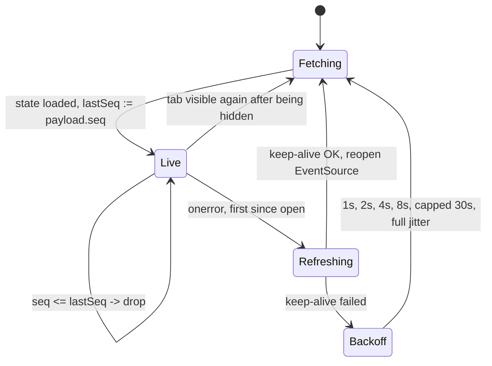

# Realtime - Mercure topics, subscriber authorization, payload contracts

> Elaborates `00-overview.md` sections 3.3, 3.4, 4.3, 5 (P0.4, P0.5, P0.6) and
> invariants 8-9. Where this file and the overview disagree, the overview wins
> and must be amended first.
>
> Owns: the topic set, the subscriber-JWT cookie, the three wire payloads,
> `GameStatePayloadBuilder`, `GameUpdatePublisher`, the publish call-site map.
> Not owned here: clock arithmetic (`03-time-control.md`), pairing
> (`04-matchmaking.md`), Web Push (`07-notifications.md`), client rendering
> (`08-frontend.md`), routes and the error envelope (`09-api-reference.md`).

---

## 1. Current state, exactly

### 1.1 One topic, one payload, 43 lines

`src/Service/GameUpdatePublisher.php` in full - the entire realtime surface of
the platform today:

```php
readonly class GameUpdatePublisher
{
    public function __construct(
        private HubInterface $hub,
    ) {
    }

    /**
     * Publish a game update to all clients listening to this game.
     */
    public function publishGameUpdate(string $gameUuid, BoardMovesData $boardMovesData): void
    {
        $boardData = $boardMovesData->boardData;

        // Create the update data with timestamp in microseconds
        $data = [
            'success' => true,
            'board' => base64_encode($boardData->data),
            'moves' => base64_encode($boardMovesData->movesData->toBinary()),
            'gameOver' => $boardData->gameOver,
            'whiteWins' => $boardData->whiteWins,
            'draw' => $boardData->draw,
            'timestamp' => (int) (microtime(true) * 1000000), // Microseconds since epoch
        ];

        $update = new Update(
            "game/{$gameUuid}",
            json_encode($data, \JSON_THROW_ON_ERROR),
        );

        $this->hub->publish($update);
    }
}
```

### 1.2 The three publish call sites

| # | Call site | Trigger | In a DB transaction? |
|---|---|---|---|
| 1 | `MessageHandler/ProcessAiMoveHandler.php:35` | Stale message - move already played, re-publish current state | No (read-only path) |
| 2 | `MessageHandler/ProcessAiMoveHandler.php:41` | AI move applied | No - `GameEngine::applyMove()` already committed (`src/Engine/GameEngine.php:78`) |
| 3 | `Command/PlayAICommand.php:48` | Manual CLI AI move | No, same reason |

`SubmitMoveAction` is absent from that table: a human move produces a JSON
response (`src/Action/SubmitMoveAction.php:107-125`) and nothing else. The
opponent's browser learns nothing - the whole of `00-overview.md` 3.2.

### 1.3 The client half

- `templates/actions/play.html.twig:7` renders
  `<meta name="mercure-url" content="{{ mercure(url('play', {uuid: game.uuid})) }}">`.
  The Twig helper appends `?topic=<absolute play URL>`
  (`vendor/symfony/mercure/src/Twig/MercureExtension.php:51-60`); nothing ever
  publishes to that topic. `MercureClient.getMercureUrl()` returns that meta
  content verbatim (`assets/typescript/src/network/MercureClient.ts:30-39`) and
  `subscribe()` appends a *second* `topic=game/{uuid}` (`MercureClient.ts:50-52`),
  so every play page subscribes to two topics, one dead. `08-frontend.md`
  reduces the meta tag to a bare `mercure()` and gives the client sole ownership
  of `topic` parameters.
- Dedup is `data.timestamp <= this.lastTimestamp` (`MercureClient.ts:64-69`).
- `GameController.handleMercureUpdate()` calls `setBoardLocked(false)`
  unconditionally (`assets/typescript/src/controllers/GameController.ts:73`).
- `app.ts:105-110` only calls `initializeMercure()` for `OPPONENT_TYPE_AI`.

### 1.4 Proof the transport is unauthenticated

1. **Updates are public.** `new Update("game/{$gameUuid}", $json)`
   (`GameUpdatePublisher.php:36-39`) passes two of six constructor arguments;
   the third is `private bool $private = false`
   (`vendor/symfony/mercure/src/Update.php:39`).
2. **The hub accepts anonymous subscribers.** `frankenphp/Caddyfile:42-43`
   contains the bare `anonymous` directive inside the `mercure` block.
3. **The app never mints a subscriber token.** `config/packages/mercure.yaml`
   declares `jwt.secret` and `jwt.publish: '*'` and no `jwt.subscribe` - the key
   exists in the bundle's config tree
   (`vendor/symfony/mercure-bundle/src/DependencyInjection/Configuration.php:75-78`),
   it is simply unset. Nothing in `src/`, `config/` or `templates/` calls
   `Authorization::setCookie()`; the Twig `mercure()` helper only sets a cookie
   when passed `subscribe`, `publish` or `additionalClaims`
   (`MercureExtension.php:68-78`), and `play.html.twig:7` passes none.

**Consequence, plainly:** anyone who learns a game UUID can run
`new EventSource('https://app.playkeres.com/.well-known/mercure?topic=game/<uuid>')`
from any origin with no session, no cookie and no token, and receive every board
update until the game ends. Today that leaks exactly "the board", which both
players can see anyway (`00-overview.md` 4.3). It stops being tolerable the
moment challenges, friend requests and notifications ride the same hub.

### 1.5 Deployment facts this chapter is built on

| Fact | Source | Value |
|---|---|---|
| Hub is same-origin with the app | `compose.yaml:64`, `deploy/compose.yaml:80` | `MERCURE_PUBLIC_URL = https://app.${SERVER_NAME}/.well-known/mercure`; app is `https://app.${SERVER_NAME}` |
| Publish endpoint is container-internal | `compose.yaml:63`, `deploy/compose.yaml:79` | `MERCURE_URL = http://php/.well-known/mercure` |
| Publisher and subscriber keys are one secret | `compose.yaml:57-59`, `deploy/compose.yaml:72-75` | all three derive from `MERCURE_JWT_SECRET` |
| Hub is embedded in the app's Caddy | `frankenphp/Caddyfile:37-48`, `Dockerfile.base:28` | `--with github.com/dunglas/mercure/caddy` |
| Bundled hub version | `Dockerfile.base:14` -> FrankenPHP 1.12 -> `github.com/dunglas/mercure v0.21.11` | |
| No transport is configured | `frankenphp/Caddyfile:37-48` | only `publisher_jwt`, `subscriber_jwt`, `anonymous`, `subscriptions`, `{$MERCURE_EXTRA_DIRECTIVES}`; the latter is set nowhere in `.env.example`, `compose.yaml`, `deploy/compose.yaml`, `Dockerfile`, `Dockerfile.base` |
| Default transport is therefore Bolt | mercure v0.21.11 `caddy/mercure.go:235-236` | `http.handlers.mercure.bolt`, path `caddy.AppDataDir()/mercure.db` (`caddy/bolt.go:44-45`), `size=0` (unbounded), `cleanup_frequency=0` |
| Bolt persistence is prod-only | `deploy/compose.yaml:119,197` vs `compose.yaml:106-110` | prod mounts `caddy_data:/data`; dev mounts no `/data`, so history dies on every `--force-recreate` (the documented dev command, `AGENTS.md:146`) |
| Cookie name matches on both sides | `vendor/symfony/mercure/src/Authorization.php:26`; mercure v0.21.11 `authorization.go:33` | `mercureAuthorization` |
| An invalid or expired subscriber JWT is **fatal** | mercure v0.21.11 `subscribe.go:190-204` | present-but-invalid yields `401` even with `anonymous` enabled; it does not degrade to anonymous |
| `/.well-known/mercure` bypasses PHP | `frankenphp/Caddyfile:57-61` | `@phpRoute` excludes it |
| The hub is outside the CORS block | `config/packages/nelmio_cors.yaml:9-10` | only `^/api/` is CORS-managed |

---

## 2. Topic taxonomy

### 2.1 The three topics

| Topic (exact) | Private | Who may subscribe | Published to it | Rate (typical / peak) |
|---|---|---|---|---|
| `game/{gameUuid}` | no | anyone, including anonymous visitors | `GameStatePayload` (4.1), one per state transition | 0.2/s typical; ~6/s peak in a 1+0 scramble; 0 while nobody moves |
| `user/{userUuid}` | **yes** | only the owning user, via the subscriber JWT (3) | `UserEventPayload` (4.2), one per `NotificationType` occurrence | under 1/min, bursty - accepting a challenge fires two |
| `lobby/seeks` | no | anyone on the lobby page | `SeekEventPayload` (4.3), exactly one `seek.created` and one `seek.removed` per seek | proportional to lobby churn; 100 seeks/min is ~3.3/s fanned out to every lobby viewer |

Both placeholders are RFC 4122 lowercase-hyphenated (`Uuid::toRfc4122()`).
`Game::$uuid` exists (`src/Entity/Game.php:27`) and `User`'s primary key already
*is* a `Uuid` (`src/Entity/User.php:22-23`), so `user/{userUuid}` is
`$user->getId()->toRfc4122()` and needs no new column.

There is no `game/{uuid}/clock`, no per-colour topic and no
`user/{uuid}/notifications` sub-topic: one topic per addressable subject, one
payload shape per topic. Splitting the clock out of `GameStatePayload` would
reintroduce the two-divergent-builders problem this spec exists to kill
(`00-overview.md` 3.3).

### 2.2 Why `game/{gameUuid}` stays public

The game is **perfect-information**: the 83-byte board is the complete state,
with no hand, no fog and no hidden deployment, so a spectator who receives the
board learns nothing a participant could withhold. `00-overview.md` 4.3 already
grants `GAME_VIEW` to anyone for multiplayer games, and a private topic behind a
public page is theatre with a real cost - every spectator would need a per-game
selector, so the cookie would have to be re-minted on every game page load. The
payload carries no private field by construction: emails never appear, and
usernames and ratings are already public via `GET /@/{username}`.

### 2.3 Why `user/{userUuid}` must be private

It carries who challenged you, who sent you a friend request, which of your
games just finished and by how much your rating moved, and game UUIDs before
they are otherwise discoverable. A user UUID is not a secret - it appears in
profile links and in `SeekEventPayload.seek.user.uuid` - so "unguessable topic"
is not a control. `private: true` plus a subscriber JWT whose
`mercure.subscribe` claim holds exactly one literal topic is the only mechanism
the protocol offers.

### 2.4 Topic selector semantics - one landmine

The hub matches a subscriber's allowed-topic selector against an update topic in
this order: the literal `*` wildcard, exact string equality, then RFC 6570
URI-template expansion if the selector contains `{`
(mercure v0.21.11 `topicselector.go:21-57`).

**Therefore `user/{uuid}` as a selector matches every user's topic.** The claim
must contain the expanded literal
`user/0193e8f2-1c4a-7b3d-9f01-2a3b4c5d6e7f`, never a template. Code that builds
the claim by string-templating a route pattern is a total authorization bypass;
3.3 builds it from `$user->getId()->toRfc4122()` for exactly this reason.

### 2.5 What must never be granted

`frankenphp/Caddyfile:44-45` enables `subscriptions`. The subscription API
publishes to `/.well-known/mercure/subscriptions{/topic}{/subscriber}` as
private updates (mercure v0.21.11 `subscribe.go:361-366`); today no subscriber
JWT exists, so it is unreachable. Once section 3 starts minting tokens, granting
`*` or any selector covering that prefix would expose the subscriber roster -
who is watching which game, from which connection. The claim list in 3.3 is a
closed set of literals; `*` is never issued to a browser.

---

## 3. Subscriber authorization

### 3.1 Why a cookie, and not a header

`EventSource` has no API for request headers - the constructor takes a URL and
an optional `{ withCredentials }` flag, full stop. Mercure accepts a subscriber
token three ways (`authorization.go:79-100`): an `Authorization: Bearer` header
(impossible from `EventSource`), an `?authorization=` query parameter (leaks the
JWT into access logs - `frankenphp/Caddyfile:26-31` exists specifically to
redact it, which tells you it is a known hazard), or a cookie. The cookie is the
only option reachable from `EventSource` that is not written to disk in
cleartext. Because the hub is same-origin (1.5), `withCredentials` is not
needed: the browser attaches a same-origin cookie to `EventSource` by default.

### 3.2 Configuration change

```yaml
# config/packages/mercure.yaml
mercure:
    default_cookie_lifetime: 43200        # 12h; see 3.6
    hubs:
        default:
            url: '%env(MERCURE_URL)%'
            public_url: '%env(MERCURE_PUBLIC_URL)%'
            jwt:
                secret: '%env(MERCURE_JWT_SECRET)%'
                publish: '*'
                subscribe: []             # explicit: the server token grants no subscription
```

`default_cookie_lifetime` is a real key (`Configuration.php:110`) and becomes
constructor argument 1 of `Symfony\Component\Mercure\Authorization`
(`MercureExtension.php:278-281`). Left unset it falls through to
`framework.session.cookie_lifetime`, which this repo does not configure
(`config/packages/framework.yaml:22-23` sets only `cookie_domain`), so it
resolves to PHP's `session.cookie_lifetime = 0`: a browser-session cookie
carrying a **1-hour** JWT (`Authorization.php:39,82-89`). One hour is shorter
than a classical game and far shorter than a correspondence tab, and expiry is
fatal (1.5). `jwt.subscribe: []` is declared explicitly so the server's own
publish token can never be repurposed as a subscriber token.

**Caddy keeps `anonymous`.** Two of three topics are public and must stay
readable by logged-out visitors and never-authenticated spectators
(`00-overview.md` 4.3). Removing it would 401 every anonymous subscriber
outright (`subscribe.go:196-197`) and gain nothing: privacy for `user/{uuid}`
comes from `private: true` on the *update*, not from the hub's anonymous policy.
An anonymous subscriber gets `privateTopics = nil` and matches no private update
(`subscribe.go:183-214`, `subscriber.go:51-76`).

### 3.3 The listener

```php
// src/EventListener/MercureAuthorizationListener.php
#[AsEventListener(event: KernelEvents::RESPONSE, priority: 0)]
#[AsEventListener(event: LogoutEvent::class, method: 'onLogout')]
final readonly class MercureAuthorizationListener
{
    private const SESSION_KEY = '_mercure_cookie_issued_at';

    public function __construct(
        private Security $security,
        private Authorization $authorization,
        private int $cookieLifetime,          // bound to mercure.default_cookie_lifetime
    ) {
    }

    public function __invoke(ResponseEvent $event): void
    {
        if (!$event->isMainRequest() || !($user = $this->security->getUser()) instanceof User) {
            return;                            // anonymous: no cookie, public topics only
        }
        $request = $event->getRequest();
        $issuedAt = (int) $request->getSession()->get(self::SESSION_KEY, 0);
        if ($request->cookies->has('mercureAuthorization')
            && time() - $issuedAt < intdiv($this->cookieLifetime, 2)) {
            return;
        }
        $this->authorization->setCookie($request, ['user/'.$user->getId()->toRfc4122()]);
        $request->getSession()->set(self::SESSION_KEY, time());
    }

    public function onLogout(LogoutEvent $event): void
    {
        $this->authorization->clearCookie($event->getRequest());
    }
}
```

- `Authorization::setCookie()` does not touch the response: it stores a `Cookie`
  in `$request->attributes['_mercure_authorization_cookies']`
  (`Authorization.php:50-52,172-184`), and the component's `SetCookieSubscriber`
  copies it onto the response at `kernel.response` **priority -10**
  (`SetCookieSubscriber.php:27-48`, `MercureExtension.php:287-290`). This
  listener must run before that, so any priority above `-10` works; `0` is used.
- `setCookie()` throws if called twice in one request
  (`Authorization.php:177-180`), and this listener is the only caller.
  **`08-frontend.md` must never pass `subscribe:`/`publish:`/`additionalClaims:`
  to the Twig `mercure()` helper**: that helper calls `setCookie()` too
  (`MercureExtension.php:78`), and the second call fatals the request.
- `clearCookie()` reuses the identical name/path/domain/SameSite tuple
  (`Authorization.php:125-142`), so the browser actually drops it. On logout the
  security token is already cleared, so `__invoke` short-circuits on the same
  response and there is no double-set.
- The freshness check is session-based on purpose: this runs on every response,
  and decoding a JWT per response just to read `exp` is waste.
- No mutable state and `readonly`, so no `kernel.reset` is needed
  (`00-overview.md` 6, worker-mode safety).

### 3.4 Cookie attributes

Produced by `Authorization::createCookie()` (`Authorization.php:107-117`). None
is ours to choose except the lifetime, so these are recorded, not decided.

| Attribute | Value | Derivation |
|---|---|---|
| Name | `mercureAuthorization` | `Authorization.php:26`; hub default matches (`authorization.go:33`) |
| Value | HS256 JWT, claim `{"mercure":{"subscribe":["user/<uuid>"],"publish":[]}}` plus `exp` | `LcobucciFactory::create()` lines 75-83; algorithm `hmac.sha256` (`LcobucciFactory.php:28`) |
| Path | `/.well-known/mercure` | `parse_url(MERCURE_PUBLIC_URL)['path']` (`Authorization.php:111`), so it is not sent on ordinary app requests |
| Domain | none (host-only on `app.{domain}`) | `getCookieDomain()` returns `null` when hub host equals request host (`Authorization.php:150-154`) |
| Secure | `true` | scheme of `MERCURE_PUBLIC_URL` is `https` in dev and prod (`Authorization.php:113`) |
| HttpOnly | `true` | hardcoded (`Authorization.php:114`) |
| SameSite | `Strict` | constructor default; the bundle passes only 2 arguments (`Authorization.php:37`, `MercureExtension.php:278-281`) |
| Max-Age | 12h | `default_cookie_lifetime` (3.2) |

`SameSite=Strict` is correct and free here: the `EventSource` request is a
same-origin subresource issued from a page already on `app.{domain}`, so it is
same-site by construction. A cold navigation from an external link (a challenge
URL posted in Discord) does not carry the cookie on that first request, but that
request is an HTML page load which re-issues it via 3.3 before any `EventSource`
opens. `HttpOnly` means JavaScript cannot read the expiry, so the refresh in 3.6
must be timer-driven, not cookie-driven.

### 3.5 Same-origin, and the cross-subdomain problem that does not exist here

Verified: the app is served at `https://app.${SERVER_NAME}` (`compose.yaml:120`,
`deploy/compose.yaml:146`) and the hub's public URL is
`https://app.${SERVER_NAME}/.well-known/mercure` (`compose.yaml:64`,
`deploy/compose.yaml:80`), served by the same Caddy in the same container
(`frankenphp/Caddyfile:37-48`). **App and hub are same-origin** - no CORS, no
`withCredentials`, no cookie-domain widening.

Worth stating because the alternative is a live trap.
`Authorization::getCookieDomain()` (`Authorization.php:144-170`) walks the
request host's segments: for a hub on `mercure.playkeres.com` served to a page
on `app.playkeres.com` it returns `.playkeres.com`, silently broadening the JWT
cookie to the whole registrable domain including the marketing site
(`STATIC_SITE_URL`, a separate deployment per `AGENTS.md`); for a hub on a
different second-level domain it throws `RuntimeException`
(`Authorization.php:169`). **Moving the hub off `app.{domain}` is a security
change, not an ops change.** Note the deliberate asymmetry with the session
cookie, scoped to the bare domain (`framework.yaml:22-23`;
`SESSION_COOKIE_DOMAIN` is `${SERVER_NAME}` without the `app.` prefix,
`compose.yaml:48`) - the Mercure cookie stays host-only, so the marketing site
never receives a token it has no use for.

### 3.6 Refresh on a long-lived tab

The failure being prevented: at `exp` the hub returns **401** for a
present-but-expired cookie and does not fall back to anonymous
(`subscribe.go:190-204`), so a tab open past 12h loses *all* updates - including
the public game topic it would have received with no cookie at all. Three
mechanisms, all required:

1. **Server-side re-issue.** 3.3 re-mints on any main-request response once half
   the lifetime has elapsed. An in-game tab hits the server constantly (moves,
   presence heartbeats, seek heartbeats), so this alone covers active play.
2. **Client-side keep-alive.** An idle spectator or lobby tab may make no
   request for hours. The layout exposes the lifetime as
   `<meta name="mercure-cookie-ttl" content="43200">` and the client schedules a
   credentialed `GET /notifications/unread-count` at `ttl / 2`, resetting the
   timer on each success: cheap, already authenticated, re-issues the cookie as
   a side effect. Details in `08-frontend.md`.
3. **Refresh-then-retry on error.** `EventSource.onerror` cannot distinguish a
   401 from a dropped connection. On the first error after a successful open,
   the client performs the keep-alive fetch, then closes and reopens the
   `EventSource`; later errors fall through to 6.4's backoff. Without this, a
   tab that slept through its refresh window reconnects into a 401 loop at the
   browser's default retry interval.

---

## 4. Payload contracts

### 4.0 Encoding rules (all three payloads)

| Rule | Detail |
|---|---|
| Binary | base64, standard alphabet, padded. `board` is 83 bytes -> 112 chars; `moves` is `2N` bytes. Decoded exclusively in `assets/typescript/src/utils/boardUtils.ts` (`AGENTS.md`, landmine 10) |
| Timestamps | integer **microseconds** since the epoch, always. PHP `(int) $dt->format('Uu')`. Never ISO-8601, never milliseconds, never a float |
| Enums | lowercase `snake_case` strings, never the integer backing value. `GameEndReason::ABANDONMENT` -> `"abandonment"`, `NotificationType::CHALLENGE_RECEIVED` -> `"challenge_received"` |
| Absent vs null | every field is always present; not-applicable is JSON `null`. Clients never branch on `undefined` |
| Encoder flags | `JSON_THROW_ON_ERROR \| JSON_UNESCAPED_SLASHES \| JSON_UNESCAPED_UNICODE`, fixed in one place (section 5). No raw newline can occur inside a JSON string, so single-line SSE framing is safe |
| Identifiers | UUIDs as RFC 4122 lowercase-hyphenated strings; `GamePlayer`/`Friendship` BIGSERIAL ids as JSON numbers |

Two sub-objects are shared and defined once. `kind` is
`unlimited|realtime|correspondence`; `speed` is
`bullet|blitz|rapid|classical|correspondence|null`, `null` iff `unlimited`.

```json
// PlayerRef - null when that side is the engine
{"uuid": "0193...", "username": "vincent", "rating": 1512, "provisional": false}
// TimeControlRef
{"kind": "realtime", "initialSeconds": 180, "incrementSeconds": 2,
 "daysPerMove": null, "speed": "blitz"}
```

### 4.1 `GameStatePayload` - topic `game/{gameUuid}`

| Field | Type | Null? | Meaning |
|---|---|---|---|
| `type` | string | no | Constant `"game.state"` |
| `gameUuid` | string | no | `Game.uuid` |
| `seq` | int | no | `Game.version`, strictly increasing per game (6.1) |
| `board` | string | no | base64 of the 83-byte `BoardData` |
| `moves` | string | no | base64 of the `2N`-byte move list |
| `status` | string | no | `created` (no move yet) / `ongoing` / `finished` |
| `endReason` | string | no | `GameEndReason` lowercased; `"none"` while unfinished |
| `result` | string\|null | yes | `white` / `black` / `draw`; `null` until finished |
| `clock.kind` | string | no | `TimeControlKind` lowercased |
| `clock.whiteMs` | int\|null | yes | `GamePlayer(WHITE).clockMsRemaining`; `null` iff `unlimited` (invariant 11) |
| `clock.blackMs` | int\|null | yes | as above, black |
| `clock.running` | string\|null | yes | `white` / `black` / `null` (not started, finished, or untimed) |
| `clock.turnStartedAt` | int\|null | yes | `Game.clockTurnStartedAt` in us - the anchor the client interpolates from |
| `clock.deadlineAt` | int\|null | yes | `Game.moveDeadlineAt` in us |
| `offers.draw` | string\|null | yes | `PieceColor` of the offerer, from `Game.drawOfferedByColor` |
| `offers.rematch` | string\|null | yes | as above, from `Game.rematchOfferedByColor` |
| `presence.white` | bool | no | White's user is currently connected (6.2) |
| `presence.black` | bool | no | as above, black |
| `rating` | object\|null | yes | `null` unless the game is finished **and** rated |
| `rating.{white,black}.before` | int | no | `GamePlayer.ratingBefore` |
| `rating.{white,black}.after` | int | no | `GamePlayer.ratingAfter` |
| `rating.{white,black}.delta` | int | no | `after - before`. Does **not** sum to zero across sides - Glicko-2 moves a provisional player far more than an established one (`06-rating.md`) |
| `serverTime` | int | no | us at build time; the client's clock-skew reference |

```json
{
  "type": "game.state",
  "gameUuid": "0193e8f2-1c4a-7b3d-9f01-2a3b4c5d6e7f",
  "seq": 42,
  "board": "AAAAAAAAAAAAAAAAAAAAAAAAAAAAAAAAAAAAAAAAAAAAAAAAAAAAAAAAAAAAAAAAAAAAAAAAAAAAAAAAAAAAAAAAAAAAAAAAAAAAAAAAAAAAAIAA",
  "moves": "AQIDBAUG",
  "status": "ongoing", "endReason": "none", "result": null,
  "clock": {"kind": "realtime", "whiteMs": 180000, "blackMs": 174300,
            "running": "white", "turnStartedAt": 1732650000123456,
            "deadlineAt": 1732650180123456},
  "offers": {"draw": null, "rematch": null},
  "presence": {"white": true, "black": false},
  "rating": null,
  "serverTime": 1732650000123456
}
```

`presence` for an engine side is always `true`; in hot-seat both sides mirror
the single user's presence.

### 4.2 `UserEventPayload` - topic `user/{userUuid}`, private

Envelope, identical for every variant. There is no `seq`: user events are
independent facts, not successive views of one row, so there is nothing to order
them against. Idempotence is by `notificationUuid` when present (6.5).

| Field | Type | Null? | Meaning |
|---|---|---|---|
| `type` | string | no | Constant `"user.event"` |
| `event` | string | no | `NotificationType`, lowercased |
| `notificationUuid` | string\|null | yes | `Notification.uuid`, the client's idempotency key; `null` for ephemeral events that mint no durable row (6.5) |
| `createdAt` | int | no | `Notification.createdAt` in us |
| `unreadCount` | int | no | The user's unread count after this notification was persisted; unchanged current count for an ephemeral event |
| `data` | object | no | Variant-specific, below |
| `serverTime` | int | no | us at build time |

| `event` | `data` fields |
|---|---|
| `challenge_received` | `challengeUuid`, `from` (PlayerRef), `timeControl` (TimeControlRef), `rated` bool, `colorPreference` string, `expiresAt` int, `url` string |
| `challenge_accepted` | `challengeUuid`, `gameUuid`, `opponent` (PlayerRef), `yourColor` string |
| `challenge_declined` | `challengeUuid`, `by` (PlayerRef) |
| `friend_request` | `friendshipId` int, `from` (PlayerRef) |
| `friend_accepted` | `friendshipId` int, `by` (PlayerRef) |
| `your_turn` | `gameUuid`, `opponent` (PlayerRef), `ply` int, `deadlineAt` int\|null, `kind` string |
| `game_finished` | `gameUuid`, `result` string, `endReason` string, `yourColor` string, `ratingBefore` int\|null, `ratingAfter` int\|null, `ratingDelta` int\|null, `opponent` (PlayerRef) |
| `seek_matched` | `seekUuid`, `gameUuid`, `yourColor` string, `opponent` (PlayerRef) |
| `draw_offered` | `gameUuid`, `byColor` string |
| `rematch_offered` | `gameUuid`, `byColor` string, `newGameUuid` string\|null |

```json
{
  "type": "user.event", "event": "challenge_received",
  "notificationUuid": "0193e900-77aa-7c10-8e21-9f0011223344",
  "createdAt": 1732650001000000, "unreadCount": 3,
  "data": {
    "challengeUuid": "0193e900-1111-7000-8000-aaaabbbbcccc",
    "from": {"uuid": "0193e7aa-0000-7000-8000-000000000001",
             "username": "kasparov", "rating": 1743, "provisional": false},
    "timeControl": {"kind": "realtime", "initialSeconds": 300, "incrementSeconds": 0,
                    "daysPerMove": null, "speed": "blitz"},
    "rated": true, "colorPreference": "random", "expiresAt": 1732736401000000,
    "url": "https://app.playkeres.com/challenge/0193e900-1111-7000-8000-aaaabbbbcccc"
  },
  "serverTime": 1732650001000123
}
```

`your_turn` and `game_finished` duplicate information already on
`game/{gameUuid}`. That is intentional: the game topic only reaches a tab that
is actually on that board, and the point of the user topic is to reach a user
who is somewhere else - the lobby, their notifications, another game. Both
frames therefore arrive at a tab that *is* on the board, which makes the
ownership rule load-bearing rather than stylistic:

> **`game/{gameUuid}` moves pieces and clocks. `user/{userUuid}` notifies.**
> An OS notification or in-tab toast is raised only from a `UserEventPayload`,
> never derived from a `GameStatePayload`, or an implementer double-notifies on
> every move. Realtime `your_turn` rides SSE like every other event but
> suppresses the toast when that game's view is the active tab, and mints no
> durable row (6.5). `07-notifications.md` 9.1 owns the suppression rules.

### 4.3 `SeekEventPayload` - topic `lobby/seeks`

| Field | Type | Null? | Meaning |
|---|---|---|---|
| `type` | string | no | `"seek.created"` or `"seek.removed"` |
| `seekUuid` | string | no | `Seek.uuid` |
| `reason` | string\|null | yes | On removal: `matched` / `canceled` / `expired`. `null` on create |
| `seek` | object\|null | yes | Full row on create, `null` on removal |
| `seek.user` | PlayerRef | no | `rating` is `Seek.ratingSnapshot`, not a live read |
| `seek.timeControl` | TimeControlRef | no | |
| `seek.rated` | bool | no | |
| `seek.colorPreference` | string | no | `white` / `black` / `random` |
| `seek.ratingMin`, `seek.ratingMax` | int\|null | yes | Current window, already widened if `autoWiden` |
| `seek.createdAt`, `seek.expiresAt` | int | no | us |
| `serverTime` | int | no | us |

```json
{"type": "seek.removed", "seekUuid": "0193e901-0000-7000-8000-000000000002",
 "reason": "matched", "seek": null, "serverTime": 1732650002000000}
```

This is the one delta stream in the design, so it needs a reconciler: a client
that misses a `seek.removed` renders a ghost. Three defences, all required - the
lobby re-fetches `GET /lobby/seeks` on every SSE (re)connect; it re-fetches on a
30 s backstop timer; and accepting a vanished seek fails with a specific error
code from `09-api-reference.md` rather than a 500. A `seek.removed` for a seek
the client never saw is a no-op. No user-identifying field beyond the public
profile triple ever appears here - the topic is public.

---

## 5. `GameStatePayloadBuilder`

One class replaces the two divergent construction sites of `00-overview.md` 3.3
(`SubmitMoveAction::getResponse()` at `SubmitMoveAction.php:107-125` and
`GameUpdatePublisher::publishGameUpdate()` at `GameUpdatePublisher.php:21-42`).

```php
namespace App\Service\Game;

final readonly class GameStatePayloadBuilder
{
    private const ENCODE_FLAGS = \JSON_THROW_ON_ERROR
        | \JSON_UNESCAPED_SLASHES | \JSON_UNESCAPED_UNICODE;

    public function __construct(
        private ClockManager $clockManager,
        private PresenceTracker $presenceTracker,
    ) {
    }

    /** @return array<string, mixed> */
    public function build(Game $game, BoardMovesData $boardMovesData): array;

    /** The one and only encoder. */
    public function encode(array $payload): string
    {
        return json_encode($payload, self::ENCODE_FLAGS);
    }
}
```

`BoardMovesData` is passed in, not re-derived: it is the return value of the
engine call that just happened (`GameEngine.php:88`). Re-deriving would mean a
second `/replay-moves` round trip per publish, and `EngineApi` has no timeout
and no fault tolerance (landmine 9). For publishes with no preceding engine call
(resign, timeout, draw agreed) the caller passes
`GameEngine::getBoardMovesData($game)` (`GameEngine.php:26-32`), the single
existing replay path.

`build()` is **side-effect free**. It reads presence but never writes the
transition (6.2): `GET /play/{uuid}/state` is a read endpoint, and letting it
bump `seq` would perturb the very sequence a resyncing client is aligning on.

### 5.1 Field sources

| Payload field | Source |
|---|---|
| `gameUuid` | `Game::getUuid()->toRfc4122()` (`src/Entity/Game.php:91-94`) |
| `seq` | `Game::getVersion()` (`src/Entity/Game.php:168-171`) - see 5.3 |
| `board` | `base64_encode($boardMovesData->boardData->data)` |
| `moves` | `base64_encode($boardMovesData->movesData->toBinary())` |
| `status` | `gameOverAt !== null` -> `finished`; else `gameMoves->count() === 0` -> `created`; else `ongoing` |
| `endReason` | `Game.endReason` enum, lowercased |
| `result` | `draw` -> `"draw"`; else `whiteWins ? "white" : "black"`; `null` while unfinished |
| `clock.*` | `ClockManager::snapshot(Game)` - the only reader of `GamePlayer.clockMsRemaining`, `Game.clockTurnStartedAt`, `Game.moveDeadlineAt` (`03-time-control.md`) |
| `offers.*` | `Game.drawOfferedByColor`, `Game.rematchOfferedByColor` |
| `presence.*` | `PresenceTracker::isPresent(GamePlayer)`; `true` for an engine side |
| `rating.*` | The four `GamePlayer` int columns verbatim; `null` unless finished and rated |
| `serverTime` | `(int) (new \DateTimeImmutable())->format('Uu')` |

The builder holds no state between calls and is `readonly`, so it needs no
`kernel.reset` under worker mode (`00-overview.md` 6).

### 5.2 The byte-identity rule

**`SubmitMoveAction`'s HTTP response body and the Mercure push carry
byte-identical payload bytes.** Not "equivalent", not "the same fields" -
identical bytes, guaranteed by construction rather than by discipline:

```php
$payload = $builder->build($game, $boardMovesData);
$json    = $builder->encode($payload);          // one encoder, one flag set

$publisher->publishGameState($game->getUuid()->toRfc4122(), $json);
return JsonResponse::fromJsonString('{"data":'.$json.'}');
```

The HTTP layer's `{"data": ...}` envelope (`09-api-reference.md`) wraps that
exact `$json` substring, and the Mercure `data` field is that substring alone.
A mover renders exactly what a spectator renders, and a payload bug cannot
manifest on one path only; `GET /play/{uuid}/state` returns the same envelope
built the same way. This is why `publishGameState()` takes a pre-encoded string
rather than an array: an array signature would let a caller re-encode with
different flags and quietly break the guarantee.

### 5.3 `seq` is stale unless P0.7 lands first

`GameEngine::applyMove()` has two lock paths (`00-overview.md` 3.5). On the
game-over path `Game` is dirty, Doctrine's `#[ORM\Version]` UPDATE fires and the
ORM writes the new version back onto the entity, so `getVersion()` is fresh. On
the non-game-over path `Game` is clean, so the code issues raw DBAL
`UPDATE game SET version = version + 1 ...` (`GameEngine.php:66-76`) and **the
managed entity is never touched** - `$game->getVersion()` still returns the
pre-move value.

On today's code the builder would therefore emit the *same* `seq` for move N and
move N+1, every client would drop the second as `seq <= lastSeq`, and the
opponent's board would freeze silently. `00-overview.md` 5 P0.7 collapses the
two paths (the clock writes `clock_turn_started_at` on every move, so `Game` is
always dirty and native versioning always applies); see `03-time-control.md`.

**P0.4 hard-depends on P0.7.** If they must ship apart, the builder takes
`$expectedVersion + 1` from the caller instead of reading the entity, and that
workaround is deleted the day P0.7 lands. Recorded in `10-delivery-plan.md`.

### 5.4 `GameUpdatePublisher`, extended

```php
namespace App\Service\Game;

final readonly class GameUpdatePublisher
{
    public function __construct(private HubInterface $hub, private LoggerInterface $logger)
    {
    }

    public function publishGameState(string $gameUuid, string $json): void;   // public
    public function publishUserEvent(string $userUuid, string $json): void;   // private: true
    public function publishSeekEvent(string $json): void;                     // public, lobby/seeks
}
```

`publishUserEvent()` is the only method that constructs
`new Update("user/{$userUuid}", $json, true)`; the third argument is
`bool $private` (`vendor/symfony/mercure/src/Update.php:39`). Passing it is the
entire privacy mechanism - forgetting it publishes a challenge notification to
the world. All three methods wrap `$this->hub->publish()` in the swallow-and-log
of 8.1. The class moves from `App\Service\` to `App\Service\Game\`;
`publishGameUpdate()` is deleted, not deprecated (clean cutover).

---

## 6. Ordering, idempotence and reconnection

### 6.1 `seq = Game.version` replaces the timestamp

Today's guard is `data.timestamp <= this.lastTimestamp`
(`MercureClient.ts:64-69`) against `(int) (microtime(true) * 1000000)`
(`GameUpdatePublisher.php:33`). It is wrong three ways: it orders by *publish*
wall-clock rather than by state, so a web request and a Messenger worker in
another container can stamp out of order under clock skew and a newer state gets
dropped; `microtime(true)` is a float, so past ~2^53 us the multiplication loses
precision and two publishes in the same microsecond tie; and it bears no
relationship to the row it describes, so it can detect an out-of-order update
but never a *missing* one.

`Game.version` is the value the optimistic lock already maintains
(`src/Entity/Game.php:47-49`, default `1`). Every committed state change bumps
it exactly once; after P0.7 no state change leaves it unchanged (5.3). It is
monotonic per game, gap-free, and derived from the same serialization point that
makes concurrent moves safe - `00-overview.md` invariants 8-9 state this
directly. Clients start at `lastSeq = 0` and drop `seq <= lastSeq`.

### 6.2 Collisions, and the presence carve-out

Same `seq` with the **same** payload is expected and harmless: the stale-message
branch at `ProcessAiMoveHandler.php:32-37` re-publishes current state, the lazy
clock check re-publishes on read, and `GET /play/{uuid}/state` returns the same
snapshot; the client drops the duplicate. This is precisely why the payload is a
full snapshot and not a delta - a replayed delta corrupts state, a replayed
snapshot cannot.

Same `seq` with a **different** payload is a bug, and exactly one field can
cause it: `presence`, which lives on `GamePlayer.lastSeenAt`, a different table,
so flipping it would not bump `Game.version` and the client would drop the
update. Resolved with `03-time-control.md` 8.1 as a split:

- **Heartbeat** (`POST /play/{uuid}/presence`, every
  `DISCONNECT_ABANDON_SECONDS / 6` = 10 s per player per open game - derived
  from the abandonment constant it defends, *not* from
  `SEEK_HEARTBEAT_INTERVAL_MS`, which governs the seek pool) writes
  `game_player.last_seen_at` and `user.last_seen_at`, takes no lock, dirties
  nothing on `game`, and publishes nothing. It must never queue behind a move
  transaction or it would report a disconnect that did not happen. It answers
  `200` with `{"data":{"presence":{"white":true,"black":false}}}` rather than
  `204`: the envelope is universal (`09-api-reference.md` 2.3), and returning
  the pair means a client learns its opponent's state from its own beat instead
  of waiting for an SSE frame that only fires on a transition.
- **Transition** (edge-triggered, rare) takes `PESSIMISTIC_WRITE` on the game
  row, issues an explicit `UPDATE game SET version = version + 1`, calls
  `em->refresh($game)` so the in-memory version is never stale, and publishes
  exactly one `GameStatePayload`. Edge detection needs no new timer: absent to
  present is seen by the arriving heartbeat comparing `last_seen_at` before
  overwriting it, and present to absent by the *opponent's* heartbeat checking
  the other side, so worst-case detection is `DISCONNECT_ABANDON_SECONDS + 10s`.

Invariant 8 therefore holds and the client's reducer stays uniform - no
presence-shaped exception in the `seq` guard. The one constraint this chapter
imposes back: `GameStatePayloadBuilder::build()` may *observe* a stale
`last_seen_at` but must never perform the transition write (5), or a read
endpoint would bump `seq` underneath a resyncing client.

Every other payload field comes from `game`, `game_move`, or a `GamePlayer`
column that changes only on a move or at game end - all of which bump the
version.

### 6.3 Reconnection: what the hub will and will not replay

`EventSource` reconnects on its own and the browser resends the last event id as
`Last-Event-ID`. Whether that replays anything depends entirely on the hub
transport, so: **the Caddyfile configures no transport**
(`frankenphp/Caddyfile:37-48`; `MERCURE_EXTRA_DIRECTIVES` is unset everywhere).
The bundled hub is mercure v0.21.11 (FrankenPHP 1.12, `Dockerfile.base:14`),
whose Caddy module defaults to Bolt when no `transport` is given
(`caddy/mercure.go:235-236`) at `caddy.AppDataDir()/mercure.db`
(`caddy/bolt.go:44-45`), and Bolt *does* dispatch history on `Last-Event-ID`
(`bolt.go:141-142,200-247`). So replay works in prod today by accident, and not
in dev (no `/data` volume on the `php` service, `compose.yaml:106-110`).

**The spec declares the transport explicitly and picks `local`:**

```caddyfile
mercure {
    publisher_jwt {env.MERCURE_PUBLISHER_JWT_KEY} {env.MERCURE_PUBLISHER_JWT_ALG}
    subscriber_jwt {env.MERCURE_SUBSCRIBER_JWT_KEY} {env.MERCURE_SUBSCRIBER_JWT_ALG}
    anonymous
    subscriptions
    transport local
    {$MERCURE_EXTRA_DIRECTIVES}
}
```

Three reasons, in order of weight. (1) **Replaying `user/{uuid}` re-fires
notifications**: a reconnecting tab would receive `challenge_received` and
`your_turn` again and re-toast the user, and `notificationUuid` dedup (6.5)
hides that only within one page lifetime. (2) **Replay of a full-snapshot topic
is waste**: replaying the 40 snapshots a client missed delivers 39 payloads it
immediately drops by `seq`. (3) **Bolt is configured with `size = 0`** - no cap
on retained events (`caddy/bolt.go:21`; no `size` in the Caddyfile) - on a
volume nobody monitors, ephemeral in dev, from a module version pinned by a base
image this repo does not control (`Dockerfile.base:14,28`); an accidental
dependency on undeclared behaviour is exactly what this spec exists to remove.

`transport local` makes dev and prod identical: **reconnect delivers nothing;
the client must re-fetch.**

### 6.4 The client's recovery contract



- **Open the `EventSource` first, then fetch state**, adopting the fetched
  payload only if its `seq` exceeds `lastSeq`. Fetching first would leave a hole
  between the response and the subscription.
- `GET /play/{uuid}/state` (`09-api-reference.md`) returns
  `{"data": <the same GameStatePayload>}` from the same builder (5.2). It is the
  single recovery primitive; there is no delta-since-seq endpoint and there will
  not be one, because the snapshot is small (a 60-move game is roughly 250 bytes
  of base64) and a delta API would be a second payload contract to keep in sync.
- Lobby recovery is `GET /lobby/seeks` (4.3); user-event recovery is
  `GET /notifications?unread=1`.
- A missed update is therefore always recoverable and never silently lost: the
  client either receives a later `seq`, which supersedes the missed one because
  snapshots are total, or it resyncs.

### 6.5 Idempotence on the user topic

Persisted events carry `notificationUuid`, and the client keeps a bounded LRU of
the last 100 values and drops repeats. The server writes the `Notification` row
and publishes in the same post-commit step, so one row means one logical event
however many times it is delivered.

Ephemeral events carry `notificationUuid: null`: realtime `your_turn` mints no
durable row, because one INSERT per ply is 240 rows for a 1+0 game
(`07-notifications.md`). They have no idempotency key and are collapsed instead
by `(event, data.gameUuid)`, last-write-wins - safe precisely because they carry
no state the client cannot re-derive from `game/{gameUuid}`.

`notificationUuid` is **not** the Web Push dedup tag. Push carries it as a
separate correlation field; the collapsing `Topic`/`tag` is a *subject* key
owned by `07-notifications.md` (RFC 8030 caps `Topic` at 32 base64url
characters, so a hyphenated UUID is illegal there anyway). A per-event uuid is
unique by construction and would collapse nothing.

---

## 7. Publish call-site map

### 7.1 The rule

**Publish only after the transaction that produced the state has committed.**
No exceptions, and it is a correctness rule rather than a style rule: a publish
that races a rollback broadcasts a board that does not exist, and because
clients trust the highest `seq`, every subscriber would render a phantom move
until the next real update.

### 7.2 How it is guaranteed

Doctrine's `postFlush` is **not** the mechanism, and this is the trap worth
naming. `GameEngine::applyMove()` opens its own DBAL transaction
(`GameEngine.php:48`), flushes inside it (`GameEngine.php:61`) and commits
afterwards (`GameEngine.php:78`), so `postFlush` fires at line 61 - before the
version bump at 66-76 and before the commit. A `postFlush`-driven publisher
would emit a stale `seq` from inside an uncommitted transaction, the exact bug
the rule forbids. `kernel.terminate` is not it either: Messenger handlers
(`ProcessAiMoveHandler`) and console commands (`PlayAICommand`) never reach it.

The mechanism is an **explicit call after the transaction-owning method
returns**, in the service that owns the operation:

```php
$boardMovesData = $this->gameEngine->applyMove($game, $moveData);   // commits
$json = $this->payloadBuilder->encode($this->payloadBuilder->build($game, $boardMovesData));
$this->publisher->publishGameState($uuid, $json);                    // then publish
```

Boring, greppable, correct in all three runtimes. No buffering service sits
between them: an in-memory outbox would be mutable state in a FrankenPHP worker,
forbidden by `00-overview.md` 6 unless tagged `kernel.reset`, and that is
complexity bought for nothing when the call sites are a closed set of nineteen.

### 7.3 `src/Event/GameUpdateEvent.php` - delete it

It is dead code: a search across `src/`, `config/`, `templates/` and `assets/`
returns exactly one match, its own class declaration. It carries a single
`string $gameUuid`, has no dispatcher and no listener, and `src/` contains no
`#[AsEventListener]` or `EventSubscriberInterface` implementation at all.

**Recommendation: delete the file.** Wiring it up would be strictly worse than
7.2 - a dispatch inside the transaction publishes too early, a dispatch after
commit is the explicit call plus an indirection, its `string` payload is too
thin to build a `GameStatePayload` from (a listener would have to re-load the
`Game` and re-call the engine), and an event listener is a natural place for
someone to later add a second subscriber that publishes twice. Three publish
methods and nineteen call sites is a call graph, not an event bus.

### 7.4 Every event that must publish

`GSP` = `GameStatePayload`, `UEP` = `UserEventPayload`, `SEP` =
`SeekEventPayload`; "Tx" is the transaction whose commit must precede the
publish. Every row obeys 7.1 - the publish is outside and after that transaction.

| # | Event | Triggering service | Topics | Payload | Tx |
|---|---|---|---|---|---|
| 1 | Game created from seek or challenge | `Matchmaking\SeekMatcher`, `Matchmaking\ChallengeManager` via `Game\GameFactory` | `game/{g}`, `user/{a}`, `user/{b}`, `lobby/seeks` | GSP + 2x UEP (`seek_matched` or `challenge_accepted`) + SEP (`seek.removed`, `matched`) | pairing tx (invariant 12) |
| 2 | Human move applied | `SubmitMoveAction` | `game/{g}` | GSP | `GameEngine::applyMove()` |
| 3 | AI move applied | `MessageHandler\ProcessAiMoveHandler` | `game/{g}` | GSP | `GameEngine::applyMove()` |
| 4 | Stale AI message re-publish | `ProcessAiMoveHandler` (`:32-37`) | `game/{g}` | GSP, same `seq`, dropped client-side | none, read-only |
| 5 | Opponent's turn begins | `Notification\NotificationDispatcher`, driven by rows 2 and 3 | `user/{opponent}` | UEP `your_turn` | the tx that wrote the notification row |
| 6 | Flag fall | `Clock\ClockAdjudicator` - delayed message, lazy read, or claim endpoint | `game/{g}`, `user/{w}`, `user/{b}` | GSP (`timeout`) + 2x UEP `game_finished` | adjudication tx |
| 7 | Resignation | `Game\GameLifecycleManager` | `game/{g}`, `user/{opponent}` | GSP (`resignation`) + UEP `game_finished` | lifecycle tx |
| 8 | Abort | `Game\GameLifecycleManager` | `game/{g}`, `user/{opponent}` | GSP (`aborted`, `rating: null`) + UEP | lifecycle tx |
| 9 | Abandonment adjudicated | `Game\GameLifecycleManager` from `Presence\PresenceTracker` | `game/{g}`, `user/{w}`, `user/{b}` | GSP (`abandonment`) + 2x UEP | lifecycle tx |
| 10 | Draw offered / accepted / declined | `Game\GameLifecycleManager` | `game/{g}`, `user/{opponent}` | GSP (`offers.draw`, or `draw_agreed` on accept) + UEP `draw_offered` on offer | lifecycle tx |
| 11 | Rematch offered / accepted | `Game\GameLifecycleManager` | `game/{g}`, `user/{opponent}`, plus `game/{new}` on accept | GSP + UEP `rematch_offered` | lifecycle tx |
| 12 | Presence transition | `Presence\PresenceTracker` (6.2) | `game/{g}` | GSP with new `seq` | transition tx (`PESSIMISTIC_WRITE` + refresh) |
| 13 | Seek created | `Matchmaking\SeekMatcher` | `lobby/seeks` | SEP `seek.created` | seek insert |
| 14 | Seek canceled or expired | `Matchmaking\SeekMatcher`, `ExpireSeekMessage` handler | `lobby/seeks` | SEP `seek.removed` | status update |
| 15 | Challenge created | `Matchmaking\ChallengeManager` | `user/{challenged}` | UEP `challenge_received` | challenge insert |
| 16 | Challenge declined / canceled / expired | `Matchmaking\ChallengeManager`, `ExpireChallengeMessage` handler | `user/{challenger}` | UEP `challenge_declined`; nothing on cancel or expire by the actor | status update |
| 17 | Friend request sent / accepted | `Social\FriendshipManager` | `user/{addressee}` / `user/{requester}` | UEP `friend_request` / `friend_accepted` | friendship write |
| 18 | Rating applied at game end | `Rating\RatingUpdater`, inside the finalising tx | none of its own | folded into the GSP of rows 6-9 | - |
| 19 | CLI AI move | `Command\PlayAICommand` | `game/{g}` | GSP | `GameEngine::applyMove()` |

Row 18 is deliberate: rating never publishes separately. `RatingUpdater` writes
`game_player` inside the same transaction that sets `gameOverAt`
(`06-rating.md`), so by the time rows 6-9 publish, `rating` is already populated
in the snapshot. One publish per state change, always.

`SubmitMoveAction` gains row 2 and loses its AI gate; `PlayAction` and `app.ts`
lose theirs (`00-overview.md` 5, P0.5).

---

## 8. Failure modes

### 8.1 Hub unreachable during publish

`Hub::publish()` POSTs to `MERCURE_URL` through the shared `http_client` service
(`vendor/symfony/mercure/src/Hub.php:74-83`, `MercureExtension.php:163-169`) and
wraps any transport error in
`Symfony\Component\Mercure\Exception\RuntimeException`. Two problems, two fixes.

**Unbounded stall.** The hub is injected with the *generic* `http_client` and
this repo configures no `framework.http_client` defaults, so the timeout falls
through to PHP's `default_socket_timeout` - a wedged hub would hold a move
request open for most of a minute after the move already committed. Give the hub
its own client: the bundle hardcodes `new Reference('http_client')` as
**argument index 4** of `mercure.hub.default` (`MercureExtension.php:168`), so
it must be swapped by a compiler pass registered from `Kernel::build()`. A
scoped client rather than `http_client.default_options`, so the engine bridge's
timeout stays a separate decision (landmine 9, `10-delivery-plan.md`).

```yaml
# config/packages/framework.yaml
framework:
    http_client:
        scoped_clients:
            mercure.hub_client:
                base_uri: '%env(MERCURE_URL)%'
                timeout: 2
                max_duration: 3
```

```php
// src/DependencyInjection/Compiler/MercureHubClientPass.php
$container->getDefinition('mercure.hub.default')
    ->replaceArgument(4, new Reference('mercure.hub_client'));
```

**Exception propagation.** All three `GameUpdatePublisher` methods catch
`Throwable`, log at `error` with the topic and the game or user uuid, and
return: a failed broadcast must never turn a committed move into an HTTP 500,
and the mover already holds the authoritative state in their own response (5.2).
Recovery for the opponent is client-driven, not a server retry - no
`RepublishGameStateMessage` is added, because the Messenger message list in
`00-overview.md` is closed. A `realtime` client whose interpolated clock says
the opponent's move is overdue re-fetches `GET /play/{uuid}/state`; a
`correspondence` client is nudged by `CorrespondenceNudgeMessage`; any tab
resyncs on becoming visible. Persistent publish failure shows up as an
error-log rate, which is the signal to page.

### 8.2 Publish succeeds, transaction rolls back

Impossible under 7.1, which is the entire reason the rule is absolute: the
publish statement is unreachable until `commit()` has returned, and a rollback
throws out of `applyMove()` (`GameEngine.php:79-83`) so the caller never gets
there.

The near-miss worth naming: `SubmitMoveAction` catches
`OptimisticLockException|RetryableException` and returns `409 concurrent_move`
(`SubmitMoveAction.php:87-92`), and under SERIALIZABLE `40001`/`40P01` surface
there (landmine 3). Because the publish sits after the try/catch and the catch
returns early, the *losing* writer of a concurrent-move race publishes nothing
while the winner publishes exactly one update with the version it committed.
Both clients converge on the winner's `seq`.

### 8.3 Duplicate delivery

Three sources: the deliberate republish (`ProcessAiMoveHandler.php:32-37`),
Messenger's at-least-once redelivery of a delayed clock or expiry message, and a
client that resyncs while an update is in flight.

- On `game/{g}`: harmless by construction - snapshots are total and `seq`
  dedups. Idempotence of the underlying operation is invariant 7: adjudication
  funnels through one method that yields one result.
- On `user/{u}`: `notificationUuid` when present, else the `(event, gameUuid)`
  collapse (6.5). A redelivered `SendPushNotificationMessage` reuses the same
  `Notification` row, so the id is stable across retries.
- On `lobby/seeks`: a duplicate `seek.removed` targets an id the client has
  already forgotten and is a no-op; a duplicate `seek.created` overwrites the
  same key in the client's map.

### 8.4 Thundering herd on mass reconnect

A `php` container restart (deploy, worker crash, config reload) drops every SSE
connection at once. `EventSource` retries after the hub's `retry` interval, so N
clients reconnect within milliseconds of each other - and because 6.3 removed
history, each reconnect is followed by a `GET /play/{uuid}/state` or
`GET /lobby/seeks` that hits PHP, Postgres and, for game state, the engine's
`/replay-moves`.

| Mitigation | Where | Effect |
|---|---|---|
| Full jitter before the first re-fetch: `random() * min(30s, 2^attempt)`, not a fixed backoff | client (`08-frontend.md`) | spreads N requests over up to 30 s |
| Resync only when the tab is visible; hidden tabs defer to the visibility change | client | removes background tabs from the herd entirely |
| Rate-limit `GET /play/{uuid}/state` per session | `09-api-reference.md` | caps the blast radius of a buggy client |
| `EngineApi` timeout plus `/replay-moves` fault tolerance | landmine 9, `10-delivery-plan.md` | stops a herd turning an engine hiccup into cascading 500s - `replayMoves()` has no fault tolerance today |

The herd is bounded by concurrent *players*, not registered users, and each
resync is one indexed read plus one engine call. No server-side mechanism
(staggered reconnect tokens, a queue) is justified at this scale;
`00-overview.md` 7 lists the thresholds that would change that.

### 8.5 Two more that will bite

- **Horizontal scaling of `php` breaks the hub regardless of transport.** The
  hub is embedded in each app container (`frankenphp/Caddyfile:37-48`) and
  `MERCURE_URL = http://php/...` resolves by Docker DNS to *some* replica, so
  with two replicas a publish landing on A is invisible to a subscriber
  connected to B. This is already true with Bolt; `transport local` does not
  worsen it. Scaling out requires a standalone hub with a shared transport - a
  prerequisite, not a tuning knob.
- **Rotating `MERCURE_JWT_SECRET` invalidates every outstanding subscriber
  cookie**, and per 1.5 an invalid cookie is a 401, not a downgrade. Every open
  tab loses realtime until it makes an HTTP request that re-mints (3.6, path 1
  or 3). Rotation is a user-visible event and belongs in the deploy runbook.

---

## Open questions

| # | Question | Recommended default |
|---|---|---|
| 1 | `NotificationType` backing values. The contract fixes the case names, not the backed values; 4.0 requires lowercase `snake_case` on the wire and `notification.type` is `string(32)`. | Back the enum with the lowercase `snake_case` form so the column, the wire and the Web Push `type` are one string with no mapping table. Owner: `01-domain-model.md`. |
| 2 | The presence transition (6.2) reintroduces one raw `UPDATE game SET version = version + 1`, the very statement P0.7 removes from the move path. `03-time-control.md` 8.1 offered `01-domain-model.md` the alternative of a real `game` column whose write would dirty the entity and let native versioning fire. | Either is acceptable to this chapter, which only requires that a presence transition produce a new `seq`. Prefer the real column if `01-domain-model.md` is adding one anyway; otherwise keep the guarded raw bump (`PESSIMISTIC_WRITE` + `em->refresh()`, one call site). |
| 3 | AI and hot-seat games are `GAME_VIEW`-private at the HTTP layer, but their `game/{uuid}` topic is public (2.2). | Accept. The attack is "guess a v4 UUID to watch a solitaire game", and making it private would force a per-game selector into every cookie mint to protect nothing. Revisit if single-player games ever carry private annotations. |
| 4 | Multi-tab unread-count drift: `unreadCount` rides every `UserEventPayload`, but marking a notification read in tab A leaves tab B's badge stale, and no `NotificationType` covers "read state changed". | No new event. Tabs reconcile with `GET /notifications/unread-count` on becoming visible - the same request that already serves as the cookie keep-alive (3.6). Owner: `07-notifications.md`. |
| 5 | `transport local` (6.3) is a Caddyfile change and the Caddyfile ships inside the image (`Dockerfile:30,86`), while existing deployments carry a Bolt `mercure.db` in `caddy_data` (`deploy/compose.yaml:197`). | Ship the Caddyfile change and delete `mercure.db` from the volume in the same release. Leaving it costs disk and nothing else - no code reads it once the transport is `local`. |
| 6 | Should `game/{uuid}` updates still be published for AI and hot-seat games now that the client no longer gates on mode? | Yes, unchanged. Hot-seat across two tabs on one account is real usage, and the AI path already depends on it (`ProcessAiMoveHandler.php:35,41`). |
