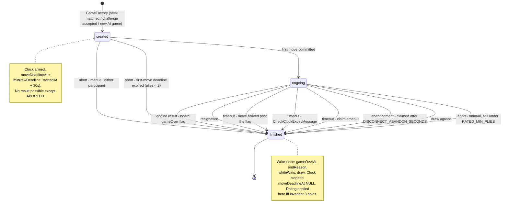

# Time Control — Clocks, Flag Adjudication, Lag Compensation, Abort

> Elaborates `00-overview.md` D3, D4, §3.5, §5 (P0.7) and invariants 5, 6, 7, 8, 9, 11.
> Owns the clock model, the timing anchor, lag compensation, the move transaction,
> flag adjudication, abort, abandonment, correspondence deadlines, worker reliability.
> Does not own: DDL (`01-domain-model.md`), Mercure mechanics (`02-realtime.md`),
> the rated? predicate (`06-rating.md`), clock rendering (`08-frontend.md`),
> routes and error catalogue (`09-api-reference.md`), phasing (`10-delivery-plan.md`).

A clock is the one subsystem here where a bug is not "the UI looks wrong" but
"the player lost a rated game to infrastructure". Everything below is written so
that the failure mode of every component is *late*, never *wrong*.

Units: `us` = microseconds since epoch (the unit of every timestamp in
`GameStatePayload`), `ms` = milliseconds. All arithmetic is on integers.
From `App\Model\MultiplayerLimits`: `L = CLOCK_LAG_COMPENSATION_MS = 100`,
`G = CLOCK_EXPIRY_GRACE_MS = 500`, `F = FIRST_MOVE_TIMEOUT_SECONDS = 30`.

---

## 1. Model

### 1.1 The three kinds

| `TimeControlKind` | Columns | Semantics | Rated? |
|---|---|---|---|
| `UNLIMITED = 0` | none | No clock, neither side can flag. Ends only by engine result, resignation, abort or draw agreement. | Never (inv. 3) |
| `REALTIME = 1` | `initial_seconds`, `increment_seconds` | Fischer increment: a depleting budget per side, increment credited *after* the move. | If inv. 3 holds |
| `CORRESPONDENCE = 2` | `days_per_move` | A per-move allowance, reset in full on every move. No carry-over, no banking. | If inv. 3 holds |

No Bronstein, no simple delay, no extra time at move 40 (D3). A fourth kind
would touch two functions: `ClockManager::arm()` and
`SpeedCategory::fromTimeControl()`.

### 1.2 Where the state lives

| Field | Table | Type | Meaning |
|---|---|---|---|
| `GamePlayer.clockMsRemaining` | `game_player` | `int NULL` | Milliseconds left for that side **as of `Game.clockTurnStartedAt`**. Never decremented by the passage of time; written only at turn boundaries. |
| `Game.clockTurnStartedAt` | `game` | `timestamptz(6) NULL` | The instant the current turn's clock started. The running-clock anchor. |
| `Game.moveDeadlineAt` | `game` | `timestamptz(6) NULL`, indexed | Denormalised `clockTurnStartedAt + clockMsRemaining[sideToMove]`: the instant the side to move reaches zero. |
| `Game.startedAt` | `game` | `timestamptz NULL` | When the clock was first armed. Anchor for ply 0. |
| `Game.endReason` | `game` | `smallint` | `GameEndReason`, write-once with `gameOverAt`. |

Invariant 11 fixes nullability: both `clockMsRemaining` are `NULL` **iff** the
kind is `UNLIMITED`; correspondence therefore stores a real number (§1.3).

`moveDeadlineAt` is derivable and stored anyway: it is the only thing a sweep
query can index (`00-overview.md` §7's escape hatch is literally "sweep
`move_deadline_at`"), it lets game lists render "deadline in 4h" without joining
`game_player`, and it is what `CheckClockExpiryMessage` is scheduled against. It
is written in the same statement as the anchor, so it cannot drift.

**Why stored rather than folded over `game_move.created_at`:** that column is
`TIMESTAMP(0) WITHOUT TIME ZONE` (`migrations/Version20260203141243.php:27`), so
bullet is decided in units it cannot represent; it is stamped at the wrong
instant (§2.1); the fold is O(N) on a path that runs on every game page load
(§5.2b); and it cannot represent non-move clock events — lag compensation, the
first-move clamp, any future courtesy-time button.

### 1.3 Arithmetic

**Arming** (`GameFactory`, via `ClockManager::arm()`):

```
startedAt = clockTurnStartedAt = now
REALTIME:        clockMsRemaining[WHITE] = clockMsRemaining[BLACK] = initialSeconds * 1000
CORRESPONDENCE:  clockMsRemaining[WHITE] = clockMsRemaining[BLACK] = daysPerMove * 86_400_000
UNLIMITED:       clockMsRemaining[WHITE] = clockMsRemaining[BLACK] = NULL
```

**The deadline**, for side to move `s`, recomputed at every turn boundary:

```
plies        = game.gameMoves.count()
rawDeadline  = clockTurnStartedAt + clockMsRemaining[s] * 1000      # NULL if UNLIMITED
firstMoveCap = clockTurnStartedAt + F * 1_000_000

moveDeadlineAt = plies < 2 ? min(rawDeadline ?? +inf, firstMoveCap) : rawDeadline
```

An `UNLIMITED` game therefore carries a non-null deadline for exactly its first
two plies (the abort timer, §7) and `NULL` after. That expression is the whole
of §7's timer.

**Charging a move** by side `s` received at `t_r`:

```
elapsedMs = intdiv(max(0, t_r - clockTurnStartedAt), 1000)
chargedMs = max(0, elapsedMs - L)
flagged   = chargedMs > clockMsRemaining[s]           # REALTIME and CORRESPONDENCE alike

REALTIME:        clockMsRemaining[s] = max(0, clockMsRemaining[s] - chargedMs) + incrementSeconds * 1000
CORRESPONDENCE:  clockMsRemaining[s] = daysPerMove * 86_400_000     # full reset, no carry-over
UNLIMITED:       clockMsRemaining[s] = NULL                         # flagged is always false
```

`max(0, ...)` before `+ increment` is deliberate: a player who lands on zero
inside the lag window plays on the increment alone; with a zero increment they
get `0`, `moveDeadlineAt = now`, and flag on their next move. Correct Fischer
behaviour, not a special case.

`clockMsRemaining` is `int`; the largest producible value is a 7-day allowance,
`604_800_000 ms`, well inside signed 32-bit. No cap on accumulated increment.

**Speed category** (contract, pure, computed once at creation and never again):
`estimated = initialSeconds + 40 * incrementSeconds`; `< 180` BULLET, `< 480`
BLITZ, `< 1500` RAPID, else CLASSICAL. `CORRESPONDENCE` yields
`CORRESPONDENCE`; `UNLIMITED` yields `null` and is never rated.

### 1.4 Payload mapping

`clockTurnStartedAt` and `moveDeadlineAt` are `timestamptz(6)`, unlike every
existing timestamp column, which is `TIMESTAMP(0)`
(`migrations/Version20260203141243.php:25,27`). `01-domain-model.md` owns the
DDL; the requirement is this chapter's: **second resolution is not acceptable
for either column.**

| `GameStatePayload.clock` | Source |
|---|---|
| `kind` | `TimeControlKind` name, lowercase snake_case string |
| `whiteMs` / `blackMs` | `GamePlayer.clockMsRemaining` verbatim, **not** interpolated |
| `running` | `null` unless ongoing and not `UNLIMITED`; else the colour to move |
| `turnStartedAt` / `deadlineAt` | `Game.clockTurnStartedAt` / `Game.moveDeadlineAt`, us |
| `serverTime` (top level) | `now`, us, stamped by `GameStatePayloadBuilder` |

The client renders `displayed = clockMs - (serverNow - turnStartedAt)/1000` for
the running side and holds the other static. `serverTime` exists so it computes
skew once and never trusts its own wall clock (inv. 6). See `08-frontend.md` §4.

---

## 2. The timing anchor problem

### 2.1 What is broken today

`GameEngine::applyMove()` performs the engine round trip before opening a
transaction and before any timestamp is taken:

```
src/Engine/GameEngine.php:38   $boardData = $this->engineApi->replayMoves($movesData);   <- network
src/Engine/GameEngine.php:48   $connection->beginTransaction();
src/Engine/GameEngine.php:51   $newMove = $this->boardTreeManager->getGameMove(...);     <- stamps createdAt
```

`GameMove::__construct` sets `createdAt = new \DateTimeImmutable()`
(`src/Entity/GameMove.php:34`), reached via `Game::addMove()`
(`src/Entity/Game.php:220-226`) from `BoardTreeManager::getGameMove()`
(`src/Engine/BoardTreeManager.php:45`) — after the engine call, inside the
transaction.

That call is unbounded: `EngineApi::callApi()` passes no `timeout` or
`max_duration` (`src/Engine/EngineApi.php:42-51`) and
`frankenphp/conf.d/10-app.ini` sets no `default_socket_timeout`. On a game's
**first move** it is two round trips: `getGameMove()` calls
`getRootBoardPosition()` when there is no prior move (`BoardTreeManager:33-34`),
issuing a second `replayMoves()` from *inside* the open transaction (`:98`).

`game_move.created_at` therefore measures "when the platform finished talking to
Rust", at one-second resolution. It stays as a cheap audit column; nothing in
the clock reads it.

### 2.2 The principle

> **Engine latency and platform latency never burn a player's clock.** The only
> interval charged to a player is between the opponent's move becoming visible
> and their own move arriving at the server.

```
 t_a --------------------- t_r ------------ t_x -- t_c -- t_p
  |                         |                |      |      |
  |  charged to the mover   | engine round   |flush |commit|publish
  |  (thinking + network)   | trip + board   |      |      |
  |                         | tree dedup     |<-- charged to NOBODY -->|
```

`t_a` = `Game.clockTurnStartedAt`, written by the previous ply. `t_r` =
`$receivedAt`, captured at controller entry. `t_x` = the new anchor, captured
immediately before `flush()`. `t_p` = the Mercure publish.

`[t_r, t_x]` holds the unbounded engine call and is charged to nobody.
`[t_x, t_p]` — flush, commit, publish — is charged to the *opponent* and is the
one residual: a local Postgres write plus a local hub POST, single-digit
milliseconds, refunded on their next move by the 100 ms compensation of §3.
`ClockManager` logs at `warning` when `t_x - t_r` exceeds 1 s, so engine
degradation is visible before players complain.

### 2.3 The fix

Capture `$receivedAt` as the **first statement** of the controller, before the
repository lookup and before the voter:

```php
#[Route(path: '/play/{uuid}/move', name: 'submit_move', methods: ['POST'])]
public function __invoke(string $uuid, Request $request): Response
{
    $receivedAt = $this->clockManager->nowMicros();
    // 404 / 403 / 415 / 400 / 409 preconditions, none of which cost the mover clock
}
```

and thread it through: `GameEngine::applyMove(Game, MoveData, int
$receivedAtMicros)` and `GameEngine::aiMove(Game, int $receivedAtMicros)`. The
three existing `applyMove` callers — `SubmitMoveAction:86`,
`ProcessAiMoveHandler:40`, `PlayAICommand:46` — each pass a capture taken at
their own entry. For an AI game `ClockManager` is a no-op and the value is
discarded; the engine is never charged.

`ClockManager::nowMicros()` is the single time source for the subsystem, wrapping
`Symfony\Component\Clock\ClockInterface` — `symfony/clock` v7.4.8 is vendored and
autowirable, aliased by framework-bundle at
`vendor/symfony/framework-bundle/Resources/config/services.php:242` — and
returning `(int) $clock->now()->format('Uu')`. Promote it from transitive (pulled
by `symfony/messenger` and `symfony/security-bundle`) to a direct
`composer require`. Using `ClockInterface` rather than `microtime()` makes every
rule here testable with `MockClock` without sleeping. `ClockManager` is a
`readonly class` with no mutable state, so worker mode needs no `kernel.reset`
(`00-overview.md` §6).

### 2.4 The only writer

Nothing outside `ClockManager` may write a clock column.

| Method | Caller | Effect |
|---|---|---|
| `arm(Game)` | `GameFactory` | Sets `startedAt`, `clockTurnStartedAt`, both `clockMsRemaining`, `moveDeadlineAt` |
| `chargeAndSwap(Game, PieceColor $mover, int $receivedAt, int $anchorAt): ClockOutcome` | `GameEngine::applyMove` only | Charges the mover, credits the increment, moves the anchor to `$anchorAt`, recomputes `moveDeadlineAt` |
| `stop(Game, int $atMicros)` | `GameLifecycleManager`, `ClockAdjudicator` | Charges the side to move up to `$atMicros`, floors at 0, nulls `clockTurnStartedAt` and `moveDeadlineAt` |

`ClockOutcome` = `{bool flagged, int chargedMs, int remainingMsAfter, ?int
deadlineAtMicros}`. `flagged === true` aborts the move and finalises (§4 step 13).

---

## 3. Lag compensation

### 3.1 Formula

```
chargedMs = max(0, elapsedMs - CLOCK_LAG_COMPENSATION_MS)
```

applied on every ply of every clocked game. The two tolerance constants never
overlap:

| Constant | Applies to | Credited to a clock? | Purpose |
|---|---|---|---|
| `L = 100 ms` | The **move path** only | Yes, the player keeps it | Refund of the inbound network leg: a move that left the client before the deadline must not flag on transit. |
| `G = 500 ms` | The **adjudicator** only | Never | Slack before declaring a flag on a player who has not moved: a move still in flight, commit skew, and `timestamp(0)` rounding of `messenger_messages.available_at` (§10.2). |

```
client-visible deadline = moveDeadlineAt
last accepted move      = moveDeadlineAt + L
adjudicator fires at    = moveDeadlineAt + L + G
```

The two paths **agree on the verdict** and differ only in latency: between
`moveDeadlineAt + L` and `+ L + G` a late move self-flags with the same result
the timer would produce 500 ms later. There is no window in which they disagree.

### 3.2 Worked examples

A 3+2 game (180 s, +2 s), Black to move, anchor `t_a`, offsets in ms after `t_a`.

**A — normal.** Black has 174 300 ms, deadline `t_a + 174 300`, move at `t_a + 4 520`.
`elapsed 4520 -> charged 4420`; `4420 > 174300`? no -> accepted;
`remaining = 174300 - 4420 + 2000 = 171 880`.

**B — 80 ms late, saved by compensation.** Black has 1 200 ms, deadline
`t_a + 1 200`, move at `t_a + 1 280`. `elapsed 1280 -> charged 1180`;
`1180 > 1200`? no -> accepted; `remaining = 1200 - 1180 + 2000 = 2 020`. Black had
20 ms left. This is the point of `L`: a move dispatched at `t_a + 1 180` that
spent 100 ms on the wire is not punished for the wire.

**C — 400 ms late, flagged.** Same 1 200 ms, move at `t_a + 1 600`.
`elapsed 1600 -> charged 1500`; `1500 > 1200`? **yes** -> flagged, overrun 300 ms.
The move is **not applied**: `ClockManager::stop()` floors Black to 0,
`GameLifecycleManager::finaliseTimeout(game, BLACK)` writes `gameOverAt`,
`endReason = TIMEOUT`, `whiteWins = true`, `draw = false`. Response `409 flagged`
with the finished payload in `details.state`; the same payload goes to
`game/{uuid}`. Had Black sent nothing, the `CheckClockExpiryMessage` scheduled
for `t_a + 1 800` would have produced a byte-identical result.

### 3.3 Deliberately not done

| Rejected | Why |
|---|---|
| **Per-client measured lag** (an EWMA of observed RTTs per connection) | Needs per-connection state: in memory, forbidden by `00-overview.md` §6, or a Postgres write on every move — a second row lock on the hot path to refine a value that changes maybe one game in ten thousand. |
| **Round-trip probing** | Mercure is one-directional; a probe needs a second endpoint hit at ~1 Hz per connected player to tune a 100 ms constant. Also trivially gameable: understate lag when winning, overstate when losing. |
| **Trusting a client timestamp** | Invariant 6. `SubmitMoveAction` reads only the 2-byte `MoveData` body. |
| **Compensating the outbound leg** | Already covered: the anchor `t_x` precedes commit and publish, and `L` refunds the receiver's inbound leg. Double-compensating would let a slow connection gain time. |

100 ms is a *policy*, not a measurement: generous same-datacentre, slightly
stingy intercontinental, identical for both players in a game, so it cannot
create an asymmetric advantage. The seam for making it adaptive is
`ClockManager::compensationMsFor(GamePlayer): int`, currently returning the
constant.

---

## 4. The move transaction

### 4.1 Algorithm

```
POST /play/{uuid}/move

 0. receivedAt := clockManager.nowMicros()                     # first statement, no I/O before it

 --- unlocked preconditions, no writes --------------------------------------
 1. game := GameRepository::findByUuid(uuid)                   # WITH deletedAt IS NULL (landmine 5)
    null                                     -> 404 game_not_found
 2. !isGranted(GAME_PARTICIPATE, game)       -> 403 forbidden
 3. body not 2 bytes / unparseable           -> 415 | 400 invalid_move_data
 4. game.gameOverAt !== null                 -> 409 game_finished
 5. ClockAdjudicator::adjudicate(game)                          # §5, takes its own short lock
    returned true                            -> 409 flagged + details.state
 6. mover := colour of the acting participant
    game.isWhiteTurn() !== (mover === WHITE) -> 409 not_your_turn
    expectedMoveCount := game.gameMoves.count()

 --- engine round trip, OUTSIDE every transaction ---------------------------
 7. movesData := game.getMovesData(); movesData.addMove(moveData)
    boardData := EngineApi::replayMoves(movesData)              # unbounded, uncharged

 --- the locked transaction -------------------------------------------------
 8. BEGIN                                                       # READ COMMITTED, the default
 9. SET LOCAL lock_timeout = '3s'
10. em.find(Game::class, game.id, LockMode::PESSIMISTIC_WRITE)  # SELECT ... FOR UPDATE, §6
11. re-validate against the row just locked:
      gameOverAt !== null                     -> ROLLBACK, 409 game_finished
      gameMoves.count() !== expectedMoveCount -> ROLLBACK, 409 not_your_turn
12. outcome := ClockManager::chargeAndSwap(game, mover, receivedAt, anchorAt := nowMicros())
13. outcome.flagged
      -> ClockManager::stop(game, receivedAt)
         GameLifecycleManager::finaliseTimeout(game, mover)     # gameOverAt/endReason/whiteWins/
                                                                # draw + RatingUpdater
         flush; COMMIT; publish; return 409 flagged + details.state
14. gameMove := BoardTreeManager::getGameMove(game, boardMovesData); em.persist(gameMove)
15. game.drawOfferedByColor := null                             # any move revokes a standing offer
16. boardData.gameOver
      -> gameOverAt := anchorAt; endReason := ENGINE
         whiteWins := boardData.whiteWins; draw := boardData.draw
         ClockManager::stop(game, receivedAt); RatingUpdater::applyForFinishedGame(game)
17. em.flush()                                                  # ONE versioned UPDATE on game
18. COMMIT                                                      # version bumped in memory -> seq

 --- after commit -----------------------------------------------------------
19. payload := GameStatePayloadBuilder::build(game)
20. GameUpdatePublisher::publishGameState(payload)              # topic game/{uuid}
21. still ongoing and kind !== UNLIMITED:
       dispatch CheckClockExpiryMessage(uuid, gameMoves.count(), moveDeadlineAt)
                DelayStamp(max(0, moveDeadlineAt + (L+G)*1000 - nowMicros()) / 1000)
    kind === CORRESPONDENCE:
       dispatch CorrespondenceNudgeMessage(uuid, gameMoves.count()) with its DelayStamp (§9.3)
    opponent is the engine:
       dispatch ProcessAiMoveMessage(uuid, gameMoves.count())    # unchanged
22. return 200 with the payload from step 19
```

### 4.2 Ordering constraints

| Step | In the transaction? | Why |
|---|---|---|
| 7 engine call | **No** | Unbounded (§2.1). Holding `FOR UPDATE` across it turns one slow engine response into a stalled game and a pinned Postgres connection. |
| 10 row lock | Yes, and **first** | It is what serialises everything else; any read before it is stale. |
| 11 re-validation | Yes | Steps 1-6 read unlocked state that may have changed while waiting for the lock. |
| 12 clock arithmetic | Yes | Reads and writes `clockTurnStartedAt` under the lock. |
| 14 board-tree writes | Yes | Must roll back with the move. These nest transactions (`BoardTreeManager:64,111`); DBAL 4 turns a nested `beginTransaction()` into a `SAVEPOINT` (`vendor/doctrine/dbal/src/Connection.php:1054-1062`), so it is safe. |
| 16 rating write | Yes | Inv. 4: ratings change exactly once, at the transition to `gameOverAt IS NOT NULL`. |
| 20 publish | **No, after commit** | Publishing inside means a subscriber can be told about a state that then rolls back. A published-then-rolled-back `seq` is unrecoverable for a client that drops `seq <= lastSeq`. |
| 21 dispatch | **No, after commit** | The `async` transport writes to the same Postgres connection. Dispatching before commit lets the other `numprocs=2` worker consume a message whose game state is not yet visible. Dispatching after risks only a message never sent, which §5.2b covers. |

### 4.3 Failure modes

| Failure | Behaviour |
|---|---|
| Engine unreachable at step 7 | `EngineApi` throws `\RuntimeException` (`src/Engine/EngineApi.php:53-55`). No transaction, no clock write, anchor untouched -> `502`. Nothing is charged, but the retry is charged from the same `t_a`, so a slow engine still costs the mover real time. A bounded engine timeout is the mitigation; `10-delivery-plan.md` carries it. |
| `lock_timeout` at step 10 | `LockWaitTimeoutException` -> rollback, `409 concurrent_move` + `details.state`. Nothing charged. |
| Crash between 18 and 20 | Committed but unannounced. The opponent resyncs on their next event or `GET /play/{uuid}/state`; the `seq` guard makes a late arrival harmless. |
| Crash between 20 and 21 | Published but no timer. Covered by §5.2b and §5.2c. |

---

## 5. Flag adjudication — three paths, one method

### 5.1 The method

```php
final readonly class ClockAdjudicator
{
    /** Idempotent. True iff THIS call transitioned the game to finished. */
    public function adjudicate(Game $game): bool;
}
```

Idempotent (inv. 7): two concurrent invocations produce one result, the loser
returns `false`. Never throws for an ordinary state — finished, unarmed,
`UNLIMITED`, or deadline-in-the-future all return `false` without writing.
Publishes exactly one payload when it returns `true`, after its own commit, and
never when it returns `false` (inv. 8). Read-only in the common case: it
short-circuits before opening a transaction, which is what makes path (b)
affordable.

```
adjudicate(game):
    if game.gameOverAt !== null:                    return false
    if game.moveDeadlineAt === null:                return false     # UNLIMITED past ply 1
    if nowMicros() < moveDeadlineAt + (L+G)*1000:   return false     # not yet
    plies := game.gameMoves.count()

    TRANSACTION:
        SET LOCAL lock_timeout = '3s'
        em.find(Game, game.id, PESSIMISTIC_WRITE)                     # the mutex, §5.5
        re-read; if gameOverAt !== null
              or moveDeadlineAt === null
              or gameMoves.count() !== plies
              or nowMicros() < moveDeadlineAt + (L+G)*1000:
            ROLLBACK; return false                                    # someone moved first
        loser := game.isWhiteTurn() ? WHITE : BLACK
        ClockManager::stop(game, moveDeadlineAt)                      # floors loser to exactly 0
        plies < 2 ? GameLifecycleManager::finaliseAbort(game)         # §7
                  : GameLifecycleManager::finaliseTimeout(game, loser)
        flush; COMMIT
    publish GameStatePayloadBuilder::build(game)
    return true
```

`stop(game, moveDeadlineAt)` — not `nowMicros()` — so the final clock reads
exactly `0` however late the adjudicator ran. **The recorded outcome is
independent of discovery time.** That single line is what makes §10.5 true.

### 5.2 The three callers

| # | Caller | When | Purpose |
|---|---|---|---|
| a | `CheckClockExpiryHandler` | `DelayStamp` to `moveDeadlineAt + L + G`; ~1 s accuracy with §10.2's DSN tuning | The live flag-fall moment: the result appears without anyone clicking. |
| b | `adjudicate()` on read | Every authenticated `GET /play/{uuid}`, `GET /play/{uuid}/state`, and step 5 of the move transaction. Zero extra queries in the common case. | The safety net: worker down, message in `failed`, deadline passed unobserved. |
| c | `POST /play/{uuid}/claim-timeout` | Explicit, `GAME_PARTICIPATE` | The player-facing escape hatch. `false` -> `409 clock_not_expired` + `details.state`, so the client resyncs its countdown instead of arguing. |

Path (b) runs for **authenticated participants only**, never anonymous
spectators: `GAME_VIEW` is public (`00-overview.md` §4.3), and letting an
anonymous page load finalise a rated game hands a write-amplification lever to
anyone holding a game UUID. Spectators see the result on the next Mercure event.

### 5.3 The staleness guard

`CheckClockExpiryMessage(gameUuid, expectedMoveCount, deadlineAtMicros)`. The
handler discards before touching the adjudicator:

```
game := findByUuid(uuid)                                             # deletedAt IS NULL
if game === null:                                            return  # deleted, drop
if game.gameMoves.count() !== message.expectedMoveCount:     return  # a newer message governs
if game.moveDeadlineAt?.micros !== message.deadlineAtMicros: return  # deadline moved
ClockAdjudicator::adjudicate(game)
```

Neither field is redundant. `expectedMoveCount` catches the ordinary case (the
player moved) — the pattern `ProcessAiMoveHandler:32` already uses.
`deadlineAtMicros` catches a deadline that changed *without* a move: a re-armed
timer, or any future clock adjustment. Without it, a re-armed game could be
adjudicated against a stale deadline. A stale message is a **success**: the
handler returns normally, the transport acks, no retry and no `failed` row.

### 5.4 The grace window

`G = 500 ms` is applied only by the adjudicator, in the `DelayStamp` target and
in the guard re-evaluated **after** the lock. It absorbs:

1. A move in flight when the timer fires. The move takes the lock first; the
   adjudicator waits, re-reads, sees the changed move count, returns `false`.
2. `messenger_messages.available_at` is `TIMESTAMP(0)`
   (`migrations/Version20260204095300.php:22`). PostgreSQL rounds sub-second
   values to the nearest second on store, so a message can become available up
   to 500 ms **early**. The post-lock re-check catches it.
3. Clock skew between app and worker containers — defence in depth on one host.

### 5.5 Concurrency: the game row is the mutex

**Every** mutation of a game aggregate — move, adjudication, resignation, abort,
draw offer/accept, rematch, abandonment, presence transition, rating write —
begins by taking `LockMode::PESSIMISTIC_WRITE` on the `game` row inside a
transaction. That rule makes invariant 7 true by construction.

1. **Fixed global lock order:** `game` -> `game_player` (colour ASC) ->
   `user_rating` (`user_id` ASC) -> everything else. No transaction deviates, so
   `40P01` is unreachable between two game transactions. `06-rating.md` §5.3
   holds the same order.
2. **`SET LOCAL lock_timeout = '3s'`** on every such transaction: a FrankenPHP
   thread blocked indefinitely on a row lock is a leaked thread, a clean
   `LockWaitTimeoutException` mapped to `409` is not.
3. **No unbounded I/O under the lock.** Engine call before, publish after.
4. **`em.find(Game::class, $id, PESSIMISTIC_WRITE)`** is the only accepted
   spelling. For an entity already in the identity map Doctrine issues a
   `refresh()` carrying the lock mode
   (`vendor/doctrine/orm/src/EntityManager.php:339-343`), which both locks and
   re-hydrates — exactly what step 11 needs. `find()` does **not** itself require
   an open transaction (only `EntityManager::lock()` does, `:608-610`), so
   `FOR UPDATE` outside one silently releases at statement end: **open the
   transaction first.** The locking `SELECT` must target the `game` row alone —
   Postgres rejects `FOR UPDATE` against the nullable side of an outer join, so
   it must not be fused with a `leftJoin('g.gameMoves')`.

| A | B | Resolution |
|---|---|---|
| Move | Delayed expiry | First to the lock wins. Move first -> adjudicator's re-read sees a changed move count -> `false`. Adjudicator first -> move's step 11 sees `gameOverAt` -> `409 game_finished`. |
| Claim-timeout | Delayed expiry | Same method; one `true`, one `false`. A `false` on an already-finished game returns `200` with the finished state, not `409`. |
| Move | Opponent's claim-timeout | Serialised by the lock. Move inside `+L` -> the claim then fails its deadline guard. Move later -> it self-flags at step 13 and the claim finds the game finished. |
| Two adjudications | — | One `true`, one `false`, one publish. |
| Move by White | Move by Black | Turn check, then post-lock move-count re-validation. |

### 5.6 Interaction with the invariants

- **Inv. 5** (never reopened): every write path re-checks `gameOverAt !== null`
  *after* taking the lock. `gameOverAt`, `endReason`, `whiteWins`, `draw` are
  write-once, enforced by a guard in `GameLifecycleManager`, the only class
  permitted to set them.
- **Inv. 8 / 9** (`seq === Game.version`): the adjudicator dirties `game`, so
  Doctrine bumps `version` in the same `UPDATE`. A `false` return publishes
  nothing and bumps nothing.
- **No re-arming.** If the post-lock re-check finds the deadline not yet passed
  (§5.4 case 2), the handler returns `false` and schedules no replacement:
  re-arming from inside a handler is a self-perpetuating chain that outlives its
  game. The affected player is by definition looking at the board, so path (b)
  covers the gap on their next request.
- **`GameRepository::findByUuid()` must filter `deletedAt IS NULL`** (landmine 5;
  `src/Repository/GameRepository.php:23-30` does not; `00-overview.md` §6 fixes
  it in P0.2). Without it the adjudicator will finalise and publish a
  soft-deleted game.

### 5.7 Lifecycle



`created` vs `ongoing` is not a column: it is `gameMoves.count() === 0` vs `> 0`,
surfaced as `status`. A status enum would be a second source of truth for
something `gameOverAt` and the move count already determine.

| Edge | `endReason` | `whiteWins` | `draw` | Rated? |
|---|---|---|---|---|
| Engine result | `ENGINE` | from `BoardData` | from `BoardData` | if inv. 3 |
| Resignation | `RESIGNATION` | `resigner === BLACK` | `false` | if inv. 3 |
| Timeout (any path) | `TIMEOUT` | `loser === BLACK` | `false` | if inv. 3 |
| Abandonment | `ABANDONMENT` | `absentee === BLACK` | `false` | if inv. 3 |
| Draw agreed | `DRAW_AGREED` | `false` | `true` | if inv. 3 |
| Abort | `ABORTED` | `false` | `false` | **never** |

A timeout is **always** a win, never a draw. "Flag-fall with insufficient
material is a draw" would require the platform to evaluate material, which
`00-overview.md` §1 forbids absolutely; the engine wire protocol has no way to
ask and inventing one would leak rules knowledge into PHP.

---

## 6. The optimistic-lock collapse

### 6.1 What exists today

`GameEngine::applyMove()` (`src/Engine/GameEngine.php:34-89`) runs two mutually
exclusive locking paths under a session-scoped isolation change:

```
41     $expectedVersion = $game->getVersion();
43-45  setTransactionIsolation(SERIALIZABLE)
48     beginTransaction()
51-52  persist(new GameMove)                    # inverse side only: Game stays CLEAN
55-59  if gameOver -> mutate Game               # Game becomes DIRTY
61     flush()                                  # versioned UPDATE only if dirty
66-76  if !gameOver -> raw "UPDATE game SET version = version + 1
                             WHERE id = :id AND version = :version"
                      0 rows -> OptimisticLockException::lockFailed()
78     commit()
85     setTransactionIsolation($previousIsolation)
```

Path 2 exists because adding a `GameMove` to the inverse-side collection
(`src/Entity/Game.php:220-226`) does not dirty `Game`, so Doctrine emits no
`UPDATE game` and performs no version check.

### 6.2 Why a clock makes path 2 unreachable

Step 12 of §4.1 writes `clockTurnStartedAt` and `moveDeadlineAt` on **every**
move, so `Game` is dirty on every move:

1. Line 61 `flush()` emits `UPDATE game SET clock_turn_started_at = ?,
   move_deadline_at = ?, version = version + 1 WHERE id = ? AND version = ?` with
   the *old* version in the `WHERE`
   (`vendor/doctrine/orm/src/Persisters/Entity/BasicEntityPersister.php:467-481`).
   The row now holds `v + 1`.
2. Line 66 `if (!$boardData->gameOver)` is still true for a normal move.
3. Lines 68-71 run with `:version = $expectedVersion = v`; the row holds `v + 1`.
   **Zero rows affected.**
4. Line 73 throws.

`00-overview.md` §3.5 calls this "dead code overnight, silently". The failure is
louder, which is the only mercy in it: path 2 becomes unreachable *as a
correctness mechanism* while remaining perfectly reachable *as a statement* — it
throws on 100% of non-terminal moves, and `SubmitMoveAction:87-92` turns that
into `409 concurrent_move`. Every human move in every game 409s and rolls back.
That would be caught in the first minute of testing; the danger is a partial
implementation (clock fields written on only *some* moves) making it
intermittent instead.

### 6.3 Two further reasons, independent of the above

**The in-memory version goes stale.** The raw statement bypasses the UnitOfWork,
so `$game->version` still reads `v` while the row reads `v + 1`. The contract
makes `seq === Game.version` (inv. 9) and tells clients to drop `seq <= lastSeq`,
so a payload built after `applyMove()` in the same process carries a stale `seq`
and is **silently discarded by the receiving client** — the hardest failure mode
to reproduce and attribute. `PlayAICommand:46-48` already builds and publishes
after `applyMove()` in one process; the drift is invisible today only because the
payload carries no `seq`. This makes P0.4 (`GameStatePayloadBuilder`) hard-depend
on P0.7.

**`SERIALIZABLE` here is session-scoped.**
`PostgreSQLPlatform::getSetTransactionIsolationSQL()` emits `SET SESSION
CHARACTERISTICS AS TRANSACTION ISOLATION LEVEL ...`
(`vendor/doctrine/dbal/src/Platforms/PostgreSQLPlatform.php:561-563`) — the whole
connection, not one transaction, and under worker mode the connection is
long-lived. The `finally` at line 85 "restores" it generously:
`getTransactionIsolation()` returns the platform *default* constant when none was
ever set (`vendor/doctrine/dbal/src/Connection.php:437-440`), so the restore
writes an explicit `READ COMMITTED` rather than reverting to the server's
configured value. Two extra round trips per move for an isolation level that
pessimistic locking makes unnecessary.

### 6.4 The replacement

P0.7 lands **before** any clock column exists — a pure refactor at the time it
lands, which is exactly why it must go first. Delete lines 41, 43-45, 63-76,
84-86. Keep `#[ORM\Version] $version` (`src/Entity/Game.php:47-49`); inv. 9
depends on it.

```php
public function applyMove(Game $game, MoveData $moveData, int $receivedAtMicros): BoardMovesData
{
    // 1. Engine round trip: no transaction, no lock, unbounded, uncharged.
    $movesData = $game->getMovesData();
    $movesData->addMove($moveData);
    $expectedMoveCount = $game->getGameMoves()->count();
    $boardMovesData = new BoardMovesData($this->engineApi->replayMoves($movesData), $movesData);

    // 2. One transaction, one lock, one flush.
    return $this->entityManager->wrapInTransaction(
        function (EntityManagerInterface $em) use ($game, $boardMovesData, $expectedMoveCount, $receivedAtMicros): BoardMovesData {
            $em->getConnection()->executeStatement("SET LOCAL lock_timeout = '3s'");

            // SELECT ... FOR UPDATE + re-hydrate (EntityManager.php:339-343).
            $em->find(Game::class, $game->getId(), LockMode::PESSIMISTIC_WRITE);

            if (null !== $game->getGameOverAt()) {
                throw new GameAlreadyFinishedException();
            }
            if ($game->getGameMoves()->count() !== $expectedMoveCount) {
                throw new StalePositionException();
            }

            // ... §4.1 steps 12-17 ...
            $em->flush();

            return $boardMovesData;
        }
    );
}
```

`wrapInTransaction` replaces the hand-rolled begin/commit/rollback; DBAL's
nested-savepoint handling (`Connection.php:1054-1062`) keeps `BoardTreeManager`'s
inner `wrapInTransaction` calls (`:64,111`) safe inside it.

### 6.5 Justification

| Claim | Evidence |
|---|---|
| Every move dirties `game` anyway | §4.1 step 12 writes the anchor and deadline unconditionally; step 15 clears `drawOfferedByColor`. The `UPDATE` carrying the version bump is a row we were writing regardless — the lock costs one extra `SELECT ... FOR UPDATE`, not an extra write. |
| Contention is negligible | A `game` row has exactly two participants (inv. 1), at most one of whom may legally move. The realistic concurrent writers are the mover, an adjudicator, and possibly a claim: three short transactions each holding the lock for one flush against local Postgres. Not a hot row; a row with a two-person waiting list. |
| It eliminates the retry storm | `SERIALIZABLE` reports serialization failures as `40001`, which DBAL maps to `DeadlockException` (`.../PostgreSQL/ExceptionConverter.php:34-36`), which `implements RetryableException` (`vendor/doctrine/dbal/src/Exception/DeadlockException.php:10`). Under a clock a 409 is not a benign retry: the client resubmits and every retry burns real time while the anchor stays put. Pessimistic locking converts the retry into a bounded wait — and because `$receivedAt` was captured *before* the wait, the wait costs the mover nothing. |
| It removes an unbounded stall | The engine call moves outside the transaction. One residual: on a game's first move `BoardTreeManager::getRootBoardPosition()` still issues an engine call from inside it (`:98` via `:33-34`). **`01-domain-model.md` must seed the root `BoardPosition` in a migration**, or every game's first move holds a row lock across an unbounded engine call. |

### 6.6 What happens to `concurrent_move` and `RetryableException`

`SubmitMoveAction:85-92` catches `OptimisticLockException|RetryableException` and
returns `409 {'error': 'concurrent_move'}`.

| Exception | After |
|---|---|
| `OptimisticLockException` | Unreachable by design: every writer holds the row lock before dirtying `game`, so the version in the `WHERE` is always current. **Keep the catch**, log at `error` with the game UUID, treat a hit as a bug report — it means some path mutated a game without the lock. Response unchanged. |
| `DeadlockException` `40001` | Unreachable: `40001` requires `SERIALIZABLE` or `REPEATABLE READ`; the transaction now runs at the connection default `READ COMMITTED`. |
| `DeadlockException` `40P01` | Prevented by the fixed lock order (§5.5). Keep the catch as a last resort, log at `error`. |
| `LockWaitTimeoutException` | New, and the only member of the family expected to fire. Already a `RetryableException` subtype, so the existing catch covers it. Map to `409 concurrent_move` — the honest meaning of that code, and the only one it will ever carry. |
| `StalePositionException` (new) | Post-lock move-count mismatch -> `409 not_your_turn` + `details.state`. |
| `GameAlreadyFinishedException` (new) | Post-lock `gameOverAt` -> `409 game_finished` + `details.state`. |

The HTTP contract is therefore **unchanged**: `409 concurrent_move` stays
documented with retry-once semantics (`09-api-reference.md` §9 keeps it, marked
should-never-fire) and no client change is required by P0.7. What changes is that
the code stops being the normal outcome of a normal move.

---

## 7. First-move timeout and abort

### 7.1 The clamp

While `gameMoves.count() < 2` — White's first move and Black's first move —
`moveDeadlineAt` is clamped to `clockTurnStartedAt + F * 1_000_000` (§1.3),
including in `UNLIMITED` games, the only circumstance in which an untimed game
carries a deadline. The real clock runs concurrently and the nearer bound wins;
below the smallest quick-pair preset (1+0, 60 s) the 30 s clamp is always nearer,
so every game has a 30 s "did anyone turn up" timer on each of its first two
plies.

Expiry inside the clamp is an **abort**, not a timeout: `ClockAdjudicator`
branches on `plies < 2` and calls `finaliseAbort()` (§5.1). No result, no rating
change, no loss recorded against anyone.

### 7.2 Who may abort, and when

```
Game::hasReachedRatedPlyFloor(): bool
    => min(whitePlies, blackPlies) >= RATED_MIN_PLIES      # i.e. gameMoves.count() >= 4

abortable(game) := game.gameOverAt === null && !game.hasReachedRatedPlyFloor()
```

`POST /play/{uuid}/abort` requires `GAME_PARTICIPATE`, needs **no consent**, and
is refused with `409 abort_not_allowed` once the floor is reached. Beyond it the
exits are resign, draw agreement, flag, or abandonment.

The window is the exact negation of the rating-eligibility ply predicate of
invariant 3, computed by one shared method so they cannot drift: **a game may be
aborted exactly while it would not have counted anyway.** That is why unilateral
abort needs no consent flow — there is nothing to lose by it. `06-rating.md` §6
clause 4 consumes the same helper, and `00-overview.md` §2.1's "before either
side has moved twice" is the same predicate and the same number.

### 7.3 Why an aborted game is never rated

1. **Invariant 3 fails by construction.** `abortable()` is the negation of the
   ply floor, so an aborted game can never satisfy it; the rating layer would
   skip it even if `endReason` were ignored.
2. **There is no result to rate.** Abort writes `whiteWins = false, draw = false`,
   which is not a score; Glicko-2 needs `1 / 0.5 / 0`.
3. **It would be farmable.** A ratable abort is a free re-roll of the pairing for
   anyone who dislikes their colour or their opponent's rating — and with D8
   removing takeback, abort is the last unilateral exit, so it must cost and
   grant nothing.

`ABORTED` and "unrated" are **not** the same set: a flag at ply 2 or 3 records
`endReason = TIMEOUT` with a genuine winner and is still unrated because inv. 3
fails on plies. The rating predicate must gate on plies, not only on `endReason`.

An aborted game is finished, not deleted: it keeps its row, shows as "aborted" in
history, and is hidden per participant via `GamePlayer.hiddenAt`.

---

## 8. Disconnection and abandonment

### 8.1 Presence: heartbeat vs. transition

`GamePlayer.lastSeenAt` is in-game presence — "this participant's browser had
this game open at this instant" — distinct from `User.lastSeenAt`, which is
site-wide and belongs to `05-social.md`. The two operations have opposite cost
profiles and must not be conflated.

**The heartbeat** (`POST /play/{uuid}/presence`, `GAME_PARTICIPATE`) writes
`UPDATE game_player SET last_seen_at = ?` for the caller's row only, takes **no
lock**, dirties nothing on `game`, publishes nothing, returns `204`. It must never
queue behind a move transaction, or it reports a disconnect that did not happen.

| Property | Value |
|---|---|
| Client interval | `SEEK_HEARTBEAT_INTERVAL_MS` = 10 000 ms (reused rather than adding a constant) |
| Considered present | `now - lastSeenAt <= DISCONNECT_ABANDON_SECONDS` (60 s) |
| Rate limiter | `game_presence_limiter`, 12/min per user per game — one interval of headroom over the 6/min the client generates |
| Write cost | One row per player per 10 s per open game. `00-overview.md` §7 sets the Redis trigger at ~100 presence writes/s, i.e. ~500 concurrent live games. |

**The transition** (edge-triggered, rare) takes the game row mutex, bumps
`Game.version`, and publishes exactly one `GameStatePayload`, so invariant 8 holds
and `02-realtime.md`'s `seq`-guarded client reducer needs no presence-shaped
exception. Edge detection needs no new timer:

- *absent -> present*: the arriving heartbeat compares `lastSeenAt` **before**
  overwriting it and escalates only if the gap exceeded
  `DISCONNECT_ABANDON_SECONDS`.
- *present -> absent*: the **opponent's** heartbeat also checks the other side's
  `lastSeenAt`; the opponent is polling every 10 s anyway, so worst-case
  detection is `DISCONNECT_ABANDON_SECONDS + 10 s`. Also caught opportunistically
  by any `GameStatePayloadBuilder::build()`.

A transition changes nothing on the `game` row, so `#[ORM\Version]` will not bump
on its own — nothing is dirty. `PresenceTracker::publishTransition()` therefore
issues an explicit `UPDATE game SET version = version + 1 WHERE id = :id`
followed by `em.refresh($game)`. This is the statement §6 deletes from the move
path, reintroduced at exactly one call site under the two conditions the current
code violates and that made it unsafe there: it runs **while holding
`PESSIMISTIC_WRITE` on the row**, and the version is **written back** to the
managed entity. A dedicated `game` column would also work; see Open question 5.

### 8.2 The clock does not pause

**A disconnected player's clock keeps running.** No pause, no auto-add, no grace
beyond `L`.

A pause-on-disconnect clock is trivially exploitable: pull the cable when short
of time, think, reconnect. The server cannot distinguish a dishonest disconnect
from a real one, and the honest case is already handled — the player who lost
connectivity loses on time, exactly as they would have if their machine had
frozen.

The consequence: abandonment is almost never why a game ends. In a 3+2 game a
disconnected player flags within minutes, long before anyone claims. Abandonment
matters for one shape only — `UNLIMITED` games and long correspondence, where the
flag is far away or does not exist.

### 8.3 A disconnect alone never ends a game before the flag

> A disconnect, however long, does **not** by itself terminate a game while the
> disconnected player still has clock. It makes a *claim* available to the
> opponent, and only after `DISCONNECT_ABANDON_SECONDS`.

The signal is a proxy, and a bad one: a missed heartbeat covers a backgrounded
tab, a laptop lid, a 90-second tunnel, so auto-terminating means losing rated
games to a train. The opponent may not even want it — in an `UNLIMITED` casual
game the natural response to "my friend dropped" is to wait. It would also need a
timer per disconnect, a fourth delayed-message type scheduled on a signal that
flaps, where the claim endpoint gets the same outcome with zero scheduled
messages. And the flag already covers the competitive case, correctly and sooner.

`POST /play/{uuid}/claim-timeout` serves both grounds:

```
require GAME_PARTICIPATE; claimant := caller's colour
if ClockAdjudicator::adjudicate(game):           return 200 + finished state   # flag fell
opponent := other(claimant)
if game.isWhiteTurn() !== (opponent === WHITE):  return 409 clock_not_expired  # not their turn
if now - GamePlayer[opponent].lastSeenAt < DISCONNECT_ABANDON_SECONDS:
                                                 return 409 clock_not_expired
TRANSACTION with the row mutex, re-check both conditions:
    ClockManager::stop(game, now)
    GameLifecycleManager::finaliseAbandonment(game, absentee := opponent)
COMMIT; publish; return 200 + finished state
```

One endpoint, two grounds, one lock, one payload. The abandonment branch requires
it to be the **absentee's turn**: a player who disconnects after moving is
obstructing nothing and cannot be claimed against. `endReason = ABANDONMENT`,
`whiteWins = (absentee === BLACK)`, `draw = false`, rated on the same terms as any
other result.

### 8.4 What the opponent sees

| Signal | Source |
|---|---|
| `presence: {"white": true, "black": false}` in every payload | `PresenceTracker`, derived from `lastSeenAt` |
| Greyed avatar and "Opponent disconnected" under the clock | `08-frontend.md` §5 (`PlayerPanelView`), driven by the payload |
| A "Claim victory" button, enabled only after `DISCONNECT_ABANDON_SECONDS` and only while it is the absentee's turn | Client-side gate on the same predicate; the server is authoritative and returns `409 clock_not_expired` if the client's timer is fast |
| The absentee's clock ticking down normally | Nothing special — the clock does not know about presence |

The absentee sees nothing until they reconnect, at which point their next request
runs path (b) and delivers whatever the current truth is.

---

## 9. Correspondence

### 9.1 Deadlines

Identical machinery. `clockMsRemaining` holds `daysPerMove * 86_400_000` and is
**reset in full** on every move rather than decremented (§1.3), so
`moveDeadlineAt = clockTurnStartedAt + clockMsRemaining * 1000` is the same
expression as real-time. No per-game budget, no banking: replying in ten seconds
gains nothing. Presets 1, 3, 7 days; `SpeedCategory` is always `CORRESPONDENCE`,
its own rating pool (D2).

Expiry is a normal timeout — `endReason = TIMEOUT`, absentee loses, rated if
inv. 3 holds. Nothing in §5 changes; only the magnitude of the delay does. Lag
compensation still applies and is meaningless at this scale; it is applied anyway,
because one formula is worth more than the branch would save.

### 9.2 A message that sits for seven days

Confirmed against the transport, not assumed:

- `Connection::send()` computes `available_at = now + delay` and inserts it as a
  plain column (`vendor/symfony/doctrine-messenger/Transport/Connection.php:133-160`).
  No upper bound on `delay`, no TTL anywhere in the transport.
- `createAvailableMessagesQueryBuilder()` filters `m.available_at <= ?` (`:388`);
  `get()` orders by `available_at ASC` with `LIMIT 1` (`:169-170`) and
  `FOR UPDATE SKIP LOCKED` (`:643`). A row seven days out is invisible to every
  poll until due and costs one index entry.
- `redeliver_timeout` (default 3600, `:56`) only affects rows with a non-null
  `delivered_at`; a pending delayed message has `delivered_at IS NULL`.

So the transport handles a seven-day delay correctly and cheaply. Two operational
notes:

**The index is wrong for this workload.** The project's migration creates three
single-column indexes (`migrations/Version20260204095300.php:23-25`), whereas the
transport's own schema builder wants the composite
`(queue_name, available_at, delivered_at, id)` (`Connection.php:565,591`). Because
the DSN sets `auto_setup=0` (`compose.yaml:65`) the hand-written migration is
authoritative and the composite index does not exist. With a correspondence
backlog the polling query degrades to an index scan plus heap fetches on rows
that are then filtered out. `01-domain-model.md` should add it.

**Backlog threshold.** With the nudge chain of §9.3 an active correspondence game
holds at most **two** rows in `messenger_messages` (one expiry, one nudge).
`00-overview.md` §7 puts the Redis/sweep trigger at 100 000 sustained undelivered
rows — roughly **50 000 concurrent correspondence games**. Below that, one row per
timer is the cheapest correct implementation. Above it, the named escape hatch is
a periodic sweep over the indexed `game.move_deadline_at`, which is exactly why
that column is denormalised and indexed (§1.2).

### 9.3 The nudge chain

`CorrespondenceNudgeMessage(gameUuid, expectedMoveCount)` carries no tier
discriminator, so the handler derives the tier from the time left and reschedules
itself: one live row per game, not three.

| Tier | Fires at | Condition |
|---|---|---|
| 1 | `moveDeadlineAt - 24h` | `daysPerMove >= 3` |
| 2 | `moveDeadlineAt - 6h` | `daysPerMove >= 1` |
| 3 | `moveDeadlineAt - 1h` | always |

```
onMove(correspondence game):
    dispatch CorrespondenceNudgeMessage(uuid, plies), DelayStamp to the earliest future tier

handler(message):
    game := findByUuid(uuid)                                        # deletedAt IS NULL
    if game === null or game.gameOverAt !== null:            return # drop, no reschedule
    if game.gameMoves.count() !== message.expectedMoveCount: return # they moved, drop
    tier := the tier whose window contains (moveDeadlineAt - now)
    NotificationDispatcher::dispatch(sideToMove.user, YOUR_TURN, {...})
    next := the next tier still in the future
    if next !== null: re-dispatch the same message with a DelayStamp to next
```

The immediate "it is your turn" notification at move time is not a nudge; it is
dispatched by the move transaction and owned by `07-notifications.md` §6. Nudges
are reminders for someone already told once. `NotificationDispatcher` applies
`User.notificationPreferences`, so a player who mutes reminders still has the
deadline enforced — they are simply not told about it.

### 9.4 Vacation and pause — out of scope

**Recommendation: not built.** A pause that stops the clock is an unbounded
takeback of time, which D8 removed from rated play for exactly this class of
reason; making it safe needs a vacation budget, accrual rules, a per-game opt-out
and an anti-abuse policy — its own spec. It also contradicts §8.2: the clock does
not pause for a disconnect, and a scheduled pause is the same exemption with a
nicer name. Mechanically it touches every path here — `moveDeadlineAt` stops being
a function of the anchor and the allowance, the delayed-message deadline stops
being knowable at dispatch time, and the adjudicator needs a paused-interval fold,
so every formula in §1.3 grows a term. And nothing else in the spec references it:
no entity, endpoint or payload field in `00-overview.md`.

If it is ever wanted, the cheapest non-corrupting shape is a per-user
`vacationUntil` honoured only by *newly computed* deadlines: it extends
`daysPerMove` for moves made while active and never retroactively moves a
deadline already set. That preserves "the deadline is a pure function of the
anchor and the allowance" and needs no change to §5. Recorded so the next person
does not reinvent a worse one.

---

## 10. Worker reliability

### 10.1 Topology

Two consumers under supervisor, recycled every 60 s
(`frankenphp/supervisor/messenger-worker.conf:2-4`):

```
command=php /app/bin/console messenger:consume async --time-limit=60 --memory-limit=128M
numprocs=2 ; autostart=true ; autorestart=true ; startsecs=0
```

`--time-limit=60` defends against long-running-PHP failure modes (leaked memory, a
stale entity manager, a dropped connection); the restart window is sub-second.
`FOR UPDATE SKIP LOCKED` (`.../Transport/Connection.php:643`) means the two
consumers never block each other and never double-consume, so two expiry messages
for different games adjudicate concurrently and the same message never runs twice.

### 10.2 The delayed-message latency landmine

The default configuration would make a bullet clock fire up to a minute late.

`doctrine://default` on Postgres instantiates `PostgreSqlConnection`
(`.../Transport/DoctrineTransportFactory.php:49-50`), which uses `LISTEN`/`NOTIFY`
instead of polling once the queue has been seen empty. `NOTIFY` is emitted on
**insert** (`.../Transport/Connection.php:470`) — when a message is *sent*, not
when a delayed message becomes *due*. Nothing notifies at `available_at`. The only
thing that catches a due delayed message is the fallback poll, gated by
`'check_delayed_interval' => 60000` (`.../Transport/PostgreSqlConnection.php:32`):
`get()` returns `null` after a 1 ms sleep unless a notification arrived or that
interval has elapsed since the queue was last seen empty (`:62-91`). On an idle
instance — one live bullet game, no other traffic — a flag scheduled for `T` is
discovered at up to `T + 60 s`.

**Required change**, one line:

```
MESSENGER_TRANSPORT_DSN=doctrine://default?auto_setup=0&check_delayed_interval=1000&redeliver_timeout=60
```

Both keys are legal: `check_delayed_interval` is in
`PostgreSqlConnection::DEFAULT_OPTIONS` (`:31-34`), `redeliver_timeout` in
`Connection::DEFAULT_OPTIONS` (`:53-58`), and `DoctrineTransportFactory` always
builds configuration through `PostgreSqlConnection::buildConfiguration()` (`:41`),
so the Postgres-specific key is accepted regardless of platform. Defaults live at
`compose.yaml:65` and `deploy/compose.yaml:83`.

- `check_delayed_interval=1000` bounds flag detection at ~1 s, costing one indexed
  `SELECT ... LIMIT 1` per idle worker per second — two queries/s at `numprocs=2`.
- `redeliver_timeout=60` bounds recovery from a worker killed mid-handling at 60 s
  instead of an hour (`Connection.php:56,383`). It must not go below the keepalive
  interval, which this project does not use (`Connection.php:269-271`).

Neither is a correctness dependency (§10.5) — but a clock reliably 60 s late is a
clock nobody trusts.

### 10.3 Retry behaviour

`config/packages/messenger.yaml` declares no `retry_strategy`, so framework
defaults apply
(`vendor/symfony/framework-bundle/DependencyInjection/Configuration.php:1793-1797`):
`max_retries: 3`, `delay: 1000`, `multiplier: 2`, `max_delay: 0`, `jitter: 0.1`.
Four attempts at roughly 1 s, 2 s, 4 s (+/-10%), then the `failed` transport
(`messenger.yaml:3,8`); worst case ~7 s. These are correct for this message and are
**not** overridden: the failure they cover is momentary lock contention or a
connection blip.

Two handler-side rules. A **staleness** result is not a failure (§5.3): return
normally, the transport acks, no retry. A **missing or soft-deleted game** throws
nothing — contrast `ProcessAiMoveHandler`, which throws `\RuntimeException` on a
missing game (`src/MessageHandler/ProcessAiMoveHandler.php:28-30`) and so burns
four attempts and a `failed` row for a deleted game. For a genuine permanent
failure (malformed payload) throw `UnrecoverableMessageHandlingException` to skip
the retries.

### 10.4 The `failed` transport

`failure_transport: failed` -> `doctrine://default?queue_name=failed`
(`messenger.yaml:3,8`). Nothing consumes it; messages accumulate until someone runs
`messenger:failed:show`. A `CheckClockExpiryMessage` landing there means path (a)
is permanently lost for that game. No automatic replay is added: a replayed message
with a stale `expectedMoveCount` is discarded anyway, and one still current is
exactly the case the lazy path handles.

Path (b) covers it the next time either participant loads the game — for a
real-time game, within seconds, because both are staring at it. Path (c) covers the
case where only the beneficiary is present. Correspondence is the one case where
nobody may look for days, and there the nudge chain (§9.3) is a second independent
timer per game that would also have to fail; a correspondence deadline discovered a
day late is an inconvenience, not a lost game, because `stop()` uses
`moveDeadlineAt`, not `now`, so the recorded result is identical whenever it is
found (§5.1). Alert on `SELECT count(*) FROM messenger_messages WHERE queue_name =
'failed'` exceeding zero.

### 10.5 Degradation with the worker down entirely

The load-bearing property: **no clock outcome depends on a message being
delivered.** Every message is an optimisation of *latency*, never of *correctness*.

| Scenario | With both consumers stopped |
|---|---|
| Both players active, one flags | The winner's next page load, state poll or move attempt runs path (b) and finalises. Latency ~1 s. **Correct result.** |
| The flagged player moves late | Step 5 adjudicates on their own request; they get `409 flagged`. Their own move finalises their own loss. **Correct result.** |
| Neither player looks again | The game stays `ongoing` with a past `moveDeadlineAt`. Not finished, so not rated and appearing nowhere as a result. The moment either participant opens it — or the worker returns and the pending message, whose `available_at` is now in the past, becomes immediately available — it finalises against `moveDeadlineAt`. **Correct result, discovered late.** |
| A spectator loads it | Sees `status: "ongoing"` with a past deadline; path (b) does not run for anonymous viewers (§5.2). Cosmetic, resolves when a participant appears. |
| Correspondence nudges | Not sent. Deadlines still enforced whenever the game is next touched. |
| AI games | `ProcessAiMoveMessage` is not consumed, so the AI does not move. Pre-existing, unchanged by this chapter. |

Three properties make this work, and each must survive review:

1. `moveDeadlineAt` is **persisted** — the truth is in the row, not in the queue.
2. `ClockManager::stop()` charges to `moveDeadlineAt`, not `now`, so the result is
   **independent of discovery time**.
3. `adjudicate()` is idempotent and callable anywhere, so **any** request touching
   the game repairs it.

Deleting the entire `async` transport would degrade this system from "the flag
falls on screen" to "the flag falls when someone looks". It would not corrupt a
single game.

---

## Open questions

| # | Question | Recommended default |
|---|---|---|
| 1 | `RATED_MIN_PLIES = 2`: per side (total 4) or total? Inv. 3 says "both sides completed at least RATED_MIN_PLIES plies"; §2.1 says "before either side has moved twice". | **Per side**: `min(whitePlies, blackPlies) >= 2`, total >= 4. Agreed with `06-rating.md`, which uses the same predicate. Adopted throughout via `Game::hasReachedRatedPlyFloor()`. |
| 2 | Does White's clock run during the 30 s first-move window, or start only on the first move? | **It runs.** One anchor, one formula, no special case — and every preset gives White more than 30 s, so the abort clamp always fires first. Revisit only if a sub-30-second preset is added. |
| 3 | Should the residual `[flush, commit, publish]` interval (§2.2) be charged to nobody via a second write for the true publish instant? | **No.** Single-digit milliseconds against a 100 ms compensation. Ship the `warning` log for `t_x - t_r > 1 s` and measure before spending a second `UPDATE` per move. |
| 4 | Is a flat 100 ms right for intercontinental play? | Ship the constant, instrument `elapsedMs - chargedMs` against outcomes, revisit with data. Seam: `ClockManager::compensationMsFor(GamePlayer)`. |
| 5 | Presence transitions must bump `Game.version` to survive the `seq` filter but change nothing on the `game` row. Explicit `UPDATE ... version = version + 1` under the lock, or a new `game` column? | **The explicit bump** (§8.1): one guarded call site, no schema change, version written back via `em.refresh()`. If `01-domain-model.md` prefers a column, switch and delete the statement — the rest of this chapter is unaffected. |
| 6 | Should repeated aborts be counted and rate-limited? A player can abort every pairing they dislike at zero cost. | Out of scope here; `04-matchmaking.md`/`05-social.md` own anti-abuse. Suggested: count aborts per user per hour and let the seek matcher deprioritise a serial aborter. Not built in this phase. |
| 7 | Should the engine call get a bounded HTTP timeout as part of this work? | Yes in principle, not in this chapter. `EngineApi` sets none (`src/Engine/EngineApi.php:42-51`); the clock is safe from it because §2.2 charges nobody for engine time, but a hung request still pins a FrankenPHP thread. `10-delivery-plan.md` carries it. |
| 8 | Are the `messenger_messages` composite index (§9.2) and the root-`BoardPosition` seed (§6.5) in scope for `01-domain-model.md`? | Yes to both — each is a one-line migration and each is load-bearing here. Flagged there rather than duplicated. |
