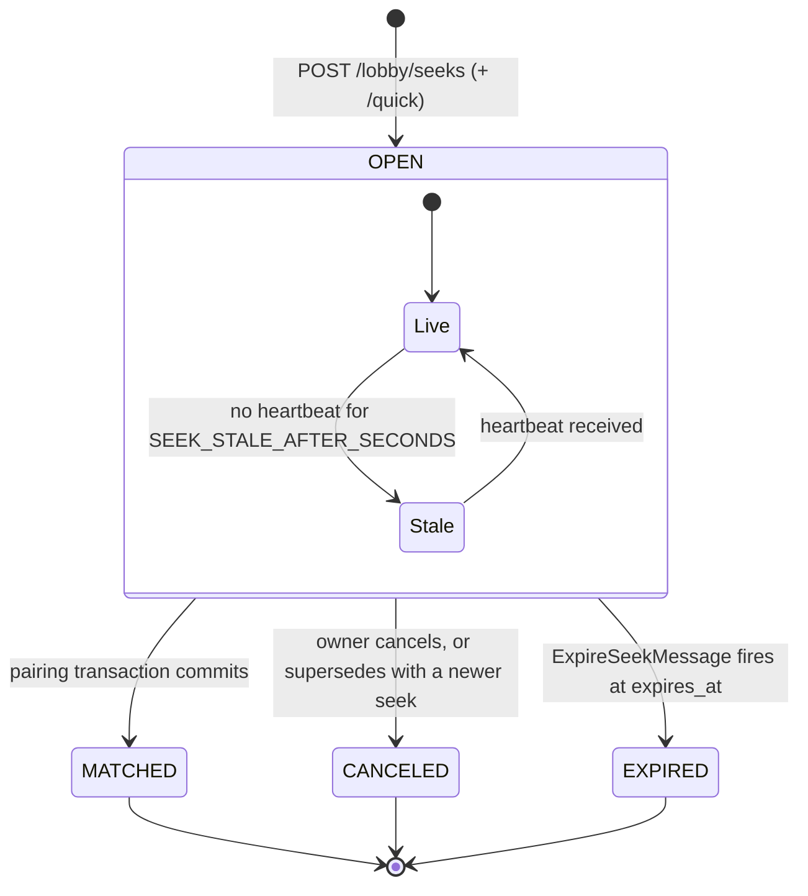

# Matchmaking — Seeks, Quick Pair, Pairing, Lobby

> **Status**: specification, not yet implemented. Elaborates `00-overview.md` D6, D7, §6, §7
> and invariant 12. Owns the `Seek` entity's *behaviour* only: `01-domain-model.md` owns its
> DDL, `02-realtime.md` the transport and wire encoding, `03-time-control.md` the clock that
> starts when a pairing commits, `05-social.md` challenges and blocking, `06-rating.md`
> `rating_snapshot`, `09-api-reference.md` the route table and error catalogue.

## 1. Two front doors, one mechanism

### 1.1 The presets

Quick pair is a row of buttons: one click, no form. Speed is derived per the contract,
`estimated = initialSeconds + 40 * incrementSeconds`.

| Preset | `initial` | `increment` | `estimated` | Speed |
|---|---|---|---|---|
| 1+0 | 60 | 0 | 60 | BULLET |
| 3+2 | 180 | 2 | 260 | BLITZ |
| 5+0 | 300 | 0 | 300 | BLITZ |
| 10+0 | 600 | 0 | 600 | RAPID |
| 15+10 | 900 | 10 | 1300 | RAPID |
| 1 / 3 / 7 days | — | — | — | CORRESPONDENCE |

No preset yields CLASSICAL: the threshold is 1500 and the largest preset is 1300. CLASSICAL
is reachable only by custom seek or challenge, which is correct — nobody starts a 30-minute
game by mashing a button, and a CLASSICAL button would front an always-empty pool.

The lobby is the second door: a live list of every open seek, plus a form for an arbitrary
time control, rated flag, colour preference and optional explicit rating range. A directed
invitation to a named user, or an open shareable link, is **not** a seek — that is a
`Challenge` (`05-social.md`), and a rematch is a pre-accepted challenge.

### 1.2 Both doors write one row

| Column | Quick pair | Custom seek |
|---|---|---|
| `auto_widen` | `true` (REALTIME only, §1.3) | `false` |
| `rating_min` / `rating_max` | `NULL` | user-supplied, both nullable |
| `color_preference` | `RANDOM` | user choice |
| `rated` | `true` unless `UNLIMITED` | user choice |
| time-control tuple | one preset row above | arbitrary, validated |

Everything else is identical: a quick-pair seek is listed in the lobby and clickable, a
custom seek is a candidate for a quick-pairer, and the affordances stay distinct only in the
template. **There is one pool.** Two pools would be wrong:

| | Why two pools fail |
|---|---|
| Liquidity | The binding constraint at this scale is whether anyone else is waiting at all. Splitting five waiters into two and three roughly halves everyone's chance of pairing. |
| The cross-edge | A quick-pairer obviously should match a compatible posted seek. Adding that edge gives one mechanism plus a bridge plus two sets of races — not two mechanisms. |
| Invariants | Invariant 12 needs proving per pool, and "consumed by quick pair while simultaneously accepted from the lobby" becomes a race with no shared lock to resolve it. |
| Size of the delta | `auto_widen` and the presence of an explicit window. A mechanism boundary is not justified by two nullable columns. |

### 1.3 Three lanes, keyed on time-control kind

| Kind | `auto_widen` | Heartbeat | Rating window | TTL |
|---|---|---|---|---|
| `REALTIME` | allowed | **required** | active | `SEEK_TTL_SECONDS` (600) |
| `UNLIMITED` | forced `false` | required | inert | `SEEK_TTL_SECONDS` (600) |
| `CORRESPONDENCE` | forced `false` | **none** | active if set | `CHALLENGE_TTL_SECONDS` (86400) |

**`UNLIMITED` is never rated** (contract), so `rating_snapshot` holds the literal
`GLICKO_DEFAULT_RATING` only to satisfy the `NOT NULL` column: everyone matches everyone.

**Correspondence must not auto-widen.** Widening is driven by the seeker's own heartbeat
(§3.1), and a correspondence seeker posts and closes the tab by definition, so nothing would
re-evaluate the widened window. Two correspondence seekers 400 apart would each fail the
incoming side's narrow window and both wait forever. Unconditional pairing within a
`days_per_move` bucket is right for a pool whose games last weeks, and it removes the only
reason correspondence would need a heartbeat.

## 2. Seek lifecycle



`Live`/`Stale` is **not** persisted — a predicate over `last_heartbeat_at` evaluated at read
time, deliberately reversible. Browsers throttle background-tab timers to roughly one per
minute, so a lobby tab that loses focus must be able to drop out of the pool and rejoin, not
be destroyed. Only the three terminal transitions write `status`, and none of them is
reversible: a player who wants back in posts a new seek.

| From | To | Trigger | Actor | Side effects |
|---|---|---|---|---|
| — | `OPEN` | `POST /lobby/seeks[/quick]` | owner | insert; `ExpireSeekMessage` dispatched with `DelayStamp(ttl * 1000)` **inside** the transaction; pairing attempted immediately (§3); on no match, `seek.added` published after commit |
| `OPEN` | `MATCHED` | pairing transaction commits (§3.5) | either side's create, heartbeat or accept | `matched_game_id` set; `Game` + two `GamePlayer` rows created; `seek.removed{matched}` to `lobby/seeks`; `GameStatePayload` to `game/{uuid}`; a `SEEK_MATCHED` `UserEventPayload` to **both** `user/{uuid}` topics, each carrying its own `notificationUuid` as idempotency key — that topic has no `seq` (`02-realtime.md` §4.0); first-move deadline scheduled (`03-time-control.md` §5) |
| `OPEN` | `CANCELED` | `POST .../cancel`, or `sendBeacon` on `beforeunload` | owner | `seek.removed{canceled}`; the pending `ExpireSeekMessage` is *not* revoked — its handler is guarded (§4.4) |
| `OPEN` | `CANCELED` | owner posts a different seek while one is open | owner | same, `reason: replaced` (§6.2) |
| `OPEN` | `EXPIRED` | `ExpireSeekMessage` at `expires_at` | messenger worker | `seek.removed{expired}`; a `UserEventPayload` so an open tab can re-post in one click |

| Column | Semantics not evident from the column list |
|---|---|
| `rating_snapshot` | REALTIME/CORRESPONDENCE: the acting user's inflation-adjusted rating in `speed_category`, read **server-side at creation** via `RatingUpdater::currentRating(User, SpeedCategory)` (`06-rating.md` §4.4). UNLIMITED: the literal `MultiplayerLimits::GLICKO_DEFAULT_RATING` — `currentRating()` is deliberately not given a nullable category, because "1500, no rated games yet" and "1500, no pool exists" must not collapse into one value that could later render as a real rating. Never re-read during pairing, never accepted from the client: frozen so a mid-wait rating change cannot retroactively invalidate a posted seek, and so the pairing SQL needs no join. |
| `auto_widen` | Mutually exclusive with `rating_min`/`rating_max` (CHECK, `01-domain-model.md`), which keeps §3.3's acceptance predicate a two-branch `CASE` instead of a lattice. |
| `created_at` | The widening clock's origin. Never updated — updating it on heartbeat would reset the window and make waiting *worse*. |
| `last_heartbeat_at` | Liveness only. Initialised to `created_at`. **Deliberately not indexed** (§4.3). |
| `expires_at` | Hard TTL, computed once from the kind, never extended. Ten minutes of silence in a realtime pool means the player left, and a seek that never dies is one nobody notices is stale. |
| `matched_game_id` | Written only by the pairing transaction's terminal `UPDATE`, in the same statement as `status = MATCHED`, so it and `status` can never disagree. |

## 3. The pairing algorithm

### 3.1 Trigger: synchronous, never a background matcher

Pairing runs inline, in the request that mutates the pool. Three entry points, one
implementation — `SeekMatcher::attemptPair(int $seekId, ?Uuid $restrictTo = null): ?Game`:

| Entry point | Candidate set | Why it pairs |
|---|---|---|
| `POST /lobby/seeks[/quick]` | whole compatible pool | instant feedback: the common case is someone already waiting, and the seeker should get a `gameUuid` in the create response |
| `POST /lobby/seeks/{uuid}/heartbeat` | whole compatible pool | **the widening retry clock** (below) |
| `POST /lobby/seeks/{uuid}/accept` | exactly one seek | explicit consent from the lobby (§5.3) |

**Why no background matcher.** No scheduler exists (`00-overview.md` §3.6) and D7 forbids
adding infrastructure. The options are Symfony Scheduler (new dependency), a supervisor
daemon (a third process type beyond the two `messenger:consume` workers), or a
self-rescheduling Messenger message — one that never drains, which is exactly the
`messenger_messages` growth failure mode overview §7 warns about. None buys anything:
pairing is one index scan over tens of rows, and every event that changes whether a pairing
is possible is already an HTTP request.

**Why the heartbeat is the retry clock — the non-obvious part.** Mutual acceptance evaluates
each side's window at *its own* age. A brand-new seek has age ~0, so its window is
`QUICK_PAIR_WINDOW_BASE` = 200 no matter how long the other side waited. If pairing only ran
at creation the incoming seek's 200-point window would always bind and **widening would be
dead code**. The heartbeat re-evaluates a seek at its current age, and is therefore what
makes auto-widening function at all: not liveness plumbing with a matching side effect, but
the matcher's clock that also carries liveness.

### 3.2 Compatibility predicate

For an acting seek `A` and a candidate `C`:

```
compatible(A, C) :=
      C.status = OPEN  AND  C.id <> A.id  AND  C.user_id <> A.user_id
  AND C.time_control_kind = A.time_control_kind
  AND C.speed_category    IS NOT DISTINCT FROM A.speed_category
  AND C.initial_seconds   IS NOT DISTINCT FROM A.initial_seconds
  AND C.increment_seconds IS NOT DISTINCT FROM A.increment_seconds
  AND C.days_per_move     IS NOT DISTINCT FROM A.days_per_move
  AND C.rated = A.rated
  AND NOT (A.color_preference = WHITE AND C.color_preference = WHITE)
  AND NOT (A.color_preference = BLACK AND C.color_preference = BLACK)
  AND accepts(A, C) AND accepts(C, A)                        -- mutual, see 3.3
  AND C.expires_at > now()
  AND (A.kind = CORRESPONDENCE OR C.last_heartbeat_at > now() - SEEK_STALE_AFTER_SECONDS)
  AND NOT blocked(A.user_id, C.user_id)
```

| Clause | Trap it avoids |
|---|---|
| `IS NOT DISTINCT FROM`, not `=` | those four columns are `NULL` in the modes that do not use them, and `NULL = NULL` is `NULL`, treated as false — plain `=` would make correspondence and untimed seeks **never** pair with each other. The single most likely bug in this chapter. |
| `rated` exact match | pairing rated with casual silently rates a game one side did not opt into, violating invariant 3. The lobby is where those two negotiate by clicking. |
| colour | only bites when both named the same concrete colour; `RANDOM` is compatible with everything including another `RANDOM`. Emitted from PHP as a single `C.color_preference <> :pref`, omitted entirely when the acting seek is `RANDOM` — cheaper to plan than a `CASE`. |
| `C.user_id <> A.user_id` | self-play within one account, with the one-open-seek index (§6.2). Two-account self-play is *not* solved — §6.4. |

`blocked` is symmetric even though `friendship` stores a direction; semantics and the
`INDEX(addressee_id, status)` that serves it are `05-social.md`'s:

```sql
NOT EXISTS (SELECT 1 FROM friendship f
            WHERE f.status = 3                       -- FriendshipStatus::BLOCKED
              AND ((f.requester_id = C.user_id  AND f.addressee_id = :selfUserId)
                OR (f.requester_id = :selfUserId AND f.addressee_id = C.user_id)))
```

### 3.3 The auto-widening window

```
w(t) = min(QUICK_PAIR_WINDOW_MAX, QUICK_PAIR_WINDOW_BASE + QUICK_PAIR_WIDEN_PER_SECOND * t)
     = min(1000, 200 + 50 * t)                    t = age in seconds

accepts(X, Y) := CASE WHEN X.auto_widen
                      THEN abs(Y.rating_snapshot - X.rating_snapshot) <= w(age(X))
                      ELSE (X.rating_min IS NULL OR Y.rating_snapshot >= X.rating_min)
                       AND (X.rating_max IS NULL OR Y.rating_snapshot <= X.rating_max)
                 END
```

| Age (s) | 0 | 2 | 4 | 8 | 12 | 16 | 30 |
|---|---|---|---|---|---|---|---|
| `w(t)` | 200 | 300 | 400 | 600 | 900 | 1000 | 1000 |

The cap is reached at `t = (1000 - 200) / 50 = 16` seconds, after which a quick-pair seek
accepts anyone within 1000 points — in practice the whole pool. **Widening therefore only
matters for the first sixteen seconds**; past that, starvation is impossible for any
realistic rating spread and the algorithm degenerates to "pair with the longest waiter".
Worth knowing before adding sophistication here.

`age(X) = EXTRACT(EPOCH FROM (now() - X.created_at))`, evaluated in SQL. That is what
removes the need for a background job: nothing has to periodically *write* a widened window,
because the window is a pure function of a column already there. `now()` inside a
transaction is the transaction start time, so both sides of the mutual test share one clock.
The test is mutual, not one-sided: a one-sided test would drag a patient 1200 into a game
against a 2200 who just arrived, the pairing-quality failure that makes people stop using
quick pair.

### 3.4 The candidate query

Literal SQL, as executed by `SeekRepository::lockNextCandidate()`. `:self*` parameters come
from the acting seek row, already read under its own lock in step 1 of §3.5.

```sql
SELECT c.id
FROM seek c
WHERE c.status = 0                                    -- SeekStatus::OPEN
  AND c.speed_category = :selfSpeedCategory           -- "IS NULL" when UNLIMITED
  AND c.id      <> :selfId
  AND c.user_id <> :selfUserId
  AND c.time_control_kind = :selfKind
  AND c.initial_seconds   IS NOT DISTINCT FROM :selfInitialSeconds
  AND c.increment_seconds IS NOT DISTINCT FROM :selfIncrementSeconds
  AND c.days_per_move     IS NOT DISTINCT FROM :selfDaysPerMove
  AND c.rated = :selfRated
  AND c.color_preference <> :selfColorPreference      -- omitted when self is RANDOM
  AND c.expires_at > now()
  AND c.last_heartbeat_at > now() - make_interval(secs => :staleAfter)
                                                      -- omitted when self is CORRESPONDENCE
  AND (   -- self accepts candidate
        CASE WHEN :selfAutoWiden
             THEN abs(c.rating_snapshot - :selfRating) <= LEAST(
                    :windowMax, :windowBase + :widenPerSecond
                                * EXTRACT(EPOCH FROM (now() - :selfCreatedAt)))
             ELSE (:selfRatingMin IS NULL OR c.rating_snapshot >= :selfRatingMin)
              AND (:selfRatingMax IS NULL OR c.rating_snapshot <= :selfRatingMax)
        END)
  AND (   -- candidate accepts self
        CASE WHEN c.auto_widen
             THEN abs(:selfRating - c.rating_snapshot) <= LEAST(
                    :windowMax, :windowBase + :widenPerSecond
                                * EXTRACT(EPOCH FROM (now() - c.created_at)))
             ELSE (c.rating_min IS NULL OR :selfRating >= c.rating_min)
              AND (c.rating_max IS NULL OR :selfRating <= c.rating_max)
        END)
  AND NOT EXISTS (
        SELECT 1 FROM friendship f
        WHERE f.status = 3
          AND ((f.requester_id = c.user_id  AND f.addressee_id = :selfUserId)
            OR (f.requester_id = :selfUserId AND f.addressee_id = c.user_id)))
  AND (:restrictToUuid::uuid IS NULL OR c.uuid = :restrictToUuid::uuid)
ORDER BY c.created_at ASC, c.id ASC
LIMIT 1
FOR UPDATE OF c SKIP LOCKED;
```

Built with DBAL: `forUpdate(ConflictResolutionMode::SKIP_LOCKED)`
(`vendor/doctrine/dbal/src/Query/QueryBuilder.php:523`) emits the lock clause through
`DefaultSelectSQLBuilder` (`vendor/doctrine/dbal/src/SQL/Builder/DefaultSelectSQLBuilder.php:74-90`),
with the strings supplied at `vendor/doctrine/dbal/src/Platforms/AbstractPlatform.php:869`.

**Index usage.** The contract's `INDEX(status, speed_category, created_at)` is matched
exactly: `status` and `speed_category` are equality-constrained and `created_at` supplies the
`ORDER BY`, so the planner produces an index scan with no sort node that stops at the first
lockable row. `speed_category = :x` is a plain equality (or `IS NULL` for UNLIMITED)
precisely so it stays index-driving — `IS NOT DISTINCT FROM` is not an indexable operator
clause in PostgreSQL 16, which is why it is confined to three columns that are heap filters
over an already-narrow row set, as are `last_heartbeat_at`, `expires_at` and the two `CASE`s.

**Why `SKIP LOCKED` is the right primitive.**

| Alternative | Failure |
|---|---|
| plain `FOR UPDATE` | The loser blocks on a row it will discover is already `MATCHED`. Under mutual creation (§7 race 1) two transactions each hold one row and want the other's: a real deadlock, resolved only after `deadlock_timeout` (1 s) by aborting one. |
| `FOR UPDATE NOWAIT` | Raises `55P03` instead of skipping, so a *contended* row aborts the whole attempt rather than letting the scan advance to the next candidate. |
| advisory lock on the pool | Correct, and it converts a scalable index scan into a globally single-threaded queue. |

`SKIP LOCKED` says exactly what we mean: another transaction is already deciding this row's
fate, so it is not a candidate for me right now. Because it never waits it can never join a
wait cycle, which is half of §7's deadlock-freedom proof. It is also already in production
here — `symfony/doctrine-messenger` claims jobs with `ORDER BY available_at ASC`,
`setMaxResults(1)` and `forUpdate(ConflictResolutionMode::SKIP_LOCKED)`
(`vendor/symfony/doctrine-messenger/Transport/Connection.php:169-170,188-189,641-643`). The
seek pool is the same shape of problem.

**`LIMIT 1` and locking.** PostgreSQL places the `LockRows` node beneath `Limit` for
`SKIP LOCKED`, so the limit counts rows successfully *locked*, not rows scanned. `LIMIT 1`
therefore yields the oldest lockable candidate, not "the oldest candidate, unless it was
locked, in which case nothing". [INFERENCE — documented PostgreSQL behaviour and what the
messenger transport above relies on; not verified against this database.]

### 3.5 The transaction

```
BEGIN;                                    -- READ COMMITTED (see below)

  -- 1. Lock self. Blocking, but only ever on rows this user owns.
  SELECT * FROM seek WHERE id = :selfId FOR UPDATE;
      status = MATCHED -> COMMIT; return Game(matched_game_id)   -- someone paired us
      status <> OPEN   -> COMMIT; return null                    -- canceled / expired

  -- 2. Candidate query of 3.4.
  SELECT ... FOR UPDATE OF c SKIP LOCKED LIMIT 1;
      no row -> re-run the same predicate WITHOUT the lock as a bare EXISTS:
                true  -> a live transaction holds our candidate: set $skipped
                false -> the pool genuinely has nobody
                COMMIT; return null (see the retry rule below)

  -- 3. Re-verify. PostgreSQL's EvalPlanQual already re-qualified the locked
  --    row under READ COMMITTED, so this is an assertion, not a filter.
  assert candidate.status = OPEN

  -- 4. Build the game. GameFactory owns colour resolution (3.6) and is the
  --    single constructor for every creation path (00-overview.md 5, P0.2).
  $game = GameFactory::createFromSeeks($self, $candidate, $colors);
  $em->flush();                            -- participates in this transaction

  -- 5. Consume both seeks in one statement.
  UPDATE seek SET status = 1, matched_game_id = :gameId
   WHERE id = ANY(:ids) AND status = 0;    -- :ids = {selfId, candidateId}
  assert rowCount = 2 else ROLLBACK

  -- 6. Delayed messages ride the same connection, so they are transactional.
  $bus->dispatch(new CheckClockExpiryMessage(...), [new DelayStamp(...)]);

COMMIT;

-- 7. AFTER commit, and only then:
     publishGameState($game)            --> game/{uuid}
     publishUserEvent(white), (black)   --> user/{uuid}   SEEK_MATCHED
     publishSeekEvent(removed) x2       --> lobby/seeks
```

**Isolation.** This runs at the connection's default level, PostgreSQL's `READ COMMITTED`:
`config/packages/doctrine.yaml` sets no isolation, and `GameEngine::applyMove()` explicitly
raises it to `SERIALIZABLE` for its own critical section and restores the previous value in a
`finally` (`src/Engine/GameEngine.php:44-45,84-86`), which only makes sense against a lower
default. [INFERENCE from those two facts.] `READ COMMITTED` is *required* here, not merely
tolerated: it is what makes `FOR UPDATE` re-qualify a row after acquiring its lock, silently
dropping a candidate that turned `MATCHED` while we waited; under `REPEATABLE READ` the same
situation raises `40001`. **The pairing transaction must never nest inside `applyMove()`'s
`SERIALIZABLE` window**, and `SeekMatcher` must not call `setTransactionIsolation()` — that
is connection-scoped mutable state, the §8 hazard. `use_savepoints: true` is already
configured (`config/packages/doctrine.yaml:10`), so nesting inside an open transaction
degrades to a savepoint rather than an error.

**Seek locking and status writes use DBAL, not the ORM**, because a deliberate re-verify
failure must be a plain `return null`, not an exception thrown through `flush()`. An ORM
exception closes the `EntityManager`, and under worker mode a closed EM poisons the rest of
the request; `executeStatement` with a checked `rowCount()` gives the same guarantee with no
exception path.

**Publishing is post-commit** because Mercure publishes are HTTP calls to the hub: not
transactional, not rollback-able, and a `game.state` for a game whose transaction then aborts
leaves both clients navigating to a 404. Delayed Messenger messages are the opposite case —
the Doctrine transport writes `messenger_messages` on the *same* DBAL connection
(`MESSENGER_TRANSPORT_DSN: doctrine://default`, `compose.yaml:65`), so a rollback
un-schedules them, exactly what we want for a clock deadline on a game never created.

**The bounded retry.** If step 2 found nothing but `$skipped` is set, a concurrent
transaction was mid-decision on our only candidate. Commit (releasing the self-lock), sleep
`random_int(25_000, 75_000)` microseconds, and run `attemptPair` **once** more. By then the
other transaction has committed either a match that includes us — step 1 of the retry returns
its game — or no match, leaving its row lockable. One retry, bounded at ~75 ms, only on the
contended path. This collapses §7 race 1 from "wait for the next heartbeat" to "match now".

### 3.6 Colour assignment

Resolved once in `GameFactory`. The predicate already excluded `{WHITE, WHITE}` and
`{BLACK, BLACK}`, leaving five cases:

| A | C | A gets | C gets |
|---|---|---|---|
| WHITE | BLACK | white | black |
| BLACK | WHITE | black | white |
| WHITE | RANDOM | white | black |
| BLACK | RANDOM | black | white |
| RANDOM | RANDOM | `random_int(0, 1)` decides | the complement |

The flip is server-side, evaluated exactly once, persisted as the two `GamePlayer.color`
values, never re-derived. This is where `src/Action/NewGameAction.php:51`'s
`'random' => (bool) random_int(0, 1)` moves to: after P0.2 one colour-resolution site serves
seek pairing, challenge acceptance, rematch, AI and hot-seat. Quick pair is always `RANDOM`,
so a rated quick-pair game always has a fifty-fifty draw; custom seeks may name a colour even
when rated, because the other side consents by naming the complement, choosing `RANDOM`, or
clicking a seek that states its colour.

### 3.7 Tie-breaking

`ORDER BY c.created_at ASC, c.id ASC` — **oldest seek first**. FIFO is the only ordering
under which waiting time is bounded; any preference ordering can indefinitely starve a player
at the edge of the rating distribution, precisely the player most likely to give up on the
platform. It is also the best-quality choice under widening, because the oldest seek has the
widest window and is therefore the candidate for whom this pairing may be the only one
currently possible. And it is free — the index's natural order (§3.4), so no sort node.

`c.id ASC` is the deterministic secondary key: two rows can share a `timestamptz`, and a
non-deterministic `LIMIT 1` makes races unreproducible. Explicitly not used: rating proximity
(starvation, and irrelevant once windows cap at 16 s), or "has not played this opponent
recently" (a `game_player` join on every attempt, for a problem this pool size lacks).

### 3.8 Worked examples

**(a) Two quick-pairers 400 points apart.** Alice, Blitz 3+2 rated, snapshot 1500; Bob, Blitz
3+2 rated, 1900. Heartbeats fire every 10 s from each seek's own creation.

| t | Event | `w(Alice)` | `w(Bob)` | Binding | Outcome |
|---|---|---|---|---|---|
| 0 | Alice creates | 200 | — | — | pool empty, `OPEN`, `seek.added` |
| 3 | Bob creates | 350 | 200 | 200 | 400 > 200, no match |
| 10 | Alice heartbeats | 700 | 550 | 550 | 400 <= 550, **match** |

Alice is the acting side and gets the `gameUuid` in her heartbeat response; Bob learns over
`user/{bobUuid}`, or Web Push if backgrounded (`07-notifications.md`). Theoretical earliest
match is `max(0, 3) + (400 - 200) / 50 = 7.0 s`; realised is 10.0 s. The gap is heartbeat
quantisation: **expected extra latency is half an interval, worst case one full interval.**
Bob's own first heartbeat at t = 13 would also have matched; whichever fires first wins and
the loser finds its seek already `MATCHED` at step 1 (race 6).

**(b) A custom seek with an explicit window.** Carol posts 10+0 RAPID, rated, colour WHITE,
`rating_min = 1700`, `auto_widen = false`; her own rating 1740.

- Dave, 1650, quick-pairs 10+0. `accepts(Carol, Dave)` is `1650 >= 1700`: false. Carol's
  window never widens, so this pair is permanently incompatible. Dave still sees Carol's row
  with Play disabled and the reason shown ("rated 1700+").
- Erin, 1810, quick-pairs 10+0 at her own t = 0. `accepts(Carol, Erin)` = `1810 >= 1700`:
  true. `accepts(Erin, Carol)` = `|1740 - 1810| = 70 <= 200`: true. Colours `{WHITE, RANDOM}`
  give Carol white, Erin black. **Match on Erin's create request**, one round trip.

**(c) Incompatible pairs, and what the lobby is for.**

| Case | Blocking clause | Resolution |
|---|---|---|
| Frank 5+0 rated **WHITE** 1500 vs Grace 5+0 rated **WHITE** 1520 | both named WHITE | never auto-pairs. Grace clicks Frank's row; the accept path (§5.3) builds her mirror seek with the **complement** colour, so she plays black. Clicking *is* the consent. |
| Alice 3+2 vs Heidi 3+0 | `increment_seconds` differs | never auto-pairs despite both being BLITZ and 20 points apart. Both are listed; either can click the other. |
| Ivan 5+0 **rated** vs Judy 5+0 **casual** | `rated` differs | never auto-pairs (invariant 3). A lobby click adopts the poster's `rated` flag, consented to explicitly. |

Not defects. The automatic matcher is deliberately conservative; the lobby is the manual
override where a human resolves a near-miss the predicate refuses to guess at.

## 4. Liveness

### 4.1 Why a closed tab must not leave a zombie

A realtime seek is a promise to start playing within seconds. A closed tab, a laptop lid, a
killed browser or a dropped connection all leave a row that still says `OPEN`. Pairing
against it produces the worst outcome in the system: a real player is matched, their clock
starts (`03-time-control.md` §5), and they sit in front of a board until a
`FIRST_MOVE_TIMEOUT_SECONDS` abort — worse than not matching, because it consumed their
attention and their willingness to try again. `beforeunload` +
`navigator.sendBeacon('/lobby/seeks/{uuid}/cancel')` is the happy path and should be wired,
but it does not fire on a crash, force-quit, lost network or OS sleep. It is an optimisation,
never the guarantee.

### 4.2 The heartbeat

`SEEK_HEARTBEAT_INTERVAL_MS` = 10000 is the client `setInterval` period;
`SEEK_STALE_AFTER_SECONDS` = 25 is when a seek drops out of the pool and the listing. The
2.5x ratio tolerates one entirely lost heartbeat plus latency before a live player is treated
as gone. `POST /lobby/seeks/{uuid}/heartbeat`, in one transaction:

1. `UPDATE seek SET last_heartbeat_at = now() WHERE id = :id AND status = 0`
2. `attemptPair` (§3.5) — the widening retry of §3.1
3. return `{status, gameUuid|null, poolSize}`

Because step 2 exists, the heartbeat response is a legitimate place to learn you have been
matched; the client must handle a `gameUuid` there and not only over SSE.

**Why polling is accepted here when the codebase has none.** There is no `setInterval`
anywhere in `assets/typescript/src/` today — the only timer is `SVGBoardView`'s long-press
`setTimeout` (`assets/typescript/src/views/SVGBoardView.ts:69-70,700`) and live updates are
`EventSource` (`assets/typescript/src/network/MercureClient.ts:56`). This is the one place
that justifies breaking that: the heartbeat is not a substitute for a push we already have,
it is the **only** in-band signal that a seeker still exists, and per §3.1 it is
simultaneously the matcher's clock.
Removing it requires either a background matcher (§3.1) or the hub's subscription API (§4.4),
both rejected. It is also scoped — only while a seek is open, only on the lobby page, and it
stops the moment the seek is consumed.

### 4.3 Write-load arithmetic

One heartbeat is one single-row `UPDATE` plus one index scan. With `N` concurrent open
realtime seeks:

| `N` | `UPDATE`/s | Status |
|---|---|---|
| 10 | 1 | noise |
| 100 | 10 | comfortable |
| 500 | **50** | exactly the threshold `00-overview.md` §7 names for moving heartbeats to Redis |
| 1000 | 100 | Redis, per §7 |

Keeping 50 writes/second cheap means keeping the update **HOT** (new row version in the same
page, no index entry rewritten), which imposes two requirements on `01-domain-model.md`'s DDL:

- **`last_heartbeat_at` must not be indexed.** An index makes every heartbeat a non-HOT
  update plus an index insert, roughly tripling cost and adding bloat. It needs none: the
  `(status, speed_category, created_at)` index already narrows the scan to a handful of rows,
  and staleness is a heap filter on tuples already fetched.
- **`fillfactor = 70`**, with `autovacuum_vacuum_scale_factor = 0.01` and
  `autovacuum_vacuum_threshold = 50`. At 10 updates/second the table produces ~864k dead
  tuples/day against a live set of tens of rows; the low scale factor reclaims them in-page
  continuously rather than in painful bursts.

Per-request cost is one Symfony request through the FrankenPHP worker with two small queries
and no engine round trip — far below what the existing AI-move path already sustains.

### 4.4 Rejected: the Mercure subscription API; and the hard TTL

Caddy enables `subscriptions` (`frankenphp/Caddyfile:44-45`), exposing
`GET /.well-known/mercure/subscriptions[/{topic}]` — the live subscriber list. The tempting
design drops heartbeats and defines liveness as "the owner currently holds a subscription to
`lobby/seeks`". Rejected:

| # | Reason |
|---|---|
| 1 | **It puts a network call inside a lock-holding transaction.** Pairing holds `FOR UPDATE` on the acting seek. `EngineApi` already sets no HTTP timeout (`00-overview.md` landmine 9); repeating that while holding seek locks is strictly worse than the existing bug. |
| 2 | **It destroys the single-query pairing.** The filter leaves SQL: fetch a JSON subscriber document, parse it, filter in PHP. You cannot ask PostgreSQL to lock "the oldest row whose owner appears in this array", and all of §7 rests on that one statement. |
| 3 | **It answers a different question.** A subscription proves an SSE connection exists — not that the seek is still wanted, nor which of three open tabs posted it. Heartbeats are sent by the code that owns the seek; subscriptions belong to the transport. |
| 4 | **Wrong granularity.** `lobby/seeks` is one public topic shared by every viewer including anonymous browsers who posted nothing. Mapping subscribers to seeks needs per-user private topics, making it one hub request *per candidate*. |
| 5 | **Caching is forbidden.** Worker mode bars mutable cross-request state (§8), so every request re-fetches: the expensive case, permanently. |
| 6 | **It couples correctness to hub uptime.** Today a hub outage degrades live updates but moves still persist; this would make pairing fail closed, resting on a directive whose own comment reads "double-check that it's what you want" (`frankenphp/Caddyfile:44`). |

The rejection is scoped to *matchmaking liveness*. The subscription API may still suit
`Presence\PresenceTracker` (`02-realtime.md`), where the question genuinely is "is a socket
open", the answer is advisory, and no lock is held. Also rejected: heartbeats over Mercure
(SSE is server-to-client only) and a WebSocket channel (a new server, violating D7).

**Hard TTL.** `ExpireSeekMessage(seekUuid)` is dispatched inside the create transaction with
`DelayStamp(ttl * 1000)`, `ttl` per §1.3:

```
BEGIN;
  SELECT * FROM seek WHERE uuid = :uuid FOR UPDATE;
  if status <> 0        : COMMIT; return     -- already matched/canceled: no-op
  if expires_at > now() : COMMIT; return     -- defensive; TTL is never extended
  UPDATE seek SET status = 3 WHERE id = :id AND status = 0;
COMMIT;
publishSeekEvent(removed, reason: expired); publishUserEvent(owner, ...);
```

Idempotent by the `status = 0` guard, so redelivery is harmless and the message is never
revoked on early cancellation — revocation would mean deleting from `messenger_messages` by
payload, which the transport does not support and which buys nothing. Staleness (§4.2)
already keeps a zombie out of the pool within 25 seconds; the TTL stops the row being a
zombie at all, bounds table growth, and gives the owner an explicit "your seek expired, post
again?" event instead of an indefinite spinner.

## 5. Lobby UI contract

Routes and envelope are `09-api-reference.md`'s. All lobby routes live under `/lobby/*`,
outside the CORS `^/api/` block (`config/packages/nelmio_cors.yaml:9-10`) per overview §6.
Success is `{"data": ...}`, failure `{"error": {"code", "message", "details"}}`.

| Route | Auth | Limiter | Notes |
|---|---|---|---|
| `GET /lobby` | anonymous | — | HTML action, `AbstractController`, returns `array` |
| `GET /lobby/seeks` | anonymous | `lobby_read` | §5.1 |
| `POST /lobby/seeks` | required | `seek_create` | custom seek; JSON body validated against a request DTO (§9.3) |
| `POST /lobby/seeks/quick` | required | `seek_create` | body is `{"preset": "3+2"}` and nothing else |
| `POST /lobby/seeks/{uuid}/heartbeat` | owner | `seek_heartbeat` | §4.2 |
| `POST /lobby/seeks/{uuid}/cancel` | owner | — | also the `sendBeacon` target |
| `POST /lobby/seeks/{uuid}/accept` | required, not owner | `seek_accept` | §5.3 |

`/quick` is exactly `POST /lobby/seeks` with `auto_widen` forced true (REALTIME only),
`color_preference = RANDOM`, no explicit window, and the time-control tuple looked up from
§1.1 rather than taken from the client. Separating it costs one thin action and removes the
whole validation surface from the hot path.

### 5.1 `GET /lobby/seeks`

Query: `speed` (csv), `rated`, `kind`, `page`, `limit` (default 50, max 100 — Pagerfanta, per
overview §6). `data`:

```json
{
  "seeks": [
    {
      "uuid": "0195c3f2-...",
      "user": { "uuid": "0195b011-...", "username": "carol",
                "rating": 1740, "provisional": false },
      "timeControl": { "kind": "realtime", "initialSeconds": 600,
                       "incrementSeconds": 0, "daysPerMove": null, "speed": "rapid" },
      "rated": true,
      "color": "white",
      "ratingRange": { "min": 1700, "max": null },
      "autoWiden": false,
      "createdAt": 1732650000123456,
      "self": false,
      "playable": true
    }
  ],
  "poolSize": 7,
  "serverTime": 1732650000123456
}
```

- `user` and `timeControl` are the shared `PlayerRef` / `TimeControlRef` sub-objects defined
  once in `02-realtime.md` §4.0 and reused verbatim by challenges and notifications; do not
  introduce a seek-shaped variant. Wire conventions are that chapter's: enums are lowercase
  snake_case **strings**, never their int backing value; timestamps are integer microseconds
  since epoch; inapplicable fields are JSON `null`, never omitted.
- **The listing predicate is the pairing predicate** minus viewer-specific clauses:
  `status = OPEN`, `expires_at > now()`, same staleness filter. A seek that cannot be paired
  must not be shown, or the lobby advertises promises it cannot keep. One SQL fragment, two
  consumers.
- `self` — the viewer owns this seek; render Cancel, not Play. `playable` — the server
  evaluates §3.2 from the viewer's side, honouring the poster's window, block relations,
  `rated` and colour, but **ignoring the viewer's own window**, because clicking is consent
  (§3.8c). `null` for anonymous viewers.
- **The user uuid is published deliberately and is not a secret.** `user/{userUuid}` is a
  *private* topic whose authorization comes from the subscriber JWT's `mercure.subscribe`
  claim (contract; `02-realtime.md` §2), not from the topic name being unguessable — leaning
  on uuid secrecy would break the first time a profile page carried one, and be security by
  obscurity meanwhile. What is never exposed is the **email**, still the Security identifier,
  which must not become an "is this address registered?" oracle (overview §4.4).
- `poolSize` is the unfiltered count of listable seeks: the "7 players waiting" line, and the
  reconciliation signal below.

### 5.2 SSE and reconciliation

`lobby/seeks` is a **public** topic (contract), carrying exactly what §5.1 already serves
anonymous HTTP callers. `SeekEventPayload` is **one shape**, not two — per `02-realtime.md`
§4.0 every field is always present:

```json
{ "type": "seek.added",   "seekUuid": "0195c3f2-...",
  "seek": { "...the 5.1 object, with self and playable both null": null },
  "reason": null, "poolSize": 8, "serverTime": 1732650000123456 }

{ "type": "seek.removed", "seekUuid": "0195c3f2-...",
  "seek": null, "reason": "matched", "poolSize": 7, "serverTime": 1732650000123456 }
```

`reason` is `matched | canceled | expired | replaced`. `seek.added` carries the whole object
so a client inserts without a refetch; `seek.removed` carries only the uuid, because the
client already holds the row it is deleting. `self` and `playable` are `null` here because
they are viewer-dependent and one broadcast serves every viewer; the client derives both
locally from the seek fields plus its own bootstrapped rating, **advisory only** — the
authoritative check runs server-side in the accept transaction, so a wrong guess just yields
`409 seek_unavailable`.

**Missed events.** There is no `seq`: unlike `game/{uuid}`, whose ordering is `Game.version`
(contract), the lobby has no monotonic counter, and none would help because the events
describe a *set*, not a sequence of states. `Last-Event-ID` replay is also unavailable —
`frankenphp/Caddyfile` declares no `transport` directive in its `mercure` block (lines
37-48), so the hub runs its default local transport with no history. [INFERENCE from the
absent directive; confirm when P0.6 lands.] Reconciliation is therefore by refetch:

| Trigger | Why |
|---|---|
| `EventSource.onopen` | covers initial load *and* every automatic reconnect — the browser reconnects with no application code, which the existing client already relies on (`assets/typescript/src/network/MercureClient.ts:112-113`) |
| `visibilitychange` to visible | a backgrounded tab's timers were throttled; assume the list is wrong |
| `poolSize` mismatch | every SSE event and every heartbeat response carries `poolSize`; disagreement with the rendered list length means an event was missed |
| 60 s idle timer | last-resort backstop while the lobby is visible |

The `poolSize` check is the interesting one: it costs nothing — the number is already in
payloads the client receives anyway — and detects divergence with no sequence machinery.

### 5.3 Accepting a seek from the lobby

Not a fourth mechanism. `POST /lobby/seeks/{uuid}/accept` builds a **mirror seek** for the
clicker inside the pairing transaction:

| Mirror field | Value |
|---|---|
| time-control tuple, `rated`, `speed_category` | copied verbatim from the target |
| `color_preference` | complement of the target's, or `RANDOM` if the target said `RANDOM` |
| `rating_min` / `rating_max` | `NULL` — the clicker waives their own window; the click *is* the consent |
| `auto_widen` | `false` |
| `rating_snapshot` | the clicker's real snapshot, so the target's window still applies |

Then `attemptPair($mirrorId, restrictTo: $targetUuid)` runs the identical transaction of §3.5
narrowed to one row. If it fails — the target matched, cancelled or expired microseconds
earlier — everything rolls back, the mirror seek is never persisted, and the response is
`409 seek_unavailable`, so the clicker is left with no stray seek they did not ask for. On
success both rows land `MATCHED` pointing at the same game, so invariant 12 holds with no
special case.

### 5.4 Anonymous visitors

- **`GET /lobby` and `GET /lobby/seeks` are anonymous.** No `^/lobby` entry may be added to
  `config/packages/security.yaml`'s `access_control` (currently `^/admin`, `^/play`,
  `^/feedback`, lines 34-37). Authorization on mutating endpoints is a manual
  `Security::getUser()` check returning a `JsonResponse`, per the JSON-action convention in
  overview §6 — `denyAccessUnlessGranted` would render an HTML error page into a JSON client.
  A `POST` while anonymous is `401 authentication_required`.
- **Anonymous SSE already works.** Caddy runs the hub with `anonymous`
  (`frankenphp/Caddyfile:42-43`) and `lobby/seeks` updates are non-private, so a logged-out
  `EventSource` receives them with no cookie. Conversely an authenticated user holding the
  P0.6 subscriber cookie still receives `lobby/seeks`: the `mercure.subscribe` claim gates
  *private* updates only, it is not an allowlist for public ones. Worth an explicit
  acceptance test — getting this backwards makes the lobby go dark for exactly the users who
  can use it (`02-realtime.md` §2).
- Rows render with Play disabled and a "Sign in to play" link. `poolSize` ("7 players
  waiting") is the strongest signup prompt the page has, and the entire reason it is public.

## 6. Anti-abuse

### 6.1 Rate limits

Only `contact_limiter` exists today (`config/packages/rate_limiter.yaml:1-6`). Additions:

```yaml
framework:
    rate_limiter:
        seek_create:                # autowire alias: $seekCreateLimiter
            policy: 'token_bucket'
            limit: 10                                    # burst
            rate: { interval: '1 minute', amount: 6 }    # sustained
        seek_accept:                # $seekAcceptLimiter
            policy: 'token_bucket'
            limit: 5
            rate: { interval: '1 minute', amount: 10 }
        seek_heartbeat:             # $seekHeartbeatLimiter
            policy: 'fixed_window'
            limit: 30
            interval: '1 minute'
        lobby_read:                 # $lobbyReadLimiter
            policy: 'sliding_window'
            limit: 120
            interval: '1 minute'
```

| Limiter | Key | Number chosen because |
|---|---|---|
| `seek_create` | user id | Changing your mind between presets legitimately bursts; 10 tokens absorbs it. Sustained 6/min caps post-cancel-repost churn — the cheap way to try to jump the FIFO queue (§3.7), though every repost resets `created_at` and forfeits accumulated widening, so it mostly punishes the abuser. It also caps the `seek.added`/`seek.removed` broadcast rate to every lobby viewer. |
| `seek_accept` | user id | Accepts are one-shot and mostly fail fast on 409; 10/min is generous for a human and stops a script racing every new row. |
| `seek_heartbeat` | seek uuid | Expected 6/min; 30/min tolerates several tabs and reconnect storms. Not merely a ping — a heartbeat runs the matcher (§3.1), so unlimited heartbeats are an unlimited pairing-retry loop. |
| `lobby_read` | client IP | Anonymous-reachable, so IP-keyed. 2/s covers every §5.2 reconciliation trigger. |

**Naming gotcha, already documented here.** `config/services.yaml:28-33` records that
`symfony/rate-limiter` derives the autowiring alias from the limiter name, so
`contact_limiter` becomes `$contactLimiterLimiter` and needs an explicit bind. Naming the new
limiters *without* the `_limiter` suffix makes the aliases `$seekCreateLimiter` and friends —
readable, and requiring no `services.yaml` entry at all.

**Storage caveat.** `config/packages/cache.yaml` leaves every adapter commented out, so the
`app` pool — and therefore limiter storage — is the filesystem, which is per-container.
Correct on one PHP container; a shared pool is a prerequisite for horizontal scaling, sharing
the overview §7 triggers.

### 6.2 One open seek per user

**Recommendation: exactly 1**, enforced by a partial unique index (`01-domain-model.md`):

```sql
CREATE UNIQUE INDEX seek_one_open_per_user ON seek (user_id) WHERE status = 0;
```

N open seeks means N simultaneous pairings are possible, so a player who posted 1+0, 3+2 and
10+0 can be dropped into three games at once; preventing that needs cross-seek cancellation
inside the pairing transaction, a second lock scope and a second race, for a use case nobody
asked for. It also makes `poolSize` a lie, breaks the FIFO fairness argument (one player at
the front of five queues), and fills the lobby with duplicates of one person.

Create-time behaviour, one transaction: (1) `SELECT ... FROM seek WHERE user_id = :u AND
status = 0 FOR UPDATE` serialises this user's concurrent creates; (2) an existing open seek
with an **identical** parameter tuple is a double-submit — return it unchanged, `200`, no new
row, no events; (3) an existing open seek that **differs** is set `CANCELED` with
`seek.removed{replaced}` published, because honouring the newest intent is what the user
meant by clicking a different preset; (4) insert.

The partial index is the backstop for the one case step 1 cannot cover: two concurrent
first-ever creates both see zero rows and lock nothing, so both insert. The loser gets
`23505`; catch `UniqueConstraintViolationException` and re-run the flow once, which now takes
branch 2 or 3.

### 6.3 Sandbagging and rating manipulation

Deliberately depressing your own rating, then farming genuinely weaker opponents. The
exposure specific to this chapter is that `rating_max` on a custom seek lets a player who has
tanked aim precisely at weak opponents. Quick pair cannot be aimed — `auto_widen` is
symmetric and centred on your own snapshot — so the targeting vector is custom seeks only.

| Mitigation present | Effect |
|---|---|
| `rating_snapshot` read server-side from `UserRating` at creation | a client can never assert a rating to slip through a window |
| `RATED_MIN_PLIES = 2` | a game abandoned before both sides moved twice is not rated, so insta-resign farming — the cheapest tanking vector — costs nothing *and gains nothing* |
| Glicko-2 RD | an active player's RD is low, so each deliberate loss moves them little; tanking hundreds of points takes many recorded games (`06-rating.md`) |
| Mutual window enforcement | a narrow `rating_max` is public in the listing and in every `seek.added` — visible and auditable, not a hidden filter |
| Per-speed pools (D2) | tanking must be repeated per category to be useful |

Nothing here detects intentional losing. That is anti-cheat, explicitly out of scope
(overview §2.1) and named as a gap in `10-delivery-plan.md`.

### 6.4 Self-play across two accounts — an unsolved gap

Two accounts controlled by one person both seek the same configuration until they pair with
each other; one resigns; rating moves across. Repeat. **This spec does not solve it. Nothing
below is a fix.** Why it is not solvable at this layer:

- The pool is anonymous and undirected by design; neither side knows the other until the game
  exists, so there is nothing to check at accept time.
- There is no identity signal to correlate on. `User` carries email, `displayName`,
  `avatarUrl`, `roles`, `password`, reset-token fields, `createdAt` and OAuth `auths`
  (`src/Entity/User.php:21-57`) — no signup IP, no last-login IP, no fingerprint.
- Even with an IP, NAT, shared households, universities and carrier CGNAT make IP correlation
  produce false positives at a rate that punishes legitimate players, including two friends
  in one flat. OIDC raises the cost of a second account slightly, not enough to matter.
  Blocking cannot help: the abuser controls both accounts. And refusing to pair "suspicious"
  accounts trades a rare abuse for a common false accusation.

The honest statement: **at this scale the rated pool is trust-based.** Nothing in §3 prevents
a determined operator of two accounts from transferring rating between them. For the record,
the cheapest future detector — named, not built, needing no new PII — is the
**mutual-encounter rate**: given pool size and each account's game count, how often two
specific accounts meet is predictable, and two accounts meeting far more often than predicted
is a clean statistical signal computable entirely from `game_player`, which this spec already
stores. Pair it with "a rating counts for the leaderboard only after N distinct opponents".
Both belong to a future anti-abuse spec.

## 7. Concurrency correctness

Two rules make the rest provable:

> **R1 — Lock ordering.** Every transaction here takes **at most one blocking row-lock
> acquisition**, always on rows owned by the acting user (their own seek, or their own open
> seeks at create time). Every other row lock uses `SKIP LOCKED`, which never waits.
>
> **R2 — Terminal guard.** Every write that consumes a seek carries `AND status = 0` and
> asserts its affected-row count.

R1 makes a wait cycle impossible, so **deadlock is impossible**: a cycle needs two
transactions each waiting on a lock the other holds, and no transaction here waits more than
once while holding anything else contended. R2 makes every consumption at-most-once
regardless of interleaving.

| # | Race | Resolution | Name |
|---|---|---|---|
| 1 | Two seekers create simultaneously and are each other's only candidate | Each locks its own row, then finds the other's locked and **skips** it; both commit unmatched. §3.5's `$skipped` detector fires and each retries once after 25-75 ms of jitter; the retry finds the other row free and pairs. No double game, no deadlock, no wait. | mutual skip + jittered retry |
| 2 | A seek is cancelled while the matcher holds it | Cancel takes `FOR UPDATE` on the same row (R1: the user's own seek). Matcher first: cancel blocks, then sees `MATCHED` and returns `409 seek_already_matched` with `details.gameUuid` — the client navigates into the game, the correct UX, not an error. Cancel first: the matcher's step-3 re-verify sees `CANCELED` and rolls back. | lock-ordered cancel |
| 3 | The *candidate's* owner cancels while the acting matcher holds their row | Symmetric to 2 from the other side: their cancel blocks on `FOR UPDATE OF c`, then observes `MATCHED`. Same 409-with-gameUuid. | lock-ordered cancel |
| 4 | A user posts two seeks concurrently | The create-time `SELECT ... WHERE user_id = :u AND status = 0 FOR UPDATE` serialises them (§6.2). For the zero-existing-rows case that locks nothing, `seek_one_open_per_user` raises `23505` on the loser, which retries once and takes the dedupe or replace branch. | one-open-seek invariant |
| 5 | The same seek matched by two transactions | Impossible three independent ways: (a) `FOR UPDATE` serialises the row; (b) under `READ COMMITTED` PostgreSQL re-qualifies a locked row against the `WHERE` after acquiring the lock, so a row that turned `MATCHED` while we waited is dropped rather than returned stale; (c) R2 — the terminal `UPDATE ... WHERE id = ANY(:ids) AND status = 0` must report exactly 2 rows or the transaction rolls back. | re-qualify + affected-rows assertion |
| 6 | Heartbeat and create/accept collide on one seek (two tabs) | Both take the same self-lock (R1) and serialise. The second sees `MATCHED` at step 1 and returns the existing game instead of pairing again. | self-lock serialisation |
| 7 | `ExpireSeekMessage` fires mid-pairing | The handler takes the same self-lock and the same `status = 0` guard (§4.4). Match won: expiry is a no-op. Expiry won: the matcher's re-verify rolls back. Redelivery harmless. | guarded expiry |
| 8 | A lobby accept targets a seek that matched microseconds ago | The narrowed candidate query returns zero rows (its `status = 0` fails, or the row is locked and skipped). Rollback, mirror seek never persisted, `409 seek_unavailable`. | narrowed candidate, no orphan |
| 9 | `GameFactory` or `flush()` fails after both seeks are locked | Everything rolls back: both seeks stay `OPEN`, the scheduled `CheckClockExpiryMessage` rolls back with it (same connection, §3.5), and nothing was published because publishing is strictly post-commit. Observationally the pairing never happened. | publish-after-commit |
| 10 | Two lobby viewers accept the same seek at the same instant | Reduces to 5: one holds the row, the other's `SKIP LOCKED` scan finds nothing matching `restrictTo` and returns `409 seek_unavailable`. | narrowed candidate, no orphan |

One honest residual: an `INSERT` that would violate `seek_one_open_per_user` blocks until the
conflicting transaction resolves. That is a wait, but it cannot close a cycle — the
transaction it waits on holds nothing this one has, because both reached the `INSERT` only
after the create-time `FOR UPDATE` returned zero rows.

## 8. Worker-mode constraint

**No in-memory seek pool is permissible.** `config/services.yaml:35-49` documents the
precedent: `sidus/datagrid-bundle`'s `DataGridRegistry` and `sidus/filter-bundle`'s
`QueryHandlerRegistry` "memoize built objects per-code and never rebuild them, which leaks
stale state across requests under this platform's persistent FrankenPHP worker mode", and are
therefore decorated and tagged `kernel.reset`.

For a matchmaking queue `kernel.reset` would not even be the right fix, because the problem is
not staleness but **address-space fragmentation**: FrankenPHP runs N persistent worker threads
(`frankenphp/Caddyfile:9-13`), supervisor runs `messenger:consume async` with `numprocs=2`
(contract), and `bin/console` is further processes. That is at least four independent PHP
address spaces with no shared memory. A seek created in worker 3 would be invisible to worker
7, to both consumers and to the CLI — pairing would appear to work under single-worker local
testing and silently halve the pool in production. **The pool is a table because a table is
the only thing all of those processes can see.**

| Rule | Reason |
|---|---|
| `SeekMatcher`, `SeekRepository` and the lobby actions hold no mutable properties — `readonly` classes with injected dependencies only | overview §6 worker-mode safety; anything else needs `kernel.reset` and still would not be shared across processes |
| No `static` caches, no memoized candidate lists, no pool snapshot outliving the request | same |
| `MultiplayerLimits` is `const` only | immutable, therefore safe |
| Cross-request memory (backoff counters, cooldowns) goes to the rate-limiter cache pool or a column, never a property | it must be visible to every process |
| `SeekMatcher` must not call `Connection::setTransactionIsolation()` | connection-scoped mutable state. `GameEngine::applyMove()` gets away with it only by restoring the previous value in a `finally` (`src/Engine/GameEngine.php:44-45,84-86`); the pairing path has no reason to raise isolation at all (§3.5) |

## 9. What replaces `NewGameAction`

### 9.1 What it does today

`src/Action/NewGameAction.php` is routed `path: '/play'`, `name: 'new_game'`,
`methods: ['GET', 'POST']` (lines 27-31) and serves two unrelated jobs:

| Job | Code | Fate |
|---|---|---|
| Game creation | `new Game($user, $data['opponentType'])` + `setIsWhite(match($data['playerSide']) { ..., 'random' => (bool) random_int(0, 1) })`, lines 46-53 | every line deleted: `Game::$owner` and `Game::$isWhite` are removed by the contract and `GameFactory` becomes the sole constructor (P0.2) |
| Authenticated homepage | `NewGameType` + `findAllActiveByOwner($user)` split into in-progress and finished, lines 64-73 | the repository method scopes by `g.owner` (`src/Repository/GameRepository.php:35-44`) and disappears with the column |

`templates/actions/new_game.html.twig` mirrors the split: form at lines 12-40, in-progress
list at 43-69, finished list at 71-105. Both lists read `game.white` (lines 51, 79) and branch
on `game.opponentType` against AI / HOTSEAT with an `Unknown` fallback (lines 53-59, 81-87) —
a fallback that becomes reachable the moment `OpponentType::HUMAN` exists. Two other files
point at the route: `src/Action/IndexAction.php:28` redirects `/` to `new_game`, and
`config/packages/security.yaml:28` sets `default_target_path: new_game`.

### 9.2 The split

| New unit | Route / name | Takes over |
|---|---|---|
| `LobbyAction` | `GET /lobby`, `lobby` | the front-door role. HTML, `AbstractController`, returns `array`. **Anonymous-allowed.** Renders presets, the custom-seek form, the live list, and the viewer's own active games |
| `LobbySeekListAction` | `GET /lobby/seeks` | §5.1, JSON, anonymous |
| `CreateSeekAction` / `QuickPairAction` | `POST /lobby/seeks`, `.../quick` | the POST half of `new_game`, for human games |
| `CancelSeekAction` / `HeartbeatSeekAction` / `AcceptSeekAction` | `POST /lobby/seeks/{uuid}/{cancel,heartbeat,accept}` | §2, §4.2, §5.3 |
| `NewLocalGameAction` | `GET\|POST /play/new`, `new_local_game` | the AI / hot-seat half of `new_game`. HTML, keeps the form, calls `GameFactory` |
| `GameListAction` | `GET /games`, `game_list` | the two game lists, paginated with Pagerfanta (overview §6) |

`new_game` disappears; both references move to `lobby`. Bare `/play` is kept as a `302` to
`/lobby` for bookmarks, nothing more. `new_game.html.twig` is deleted: its form block becomes
`new_local_game.html.twig`, its list blocks `game_list.html.twig`, both rewritten against
`GamePlayer` — the `game.white` and `game.opponentType` reads cited above have no meaning
after P0.2. That rewrite is `01-domain-model.md`'s.

**One security change this forces.** `config/packages/security.yaml:36` reads
`{ path: ^/play, roles: ROLE_USER }`. Overview §4.3 makes multiplayer games publicly viewable
at `/play/{uuid}`, and this chapter makes `/lobby` public. The blanket rule must be narrowed
to `^/play/new` (plus whatever `03-time-control.md` needs for mutating in-game endpoints),
with per-action `GAME_VIEW` / `GAME_PARTICIPATE` voter checks doing the real work. Flagged
here because it is security-relevant and easy to miss; the route table is
`09-api-reference.md`'s and the voter rewrite is P0.3.

### 9.3 `NewGameType`

Renamed `LocalGameType`, kept, deliberately narrowed. `opponentType` keeps exactly its two
choices, AI and HOTSEAT (`src/Form/NewGameType.php:28-35`): **`HUMAN` must never be addable
here.** Overview §3.1 is explicit that HOTSEAT is not a placeholder for networked play, and a
HUMAN game is only ever constructed by `GameFactory` from a matched seek or an accepted
challenge — a dropdown that could produce a HUMAN game with one `GamePlayer` would violate
invariant 1 immediately. `playerSide` (`src/Form/NewGameType.php:19-27`) becomes
`ColorPreference`-valued and the `random_int` at `src/Action/NewGameAction.php:51` moves into
`GameFactory` (§3.6). Validation stays inline per-field, per overview §6.

**The custom-seek form is not a `FormType`.** It posts JSON to `/lobby/seeks` from TypeScript
(`08-frontend.md`), so there is no form object to hang constraints on. The rule adopted here,
stated because it extends the overview's convention rather than contradicting it:

> HTML form: `FormType` with inline per-field constraints.
> JSON endpoint: a `readonly` request DTO with `#[Assert\*]` on the **DTO**, validated through
> `ValidatorInterface`, violations mapped into `error.details`.

The overview forbids `#[Assert\*]` on *entities* and `validation.yaml`; neither is used. The
seek DTO validates: preset membership or an explicit tuple within bounds, `rated` false
whenever the kind is `UNLIMITED`, `rating_min <= rating_max`, no explicit window when
`auto_widen` is set, and `days_per_move` in the 1/3/7 presets or a validated range.

**CSRF.** `/lobby/*` is outside the CORS `^/api/` block
(`config/packages/nelmio_cors.yaml:9-10`), same-origin and session-cookie authenticated.
`framework.yaml` sets only `cookie_domain` (lines 22-23), so `cookie_samesite` takes
FrameworkBundle's default of `lax`
(`vendor/symfony/framework-bundle/DependencyInjection/Configuration.php:788`), which does not
send the session cookie on cross-site POSTs — sufficient here. One caveat worth recording:
`SESSION_COOKIE_DOMAIN` scopes the cookie to the *parent* domain so the logout redirect works
(`config/packages/framework.yaml:15-23`), making the marketing site same-site with the app,
and `SameSite=Lax` does not defend against a request forged from a sibling subdomain.

## Open questions

| # | Question | Recommended default |
|---|---|---|
| 1 | `SEEK_HEARTBEAT_INTERVAL_MS = 10000` is also the pairing-retry granularity (§3.1), setting expected extra wait for a widened match at ~5 s. Heartbeat at 5 s for the first 30 s instead? | **Keep 10 s uniformly.** It doubles write load (§4.3) to save a median 2.5 s, and a variable interval is a second thing to reason about in every race. Revisit only on measured complaints. |
| 2 | `QUICK_PAIR_WINDOW_MAX = 1000` means that after 16 s a quick-pair seek accepts essentially the whole pool. Is a 1000-point mismatch a game either player enjoys? | **Keep 1000.** At current pool sizes a bad match beats no match, and a lower cap makes off-peak quick pair silently useless. Reconsider above ~20 concurrent seeks per pool. |
| 3 | RANDOM/RANDOM colour is a fresh flip every time (§3.6), so a player can draw the same colour repeatedly. Should `GamePlayer` history drive alternation? | **Keep the flip.** Balancing needs a per-user-per-pool "last colour" read inside the locked transaction to fix a cosmetic complaint. A rematch already swaps colours (`05-social.md`). |
| 4 | Should the contract's `INDEX(status, speed_category, created_at)` be partial — `ON seek (speed_category, created_at) WHERE status = 0`? | **Ship the contract's index.** The partial variant is strictly better once `seek` holds six figures of history; record it as a follow-up in `01-domain-model.md` rather than diverging now. |
| 5 | Correspondence seeks borrow `CHALLENGE_TTL_SECONDS` because `SEEK_TTL_SECONDS` (600) is absurd for games lasting weeks (§1.3). Reusing a challenge constant for a seek is a smell. | **Reuse it, and note it.** A `CORRESPONDENCE_SEEK_TTL_SECONDS` would be clearer, but adding one amends `00-overview.md`'s constant block, which this chapter may not do unilaterally. |
| 6 | Should a lobby accept adopt the poster's `rated` flag silently, or confirm when it differs from the clicker's usual choice (§3.8c)? | **Adopt silently, label loudly.** The row already states rated or casual; a dialog on a two-click flow is friction for a fact on screen. |
| 7 | `Last-Event-ID` replay on `lobby/seeks` is assumed unavailable from the absent `transport` directive (§5.2, `[INFERENCE]`). | **Verify during P0.6.** If the hub does retain history, the `poolSize` reconciliation stays regardless — it is cheaper than replay and catches divergence replay cannot. |
