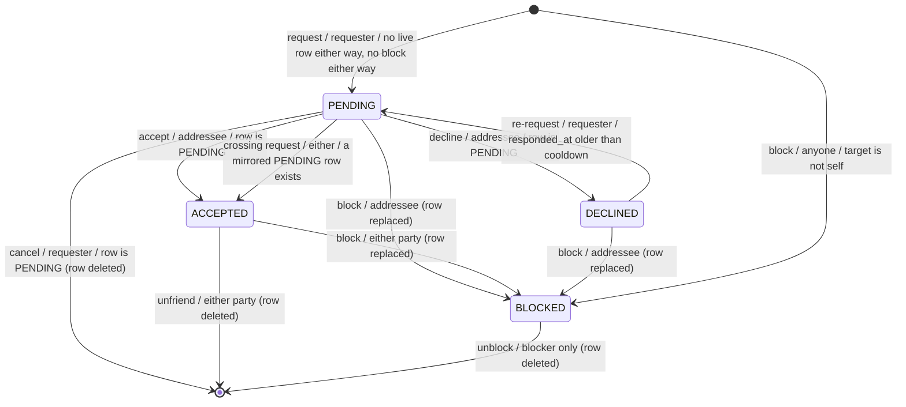
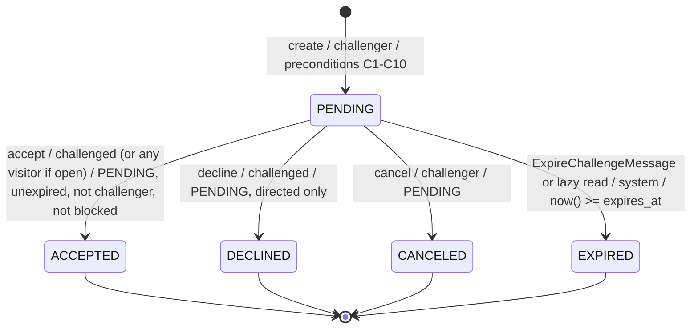

# Social — Usernames, Friendships, Blocking, Challenges, Offers

> Elaborates `00-overview.md` §2.1, §4.4 and §8 (invariant 12). Companion
> chapters: `01-domain-model.md` (columns and migrations), `04-matchmaking.md`
> (seeks and pairing), `06-rating.md` (Glicko-2), `07-notifications.md`
> (delivery), `09-api-reference.md` (canonical routes and error envelope).
>
> This chapter owns the *rules*: who may do what, under which guard, and what
> the resulting state is. It does not own payload delivery, rating maths, or
> the clock.

---

## 1. Usernames — the prerequisite

### 1.1 Identity today is email, everywhere

Every claim below was read out of the tree, not assumed.

| Fact | Source |
|---|---|
| `User::getUserIdentifier()` returns the email verbatim | `src/Entity/User.php:156-159` |
| The only unique column on `user` is `email` | `src/Entity/User.php:25-26` |
| The Security provider keys on `email` | `config/packages/security.yaml:9-12` (`property: email`) |
| OIDC provider loads users by email | `src/Security/OidcUserProvider.php:100-112` (`findByEmail($identifier)`) |
| OIDC provider creates/links users by email | `src/Security/OidcUserProvider.php:49-63` |
| The OIDC authenticator builds its `UserBadge` from the resolved email | `src/Security/MultiProviderOidcAuthenticator.php:68-74` |
| The dev-login bypass resolves and creates by email | `src/Security/DevLoginAuthenticator.php:61-72` |
| `form_login` uses the same `app_user_provider` | `config/packages/security.yaml:20,24-28` |
| Self-service registration constructs `new User($email)` | `src/Action/RegisterAction.php:45-48` |
| Password reset looks up by email | `src/Action/LostPasswordAction.php:48` |
| The only public-facing handle rendered anywhere is `displayName ?? email` | `templates/base.html.twig:48` |

There is no handle. `displayName` is free text with no uniqueness, no format,
and no index; it is whatever the OIDC provider returned
(`OidcUserProvider.php:40`) or, for dev logins, the literal email string
(`DevLoginAuthenticator.php:66`).

Three consequences make a username load-bearing rather than cosmetic:

1. A friend-lookup surface keyed on email is a registration oracle (§2).
2. A profile URL keyed on the UUID is unshareable; keyed on the email is a leak.
3. `email` is not always an email. `OidcUserProvider::resolveEmail()`
   (`src/Security/OidcUserProvider.php:68-79`) stores `<sub>@discord.placeholder`
   for Discord accounts that expose no address, and in its generic fallback
   branch (line 75) stores a bare `sub` with no `@` at all. Anything derived
   from the local part must survive both shapes.

### 1.2 Column and format

```php
// src/Entity/User.php
#[ORM\Column(type: Types::STRING, length: 32)]
private string $username;

#[ORM\Column(type: Types::DATETIMETZ_IMMUTABLE, nullable: true)]
private ?\DateTimeImmutable $usernameChangedAt = null;
```

| Property | Value | Why |
|---|---|---|
| Format | `^[a-zA-Z0-9_-]{3,32}$` (contract §4.4) | ASCII only: no homoglyph impersonation, no normalisation ambiguity, and `LOWER()` is collation-independent |
| Storage | Case-**preserving** | `VincentC` displays as the owner typed it |
| Uniqueness | Case-**insensitive**, `UNIQUE(LOWER(username))` | `Vincent` and `vincent` must not be two people |
| Nullability | `NOT NULL` after the backfill | A user without a handle has no profile URL and cannot be found; there is no valid intermediate state after §1.7 completes |
| Mutability | Once, ever, tracked by `usernameChangedAt` | §1.6 |

`usernameChangedAt` is an addition to the contract's enumerated `User` field
list — see §11.

`lower(text)` is `IMMUTABLE` in PostgreSQL and therefore legal in an index
expression; combined with the ASCII-only charset the folded form is stable
across any database collation.

### 1.3 Reserved words

Checked against the case-folded candidate, on both auto-generation and manual
change. Rejection code `username_reserved`.

| Group | Words |
|---|---|
| Impersonation | `admin`, `administrator`, `root`, `system`, `sysop`, `staff`, `official`, `support`, `help`, `moderator`, `mod`, `keres`, `keresbot`, `security`, `abuse`, `billing`, `noreply`, `postmaster`, `webmaster` |
| Engine / non-humans | `ai`, `bot`, `engine`, `computer`, `cpu`, `anonymous`, `anon`, `guest`, `deleted`, `unknown`, `null`, `undefined`, `none`, `nan` |
| Self-reference | `me`, `self`, `you`, `my`, `mine` |
| Route-shaped (future-proofing only) | `api`, `www`, `mail`, `static`, `assets`, `login`, `logout`, `register`, `account`, `settings`, `profile`, `player`, `players`, `user`, `users`, `game`, `games`, `play`, `lobby`, `seek`, `seeks`, `challenge`, `challenges`, `friend`, `friends`, `notifications`, `push`, `leaderboard`, `feedback`, `contact`, `dev` |

The last group is defensive, not functional: the public profile lives under
`/@/{username}` (§9.1), so the username namespace cannot collide with a route
by construction. Reserving them anyway costs nothing and removes a whole class
of future footgun.

Storage: a `private const array RESERVED` on
`App\Service\Social\UsernameGenerator`. It is a compile-time constant, not
configuration, and holding it in a service is worker-mode safe because it is
immutable (contract §6).

### 1.4 Derivation on account creation

```
derive(displayName, email) -> stem:
    source := displayName is non-blank ? displayName : email
    if source matches /^[^@\s]+@[^@\s]+$/ :        # DevLoginAuthenticator.php:66
        source := local part of source
    else if displayName is blank :
        source := local part of email (whole string when there is no '@')
    s := transliterate(source) to ASCII            # NFKD, drop combining marks
    s := regex_replace(s, '[^A-Za-z0-9_-]+', '-')
    s := trim(s, '-_')
    s := regex_replace(s, '[-_]{2,}', '-')
    if s matches /^[0-9]+$/ : s := 'player-' . s   # Discord snowflake case
    if length(s) < 3        : s := 'player'
    return substr(s, 0, 24)                        # 8 chars reserved for a suffix
```

```
assign(user):
    stem := derive(user.displayName, user.email)
    if not reserved(lower(stem)) and not taken(lower(stem)) : return stem
    for attempt in 1..5:
        candidate := stem . '-' . random_base36(4)
        if not taken(lower(candidate)) : return candidate
    return 'player-' . random_base36(10)
```

Why a random suffix rather than a `-2`, `-3`, … counter: the counter requires a
`SELECT max(...)`-style scan per collision and produces a predictable next
value that two concurrent registrations both compute. Four base-36 characters
give 1.7M values against a stem that already collided once — the pre-check
plus the unique index make the residual race negligible.

`taken()` is `SELECT 1 FROM "user" WHERE LOWER(username) = :folded` — an
index-only probe on the functional unique index.

**Call sites.** `UsernameGenerator::assign()` is invoked before `persist()` at
each of the three places a `User` is constructed today:

| Site | Line |
|---|---|
| OIDC first login | `src/Security/OidcUserProvider.php:52-55` |
| Dev-login bypass | `src/Security/DevLoginAuthenticator.php:65-68` |
| Self-service registration | `src/Action/RegisterAction.php:48-51` |

A `LoginSuccessEvent` listener is **not** used: the column is `NOT NULL`, so
generation has to happen before the INSERT, and `RegisterAction` flushes
(line 51) long before any login event fires.

**Race handling.** The pre-check is advisory; the unique index is authoritative.
On `UniqueConstraintViolationException` during the flush, the call site calls
`ManagerRegistry::resetManager()` (the `EntityManager` is closed after a failed
flush and is unusable under FrankenPHP worker mode, contract §6) and retries the
whole creation exactly once. A second failure surfaces as a normal 500 — at
that point something other than a username collision is wrong.

### 1.5 The Security identifier stays the email

`getUserIdentifier()` keeps returning the email
(`src/Entity/User.php:156-159`) and `security.yaml:12` keeps `property: email`.
This is deliberate:

1. **The identifier must be immutable; the username is not.** Symfony
   serialises the identifier into the session token and compares it on every
   request (`AbstractToken::getUserIdentifier()`,
   `vendor/symfony/security-core/Authentication/Token/AbstractToken.php:48-51`).
   `User` implements neither `EquatableInterface` nor a custom
   `__serialize`, so the identifier string *is* the whole identity comparison.
   A rename would silently invalidate the session.
2. **A freed username is a session-hijack primitive.** If identifiers were
   usernames and `alice` renamed to `alice2`, a fresh account taking `alice`
   would match `alice`'s stale remember-me payload. Emails are never freed;
   usernames are (§1.6 U4).
3. **Switching would break the backfill window.** `refreshUser()`
   (`OidcUserProvider.php:86-93`) re-resolves via `getUserIdentifier()`; every
   logged-in session at deploy time carries an email.
4. There is no benefit. Nothing in the login flow displays or accepts a
   username.

The username is a **display and lookup handle**. It never appears in a
`UserBadge`, a `UserProvider`, or an access-control rule.

### 1.6 The one-time change

Rules:

| # | Rule |
|---|---|
| U1 | A user may change their username at most once, ever. `usernameChangedAt IS NOT NULL` closes the door permanently — error `username_already_changed`. |
| U2 | The new value passes the same format regex, reserved-word list and case-folded uniqueness check as generation. |
| U3 | Changing only the *case* of the current username (`vincent` -> `Vincent`) is free and does **not** consume the allowance: the folded form is unchanged, so no third party is affected. |
| U4 | The old username is released immediately, with no tombstone (§11, question 6). |
| U5 | Admins have no override path in this spec. Support renames are a manual SQL operation. |

The write is a guarded DBAL statement, not an ORM flush, so a collision cannot
close the `EntityManager` mid-request:

```php
$sql = 'UPDATE "user" SET username = :new, username_changed_at = now()
         WHERE id = :id AND username_changed_at IS NULL';
try {
    $affected = $connection->executeStatement($sql, [...]);
} catch (UniqueConstraintViolationException) {
    // lost the race: re-render the form with a username_taken field error
}
// $affected === 0  =>  the allowance was already spent (concurrent tab)
$user->setUsername($new);   // keep the in-memory entity coherent
```

### 1.7 Migration and backfill

One migration, runnable against production rows as they exist today. Steps 2–4
are pure SQL and deterministic: re-running the migration on a copy of the same
data produces byte-identical usernames.

**Ownership.** The migration *file* belongs to `01-domain-model.md` §6.1 —
`DomainModel` has it as `Version20260801090000`, adding `username` and
`username_changed_at` together. What follows is the normative specification of
the *derivation and convergence rules* the file must implement, which is this
chapter's concern because it is the same algorithm `UsernameGenerator` runs at
runtime (§1.4). The two must not drift: a backfilled username and a
freshly-generated one for the same inputs have to be identical, or the same
account gets a different handle depending on whether it existed at migration
time.

**Step 1 — add the columns, nullable.**

```sql
ALTER TABLE "user" ADD username VARCHAR(32) DEFAULT NULL;
ALTER TABLE "user" ADD username_changed_at TIMESTAMP(0) WITH TIME ZONE DEFAULT NULL;
```

`TIMESTAMP … WITH TIME ZONE` diverges from the legacy columns added in
`migrations/Version20260722201821.php:22` (`WITHOUT TIME ZONE`). That is
intentional and matches the contract's `timestamptz` for all new multiplayer
columns; `01-domain-model.md` owns the decision.

**Step 2 — deterministic seed pass.** Mirrors `derive()` from §1.4 in SQL.

```sql
WITH stem AS (
    SELECT u.id, u.created_at,
           left(
             CASE
               WHEN s.v ~ '^[0-9]+$' THEN 'player-' || s.v      -- Discord snowflake
               WHEN length(s.v) < 3  THEN 'player'
               ELSE s.v
             END, 24) AS stem
      FROM "user" u
     CROSS JOIN LATERAL (SELECT btrim(regexp_replace(regexp_replace(
             unaccent(
               CASE
                 WHEN btrim(coalesce(u.display_name, '')) = ''
                   THEN split_part(u.email, '@', 1)
                 WHEN btrim(u.display_name) ~ '^[^@[:space:]]+@[^@[:space:]]+$'
                   THEN split_part(btrim(u.display_name), '@', 1)   -- DevLoginAuthenticator.php:66
                 ELSE btrim(u.display_name)
               END),
             '[^A-Za-z0-9_-]+', '-', 'g'), '[-_]{2,}', '-', 'g'), '-_')) AS s(v)
),
ranked AS (
    SELECT id, stem,
           row_number() OVER (PARTITION BY lower(stem) ORDER BY created_at, id) AS rn
      FROM stem
)
UPDATE "user" u
   SET username = CASE WHEN r.rn = 1 THEN r.stem
                       ELSE r.stem || '-' || r.rn::text END
  FROM ranked r
 WHERE u.id = r.id;
```

`split_part(email, '@', 1)` returns the whole string when there is no `@`,
which is exactly right for the `resolveEmail()` bare-`sub` branch
(`OidcUserProvider.php:75`). Discord placeholder addresses
(`<snowflake>@discord.placeholder`, line 71) reduce to an all-digit stem and
become `player-<snowflake>`.

`unaccent()` needs `CREATE EXTENSION IF NOT EXISTS unaccent;` as step 0. Drop
the call if extensions are unavailable: the following `regexp_replace` already
reduces any non-ASCII byte to `-`, so `Renee` is spelled `Ren-e` instead. Both
are valid; the extension only buys nicer output.

**Step 3 — converge on global uniqueness.** Step 2 deduplicates *within* a
stem partition. It cannot rule out a cross-partition collision (a user whose
display name is literally `bob-2` against the second `bob`). Loop until clean,
and fail loudly rather than silently creating a duplicate:

```sql
DO $$
DECLARE pass int := 0;
BEGIN
  LOOP
    EXIT WHEN NOT EXISTS (
      SELECT 1 FROM "user" WHERE username IS NOT NULL
       GROUP BY lower(username) HAVING count(*) > 1);
    pass := pass + 1;
    IF pass > 5 THEN
      RAISE EXCEPTION 'username backfill did not converge after 5 passes';
    END IF;
    WITH dup AS (
      SELECT id, username,
             row_number() OVER (PARTITION BY lower(username)
                                ORDER BY created_at, id) AS rn
        FROM "user"
    )
    UPDATE "user" u
       SET username = left(u.username, 32 - (length(d.rn::text) + 1))
                      || '-' || d.rn::text
      FROM dup d
     WHERE u.id = d.id AND d.rn > 1;
  END LOOP;
END $$;
```

**Step 4 — reserved words.** Any backfilled row landing on a reserved word is
suffixed; the literal list is inlined into the migration so it is frozen at
migration time and cannot drift with the PHP constant.

```sql
UPDATE "user"
   SET username = left(username, 27) || '-' || left(md5(id::text), 4)
 WHERE lower(username) IN ('admin','root','system','support','keres', /* … */);
```

Then re-run step 3's `DO` block. (In practice this touches zero rows; it is
cheap insurance.)

**Step 5 — constrain and index.**

```sql
ALTER TABLE "user" ALTER COLUMN username SET NOT NULL;

CREATE UNIQUE INDEX uniq_user_username_lower
    ON "user" (LOWER(username));

CREATE INDEX idx_user_username_lower_prefix
    ON "user" (LOWER(username) text_pattern_ops);
```

The second index is not redundant. Prefix search (§2.2) issues
`LOWER(username) LIKE :prefix || '%'`, and under any non-`C` collation a
default btree index cannot serve a `LIKE` prefix scan — `text_pattern_ops` is
required.

**Doctrine and the functional index.** Neither index is expressible through
`#[ORM\UniqueConstraint]`/`#[ORM\Index]`, so both are hand-written here. They
will *not* be reverted by a later `doctrine:migrations:diff`:
`PostgreSQLSchemaManager::selectIndexColumns()`
(`vendor/doctrine/dbal/src/Schema/PostgreSQLSchemaManager.php:418-450`) inner-joins
`pg_attribute` on `a.attnum = keys.attnum`, and an expression index column has
`indkey` entry `0`, which matches no `pg_attribute` row. `[INFERENCE]` The
index is therefore invisible to schema introspection and the differ will
neither manage nor drop it. Worth confirming once against the live schema
manager after P0.1 lands; if it *is* seen, the fallback is
`doctrine.dbal.schema_filter`.

**Locking.** `CREATE UNIQUE INDEX` takes a `SHARE` lock on `"user"` for its
duration. At the current table size that is milliseconds. Should the table grow
past ~100k rows, split the index creation into its own migration with
`isTransactional(): false` and use `CREATE UNIQUE INDEX CONCURRENTLY`.

**`down()`** drops both indexes and both columns.

---

## 2. Enumeration and privacy

### 2.1 The rule

**No social surface may confirm or deny that a given email address has an
account.** Usernames are public identifiers and *are* enumerable by design;
emails are credentials-adjacent and are not.

The precedent already exists in the codebase and is explicit about it:
`LostPasswordAction` looks the address up (`src/Action/LostPasswordAction.php:48`),
branches internally, and emits one identical flash either way with a comment
saying so (`:60-64`). Friend search follows the same discipline.

**Existing violation.** `RegisterAction.php:45-46` adds the form error
*"An account with this email already exists."* — a direct, unauthenticated,
unrate-limited registration oracle that contradicts the reset flow four files
away. It predates this spec and is not created by it, but any work that ships
friend search while leaving it in place has closed the front door and left the
window open. Recommended fix: always show the generic success flash and send a
"someone tried to register with your address; here is a reset link" email to
the existing account. Tracked in §11.

### 2.2 Lookup contract

`GET /players/search?q=<prefix>` — JSON, `ROLE_USER` required. Anonymous
visitors cannot enumerate at all.

| Rule | Behaviour |
|---|---|
| Input | Username prefix only. There is no email input anywhere in the social UI. |
| `@` in `q` | Return an empty result set. Do **not** attempt a lookup, do not error, do not hint. A user who pastes an address gets the same shape as a user who searched for nonsense. |
| Minimum length | 3 characters, matching the minimum username length. Shorter returns 422 `search_prefix_too_short` — a 1-character prefix is a paginated dump of the user table. |
| Match | `LOWER(username) LIKE LOWER(:q) || '%'`, with `%` and `_` escaped in `:q`. Prefix only: no infix, no fuzzy, no `displayName` matching. |
| Ordering | `LOWER(username) ASC`. Deterministic, non-gameable; no relevance heuristic that could be probed. |
| Limit | 10 rows, no pagination. Enumeration by pagination is not offered. |
| Fields returned | `username`, `displayName`, `avatarUrl`, per-category ratings, and the viewer's `relationship` (`none`/`pending_out`/`pending_in`/`friends`/`blocked_by_me`). **Never** `email`, `id`, `roles`, `createdAt`. |
| Filtered out | Any user with a block in either direction relative to the viewer (§4). |
| Non-match | HTTP 200, `{"data":{"results":[]}}`. Identical to "exists but blocked you", identical to "exists but you blocked them". |

Consequence of the last two rows: a blocked user is indistinguishable from a
non-existent one, which is what makes silent blocking (§4.3) actually silent.

### 2.3 Exact match is a deliberate oracle

`GET /@/{username}` returns 404 for an unknown handle. That *is* a username
oracle, and it is accepted: a username exists to be shared, linked and typed.
The distinction the spec defends is email/username, not "no information at all".

### 2.4 Rate limits

Two new limiters in `config/packages/rate_limiter.yaml`, alongside the existing
`contact_limiter` (`config/packages/rate_limiter.yaml:3-6`).

| Limiter name | Autowired argument | Policy | Budget | Key | Covers |
|---|---|---|---|---|---|
| `friend_search` | `RateLimiterFactoryInterface $friendSearchLimiter` | `sliding_window` | 30 / 1 minute | user id | `GET /players/search` |
| `social_action` | `RateLimiterFactoryInterface $socialActionLimiter` | `sliding_window` | 60 / 1 hour | user id | friend request, block, challenge creation, username change |

**The limiter names deliberately omit the `_limiter` suffix.** `FrameworkExtension`
registers the autowiring alias from `$name.'.limiter'`
(`vendor/symfony/framework-bundle/DependencyInjection/FrameworkExtension.php:3492-3495`),
which `ContainerBuilder::registerAliasForArgument()` camelises via
`Target::getParsedName()`
(`vendor/symfony/dependency-injection/ContainerBuilder.php:1487-1504`). A limiter
called `contact_limiter` therefore autowires as `$contactLimiterLimiter` — the
exact stutter that forced the explicit bind at `config/services.yaml:28-33`.
Naming the limiters `friend_search` and `social_action` produces the readable
arguments above and **zero `services.yaml` wiring**. Credit: `ApiReference`.

Type-hint `RateLimiterFactoryInterface`, not `RateLimiterFactory`: the latter's
autowiring alias is deprecated since Symfony 7.3 and removed in 8.0
(`FrameworkExtension.php:3497-3499`). Usage otherwise follows the established
pattern — `create($key)`, `consume(1)->isAccepted()`, 429 on refusal
(`src/Action/Api/ContactAction.php:50-53`).

Keyed on the user id, not the client IP: the endpoints are authenticated, and
IP keying would penalise shared NATs while a determined attacker rotates
addresses. Exceeding either returns 429 `rate_limited` with the standard error
envelope (`09-api-reference.md` §2).

---

## 3. Friendship model

### 3.1 Shape

One directed row per relation, `UNIQUE(requester_id, addressee_id)`,
`CHECK(requester_id <> addressee_id)` (contract). Direction is a historical
record of who asked; **an `ACCEPTED` friendship is semantically undirected** and
every read treats it as such.

Two invariants beyond the contract's constraints:

- **F1** — At most one row per *unordered* pair has status in
  `{PENDING, ACCEPTED, DECLINED}`.
- **F2** — A `BLOCKED` row is strictly directional. `A->B BLOCKED` and
  `B->A BLOCKED` may coexist (mutual blocks are legitimate and each party must
  be able to lift only their own). A `BLOCKED` row coexists with no non-blocked
  row in either direction.

F1 is enforced by a partial unique index rather than by application discipline
alone:

```sql
CREATE UNIQUE INDEX uniq_friendship_active_pair
    ON friendship (LEAST(requester_id, addressee_id),
                   GREATEST(requester_id, addressee_id))
 WHERE status <> 3;   -- 3 = BLOCKED
```

`[INFERENCE]` PostgreSQL accepts `LEAST`/`GREATEST` in an index expression when
the argument comparison is immutable, which it is for `uuid`. Verify once
against a live database; the fallback is a `SELECT … FOR UPDATE` over both
directions inside `FriendshipManager` plus a `social:check-consistency` console
command.

### 3.2 State machine



### 3.3 Transitions

Every transition: trigger, actor, guard, effect.

| # | From | To | Trigger | Actor | Guard | Effect |
|---|---|---|---|---|---|---|
| T1 | (none) | PENDING | `POST /friends/request` | requester | no row in either direction; no `BLOCKED` row either way; target exists; target != self; rate limit | INSERT `(me, them, PENDING, created_at=now())`; notify addressee `FRIEND_REQUEST` |
| T2 | PENDING `(B,A)` | ACCEPTED | `POST /friends/request` by A | requester A | a mirrored `PENDING` row `(B,A)` already exists | UPDATE that row to `ACCEPTED`, `responded_at=now()`. **No new row.** Notify both `FRIEND_ACCEPTED` |
| T3 | PENDING | ACCEPTED | `POST /friends/{username}/accept` | addressee | row is `PENDING` and not expired (there is no expiry — see below) | `status=ACCEPTED`, `responded_at=now()`; notify requester `FRIEND_ACCEPTED` |
| T4 | PENDING | DECLINED | `POST /friends/{username}/decline` | addressee | row is `PENDING` | `status=DECLINED`, `responded_at=now()`. **No notification** (§3.5) |
| T5 | PENDING | (none) | `POST /friends/{username}/remove` | requester | row is `PENDING` and `requester = me` | DELETE. No notification; if the addressee had an unread `FRIEND_REQUEST` notification it is marked read |
| T6 | ACCEPTED | (none) | `POST /friends/{username}/remove` | either party | row is `ACCEPTED` | DELETE. **No notification** — an unfriend notification is an insult delivery mechanism |
| T7 | DECLINED | PENDING | `POST /friends/request` | original requester | `now() - responded_at >= FRIEND_REQUEST_COOLDOWN_SECONDS` | `status=PENDING`, `responded_at=NULL`, `created_at=now()`; notify addressee `FRIEND_REQUEST` |
| T8 | DECLINED | DECLINED | `POST /friends/request` | original requester | cooldown **not** elapsed | **No-op.** Returns the same 200 envelope as T1 (§3.5) |
| T9 | any / none | BLOCKED | `POST /friends/block` | blocker | target != self | §4.5 |
| T10 | BLOCKED | (none) | `POST /friends/{username}/unblock` | the blocker on that row only | `requester = me AND status = BLOCKED` | DELETE. Does not restore any prior friendship, and does not touch a mirrored block owned by the other party |

Friend requests **do not expire.** A `PENDING` row is a standing offer; it costs
one row and produces no ongoing notification pressure. Contrast with challenges
(§5), which are time-bounded because they commit the recipient to playing *now*.

### 3.4 Crossing requests

A requests B while `(B, A, PENDING)` already exists (T2). The result is
**auto-accept on the existing row** — not a second row, not an error. Both
parties executed the identical intent; rejecting A's click would leave two
people who both said yes in a non-friends state, resolvable only if A happens
to notice B's inbound request. Direction carries no meaning once `ACCEPTED`
(§3.1), so keeping B's row loses nothing, and the two-row alternative violates
F1 and forces every friend query into a `UNION`.

**Race safety.** The request path opens a transaction with

```sql
SELECT id, requester_id, status FROM friendship
 WHERE (requester_id = :me AND addressee_id = :them)
    OR (requester_id = :them AND addressee_id = :me)
   FOR UPDATE;
```

and branches on what it found. `FOR UPDATE` locks nothing when there are no
rows, so the genuine simultaneous case is caught by
`uniq_friendship_active_pair`: the loser catches
`UniqueConstraintViolationException`, resets the manager, retries once, now
sees the winner's row and takes the T2 branch. Both users end up friends either
way.

### 3.5 Declines are silent, with a cooldown

**Decision: the decline is invisible to the requester, and a re-request is
blocked for 7 days.**

*Visibility.* The requester's UI shows the request as sent, indefinitely: no
notification (T4), no state change visible through any API, and
`GET /friends/list` reports outbound requests as `pending_out` whether the row
is `PENDING` or `DECLINED`. A declined friend request is a social non-event
until someone is told about it; delivering "X declined you" converts it into a
rejection whose predictable sequel — re-request, ask why, escalate — is exactly
what the feature must not manufacture. The information is also unactionable:
there is nothing the requester should do differently.

*Cooldown.* `FRIEND_REQUEST_COOLDOWN_SECONDS = 604800` (7 days) from
`responded_at`. A re-request inside the window is T8, a no-op returning the
success envelope — silence is only silence if the failure is shaped like the
success. Without a cooldown, a requester re-sending daily produces a
`FRIEND_REQUEST` notification daily and the decline button becomes useless;
seven days caps that at one notification per week per pair, low enough to
ignore and high enough that a genuine "we sorted it out offline" retry still
works. The escalation path from there is block (§4) — permanent and equally
silent.

### 3.6 Reading the friend list

`ACCEPTED` rows are undirected, so every read normalises:

```sql
SELECT CASE WHEN f.requester_id = :me THEN f.addressee_id
            ELSE f.requester_id END AS friend_id
  FROM friendship f
 WHERE f.status = 1
   AND :me IN (f.requester_id, f.addressee_id);
```

The contract provides `UNIQUE(requester_id, addressee_id)` and
`INDEX(addressee_id, status)`. The second arm of the `IN` is covered; the first
is not, because the unique index does not carry `status`. Add
`INDEX(requester_id, status)` (§11). PostgreSQL will resolve the disjunction as
a `BitmapOr` over the two indexes.

Presented in the UI paginated with Pagerfanta (contract §6), sorted by
`LOWER(username)`, each row carrying the friend's online state
(`User.lastSeenAt`) and current-game state.

---

## 4. Blocking

### 4.1 Who, and against whom

Any authenticated user may block any other user. No prior relation is required.
Blocking yourself is refused by `CHECK(requester_id <> addressee_id)` and by an
explicit 422 `cannot_block_self` before the write. Administrators are not
exempt in either direction; moderation tooling is out of scope
(`00-overview.md` §2.1).

### 4.2 What a block prevents

`A blocked B` — the row is `(requester=A, addressee=B, status=BLOCKED)`.

| Capability | Effect | Visible to B? |
|---|---|---|
| B sends A a friend request | No row created. Returns the standard success envelope (T1's shape) | No |
| A sends B a friend request | Refused, explicit `blocked` (403). A knows about A's own block | n/a |
| B challenges A directly | A **tombstone** `Challenge` row is created (§5.3, C4); no notification is delivered; it expires normally | No |
| B opens A's open-link challenge | 404, identical to an unknown UUID | No |
| Seek pairing, either direction | The pair is excluded from the candidate set (§4.4) | No |
| Notifications | No `Notification` row and no `user/{uuid}` event is generated for either party from any action by the other | No |
| Friend search | Each is filtered out of the other's results (§2.2) | No |
| `GET /@/A` viewed by B | Renders — the profile is public per contract §4.3 — but the friend, challenge and block buttons are absent | Weakly (an attentive B may infer it) |
| A game already in progress between A and B | **Unaffected.** Both play it out normally | n/a |
| An existing friendship or pending request | Deleted by the block (§4.5) | No (it silently stops appearing) |

The in-progress-game carve-out is deliberate. If a block terminated a live game,
"block to escape a lost position" becomes a free resignation-with-no-loss, and
the block button turns into a rating exploit. A block is a *future* filter.

### 4.3 A block is not disclosed

**Decision: the blocked user is never told.**

Rationale: a block notification is an attack notification. It confirms to a
harasser that they were noticed, identifies who noticed, and invites the obvious
countermeasure — a second account. The cost is that B may waste effort on
requests that go nowhere; that cost falls on the right party.

The design obligation this creates: **every blocked rejection must be
byte-identical to the corresponding success.** The four surfaces are listed in
§4.2; the two that could leak are friend requests (solved by returning the
success envelope and writing nothing) and challenges (solved by the tombstone
row in §5.3 — a challenge response carries a UUID the client will poll, so
returning a fabricated one would break within seconds).

Corollary: because the mechanism is invisible, the *blocker* needs an explicit
management surface. `GET /settings/profile` lists blocked users with an unblock
control (§9.2). Without it a block is unauditable and irreversible in practice.

### 4.4 Blocking inside the pairing query

`SeekMatcher` must not issue a per-candidate block check — that is an N+1
inside a `FOR UPDATE SKIP LOCKED` transaction, which is where latency turns
into lock contention (`00-overview.md` §7). The predicate instead rides in the
pairing query as a correlated `NOT EXISTS`. The surrounding query is
`04-matchmaking.md` §3's; only this clause is specified here, dropped in beside
the other `WHERE` predicates (`s` is the candidate seek, `:me` the acting user):

```sql
AND NOT EXISTS (
      SELECT 1
        FROM friendship b
       WHERE b.status = 3                            -- BLOCKED
         AND (   (b.requester_id = :me       AND b.addressee_id = s.user_id)
              OR (b.requester_id = s.user_id AND b.addressee_id = :me) )
    )
```

Supporting indexes — one partial index per direction:

```sql
CREATE INDEX idx_friendship_block_fwd
    ON friendship (requester_id, addressee_id) WHERE status = 3;
CREATE INDEX idx_friendship_block_rev
    ON friendship (addressee_id, requester_id) WHERE status = 3;
```

Partial on `status = 3` because blocks are rare: both stay near-empty and the
probes are index-only. The contract's `INDEX(addressee_id, status)` would serve
the reverse arm, and the unique key the forward arm with a heap recheck for
`status`; the dedicated pair removes both compromises for a few kilobytes.

Cost: `NOT EXISTS` becomes an anti-semi-join evaluated lazily under the outer
`LIMIT 1`, so it is probed only for candidates actually considered in `ORDER BY`
sequence. It adds no round trip, so the auto-widening quick-pair loop
(`QUICK_PAIR_WIDEN_PER_SECOND`) re-runs the same statement with a wider window
and pays nothing extra for the filter.

Blocking is also consulted at directed-challenge creation (§5.3 C4), open-link
acceptance (§5.7) and rematch offer (§6.1). Those are single-pair checks — one
indexed query each — via `FriendshipManager::isBlockedEitherWay()`.

### 4.5 The block transaction

```
BEGIN;
  SELECT id, requester_id, status FROM friendship
   WHERE (requester_id, addressee_id) IN ((:me,:them),(:them,:me))
     FOR UPDATE;

  -- drop any live relation in either direction (F2)
  DELETE FROM friendship
   WHERE status <> 3
     AND (requester_id, addressee_id) IN ((:me,:them),(:them,:me));

  -- upsert my directional block; a mirrored block owned by them is untouched
  INSERT INTO friendship (requester_id, addressee_id, status, created_at, responded_at)
  VALUES (:me, :them, 3, now(), now())
      ON CONFLICT (requester_id, addressee_id)
      DO UPDATE SET status = 3, responded_at = now();
COMMIT;
```

Then, outside the transaction: cancel any `PENDING` challenge between the pair
in either direction (`status = CANCELED`), and mark any unread social
`Notification` rows between the pair as read so neither inbox retains a live
link to the other. No Mercure event is published to the blocked user.

Unblocking (T10) deletes only the row where `requester_id = :me`. It restores
nothing: friendship, if wanted again, is re-requested from scratch.

---

## 5. Challenges

### 5.1 Two flavours, one table

`Challenge.challenged` is nullable (contract):

| `challenged_id` | Flavour | TTL | Who may accept |
|---|---|---|---|
| NOT NULL | **Directed** — an invitation to a named user | `CHALLENGE_TTL_SECONDS` = 86400 (24 h) | that user only |
| NULL | **Open link** — a shareable URL | `OPEN_CHALLENGE_TTL_SECONDS` = 604800 (7 d) | the first authenticated non-challenger, non-blocked visitor |

A directed challenge does not require friendship. Restricting challenges to
friends would make the friend graph a prerequisite for playing a specific
person, which is backwards; block is the opt-out, not friendship the opt-in.

### 5.2 Lifecycle



All four terminal states are final: `responded_at` is stamped once and the row
is never revived. A repeat challenge is a new row.

### 5.3 Creation preconditions

`POST /challenge`.

| # | Precondition | On failure |
|---|---|---|
| C1 | Actor authenticated | 401 |
| C2 | Directed only: `challenged` resolves by username (`LOWER(username) = LOWER(:u)`) | 404 `user_not_found` — an acceptable username oracle, §2.3 |
| C3 | `challenged_id <> challenger_id` | 422 `cannot_challenge_self` |
| C4 | No `BLOCKED` row in either direction | **Row is created as a tombstone.** `status = PENDING`, no notification, no Mercure event. Response is a normal 200. It expires on schedule. |
| C5 | Time control valid for its kind — the shared cross-field rule, `09-api-reference.md` §4.1 and `03-time-control.md` §2 | 422 `invalid_time_control` |
| C6 | `rated = true` requires `time_control_kind <> UNLIMITED` (contract: UNLIMITED yields `speed_category = null`, never rated) | 422 `unrated_time_control` |
| C7 | `speed_category` derived server-side from the contract's formula; the client's value is ignored | — |
| C8 | At most `MAX_OUTBOUND_CHALLENGES = 10` rows with `challenger = me AND status = PENDING AND expires_at > now()` | 409 `too_many_challenges` — an outstanding-count cap, deliberately **not** 429; the rate window is C10 |
| C9 | Directed only: at most one live `PENDING` challenge per `(challenger, challenged)` pair | **Idempotent** — returns the existing challenge's UUID with 200, creates nothing |
| C10 | `social_action` limiter | 429 `rate_limited` |

C4 deserves the asymmetry it has with friend requests, where the blocked path
writes nothing. A `POST /challenge` response carries a UUID the client
immediately renders and polls; returning a fabricated UUID would 404 within a
second and expose the block. A real, undelivered row costs one narrow row and
is behaviourally identical to "they saw it and ignored it". A friend request
response carries no handle, so there is nothing to fake and no row is needed.
The tombstone volume is bounded by C8 and C10.

### 5.4 Outbound cap and over-commitment

**Decision: cap at 10 concurrent outbound `PENDING` challenges; accepted
challenges never auto-cancel their siblings.**

The cap exists to bound (a) notification spam from one actor, (b) the tombstone
volume from C4, and (c) the number of games one accept-storm can create. Ten is
enough to invite a whole friend list and small enough that the worst case is
manageable.

Sibling auto-cancel is rejected. If accepting #1 cancelled #2 through #10, two
friends clicking Accept in the same second would have the outcome decided by
network latency — one gets a game, the other a 409 on a challenge that was
valid when their page rendered. Leaving all ten live means a challenger who
blasted invitations may land in several simultaneous games: self-inflicted and
recoverable by abort (`03-time-control.md` §7), where a latency-decided race is
neither. The UI warns when a realtime challenge is created while others are
outstanding.

### 5.5 Colour resolution

Resolved **at accept time**, never at creation, by `GameFactory`:

| Challenger's `color_preference` | Challenger plays | Acceptor plays |
|---|---|---|
| `WHITE` (0) | white | black |
| `BLACK` (1) | black | white |
| `RANDOM` (2) | `random_int(0, 1)` evaluated in the accept transaction | the other colour |

Late resolution matters for the open-link case: every visitor to an open
`RANDOM` link sees "random", and nobody — including the challenger — can learn
the assignment before someone commits. The `Challenge` row is **not** updated
with the resolved colour; the two `GamePlayer` rows are the record (contract
§4.1).

### 5.6 Expiry

`expires_at = created_at + ttl` is written at creation, with `ttl` selected per
§5.1. `ExpireChallengeMessage(challengeUuid)` is dispatched in the same request
with `new DelayStamp($ttlSeconds * 1000)` onto the `async` Doctrine transport
(contract).

Handler:

```
handle(ExpireChallengeMessage):
    c := findByUuid(uuid)
    if c is null or c.status != PENDING: return          # idempotent no-op
    c.status      := EXPIRED
    c.responded_at := now()
    flush
    publish user/{challenger.uuid}: {type:"challenge.expired", uuid}
    mark the addressee's unread CHALLENGE_RECEIVED notification for this uuid as read
```

**Lazy backstop.** Every read path — `GET /challenge/{uuid}`, `GET /challenge`,
and the accept/decline endpoints — treats
`status = PENDING AND expires_at <= now()` as expired and flips the row in
place before answering. A stopped or backlogged worker therefore cannot leave
an acceptable zombie challenge. This mirrors D4's belt-and-braces posture for
clocks (`03-time-control.md` §5): the delayed message provides the *timely*
transition, the lazy check provides the *correct* one.

### 5.7 The accept transaction — invariant 12

```
BEGIN;
  SELECT * FROM challenge WHERE uuid = :uuid FOR UPDATE;

  guard status = PENDING                    else 409 challenge_already_accepted
                                                 / 409 challenge_canceled
                                                 / 409 challenge_declined
                                                 / 410 challenge_expired
  guard expires_at > now()                  else 410 challenge_expired (flip to EXPIRED first)
  guard challenger_id <> :me                else 422 cannot_accept_own_challenge
  guard challenged_id IS NULL
        OR challenged_id = :me              else 403 blocked (directed at someone else)
  guard no BLOCKED row either way           else 404 (indistinguishable from unknown uuid)

  game := GameFactory::fromChallenge(challenge, acceptor)
          -- INSERT game (time control copied verbatim, opponent_type = HUMAN,
          --              created_by = challenger, started_at = NULL)
          -- INSERT 2 x game_player with colours per §5.5

  UPDATE challenge
     SET status = 1, responded_at = now(), game_id = game.id
   WHERE id = :id;
COMMIT;
```

`SELECT … FOR UPDATE` on the single challenge row is sufficient serialisation:
the challenge row is the only contended resource, so a second acceptor blocks,
then re-reads `ACCEPTED` and gets 409. This is deliberately weaker than seek
pairing, which contends on *two* rows and therefore needs `SKIP LOCKED`
(`04-matchmaking.md` §3). Do not copy the pairing pattern here — `SKIP LOCKED`
on a single-row accept would silently report "not found" to the loser.

Invariant 12 holds because the status flip and both game INSERTs share one
transaction and one commit.

**Side effects happen after commit, never inside it:**

1. `ClockManager::startIfDue()` — arms `FIRST_MOVE_TIMEOUT_SECONDS`
   (`03-time-control.md` §4).
2. `GameUpdatePublisher::publishGameState()` on `game/{uuid}`.
3. `publishUserEvent()` on `user/{challengerUuid}` carrying the new game UUID,
   so a challenger sitting on another page is redirected.
4. `NotificationDispatcher` -> `CHALLENGE_ACCEPTED` (§8).

A rollback therefore cannot emit a phantom event.

### 5.8 Open-link edge cases

`GET /challenge/{uuid}` is a public HTML page (no auth), so the link works when
pasted anywhere.

| Visitor / state | Page | Accept `POST` |
|---|---|---|
| Anonymous, `PENDING` | Renders challenger handle, rating, time control, rated flag, and a "Log in to accept" CTA. The CTA saves the challenge URL as the firewall target path — the mechanism already exists (`TargetPathTrait::saveTargetPath`, `src/Security/MultiProviderOidcAuthenticator.php:102`) — so login returns here | 401 |
| Authenticated stranger, `PENDING` | Accept button live | Accepts (§5.7) |
| **The challenger**, `PENDING` | Accept button absent; shows a copyable link and a Cancel button | 422 `cannot_accept_own_challenge` |
| Blocked by the challenger | 404 page, identical to an unknown UUID | 404 |
| Second visitor after `ACCEPTED` | HTTP **200** — "this challenge has already been accepted", with a link to the game, which is publicly viewable per contract §4.3. Not 404: the resource exists and the honest answer is more useful | 409 `challenge_already_accepted` |
| `EXPIRED` | 200, "this challenge has expired" | 410 `challenge_expired` |
| `CANCELED` | 200, "this challenge is no longer available". The wording does not distinguish cancel from expiry, so a challenger cancelling on a specific person is not broadcast | 409 `challenge_canceled` |
| `DECLINED` (directed; only the challenger can reach the page) | 200, "this challenge was declined" | 409 `challenge_declined` |

Auto-accept on login is explicitly **not** implemented. Committing a user to a
rated game as a side effect of authenticating is the kind of surprise that
produces immediate abandonment; the accept must be a deliberate second click.

### 5.9 `ChallengeVoter`

| Attribute | Grants when |
|---|---|
| `CHALLENGE_RESPOND` | `challenged_id = user`, **or** `challenged_id IS NULL AND challenger_id <> user` |
| `CHALLENGE_CANCEL` | `challenger_id = user` |

The voter answers "may this identity act on this row", not "is the row in the
right state". Status and expiry guards stay in `ChallengeManager` so each
failure gets its own error code rather than collapsing into a single 403.

---

## 6. Rematch

A rematch offer is a pre-accepted challenge with colours swapped
(`00-overview.md` §2.1). It creates no `Challenge` row: the offer lives in
`Game.rematch_offered_by_color` (contract) and rides the existing
`game/{uuid}` topic.

### 6.1 Flow

| Step | Endpoint | Actor | Guard | Effect |
|---|---|---|---|---|
| Offer | `POST /play/{uuid}/rematch/offer` | participant | `gameOverAt IS NOT NULL`; `end_reason <> ABORTED`; both `GamePlayer.user` non-null and distinct (no engine, no hot-seat); `rematch_offered_by_color IS NULL`; no block either way; `GAME_PARTICIPATE` | `rematch_offered_by_color = actorColour`; publish `GameStatePayload` with `offers.rematch`; notify opponent `REMATCH_OFFERED` (§8) |
| Accept | `POST /play/{uuid}/rematch/accept` | the *other* participant | `rematch_offered_by_color IS NOT NULL AND <> actorColour`; offer not stale (§6.2); no block either way | §6.3 |
| Decline | `POST /play/{uuid}/rematch/decline` | the *other* participant | `rematch_offered_by_color IS NOT NULL AND <> actorColour` | `rematch_offered_by_color = NULL`; publish |
| Withdraw | `POST /play/{uuid}/rematch/decline` | the offerer | `rematch_offered_by_color = actorColour` | Same clear; no penalty |

Offering on a finished game does not violate invariant 5:
`rematch_offered_by_color` is not one of the write-once result fields
(`gameOverAt`, `endReason`, `whiteWins`, `draw`). The `version` still
increments, so invariants 8 and 9 hold and the client's `seq` guard works
unchanged.

`ABORTED` games are excluded because an abort means nobody committed to
playing; the correct affordance there is a new seek, not a rematch.

### 6.2 Expiry without a column or a message

**Decision: no persisted expiry and no `ExpireRematchMessage`. The offer is
bounded by presence.**

An offer is treated as stale, and `GameStatePayload.offers.rematch` rendered as
`null`, when:

| Time control | Staleness condition |
|---|---|
| `REALTIME`, `UNLIMITED` | The offerer's `GamePlayer.lastSeenAt` is older than `DISCONNECT_ABANDON_SECONDS` (60 s). `PresenceTracker` already maintains this field (`02-realtime.md`) |
| `CORRESPONDENCE` | `now() > gameOverAt + 7 days`. Presence is meaningless for asynchronous play |

Clearing is lazy: `GameStatePayloadBuilder` suppresses a stale offer on every
read, and the accept endpoint re-checks and returns 409 `rematch_offer_stale`.
The column is physically cleared opportunistically the next time the row is
written.

This needs no new column, no new Messenger message and no timer, and it encodes
the only question the offeree actually has — *is the other player still sitting
there?* — rather than an arbitrary countdown.

### 6.3 Creation and time-control inheritance

`GameFactory::rematchOf(Game $finished, User $acceptor): Game`, in one
transaction:

```
BEGIN;
  SELECT * FROM game WHERE id = :oldId FOR UPDATE;
  guard rematch_offered_by_color IS NOT NULL AND <> acceptorColour

  new := Game(
      opponent_type      = HUMAN,
      created_by         = acceptor,
      time_control_kind  = old.time_control_kind,     -- verbatim
      initial_seconds    = old.initial_seconds,       -- verbatim
      increment_seconds  = old.increment_seconds,     -- verbatim
      days_per_move      = old.days_per_move,         -- verbatim
      speed_category     = old.speed_category,        -- verbatim
      rated              = old.rated,                 -- verbatim
  )
  INSERT game_player(new, WHITE, user = old black player)   -- colours swapped
  INSERT game_player(new, BLACK, user = old white player)
  UPDATE game SET rematch_offered_by_color = NULL WHERE id = :oldId;
COMMIT;
```

Time control is **copied**, not re-derived. The contract's speed formula is
deterministic, so the two agree; copying keeps the derivation in one place
(`04-matchmaking.md` / `06-rating.md`) and makes a rematch provably the same
conditions as the game it follows. `rated` is copied rather than recomputed, and
that is safe: `RatingUpdater::applyForFinishedGame()` never short-circuits on
`Game.rated` — the flag is one conjunct of six in a predicate re-evaluated from
scratch at finalisation, so it can only ever *withhold* rating, never grant it
(`06-rating.md` §6.1, confirmed by `Rating`). A rematch inheriting `rated = true`
from a game that was itself unrated on plies is still fully re-validated.
Colours are swapped
unconditionally, including when the original was random — that is the point.

After commit: publish a final `GameStatePayload` for the old game with
`offers.rematch = null`, and a `user/{uuid}` event to **both** players carrying
the new game UUID so an idle tab can follow without polling.

---

## 7. Draw offers

`Game.draw_offered_by_color` (contract), surfaced as `GameStatePayload.offers.draw`
(`"white" | "black" | null`).

### 7.1 Rules

| # | Rule | Rationale |
|---|---|---|
| D1 | Only in `OpponentType::HUMAN` games with two distinct human players. No AI, no hot-seat | With one person at the keyboard, or an engine opponent, a draw offer is a no-op |
| D2 | The game must be ongoing: `gameOverAt IS NULL` | Invariant 5 |
| D3 | Each side has moved at least twice — `count(gameMoves) >= 4`. Use the shared helper `Game::hasReachedRatedPlyFloor()`, not an open-coded count | Below that the correct action is abort (`03-time-control.md` §7), which costs neither player a rating. One threshold, three call sites: this guard, the abort window (`00-overview.md` §2.1), and clause 4 of the rated? predicate (`06-rating.md` §6.1) |
| D4 | Either side may offer at any time, on or off the move | Requiring "side to move" is rules-adjacent and buys nothing the other guards do not already provide |
| D5 | At most one outstanding offer per game. If `draw_offered_by_color` is already set, the *other* side must accept or decline — a counter-offer is refused with `draw_offer_outstanding` | One field, one offer |
| D6 | **Auto-withdraw on the offerer's own next move.** When a move by colour C commits and `draw_offered_by_color = C`, the field is cleared in the same unit of work | The classical convention, and it needs no timer: an offer you make and then keep playing through is withdrawn by the act of playing |
| D7 | After a **decline**, the declined side may not re-offer for `DRAW_OFFER_COOLDOWN_PLIES = 6` plies | §7.2 |
| D8 | A withdrawal by the offerer carries no cooldown | Nobody was spammed |
| D9 | An unanswered offer at game end is discarded; the terminal payload carries `offers.draw = null` | |

Threefold repetition, the 50-move rule and dead positions are **not** claimable
through this endpoint. They are rules knowledge and belong to the engine, which
already reports a draw in board byte 81 bit `0x10` (`AGENTS.md:110`). A player
in a theoretically dead position uses the offer like anyone else.

### 7.2 Cooldown storage

Enforcing D7 requires "the ply count at which this side's last offer was
declined". No such field exists and it cannot be derived. It is per-side, so it
belongs on `GamePlayer`, which the contract designates as the home for
everything per side (`00-overview.md` §4.1):

```php
// src/Entity/GamePlayer.php
#[ORM\Column(type: Types::INTEGER, nullable: true)]
private ?int $drawOfferDeclinedAtPly = null;
```

Guard: `count(gameMoves) >= ($gp->drawOfferDeclinedAtPly ?? PHP_INT_MIN) + 6`.

**Why 6 plies (3 full moves), and why plies rather than seconds.** Six is long
enough that re-offering is a considered act rather than a second click, and
short enough that two players converging on a drawn ending can agree within a
few moves. A wall-clock cooldown was rejected outright: 30 seconds is a third
of a bullet game and a rounding error in correspondence. Plies scale with the
game rather than with the format.

### 7.3 The move-path landmine

D6 writes to the `game` row on some moves. `GameEngine::applyMove()`
(`src/Engine/GameEngine.php:41-82`) has two mutually exclusive optimistic-lock
paths, and the second — the hand-rolled
`UPDATE game SET version = version + 1 WHERE id = :id AND version = :version` —
is only reachable when `Game` is *clean* after the move
(`00-overview.md` §3.5). Making `Game` dirty on the draw-clear silently retires
that path.

There is a second, sharper edge on the same code. The hand-rolled bump is a raw
`Connection::executeStatement()` (`src/Engine/GameEngine.php:66-76`); it
increments the database column but never writes the new value back to the
managed `Game` entity, so `$game->getVersion()` is **stale after every
non-terminal move**. Since `GameStatePayload.seq` is defined as `Game.version`
(contract, invariant 9) and clients drop any update with `seq <= lastSeq`, a
payload built from the in-memory entity would repeat a sequence number and the
opponent's board would freeze silently. Reported by `Realtime`
(`02-realtime.md`, open question on P0.4/P0.7 ordering) and confirmed here
against the source.

Neither hazard is new to draw offers: the clock writes to `game` on **every**
move, so `03-time-control.md` §6 already collapses the two paths into one as
prerequisite P0.7 (`00-overview.md` §5). The draw-clear is a strict subset of
that write pattern and is safe **only after P0.7 lands**. Ordering constraint
for `10-delivery-plan.md`: draw offers ship after P0.7, never before.

### 7.4 Endpoints and transitions

| Transition | Endpoint | Actor | Guard | Effect |
|---|---|---|---|---|
| Offer | `POST /play/{uuid}/draw/offer` | participant | D1–D5, D7; `GAME_PARTICIPATE` | `draw_offered_by_color = actorColour`; publish; notify (§8) |
| Accept | `POST /play/{uuid}/draw/accept` | the *other* participant | `draw_offered_by_color IS NOT NULL AND <> actorColour`; `gameOverAt IS NULL` | §7.5 |
| Decline | `POST /play/{uuid}/draw/decline` | the *other* participant | same | `draw_offered_by_color = NULL`; offerer's `GamePlayer.drawOfferDeclinedAtPly = count(gameMoves)`; publish |
| Withdraw | `POST /play/{uuid}/draw/decline` | the offerer | `draw_offered_by_color = actorColour` | `draw_offered_by_color = NULL`; publish. No cooldown (D8) |
| Auto-withdraw | (none — inside the move path) | system | D6 | `draw_offered_by_color = NULL`, folded into the move's own publish |

Missing offer on accept/decline: 409 `no_draw_offer`. Cooldown violation:
409 `draw_offer_cooldown` with `details.pliesRemaining`.

### 7.5 Agreement

In the accept transaction, using the existing `#[ORM\Version]` optimistic lock
rather than a pessimistic one (consistent with the rest of the game path):

```
gameOverAt             := now()
draw                   := true
whiteWins              := false
end_reason             := GameEndReason::DRAW_AGREED (5)
draw_offered_by_color  := NULL
rematch_offered_by_color := NULL
ClockManager::stop(game)          -- freezes both GamePlayer.clockMsRemaining
```

**`whiteWins` and `draw` are the entire score interface.** The rating layer
derives `s_white = draw ? 0.5 : (whiteWins ? 1.0 : 0.0)` with no branch on
`endReason` at all (`06-rating.md` §6.2); `endReason` is metadata and never the
score. Both columns are non-nullable and default `false`
(`src/Entity/Game.php:41-45`), so a finalisation path that forgets to write them
does not produce an error state — it produces a well-formed **black win**. The
failure is directional, not random: every omission resolves to `s_white = 0.0`,
so it accumulates as a systematic black-win skew rather than noise, and is
detectable in aggregate before any player reports it. The natural hook is
`AdminStatsRepository::getOutcomeDistribution()`
(`src/Repository/AdminStatsRepository.php:49-65`) — but note it currently
resolves outcomes from `g.isWhite`, the column P0.2 removes, so it has to be
rewritten against `GamePlayer` before it can serve as one. Flagged for
`10-delivery-plan.md`. The miscredit is also unrepairable: invariant 5 makes the
result write-once and the rating snapshot is not recomputable after the fact
(`06-rating.md` §7.3).

On *this* path the load-bearing write is `draw = true` alone: the ternary tests
`draw` first, so omitting `whiteWins` on a draw is harmless. The pseudocode above
writes `whiteWins := false` anyway, for the payload's `result` field and to keep
the row honest rather than accidentally correct. The paths that genuinely bite
are forgetting `draw` on a draw and forgetting `whiteWins` on a white win —
resignation, timeout and abandonment share that shape.

The structural answer, specified in `06-rating.md` §6.2, is that
`GameLifecycleManager::finalize()` takes the outcome as an explicit parameter and
is the **only** writer of `whiteWins`/`draw`, deriving both booleans itself. A
caller cannot forget a write it does not perform. Every transition in §7.4 and
§6.1 goes through it.

`RatingUpdater::applyForFinishedGame($game)` runs **inside** the same
transaction, called from `GameLifecycleManager` and idempotent on
`GamePlayer.ratingAfter IS NOT NULL` (`06-rating.md` §3.4). It writes only
`game_player` and `user_rating` rows and never dirties `Game`, so it cannot
disturb the locking scheme in §7.3. After commit, one `GameStatePayload`
publish with:

```json
{ "status": "finished", "endReason": "draw_agreed", "result": "draw",
  "offers": { "draw": null, "rematch": null }, "rating": { … } }
```

The terminal payload is the only one carrying `rating`, per the contract.

---

## 8. Notification triggers owned by this chapter

This chapter owns the *trigger, recipient and suppression rule*. Payload
schemas, Web Push vs. in-tab selection, per-type preferences and delivery
retries are `07-notifications.md`.

Four global rules:

1. A social notification is enqueued **after** the owning transaction commits,
   by the action, via `SendPushNotificationMessage` (contract). Never from a
   Doctrine lifecycle callback — a rollback would otherwise deliver a
   notification for an event that did not happen.
2. If a `BLOCKED` row exists in either direction, no row and no event is
   produced. This is checked at dispatch, not only at the originating action,
   so a block landing concurrently still suppresses.
3. The `NotificationType` names in the table below are PHP enum cases. On the
   wire they are lowercase snake_case strings — `CHALLENGE_RECEIVED` is emitted
   as `"challenge_received"` — per `02-realtime.md` §4.0, which applies the same
   rule to every enum the platform serialises. All timestamps in these payloads
   are integer microseconds since epoch.
4. Every `user/{uuid}` event carries `notificationUuid` = `Notification.uuid`,
   which is also the Web Push dedup tag. `user/{uuid}` is private and carries no
   `seq`; idempotency is by that UUID (`02-realtime.md`).

| Event | `NotificationType` | Recipient | `Notification` row | `user/{uuid}` event | Suppressed when |
|---|---|---|---|---|---|
| Friend request sent (T1) | `FRIEND_REQUEST` | addressee | yes | yes | block either way |
| Friend request re-sent after cooldown (T7) | `FRIEND_REQUEST` | addressee | yes | yes | block either way |
| Friend request re-sent inside cooldown (T8) | — | — | no | no | always (§3.5) |
| Friend request accepted (T3) | `FRIEND_ACCEPTED` | requester | yes | yes | — |
| Crossing requests auto-accepted (T2) | `FRIEND_ACCEPTED` | **both** | yes (x2) | yes (x2) | — |
| Friend request declined (T4) | — | — | no | no | always (§3.5) |
| Friend request cancelled (T5) | — | — | no | no | always; the addressee's unread `FRIEND_REQUEST` row is marked read |
| Unfriend (T6) | — | — | no | no | always |
| Block / unblock (T9/T10) | — | — | no | no | always (§4.3) |
| Directed challenge created | `CHALLENGE_RECEIVED` | challenged | yes | yes | block either way (tombstone, C4) |
| Open-link challenge created | — | — | no | no | always — there is no recipient |
| Challenge accepted | `CHALLENGE_ACCEPTED` | challenger | yes | yes | — |
| Challenge declined | `CHALLENGE_DECLINED` | challenger | yes | yes | — |
| Challenge cancelled | — | — | no | no | always; the challenged party's unread `CHALLENGE_RECEIVED` row is marked read |
| Challenge expired | — | — | no | yes (challenger only, so a stale UI updates) | — |
| Rematch offered | `REMATCH_OFFERED` | opponent | yes | yes | only when the opponent's presence is live — an opponent watching the board already sees `offers.rematch` on `game/{uuid}` and does not need a push |
| Draw offered, `CORRESPONDENCE` | `DRAW_OFFERED` | opponent | yes | yes | block (impossible mid-game) |
| Draw offered, `REALTIME`/`UNLIMITED` | — | — | no | no | always — the board is the channel; a push notification for an offer that expires on the offerer's next move is noise |
| Draw accepted / declined / withdrawn | — | — | no | no | always; the `game/{uuid}` payload carries it |

`YOUR_TURN`, `GAME_FINISHED` and `SEEK_MATCHED` are triggered by
`03-time-control.md`, `06-rating.md` and `04-matchmaking.md` respectively, not
here.

---

## 9. Profile and settings pages

There is **no self-service profile page in the application today.** The only
user-detail template is `templates/admin/actions/user_read.html.twig`, reachable
only behind `- { path: ^/admin, roles: ROLE_ADMIN }`
(`config/packages/security.yaml:35`). It renders the raw email in its title and
subtitle (`user_read.html.twig:3,7`) and must not be used as the base for a
public page.

### 9.1 `GET /@/{username}` — public profile

```php
#[Route(
    path: '/@/{username}',
    name: 'user_profile',
    requirements: ['username' => '[A-Za-z0-9_-]{3,32}'],
    methods: ['GET'],
)]
```

`security.yaml:34-37` guards only `^/admin`, `^/play` and `^/feedback`, so
`/@/…` is already public by default; `09-api-reference.md` nevertheless declares
the intent explicitly with `- { path: '^/@/', roles: PUBLIC_ACCESS }` rather
than leaving it to the absence of a rule. A profile link must work when pasted
into a chat, and multiplayer games are already publicly viewable (contract
§4.3).

The `/@/` prefix namespaces the entire username space under a segment that can
never be a route, so a username cannot shadow a controller. There is **no**
`/player/{username}` alias: no self-service profile page has ever existed
(`00-overview.md` §3.6), so there is no legacy URL to redirect from.

**Resolution.** `UserRepository::findOneByUsernameFold()` —
`LOWER(username) = LOWER(:username)`, served by `uniq_user_username_lower`. If
the requested casing differs from the stored casing, respond 301 to the
canonical form so link equity and caching converge on one URL. Unknown handle:
404 (§2.3).

| Block | Source | Anonymous | Other user | Self |
|---|---|---|---|---|
| `displayName`, `avatarUrl`, `@username`, member-since | `User` | yes | yes | yes |
| Online dot | `User.lastSeenAt` within 5 minutes | yes | yes | yes |
| Rating per `SpeedCategory`, games played, provisional `?` marker | `UserRating`, read through `Glicko2Calculator::inflate()` — see below | yes | yes | yes |
| W / L / D, overall and per category | aggregate over `game_player` JOIN `game` | yes | yes | yes |
| Recent games, 20/page | §9.3 | yes | yes | yes |
| Add friend / Cancel request / Unfriend | `FriendshipManager::relationOf($viewer, $subject)` | hidden | shown | hidden |
| Challenge (opens the time-control form) | — | hidden | shown, hidden if blocked either way | hidden |
| Block / Unblock | — | hidden | shown | hidden |
| Edit profile | — | hidden | hidden | shown |

**The provisional marker compares the *inflated* deviation, never the stored
column.** `Glicko2Calculator::inflate($rating, $now)->isProvisional()`, i.e.
`min(sqrt(RD^2 + (173.7178 * volatility)^2 * t), GLICKO_MAX_RD) > GLICKO_PROVISIONAL_RD`
with `t = elapsed / (GLICKO_RATING_PERIOD_DAYS * 86400)` and a strict `>`, so
exactly 110 is established (`06-rating.md` §8.1 for the marker, §4.1 for the
inflation). Reading `user_rating.deviation` raw would render a player who was
established three years ago with no `?` while `SeekMatcher` treats them as
RD 133 — the lobby and the profile would visibly disagree about the same person.

A user with **no** `UserRating` row in a category is not an error and not a gap:
render `1500?` muted with 0 games. Reads never insert rows (`06-rating.md` §5.3);
the row appears on the first rated game in that pool.

**Never rendered on this page:** `email`, `roles`, `password`, `resetToken`,
`resetTokenExpiresAt`, `id`. The UUID is not needed — every social action keys
on the username.

The `relationOf()` lookup is one query for the whole page, resolving to exactly
one of `none | pending_out | pending_in | friends | blocked_by_me`. Note the
absence of `blocked_by_them`: that value is never computed for the viewer,
which is what makes §4.3 enforceable at the template level rather than by
convention.

### 9.2 `GET|POST /settings/profile` — account settings

`ROLE_USER`. Requires a new access-control line, since `/settings` matches none
of the three existing prefixes:

```yaml
- { path: ^/settings, roles: ROLE_USER }
```

`App\Form\AccountSettingsType`, with inline per-field constraints per contract
§6 (no `#[Assert\*]` attributes, no `validation.yaml`):

| Field | Constraints | Notes |
|---|---|---|
| `username` | `NotBlank`, `Regex('/^[a-zA-Z0-9_-]{3,32}$/')`, `Callback` for the reserved list and the case-folded uniqueness probe | Rendered `disabled` with an explanatory note when `usernameChangedAt IS NOT NULL` (U1). Submitting a disabled field is re-checked server-side |
| `displayName` | `Length(max: 255)` | Free text; Twig escapes it. No uniqueness, no format |
| notification preferences | one checkbox per `NotificationType` x channel | Persisted into `User.notificationPreferences` JSON; the schema is owned by `07-notifications.md` §3 |

The write path for `username` is §1.6's guarded DBAL statement, not a plain
form flush.

Rendered outside the form, as separate sections:

| Section | Source | Actions |
|---|---|---|
| Linked sign-in providers | `User::getAuths()` (`src/Entity/User.php:165-168`) | read-only list |
| Blocked users | `friendship WHERE requester_id = me AND status = 3` | Unblock (§4.3 makes this the only place a block is auditable) |
| Sent friend requests | `status = PENDING AND requester_id = me` | Cancel (T5). Rows silently declined (T4) still render as pending — §3.5 |
| Received friend requests | `status = PENDING AND addressee_id = me` | Accept / Decline |
| Push devices | `PushSubscription` | `07-notifications.md` |

Form CSRF is automatic (contract §6). The JSON social endpoints rely on
`SameSite=Lax` and living outside the CORS `^/api/` block
(`config/packages/nelmio_cors.yaml:9-10`), consistent with the contract and with
`09-api-reference.md`'s POST-only mutation convention — which is itself already
implied by `allow_methods: ['GET', 'POST', 'OPTIONS']`
(`config/packages/nelmio_cors.yaml:5`).

### 9.3 Game history and pagination

```sql
SELECT g.*
  FROM game_player gp
  JOIN game g ON g.id = gp.game_id
 WHERE gp.user_id  = :subject
   AND gp.hidden_at IS NULL
   AND g.deleted_at IS NULL
   AND g.opponent_type_value = 2      -- HUMAN only, on the public view
 ORDER BY g.created_at DESC
```

Three deliberate predicates:

- `g.deleted_at IS NULL` — there is no Doctrine SQLFilter for soft deletes, so
  every query opts in explicitly (contract §6). `GameRepository::findByUuid()`
  is the known offender and is fixed in P0.2.
- `gp.hidden_at IS NULL` — per-side archiving. A game hidden by X vanishes from
  X's profile and stays on Y's; it is one game with two independent views,
  which is exactly why the column lives on `GamePlayer`.
- `opponent_type_value = 2` — AI and hot-seat games are participant-only under
  contract §4.3, so listing them publicly would advertise rows the viewer
  cannot open. On **self** view the filter is dropped and all three modes are
  listed. `opponentTypeValue` exists on `Game` precisely so this filter needs no
  join (contract §4.1).

Pagination uses `pagerfanta/pagerfanta`, already a direct dependency:
`new Pagerfanta(new QueryAdapter($qb))`, `setMaxPerPage(20)`,
`setCurrentPage($request->query->getInt('page', 1))`. Render with the existing
Bulma pager partial at
`templates/bundles/SidusDataGridBundle/Pager/pager.html.twig` rather than a new
template — it already exists and already matches the site's styling.

Index requirement: the contract's `GamePlayer` `INDEX(user_id, game_id)` serves
the lookup; the `ORDER BY g.created_at DESC` is satisfied from the joined
`game` rows.

### 9.4 Navbar

`templates/base.html.twig:48` renders `app.user.displayName ?? app.user.email`
as inert text. It becomes a link to the viewer's own profile
(`path('user_profile', {username: app.user.username})`), with a "Settings" item
beside "Logout". The email fallback disappears entirely: after §1.7 every user
has a username.

---

## 10. Surfaces, codes and constants

### Routes

`09-api-reference.md` owns every path, method and schema; they are not restated
here. This chapter's routes live under `/@/`, `/players/search`,
`/settings/profile`, `/friends/*`, `/challenge/*` and `/play/{uuid}/{draw,rematch}/*`,
all `POST`-for-mutation, all outside the CORS `^/api/` block
(`config/packages/nelmio_cors.yaml:9-10`, whose `allow_methods` is already
`['GET', 'POST', 'OPTIONS']`). Each section above cites the endpoint it
specifies; the guard column of every transition table is the normative
authorization rule for that endpoint.

### Error codes raised by this chapter

`09-api-reference.md` §9 is the authoritative catalogue; this is the subset this
chapter emits, with the statuses agreed with `ApiReference`. All ride the single
envelope `{"error":{"code","message","details"}}`.

| Code | Status | Raised by |
|---|---|---|
| `blocked` | 403 | Friend request or challenge from the blocker's own side (§4.2); directed challenge aimed at a third party (§5.7) |
| `user_not_found` | 404 | Unknown username on a directed challenge or friend action (§2.3) |
| `cannot_block_self` | 422 | §4.1 |
| `cannot_challenge_self` | 422 | C3 |
| `cannot_accept_own_challenge` | 422 | §5.8 |
| `invalid_time_control` | 422 | C5 |
| `unrated_time_control` | 422 | C6 |
| `search_prefix_too_short` | 422 | §2.2 |
| `username_taken` | 409 | §1.6 U2 |
| `username_reserved` | 409 | §1.3 |
| `username_already_changed` | 409 | §1.6 U1 |
| `too_many_challenges` | 409 | C8 |
| `challenge_already_accepted` | 409 | §5.7 |
| `challenge_canceled` | 409 | §5.8 |
| `challenge_declined` | 409 | §5.8 |
| `challenge_expired` | 410 | §5.6 |
| `draw_offer_outstanding` | 409 | D5 |
| `draw_offer_cooldown` | 409 | D7; `details.pliesRemaining` |
| `no_draw_offer` | 409 | §7.4 |
| `rematch_offer_stale` | 409 | §6.2 |
| `no_rematch_offer` | 409 | §6.1 |
| `rate_limited` | 429 | §2.4 |

`invalid_time_control` is a **cross-field** rule jointly owned with
`04-matchmaking.md` and specified once in `09-api-reference.md` §4.1, scoped to
`POST /lobby/seeks`, `POST /lobby/seeks/quick` and `POST /challenge`. It fires
only for a broken kind/field pairing — realtime missing `initialSeconds` or
`incrementSeconds`, correspondence missing `daysPerMove`, unlimited carrying any
of them, or a field from the wrong kind — with `details.reason` naming the
pairing. Per-field violations remain `validation_failed`, and
`unrated_time_control` stays the narrower rated-on-unlimited case. Three codes,
no overlap.

### New constants

Additions to `App\Model\MultiplayerLimits` beyond the contract's list:

| Constant | Value | Section |
|---|---|---|
| `FRIEND_REQUEST_COOLDOWN_SECONDS` | 604800 | §3.5 |
| `USERNAME_MIN_SEARCH_PREFIX` | 3 | §2.2 |
| `MAX_OUTBOUND_CHALLENGES` | 10 | §5.4 |
| `DRAW_OFFER_COOLDOWN_PLIES` | 6 | §7.2 |
| `PROFILE_ONLINE_WINDOW_SECONDS` | 300 | §9.1 |
| `PROFILE_GAMES_PER_PAGE` | 20 | §9.3 |

### New services

`App\Service\Social\FriendshipManager` and
`App\Service\Matchmaking\ChallengeManager` are named in the contract. This
chapter adds one more, `App\Service\Social\UsernameGenerator` (§1.4), holding
only immutable state and therefore worker-mode safe without `kernel.reset`.

---

## 11. Open questions

| # | Question | Recommended default |
|---|---|---|
| 1 | ~~`User.usernameChangedAt` is not in the contract's enumerated `User` additions.~~ **Resolved.** `DomainModel` accepted it: `user.username_changed_at timestamptz NULL`, same migration as `username`. | No action. `00-overview.md` §4.4 should still be amended to mention the storage. |
| 2 | ~~`GamePlayer.drawOfferDeclinedAtPly` is not in the contract's enumerated `GamePlayer` additions.~~ **Resolved.** `DomainModel` accepted it as `game_player.draw_offer_declined_at_ply INT NULL`, attributed to this chapter. | No action. |
| 3 | Does PostgreSQL accept `LEAST`/`GREATEST` in an index expression on `uuid`? §3.1 depends on it and it is marked `[INFERENCE]`. `DomainModel` reports it is immutable-safe in practice but has carried the caveat forward rather than asserting it. | Verify with one `CREATE INDEX` against a live database during P0.1. Fallback: enforce F1 with `SELECT … FOR UPDATE` over both directions in `FriendshipManager`, plus a `social:check-consistency` command run in CI. |
| 4 | ~~Three extra `friendship` indexes beyond the contract's `INDEX(addressee_id, status)`.~~ **Resolved.** `DomainModel` carries all three verbatim plus `idx_friendship_requester_status`. | No action. |
| 5 | `RegisterAction.php:45-46` discloses that an email is registered, contradicting `LostPasswordAction.php:60-64`. Out of this chapter's literal scope, in scope for its threat model. | Fix in Phase 0 alongside the username work: generic success flash plus an "account already exists" email. Needs an owner in `10-delivery-plan.md`. |
| 6 | Should a released username be tombstoned after a change (§1.6 U4)? | No. Immediate release; the one-change limit already makes churn rare and permanent squatting is the worse failure. If impersonation reports appear, add a `username_tombstone(folded, released_at)` table with a 30-day hold — additive and non-breaking. |
| 7 | Should hot-seat games appear on the owner's own profile game list (§9.3)? | Yes on self view, no on the public view. They are real games the owner played and belong in personal history; they are meaningless to a visitor and unopenable under `00-overview.md` §4.3. |
| 8 | Is `unaccent` available in the target PostgreSQL 16 deployment (§1.7 step 2)? | Assume yes and add `CREATE EXTENSION IF NOT EXISTS unaccent;` as step 0. If the deployment forbids extensions, drop the call — the following `regexp_replace` degrades non-ASCII to `-` and the migration still converges. |
| 9 | Directed challenges to non-friends are allowed (§5.1). Should a "friends only" account setting exist? | Not in this iteration. Block is the opt-out and the notification-preference surface already exists in `07-notifications.md`; a per-account challenge gate is a natural follow-up but adds a guard to every creation path for a problem nobody has reported yet. |
| 10 | ~~`09-api-reference.md` lists `GET /player/{username}`.~~ **Resolved.** `ApiReference` adopted `/@/{username}` and `/@/{username}/games` as canonical in `09-api-reference.md` §3.8/§6.3 and lists no `/player/*` route; the 301 alias this chapter originally proposed has been dropped as dead weight. | No action. |
