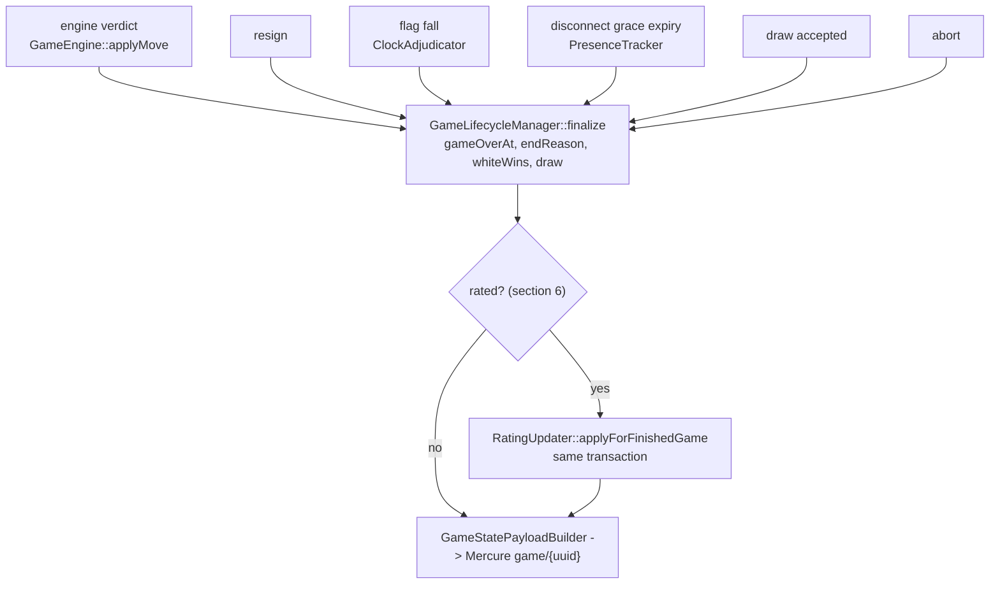

# Rating — Glicko-2

> Elaborates `00-overview.md` D1, D2 and invariants 3 and 4.
> **Owns**: the Glicko-2 mathematics, the rating pools, the rated-game
> predicate, the `user_rating` / `game_player` snapshot, the display rules.
> **Does not own**: entity DDL (`01-domain-model.md`), wire format
> (`02-realtime.md` §4), finalisation triggers (`03-time-control.md` §§5-8),
> seek windows (`04-matchmaking.md` §4), routes (`09-api-reference.md` §3).

---

## 1. Why Glicko-2 and not Elo

Elo carries one number and one hand-tuned constant `K`. Four questions this
platform must answer each need a second number:

| Question | Elo | Consequence |
|---|---|---|
| How far should this result move the rating? | `K*(s - E)`, one global `K` | `K` is a fixed compromise between "converges fast for newcomers" and "is stable for veterans". It cannot be both |
| Is this 1500 trustworthy? | not represented | `04-matchmaking.md` §4 cannot distinguish "1500 over 400 games" from "1500, never played" |
| This player vanished for two years | not represented | The stale number is treated as fresh; everyone who beats them on the way back is over-rewarded |
| When does a player stop being new? | bolted on outside the model | Two systems with a discontinuity where they meet |

The usual Elo patches — a staged `K` table, a provisional-games counter, an
activity decay — are three heuristics approximating one missing quantity: *how
confident are we in this number*. Glicko-2 carries it:

| Symbol | Column | Meaning |
|---|---|---|
| `r` | `user_rating.rating` | The rating, on the familiar 1500-centred scale |
| `RD` | `user_rating.deviation` | Standard deviation of the belief about `r`; a 95% interval is roughly `r +/- 2*RD` |
| `sigma` | `user_rating.volatility` | How erratic this player's results are. Rises when results contradict the rating, falls when they confirm it |

- **Step size is derived, not tuned.** §2.4 scales by `phi'^2`. A newcomer at
  `RD = 350` moves ~35x further per game than a veteran at `RD = 50` (§2.5B,
  measured). No `K` table.
- **Provisional is a state**, `RD > GLICKO_PROVISIONAL_RD` (110), clearing when
  the evidence justifies it — ~10 rated games (§3.3, measured).
- **Inactivity is modelled** (§4), so a returning player's results carry more
  weight automatically.
- **Pairing gets an honest input**: `RD` is what makes a newcomer's
  `Seek.rating_snapshot` something the matcher can reason about.

`sigma` is Glicko-2's addition over Glicko-1 and the only structural defence
here against result manipulation (§10): inconsistent results raise `sigma`,
which inflates `phi*` (§2.4), which enlarges every subsequent update, which
snaps the rating back faster. That alone pays for the solver in §2.3.

**D1, the presentation decision.** The UI renders `round(r)`, plus `?` while
provisional — `1523` or `1523?`. `RD` and `sigma` are **never** rendered: not
as a number, an error bar, an interval, or a tooltip. `RD` is a modelling
internal, meaningful only against a threshold nobody outside this document
knows; exposing it invites players to optimise it, which is futile (§10, last
row). The one bit they need — *is this settled yet* — is the `?`. Rules in §8.

---

## 2. The algorithm

Self-contained. An implementer needs nothing else, including not the paper.

### 2.1 Notation and constants

```
SCALE   = 173.7178      Glicko-2 scale factor
tau     = 0.5           GLICKO_TAU, bounds how fast sigma may move
eps     = 1.0e-6        volatility solver convergence tolerance
maxIter = 100           volatility solver iteration cap (never reached, 2.6)
```

`SCALE` is `400/ln(10) = 173.71779276...` rounded to the published literal.
**Use the literal**, not the derived expression: the difference is `7.2e-6`,
invisible to a player, but pinning it makes §2.5 reproducible against every
other Glicko-2 implementation.

Display scale: `(r, RD, sigma)`. Glicko-2 scale: `(mu, phi, sigma)`; `sigma` is
scale-free. Defaults for a player with no `user_rating` row: `r = 1500`,
`RD = 350`, `sigma = 0.06`. No row is written on read (§5.3).

### 2.2 Steps 2-4: scale conversion, variance, improvement

```
mu    = (r - 1500) / SCALE            mu_j  = (r_j - 1500) / SCALE
phi   = RD / SCALE                    phi_j = RD_j / SCALE

                    1
g(phi_j) = --------------------------
           sqrt(1 + 3*phi_j^2 / pi^2)

                              1
E(mu, mu_j, phi_j) = ---------------------------------
                     1 + exp(-g(phi_j) * (mu - mu_j))

          [  m                                 ]^-1
v      =  [ sum  g(phi_j)^2 * E_j * (1 - E_j)  ]
          [ j=1                                ]

      m
S     = sum  g(phi_j) * (s_j - E_j)            s_j in {0, 0.5, 1}
      j=1

delta = v * S
```

`g` discounts an opponent whose own rating is uncertain. `E_j` is the expected
score. `v` is the variance implied by these games alone; in production `m = 1`,
so `v = 1 / (g^2 * E * (1-E))`, minimised at `E = 0.5`.

**Keep `S`.** It is reused verbatim in §2.4; recomputing it there is a common
source of drift. Opponent values are the opponent's **pre-game,
inflation-adjusted** state (§4), and both players' updates consume the *same*
pre-game snapshot (§2.5B).

### 2.3 Step 5: the volatility solver

The only part with no closed form. With `a = ln(sigma^2)`:

```
           e^x * (delta^2 - phi^2 - v - e^x)     x - a
f(x)  =   ----------------------------------  -  -----
              2 * (phi^2 + v + e^x)^2            tau^2
```

`sigma' = exp(x*/2)` where `x*` is the root. `f` is strictly decreasing in the
region of interest, so a bracketing method converges unconditionally. Glickman
specifies the **Illinois variant of regula falsi**:

```
1.  A  <- a
2.  if delta^2 > phi^2 + v:
        B <- ln(delta^2 - phi^2 - v)
    else:
        k <- 1
        while f(a - k*tau) < 0:  k <- k + 1
        B <- a - k*tau
3.  fA <- f(A) ;  fB <- f(B)
4.  while |B - A| > eps  and  iterations < maxIter:
        C  <- A + (A - B) * fA / (fB - fA)
        fC <- f(C)
        if fC * fB <= 0:   A <- B ;  fA <- fB
        else:              fA <- fA / 2          <-- Illinois correction
        B  <- C ;  fB <- fC
5.  sigma' <- exp(A / 2)
```

- **Both bracket branches are live.** The `ln` branch fires on large upsets
  (fixture C, §2.5); A and B take the `k`-search with `k = 1`.
- **`fC * fB <= 0`, not `< 0`.** The paper writes `< 0`. Folding the exact-zero
  case into the sign-change branch removes a path where `fA` is halved forever
  after landing on the root.
- **The Illinois correction is load-bearing.** Plain regula falsi retains one
  endpoint indefinitely and stalls; halving the retained value restores
  superlinear convergence. Observed across every fixture here: 1-3 iterations.
- **`maxIter` is a tripwire.** On exhaustion, log at `error` with
  `(delta, phi, v, sigma)` and return `sigma` unchanged — a stale volatility
  beats aborting a game finalisation.
- `exp` overflow is unreachable: the `ln` branch bounds `B` by `ln(delta^2)`.

### 2.4 Steps 6-8: drift, update, conversion back

```
phi_star = sqrt(phi^2 + sigma'^2)                  -- one period of drift

                 1
phi'     = ----------------------------            -- precision-weighted
           sqrt( 1/phi_star^2  +  1/v )

mu'      = mu + phi'^2 * S                          -- S from 2.2

r'       = SCALE * mu' + 1500
RD'      = min(SCALE * phi', GLICKO_MAX_RD)         -- assertion, see below
```

`phi'` combines the prior (`1/phi_star^2`) with the evidence (`1/v`), so it is
always smaller than both `phi_star` and `sqrt(v)`. Step 6 is §4's lazy
inflation applied once, which is exactly why §4 is not an approximation. The
`GLICKO_MAX_RD` clamp can never bind after a game (`phi' < phi_star`, and
`phi_star` is bounded by the read-time clamp); keep it as an invariant check.

### 2.5 Worked examples

Assert on the **display scale** with `assertEqualsWithDelta(..., 1.0e-4)`:
`SCALE` is a rounded literal, so exact float equality is not portable. All
values are full double precision.

**A - Glickman's paper** (canonical, multi-opponent). `r = 1500`, `RD = 200`,
`sigma = 0.06`, three opponents in one period.

| j | r_j | RD_j | s_j | mu_j | phi_j | g(phi_j) | E_j |
|---|---|---|---|---|---|---|---|
| 1 | 1400 | 30 | 1 | -0.5756462493 | 0.1726938748 | 0.9954980065 | 0.6394677306 |
| 2 | 1550 | 100 | 0 | 0.2878231246 | 0.5756462493 | 0.9531489779 | 0.4318423561 |
| 3 | 1700 | 300 | 0 | 1.1512924985 | 1.7269387478 | 0.7242354781 | 0.3028407291 |

| Quantity | Value |
|---|---|
| `mu`, `phi` | `0.0000000000`, `1.1512924985` |
| `v`, `S`, `delta` | `1.7789770897`, `-0.2720289450`, `-0.4839332610` |
| `delta^2` vs `phi^2 + v` | `0.2342` vs `3.1044` -> `k`-search, `k = 1` |
| `a = ln(sigma^2)` | `-5.6268214335` |
| initial bracket | `A = -5.6268214335` (`fA = -5.355028e-04`), `B = -6.1268214335` (`fB = +1.999675e+00`) |
| `sigma'` (2 iterations) | `0.0599959843` |
| `phi_star`, `phi'`, `mu'` | `1.1528546896`, `0.8721991882`, `-0.2069409667` |
| **`r'`, `RD'`** | **`1464.0506705393`**, **`151.5165241239`** |

Solver trace, for testing `solveVolatility` in isolation:

| it | `C` | `f(C)` | branch |
|---|---|---|---|
| 1 | `-5.626955295117` | `+1.522830e-08` | `else` -> `fA /= 2` |
| 2 | `-5.626955287504` | `-1.522743e-08` | `fC*fB <= 0` -> `A <- B` |

The paper reports `1464.06 / 151.52 / 0.05999` from 4-decimal intermediates,
agreeing to every digit it prints. Displayed: `1500 -> 1464`, delta `-36`,
still provisional.

**B - one opponent** (the production path, `m = 1`). White is brand new
(`1500/350/0.06`), black established (`1500/50/0.06`), white wins.

| | white (winner) | black (loser) |
|---|---|---|
| `mu`, `phi` | `0.0000000000`, `2.0147618724` | `0.0000000000`, `0.2878231246` |
| `mu_j`, `phi_j` | `0.0000000000`, `0.2878231246` | `0.0000000000`, `2.0147618724` |
| `g(phi_j)`, `E`, `s` | `0.9876424016`, `0.5`, `1.0` | `0.6690694126`, `0.5`, `0.0` |
| `v` | `4.1007239776` | `8.9354749036` |
| `S`, `delta` | `+0.4938212008`, `2.0250244388` | `-0.3345347063`, `-2.9892264725` |
| bracket / iterations | `k`-search `k=1` / 2 | `k`-search `k=1` / 1 |
| `sigma'`, `phi_star` | `0.0599991770`, `2.0156550558` | `0.0600000000`, `0.2940104608` |
| `phi'`, `mu'` | `1.4285844140`, `1.0078166904` | `0.2925985620`, `-0.0286408271` |
| **`r'`, `RD'`** | **`1675.0756982644`**, **`248.1705415141`** | **`1495.0245785290`**, **`50.8295784813`** |
| displayed | `1500? -> 1675?`, `+175` | `1500 -> 1495`, `-5` |

Two things this pins down:

1. **Deltas do not sum to zero.** `+175` against `-5`. Glicko-2 is not
   zero-sum; the confident player is barely moved by a result against an
   unknown. UI copy implying a transfer of points is wrong (§8.3).
2. **Simultaneity is mandatory.** Both columns come from the *same* pre-game
   state. Computing white first and feeding `1675/248` into black's update
   silently corrupts the pool. §9.3 enforces it by taking both snapshots before
   calling the calculator at all.

**C - the other volatility bracket.** `1500/350/0.06` beats `2000/50`. Needed
because A and B never take the `ln` branch.

| Quantity | Value |
|---|---|
| `mu`, `phi` | `0.0000000000`, `2.0147618724` |
| `mu_j`, `phi_j`, `g`, `E` | `2.8782312463`, `0.2878231246`, `0.9876424016`, `0.0550618061` |
| `v`, `S`, `delta` | `19.7036502643`, `0.9332610272`, `18.3886488849` |
| `delta^2` vs `phi^2 + v` | `338.1424078119` vs `23.7629156669` -> **`ln` branch** |
| initial bracket | `A = -5.6268214335` (`fA = +1.001822e-03`), `B = +5.7506008299` (`fB = -4.550969e+01`) |
| `sigma'` (3 iterations) | `0.0600075160` |
| `phi_star`, `phi'`, `mu'` | `2.0156553040`, `1.8352990704`, `3.1435242823` |
| **`r'`, `RD'`** | **`2046.0861225696`**, **`318.8241168590`** |

The signs of `fA`/`fB` are reversed relative to A: the solver must not assume a
fixed orientation. One lucky win puts a new account at a displayed `2046?` —
correct Bayesian behaviour at `RD = 350`, and precisely why the leaderboard
filters on `RD` (§8.4) instead of trusting the number.

### 2.6 Numerical hazards

| Hazard | Reality | Handling |
|---|---|---|
| `E` reaching exactly 0 or 1 | Needs a ~6400-point gap | Unreachable, no guard |
| Solver non-convergence | 1-3 iterations everywhere | `maxIter = 100`, log + keep `sigma` |
| `float` vs arbitrary precision | Display resolution is 1 point; doubles carry ~15 digits | Plain `float`, no `bcmath` |
| Drift from stored rounded values | Never happens | `user_rating` stores doubles; `game_player` ints are never read back into the calculator (§7.1) |

---

## 3. Per-game updates instead of rating periods

### 3.1 The approximation and why

Glicko-2 is defined over **rating periods**: collect a player's games for the
period, update once with `m` opponents. Glickman sizes the period for 10-15
games per player. This system updates **immediately, once per game, `m = 1`** —
each game is its own period. That is an approximation, and it is the one
lichess makes. The reasons are structural:

- **No scheduler exists.** `00-overview.md` §3.6 confirms it, and D7 forbids
  adding a container to get one.
- **Correspondence runs for days.** A weekly batch would leave a result unrated
  for up to a week after it concluded.
- **The result screen needs a delta.** `GameStatePayload.rating` is populated at
  finalisation (`02-realtime.md` §4); deferring it breaks that contract.

### 3.2 What it costs, measured

Batched (one period, `m = n`) versus sequential (`n` periods, `m = 1`), same
games, same order:

| Scenario | Batched `r / RD` | Per-game `r / RD` | `dr` | `dRD` |
|---|---|---|---|---|
| Newcomer `1500/350`, 5W-5L alternating vs `1500/50` | `1500.00 / 106.02` | `1496.51 / 109.15` | `-3.49` | `+3.12` |
| Newcomer `1500/350`, 10 straight wins vs `1500/50` | `1819.53 / 106.02` | `1906.65 / 140.29` | `+87.12` | `+34.27` |
| Established `1600/60`, 10W-10L vs `1600/60` | `1600.00 / 48.25` | `1597.68 / 60.19` | `-2.32` | `+11.94` |

Two systematic biases:

1. **Streak overshoot.** Each win raises the rating from which the next win is
   evaluated. Balanced results cancel to a few points; streaks overshoot.
   Bounded by `RD`, so the exposure sits where it matters least — on a
   provisional player, whose number carries a `?` anyway.
2. **`RD` is biased upward.** Step 6 applies once per *game* instead of once
   per *period*, so a period of `n` games inflates by `n*sigma^2` instead of
   `sigma^2`. **[INFERENCE]** In `RD` terms this equals batched periods with
   `sigma_eff = sigma * sqrt(n)`.

Bias 2 errs toward *less* confidence — the safe direction: pairing windows stay
slightly wide and the `?` clears slightly late. Do **not** compensate by
lowering `GLICKO_DEFAULT_VOLATILITY`; `sigma` is also the inactivity engine
(§4), and shrinking it breaks that for no visible gain.

### 3.3 The `RD` floor nobody expects

Consequence of bias 2 that will otherwise be reported as a bug: `RD` does not
decay toward zero. Setting `phi' = phi` in §2.4:

```
1/phi^2 = 1/(phi^2 + sigma^2) + 1/v

  =>  phi^4 + sigma^2*phi^2 - v*sigma^2 = 0

                 -sigma^2 + sqrt(sigma^4 + 4*v*sigma^2)
  =>  phi^2  =  ----------------------------------------
                                  2
```

Floor in display units:

| `v` | `sigma=0.04` | `0.06` | `0.09` | `0.12` |
|---|---|---|---|---|
| 3.0 | 45.5 | 55.5 | 67.7 | 77.8 |
| 4.0 | 48.9 | 59.7 | 72.9 | 83.8 |
| 5.0 | 51.7 | 63.2 | 77.2 | 88.8 |
| 8.0 | 58.2 | 71.2 | 87.0 | 100.1 |

At the defaults the floor is ~`RD = 60`, comfortably under
`GLICKO_PROVISIONAL_RD = 110`, so the `?` still clears. Measured descent from
`1500/350` at a 50% score against `RD = 60` opposition:

| after game | 1 | 2 | 4 | 6 | 8 | **10** | 13 |
|---|---|---|---|---|---|---|---|
| `RD` | 248.83 | 211.11 | 162.64 | 137.09 | 120.93 | **109.65** | 97.85 |

**10 rated games clears provisional.** That number belongs in onboarding copy.
The floor is a feature — a rating that cannot freeze keeps tracking genuine
strength change — and is documented so nobody "fixes" it.

### 3.4 Exactly when the update runs

Invariant 4: ratings change **exactly once** per rated game, at the transition
to `gameOverAt IS NOT NULL`.

- **One call site.** `RatingUpdater::applyForFinishedGame(Game $game)`, invoked
  from `GameLifecycleManager` and nowhere else.
- **Same transaction** as the `gameOverAt` write. No window exists in which a
  game is finished but unrated, so no reconciliation job is needed.
- **Idempotent.** Guard: `GamePlayer.ratingAfter IS NOT NULL` on either row
  means it already ran. This composes with invariant 7 — three clock triggers
  funnelling into one method cannot double-rate.
- **Write-once upstream.** Invariant 5 makes `gameOverAt` write-once, so the
  transition happens at most once by construction.

Today the finalisation write is scattered: `src/Engine/GameEngine.php:55-59`
sets the three fields, and `src/Action/ResignGameAction.php:44-46` sets them
again inline with `setWhiteWins(!$game->isWhite())`, which stops compiling the
moment `isWhite` is removed in P0.2. Consolidation is a prerequisite.

### 3.5 The six end paths



| End path | `GameEndReason` | Current trigger | New home |
|---|---|---|---|
| Engine verdict | `ENGINE` | `src/Engine/GameEngine.php:55-59` | Stays; delegates the write |
| Resignation | `RESIGNATION` | `src/Action/ResignGameAction.php:44-46` | `GameLifecycleManager::resign()` |
| Timeout | `TIMEOUT` | none | `ClockAdjudicator`, `03-time-control.md` §5 |
| Abandonment | `ABANDONMENT` | none | `PresenceTracker`, `03-time-control.md` §7 |
| Draw agreed | `DRAW_AGREED` | none | `GameLifecycleManager::acceptDraw()` |
| Abort | `ABORTED` | none | `GameLifecycleManager::abort()` — never rated |

**The rating write never dirties `Game`.** It touches `game_player` and
`user_rating` only. Pre-P0.7 that is load-bearing: `GameEngine::applyMove()`
has two mutually exclusive lock paths (`src/Engine/GameEngine.php:66-76`) and
the non-game-over one requires `Game` to stay clean (landmine 3); a rating
update only ever happens on the game-over path, where `Game` is dirty anyway.
Post-P0.7 the hand-rolled branch is deleted for a
`LockMode::PESSIMISTIC_WRITE` on the `game` row (`03-time-control.md` §6), and
the discipline survives with a different justification: staying off `game`
keeps `applyForFinishedGame` a pure *suffix* of the global lock order (§5.3).

---

## 4. Lazy RD inflation

### 4.1 The rule, and why it is exact

```
phi_inflated = min( sqrt(phi^2 + sigma^2 * t),  GLICKO_MAX_RD / SCALE )
t            = max(0, (now - lastRatedAt) / (GLICKO_RATING_PERIOD_DAYS * 86400))
```

`t` is fractional; `GLICKO_MAX_RD / SCALE = 2.0147618724`. Multiplying through
by `SCALE` gives the display-scale form used by the SQL in §8.4:

```
RD_inflated = min( sqrt(RD^2 + (SCALE * sigma)^2 * t),  GLICKO_MAX_RD )
```

`lastRatedAt IS NULL` yields `t = 0`; a `now` earlier than `lastRatedAt` (clock
skew) clamps to `t = 0`.

Glicko-2's rule for a player with **no games** in a period is step 6 alone:
`phi_new = sqrt(phi^2 + sigma^2)`, with `mu` and `sigma` unchanged — steps 3-5
and 7 have no opponents to consume. Composing it `t` times:

```
phi_1^2 = phi_0^2 + sigma^2
phi_2^2 = phi_1^2 + sigma^2 = phi_0^2 + 2*sigma^2
...
phi_t^2 = phi_0^2 + t*sigma^2
```

The closed form is **exact**, not asymptotic, because nothing else changes
during an empty period. Fractional `t` is a continuous extension of a relation
already linear in `t`, and is better behaved than integer truncation: no
discontinuity at period boundaries, so a player's `?` does not blink on at
midnight on the seventh day. That is the whole defence — there is no accuracy
argument for a sweep because there is no accuracy difference.

### 4.2 Why lazy and not a periodic sweep

| | Lazy (chosen) | Weekly sweep (rejected) |
|---|---|---|
| Correctness | Exact (§4.1) | Exact |
| Infrastructure | None | A scheduler: cron container or Symfony Scheduler + worker. Neither exists (`00-overview.md` §3.6); D7 forbids the container |
| Cost | `O(rows actually read)` | `O(every user_rating row)` per period, forever, mostly for dormant accounts |
| Write amplification | Zero | One `UPDATE` per row per period, plus WAL, plus lock contention with live games |
| Failure mode | None; the formula is total | A missed run silently under-inflates everything until someone notices |

A sweep buys only that the *stored* `deviation` is current, and nothing depends
on that: `(deviation, volatility, last_rated_at)` fully determines the inflated
value at any instant, and the one query that filters on it expresses the
formula in SQL (§8.4).

### 4.3 Where it is applied

| Consumer | Why inflation is required |
|---|---|
| `RatingUpdater::currentRating()` — sole source of `Seek.rating_snapshot`, taken server-side at seek creation (`04-matchmaking.md` §4) | The pairing window must reflect real uncertainty, or a two-year-dormant `1800/50` is paired as if fresh |
| `RatingUpdater::applyForFinishedGame()` — both players, before the calculator | Skipping it under-weights a returning player's first game, the exact Elo defect Glicko-2 exists to fix |
| The `?` marker (§8.1) | Provisional status must agree with what pairing believes, or `1800` with no `?` appears beside a seek the matcher treats as `RD = 133` |

Inflation never moves the displayed integer: only `phi` changes, never `mu`.
**Every `Rating` leaving `RatingUpdater` is already inflated to the requested
instant** — that is the §9 contract, and `Rating::isProvisional()` is only
meaningful on such a value.

**`UNLIMITED` has no pool, so there is no rating to inflate.**
`currentRating()` takes a **non-nullable** `SpeedCategory` on purpose: `null`
would mean "there is no pool here", a different fact from "unrated in this
pool" (§8.2) even though both surface 1500, and collapsing them lets a
placeholder leak into a display as a real rating. `04-matchmaking.md` §4
therefore writes `MultiplayerLimits::GLICKO_DEFAULT_RATING` into
`Seek.rating_snapshot` literally for `UNLIMITED` seeks — at the call site the
constant reads as the placeholder it is — and forces `auto_widen = false` with
`rating_min`/`rating_max` `NULL`, so the window is inert.

### 4.4 How slow is it, really

`SCALE * 0.06 = 10.4230680`, so `RD^2` grows by `108.64` per period.

| `RD` at last rated game | 7d | 30d | 90d | 1y | 3y | 10y |
|---|---|---|---|---|---|---|
| 45 | 46.19 | 49.91 | 58.50 | 87.69 | 137.91 | 242.23 |
| 60 | 60.90 | 63.76 | 70.69 | 96.25 | 143.51 | 245.46 |
| 110 | 110.49 | 112.10 | 116.18 | 133.28 | 170.57 | 262.20 |
| 250 | 250.22 | 250.93 | 252.78 | 261.08 | 281.95 | 345.18 |

Reaching `GLICKO_MAX_RD` from `RD = 60` takes 1094 periods, ~21 years: **the
clamp is a safety rail, not a mechanism.** More usefully, falling back to
provisional from `RD = 60` needs `(110^2 - 60^2)/108.64 = 78.24` periods —
**547 days, ~18 months.** That decides §8.4: inflation alone is far too slow to
retire a dormant player from a leaderboard.

### 4.5 The method

```php
namespace App\Service\Rating;

/**
 * Applies elapsed-inactivity deviation growth. Pure: no persistence, no clock
 * service, no side effects. Returns $rating unchanged when lastRatedAt is null
 * or $at precedes it.
 */
public function inflate(Rating $rating, \DateTimeImmutable $at): Rating;
```

`$at` is a parameter, never a `ClockInterface` field. That keeps
`Glicko2Calculator` stateless and safe under FrankenPHP worker mode with no
`kernel.reset` tag (`00-overview.md` §6, landmine 6), and makes §9.4
deterministic without a clock mock.

---

## 5. Pools

### 5.1 Categories, derivation, boundaries

D2 gives one rating per speed category per user; `UNIQUE(user_id, category)` on
`user_rating` is its physical expression.

```
estimated = initialSeconds + 40 * incrementSeconds
```

| `TimeControlKind` | `SpeedCategory` |
|---|---|
| `UNLIMITED` | `null` — no pool, **never rated** (§6 clause 2) |
| `REALTIME` | banded on `estimated`, below |
| `CORRESPONDENCE` | `CORRESPONDENCE` (4), regardless of days per move |

Bands are half-open (lower inclusive, upper exclusive):

| `estimated` | Category | Value | Boundary cases |
|---|---|---|---|
| `0 .. 179` | `BULLET` | 0 | `2+1` = 160, `0+2` = 80 |
| `180 .. 479` | `BLITZ` | 1 | `3+0` = 180 is the first blitz, `5+3` = 420 |
| `480 .. 1499` | `RAPID` | 2 | `8+0` = 480 is the first rapid, `10+5` = 800 |
| `>= 1500` | `CLASSICAL` | 3 | `25+0` = 1500 and `15+15` = 1500 are the first classical |

`3+0` is blitz not bullet; `8+0` is rapid not blitz; `15+15` is classical while
`15+10` is rapid. Those are the cases a test must pin.

The `40` assumes 40 moves per side, so a player collects 40 increments. It is
inherited from chess convention, not measured on Keres — see Open questions.

Classification is a pure static declared in `01-domain-model.md`:

```php
public static function fromTimeControl(
    TimeControlKind $kind, ?int $initialSeconds, ?int $incrementSeconds,
): ?self;
```

`Game.speed_category` is written **once** by `GameFactory` at creation and
never recomputed: if the boundaries are re-tuned, in-flight games must still
settle into the pool they were advertised in.

### 5.2 The presets, classified

| Preset | initial | increment | `estimated` | Category |
|---|---|---|---|---|
| 1+0 | 60 | 0 | 60 | `BULLET` |
| 3+2 | 180 | 2 | 260 | `BLITZ` |
| 5+0 | 300 | 0 | 300 | `BLITZ` |
| 10+0 | 600 | 0 | 600 | `RAPID` |
| 15+10 | 900 | 10 | 1300 | `RAPID` |
| 1 / 3 / 7 days | — | — | — | `CORRESPONDENCE` |

The five real-time presets occupy **three** pools. `CLASSICAL` is reachable
only via a custom seek or challenge, so its leaderboard will be empty for a
long time — an empty state, not an error (§8.4).

### 5.3 Lazy row creation and the lock order

A `user_rating` row is created on the **first rated game in that category**.
Eager creation would write five rows per account including the majority that
never play rated, and make `games_played = 0` rows indistinguishable from real
ones in every aggregate.

**Reads never insert.** `RatingUpdater::currentRating()` returns a transient
`Rating::initial()` = `(1500.0, 350.0, 0.06, gamesPlayed: 0, lastRatedAt: null)`
when the row is absent. Reads are triggered by seek creation, profile rendering
and lobby listing — all high volume.

Write path, per player, inside the finalisation transaction:

```sql
-- 1. materialise the row if absent; never overwrites an existing one
INSERT INTO user_rating (user_id, category, rating, deviation, volatility,
                         games_played, last_rated_at)
VALUES (:userId, :category, 1500, 350, 0.06, 0, NULL)
ON CONFLICT ON CONSTRAINT uniq_user_rating_user_category DO NOTHING;

-- 2. take the row lock; see the global order below
SELECT rating, deviation, volatility, games_played, last_rated_at
  FROM user_rating
 WHERE user_id = :userId AND category = :category
   FOR UPDATE;

-- 3. compute (section 2), then
UPDATE user_rating
   SET rating = :r, deviation = :rd, volatility = :sigma,
       games_played = games_played + 1, last_rated_at = :now
 WHERE user_id = :userId AND category = :category;
```

`rating`/`deviation`/`volatility` are `DOUBLE PRECISION`. Rounding to integers
happens exactly once, at `game_player` write time (§7.1).

**Global lock order.** `03-time-control.md` §6 fixes one acquisition order for
the whole application:

```
game  ->  game_player (colour ASC)  ->  user_rating (user_id ASC)
```

`applyForFinishedGame` runs inside a transaction that already holds the `game`
row, so its acquisitions are a strict suffix. Keeping to it makes `40P01`
unreachable.

### 5.4 The simultaneous-finish race

Two games involving the same user in the same category finishing at once; both
transactions reach step 1 with no row present.

- **Insert race** — resolved by `uniq_user_rating_user_category` plus
  `ON CONFLICT DO NOTHING`. Exactly one insert wins, the loser proceeds. A bare
  `INSERT` would raise `UniqueConstraintViolationException` and roll back a
  finalisation.
- **Lost update** — resolved by the `FOR UPDATE` in step 2, *not* by the
  upsert. A blind `ON CONFLICT DO UPDATE SET rating = EXCLUDED.rating` lets the
  second transaction overwrite the first with a value computed from the
  pre-first state. With the row lock, transaction 2 blocks, then reads
  transaction 1's post-image and applies its own game on top — exactly the
  sequential per-game semantics §3 already accepts.
- **Deadlock** — two games between the *same pair* finishing concurrently could
  take the two locks in opposite orders. Always acquire **ordered by `user_id`
  ascending**, the suffix of the global order above; §9.3 sorts the two
  `GamePlayer` rows before touching anything.
- **`SERIALIZABLE`** — only the engine-verdict path runs at `SERIALIZABLE`
  (`src/Engine/GameEngine.php:45`). There a concurrent update to a locked row
  surfaces as `40001`, which `SubmitMoveAction` already maps to HTTP 409
  `concurrent_move` via its `RetryableException` catch
  (`src/Action/SubmitMoveAction.php:85-92`). The whole transaction rolls back
  including the move, so the client's retry is safe. The other five paths run
  at the default isolation and simply block.

---

## 6. When a game is rated

### 6.1 The predicate

Invariant 3, made executable. Evaluated once, at finalisation. It is
**never short-circuited on `Game.rated` alone** — all six conjuncts are
re-evaluated from scratch, which is what lets `05-social.md` §7 have a rematch
inherit `rated` verbatim from the finished game.

```
isRated(game) :=
      game.rated = true                                        -- (1)
  AND game.timeControlKind != TimeControlKind::UNLIMITED        -- (2)
  AND white.user !== null AND black.user !== null               -- (3a)
  AND white.user.id != black.user.id                            -- (3b)
  AND min(whitePlies, blackPlies) >= RATED_MIN_PLIES            -- (4)
  AND game.endReason NOT IN (NONE, ABORTED)                     -- (5)

where  n          = game.gameMoves.count()
       whitePlies = ceil(n / 2)
       blackPlies = floor(n / 2)
```

With `RATED_MIN_PLIES = 2`, clause 4 reduces to `n >= 4`.

| # | Why it is there |
|---|---|
| 1 | **Consent.** `Game.rated` is copied from the originating `Seek`/`Challenge` by `GameFactory` and immutable after. Someone who accepted a casual challenge must never find their rating moved. It also makes rated-ness unreachable by accident: `NewGameAction`, AI and hot-seat games are `rated = false` by construction |
| 2 | `UNLIMITED` yields `speedCategory = null`, so there is no pool to write to. Independently: with no clock there is no abandonment pressure, so a losing player can simply never move, and a result that can be withheld indefinitely is an exploit |
| 3a | `GamePlayer.user IS NULL` means the engine (invariant 2). Engine strength is not modelled and would need its own rating entity; out of scope |
| 3b | Hot-seat is two `GamePlayer` rows pointing at the *same* user (`00-overview.md` §4.1 — the unique constraint is on `(game_id, color_value)` precisely to allow it). Without 3b a user could rate games against themselves |
| 4 | A game where one side made 0 or 1 moves carries no information and is the abuse surface for "accept, read the opponent's rating, disconnect". Shared with the abort window and the draw-offer guard through one helper, `Game::hasReachedRatedPlyFloor()`: `03-time-control.md` §7 makes a game abortable **iff** that helper returns false, so the abort window is the exact negation of this clause |
| 5 | `NONE` means not finished. **`ABORTED` is a strict subset of unrated, not a synonym for it**: a first-move-clamp expiry at ply 0-1 finalises `ABORTED`, but a `TIMEOUT` at ply 2 or 3 has a real winner and a real `endReason` and is still unrated on clause 4. That is why 4 and 5 are independent conjuncts rather than one check on `endReason` |

### 6.2 Outcome table

| `GameEndReason` | Rated? | White | Black | Writes / notes |
|---|---|---|---|---|
| `NONE` (0) | no | — | — | Not finished |
| `ENGINE` (1) | yes | from `whiteWins`/`draw` | complement | The engine's verdict, `src/Engine/GameEngine.php:55-59` |
| `RESIGNATION` (2) | yes | resigner `0.0` | opponent `1.0` | Never a draw |
| `TIMEOUT` (3) | yes | flagged `0.0` | opponent `1.0` | `03-time-control.md` §5 writes `whiteWins = (flaggedColor === BLACK)`, `draw = false` |
| `ABANDONMENT` (4) | yes | abandoner `0.0` | opponent `1.0` | Identical writes to `TIMEOUT` |
| `DRAW_AGREED` (5) | yes | `0.5` | `0.5` | `05-social.md` §7 writes `draw = true`, `whiteWins = false` |
| `ABORTED` (6) | **no** | — | — | Writes `whiteWins = false`, `draw = false`. No result, no rating change |

**The rating layer reads only `Game.whiteWins` and `Game.draw`:**

```
s_white = game.draw ? 0.5 : (game.whiteWins ? 1.0 : 0.0)
s_black = 1.0 - s_white
```

`src/Entity/Game.php:41-45` declares both as non-nullable booleans defaulting
to `false`. **Every finalisation path must write both, and a miss fails
silently.** There is no null to trip over: an unwritten pair reads as
`draw = false, whiteWins = false`, which is a perfectly well-formed *black
win*. A draw path that forgets `draw = true`, or a white-win path that forgets
`whiteWins = true`, throws nothing — it credits the wrong player and moves two
ratings the wrong way, permanently, because invariant 5 makes the result
write-once and §7.3 makes the snapshot unrecomputable.

The failure is **directional**: every omission resolves to `s_white = 0.0`, so
the bug is a systematic black-win bias rather than random noise. That is also
the detection hook — `AdminStatsRepository::getOutcomeDistribution()`
(`src/Repository/AdminStatsRepository.php:49-65`, rewritten per §7.2) surfaces
it as a skew long before a player reports it.

The structural fix, not merely a warning: `GameLifecycleManager::finalize()`
(§3.5) takes the outcome as an explicit parameter and is the **only** writer of
`whiteWins`/`draw`, deriving both booleans itself. No caller can forget a write
it does not perform. `05-social.md` §7.5 carries the hazard for the draw path;
`03-time-control.md` §§4-8 owns resignation, timeout, abandonment and abort,
which have the identical shape.

**Those two boolean writes are the entire interface between the finalisation
layer and the rating layer.** `endReason` participates in the predicate and
nothing else, keeping the rating layer free of any branch on how a game ended —
the same gameplay-agnostic discipline `00-overview.md` §1 imposes everywhere.

**Timeout caveat.** "Flag falls but the opponent cannot mate with the remaining
material, so it is a draw" is *game-rules knowledge*, forbidden in PHP by
`00-overview.md` §1. A timeout is a full win, full stop. `03-time-control.md`
§5 owns that; the rating layer inherits it without comment.

### 6.3 Recording the predicate's outcome

No extra column: `GamePlayer.ratingAfter IS NOT NULL` **is** the record, and
doubles as the idempotence guard (§3.4). A rated game where the rating happened
not to move (fixture F4, §9.4) still writes `ratingAfter = ratingBefore`.

---

## 7. Storage and auditability

### 7.1 The snapshot

Four columns per `GamePlayer` row, nullable, written exactly once. `NULL` in
all four means the game was not rated (§6.3).

| Column | Type | Content |
|---|---|---|
| `rating_before` | `int` | `round(r)` before the game, **after** inflation (§4) |
| `rating_deviation_before` | `int` | `round(RD)` before the game, after inflation |
| `rating_after` | `int` | `round(r')` after the game |
| `provisional_before` | `bool` | `RD_inflated > GLICKO_PROVISIONAL_RD` before the game |

They are **integers** — the display-rounded values — because their purpose is
display and audit, not recomputation; the authoritative doubles live in
`user_rating`. The consequence is explicit and accepted: **`game_player` cannot
be replayed to reconstruct the rating stream.** It can only be charted.

### 7.2 Reconstructing a rating history graph

```sql
SELECT g.game_over_at                      AS at,
       g.uuid                              AS game_uuid,
       gp.rating_before                    AS before,
       gp.rating_after                     AS rating,
       gp.rating_after - gp.rating_before  AS delta,
       gp.provisional_before               AS was_provisional
  FROM game_player gp
  JOIN game g ON g.id = gp.game_id
 WHERE gp.user_id = :userId
   AND g.speed_category = :category
   AND gp.rating_after IS NOT NULL
   AND g.deleted_at IS NULL
 ORDER BY g.game_over_at ASC;
```

- `INDEX(user_id, game_id)` on `game_player` serves the lookup; the join to
  `game` is by primary key.
- `g.deleted_at IS NULL` is written out: no Doctrine SQLFilter is registered
  (`00-overview.md` §6), and `GameRepository::findByUuid()`
  (`src/Repository/GameRepository.php:23-30`) is the existing bug proving how
  easy it is to omit.
- The graph's leading point is the earliest row's `rating_before`.
- Paginate with `pagerfanta/pagerfanta` (`00-overview.md` §6). Backs
  `GET /@/{username}` and `GET /@/{username}/games` (`09-api-reference.md` §3).

This also replaces the existing per-user aggregates.
`AdminStatsRepository::getUserStats()`
(`src/Repository/AdminStatsRepository.php:133-159`) and `getOutcomeDistribution()`
(`:49-65`) both resolve win/lose/draw from `g.isWhite` and `g.owner`, columns
P0.2 removes. The `game_player` join above is their replacement shape: `gp.colorValue`
supplies the perspective `g.isWhite` used to, for both players rather than only
the owner.

### 7.3 Why the snapshot is stored, not recomputed

1. **Recomputation is not local.** Each update consumes the opponent's
   *then-current* `(r, RD, sigma)`, which depends on the opponent's entire
   history, which depends on *their* opponents. Recovering one player's history
   means replaying every rated game in global chronological order —
   `O(all rated games)` for one profile page.
2. **The constants are tunable.** Re-tuning `GLICKO_TAU`, the pool boundaries or
   `GLICKO_PROVISIONAL_RD` would retroactively rewrite what players were told.
   The snapshot is the record of what was shown and must not move.
3. **Soft deletes would silently rewrite history**: a game hidden via
   `deleted_at` drops out of a replay and shifts every later point.
4. **The cost is trivial** — four small columns on two rows per game.

---

## 8. Display rules

### 8.1 Rounding and the `?` marker

`(int) round($rating)`. PHP's `round()` is half-away-from-zero and ratings are
positive, so this is half-up. Round **only at the display boundary**:
`user_rating` keeps doubles and a rounded value is never fed back into
`Glicko2Calculator`. The `game_player` columns are rounded because they *are*
display artefacts (§7.1).

`?` is rendered iff `RD_inflated > GLICKO_PROVISIONAL_RD` — strictly greater,
so exactly 110 is established — with `RD_inflated` the §4 value at render time,
never the raw stored column.

| Rule | Value |
|---|---|
| Format | `1523?` — suffixed, no space, same colour and weight as the number |
| Tooltip | "Provisional - this rating is still settling." No number, no RD |
| Never rendered | `RD`, `sigma`, `games_played` as a confidence proxy, any interval |
| Where | Everywhere `02-realtime.md` §4's shared `PlayerRef {uuid, username, rating, provisional}` appears: profile, seek list, challenge cards, game header, post-game result |

`PlayerRef.rating` is `Rating::display()` and `PlayerRef.provisional` is
`Rating::isProvisional()`, both on the **inflated** value (§4.3). The wire
never carries `deviation` or `volatility`, so `provisional` is the only channel
through which `RD` reaches a client at all — D1 as a wire contract.

### 8.2 What a brand-new player sees

`1500?` in all five pools, with no `user_rating` row anywhere. A player who has
never played rated in a pool is indistinguishable from one who has played zero
rated games there — correct, they are the same state, and a missing row is not
an error. Profile pages list all five pools; a pool with `gamesPlayed = 0`
renders the `1500?` muted with the label "unrated", so "default" and "measured,
still settling" are legible apart without exposing `RD`.

### 8.3 The post-game delta

`GameStatePayload.rating` (`02-realtime.md` §4) is `null` until the game is
finished **and** was rated, then built directly from the four `game_player`
columns:

```json
"rating": {
  "white": {"before": 1500, "after": 1675, "delta": 175},
  "black": {"before": 1500, "after": 1495, "delta": -5}
}
```

(Fixture B, §2.5.) `delta` is `after - before` on the **already-rounded
integers**, never rounded independently — otherwise `+7.6` and `-7.6` would
render as `+8 / -8` while the displayed endpoints moved by 7. Storing rounded
integers is what makes this consistent by construction.

**The deltas do not sum to zero.** Copy must not say "you took N points from
your opponent"; say `+175` and nothing else.

`GameStatePayloadBuilder` emits `rating` unconditionally as a key with `null`
as the value, so the TypeScript type is `RatingDelta | null`, never an optional
property — per `02-realtime.md` §4's rule that fields are always present.

### 8.4 The leaderboard filter

`GET /leaderboard/{category}` (`09-api-reference.md` §3; `category` is the
lowercased `SpeedCategory` name, `bullet|blitz|rapid|classical|correspondence`,
never the int, with `?page=` driving pagerfanta) must not be topped by a
provisional account that won one upset — fixture C produces a displayed `2046?`
from a single game.

```sql
SELECT u.username, ur.rating, ur.games_played
  FROM user_rating ur
  JOIN "user" u ON u.id = ur.user_id
 WHERE ur.category = :category
   AND ur.games_played >= :minGames                    -- 20, see Open questions
   AND ur.last_rated_at > now() - interval '90 days'   -- recency
   AND LEAST(
         sqrt( ur.deviation * ur.deviation
             + power(173.7178 * ur.volatility, 2)
               * GREATEST(0, EXTRACT(EPOCH FROM (now() - ur.last_rated_at))
                             / (7 * 86400.0)) ),
         350.0
       ) <= 110.0                                      -- GLICKO_PROVISIONAL_RD
 ORDER BY ur.rating DESC
 LIMIT :limit OFFSET :offset;
```

| Predicate | What it stops | Why the others miss it |
|---|---|---|
| `games_played >= 20` | A lucky short run | `RD` drops under 110 after ~10 games (§3.3), so the `RD` filter alone admits 10-game accounts |
| `last_rated_at > now() - 90 days` | A dormant account squatting the top | `RD` inflation would take ~18 months from `RD = 60` (§4.4) — far too slow to be the mechanism |
| inflated `RD <= 110` | An erratic or long-dormant player whose number is untrustworthy | Independent of both; a 200-game player returning after two years is caught here and nowhere else |

`01-domain-model.md` declares
`idx_user_rating_leaderboard ON user_rating (category, rating DESC) WHERE games_played > 0`.
Its partial predicate is a superset of `games_played >= 20`, so the index
serves the equality and the `ORDER BY`; recency and `RD` are **residual
filters** applied as rows come off the index scan. That is deliberate — the
`RD` expression is a function of `now()`, so it is not immutable and **cannot**
become an expression index.

The `?` never appears on the leaderboard: by construction nothing provisional
is on it, and `RD` is a filter that is never emitted. `LOWER(username)` carries
the unique index (`00-overview.md` §4.4) but the display value is the
case-preserving `username`; `"user"` is quoted because the entity maps to
`` `user` `` (`src/Entity/User.php:18`), a PostgreSQL reserved word.

A pool with no qualifying rows renders "no rated games yet" at 200 — an empty
state, **not** a 404. `CLASSICAL` will legitimately be empty for a long time
(§5.2).

---

## 9. `Glicko2Calculator` API

### 9.1 Value objects

`src/Model/` is the home for Doctrine-free VOs (AGENTS.md), subdirectories are
already conventional there (`src/Model/Admin/UserListRow.php`), and the house
style is `readonly class` with promoted public properties
(`src/Model/BoardMovesData.php:7-13`, `src/Model/BoardData.php:21-42`).

```php
<?php

declare(strict_types=1);

namespace App\Model\Glicko;

use App\Model\MultiplayerLimits;

/**
 * Immutable Glicko-2 state on the display scale. Every instance returned by
 * RatingUpdater is already inflated (06-rating.md section 4.3).
 */
final readonly class Rating
{
    public function __construct(
        public float $rating = MultiplayerLimits::GLICKO_DEFAULT_RATING,
        public float $deviation = MultiplayerLimits::GLICKO_DEFAULT_RD,
        public float $volatility = MultiplayerLimits::GLICKO_DEFAULT_VOLATILITY,
        public int $gamesPlayed = 0,
        public ?\DateTimeImmutable $lastRatedAt = null,
    ) {
    }

    public static function initial(): self
    {
        return new self();
    }

    public function display(): int
    {
        return (int) round($this->rating);
    }

    /** Only meaningful on an inflated instance. */
    public function isProvisional(): bool
    {
        return $this->deviation > MultiplayerLimits::GLICKO_PROVISIONAL_RD;
    }
}

/** One finished game from one player's point of view. */
final readonly class GameOutcome
{
    public const float WIN = 1.0;
    public const float DRAW = 0.5;
    public const float LOSS = 0.0;

    /**
     * @param Rating $opponent pre-game, already inflated
     * @param float  $score    WIN | DRAW | LOSS
     */
    public function __construct(public Rating $opponent, public float $score)
    {
    }
}

final readonly class RatingChange
{
    public function __construct(public Rating $before, public Rating $after)
    {
    }

    /** Exactly what the UI shows; see section 8.3. */
    public function delta(): int
    {
        return $this->after->display() - $this->before->display();
    }
}
```

### 9.2 The calculator

```php
namespace App\Service\Rating;

use App\Model\Glicko\{GameOutcome, Rating, RatingChange};

/**
 * Pure Glicko-2. No Doctrine, no repositories, no clock, no configuration
 * beyond MultiplayerLimits. Stateless and readonly, therefore safe under
 * FrankenPHP worker mode without a kernel.reset tag.
 */
final readonly class Glicko2Calculator
{
    public const float SCALE = 173.7178;

    private const float CONVERGENCE_EPSILON = 1.0e-6;
    private const int MAX_ITERATIONS = 100;

    /** Section 4. Identity when lastRatedAt is null or $at precedes it. */
    public function inflate(Rating $rating, \DateTimeImmutable $at): Rating;

    /**
     * Full update, sections 2.2 - 2.4. $current MUST already be inflated to
     * $at, and every GameOutcome::$opponent MUST be the opponent's pre-game
     * inflated rating.
     *
     * @param non-empty-list<GameOutcome> $outcomes
     */
    public function rate(Rating $current, array $outcomes, \DateTimeImmutable $at): RatingChange;

    /** The production path: exactly one opponent. */
    public function rateSingle(
        Rating $current, Rating $opponent, float $score, \DateTimeImmutable $at,
    ): RatingChange;

    private function g(float $phi): float;
    private function expectedScore(float $mu, float $muJ, float $phiJ): float;
    private function solveVolatility(float $delta, float $phi, float $v, float $sigma): float;
}
```

`rate()` returns a `RatingChange` whose `after` carries
`gamesPlayed = before.gamesPlayed + count($outcomes)` and `lastRatedAt = $at`,
so `RatingUpdater` copies fields instead of recomputing them.

### 9.3 `RatingUpdater` — the Doctrine side

```php
namespace App\Service\Rating;

final readonly class RatingUpdater
{
    public function __construct(
        private EntityManagerInterface $entityManager,
        private UserRatingRepository $userRatings,
        private Glicko2Calculator $calculator,
    ) {
    }

    /**
     * Current inflation-adjusted rating. Never persists, never inserts.
     * Returns Rating::initial() when no row exists.
     *
     * $category is deliberately NOT nullable: see section 4.3. UNLIMITED has
     * no pool, and its callers must say so with a literal placeholder rather
     * than by passing null here.
     */
    public function currentRating(
        User $user,
        SpeedCategory $category,
        ?\DateTimeImmutable $at = null,
    ): Rating;

    /**
     * Invariant 4. MUST run inside the transaction that writes gameOverAt.
     * No-op when the game is not rated (section 6) or already rated.
     */
    public function applyForFinishedGame(Game $game): void;
}
```

`applyForFinishedGame`, in order:

1. Return if `null === $game->getGameOverAt()`.
2. Return if either `GamePlayer.ratingAfter` is set (idempotence, §3.4).
3. Evaluate `isRated()` (§6.1) in full. Return if false.
4. `$category = $game->getSpeedCategory()` — non-null by clause 2.
5. Sort the two `GamePlayer` rows by `user_id` ascending (§5.3 global lock
   order; the caller already holds the `game` row lock).
6. For each, in that order: the `INSERT ... ON CONFLICT DO NOTHING` then the
   `SELECT ... FOR UPDATE` from §5.3; hydrate a raw `Rating`.
7. Inflate **both** to `$game->getGameOverAt()` via `inflate()`.
8. Derive `s_white` from `whiteWins`/`draw` (§6.2); `s_black = 1 - s_white`.
9. Call `rateSingle()` **twice**, both taking the step-7 pre-game values.
   Nothing from the first call may enter the second (§2.5B).
10. Write both `game_player` snapshots (§7.1) from the step-7 and step-9 values.
11. `UPDATE` both `user_rating` rows with the post-game doubles,
    `games_played + 1`, `last_rated_at = gameOverAt`.

No `flush()` inside — the caller's transaction owns the boundary. The method
touches `game_player` and `user_rating` only and never marks `Game` dirty
(§3.5).

### 9.4 Test fixtures

No test suite exists today (`00-overview.md`, verified external facts);
`10-delivery-plan.md` owns whether one is introduced. These are the fixtures it
should be introduced with. `Glicko2Calculator` is a pure function of its
arguments, so each is a plain data-in/data-out assertion — no container, no
database, no clock mock. Tolerance `1.0e-4` on the display scale (§2.5).

| # | Input | Expected | Covers |
|---|---|---|---|
| F1 | `1500/200/0.06` vs `[(1400,30,W), (1550,100,L), (1700,300,L)]` | `r' = 1464.0507`, `RD' = 151.5165`, `sigma' = 0.0599960` | Glickman's published example; the canonical cross-implementation check; multi-opponent path |
| F2a | `1500/350/0.06` vs `(1500,50)`, win | `1675.0757 / 248.1705 / 0.0599992` | Single-opponent production path, provisional player |
| F2b | `1500/50/0.06` vs `(1500,350)`, loss | `1495.0246 / 50.8296 / 0.0600000` | The mirror. F2a+F2b together pin the non-zero-sum property |
| F3 | `1500/350/0.06` vs `(2000,50)`, win | `2046.0861 / 318.8241 / 0.0600075` | The `ln(delta^2 - phi^2 - v)` bracket branch |
| F4 | `1600/60/0.06` vs `(1600,60)`, draw | `1600.0000 / 60.0153` | Rating exactly unchanged, `RD` moves *up*. Guards a "draws should shrink RD" regression |
| F5 | `1700/45/0.06` vs `(1500,45)`, win | `1702.9099 / 45.9002` | Ordinary established win; `E = 0.7576`, small gain |
| F6 | `inflate(60/0.06)` at `+7d / +30d / +365d` | `60.8986 / 63.7621 / 96.2539` | §4 closed form, fractional periods |
| F7 | `inflate(340/0.50)` at `+700d` | `350.0` exactly | The `GLICKO_MAX_RD` clamp |
| F8 | `inflate()` with `lastRatedAt = null` | identity | Never-rated row |
| F9 | `inflate()` with `$at < lastRatedAt` | identity | Clock-skew clamp, `t = max(0, ...)` |
| F10 | `SpeedCategory::fromTimeControl` over §5.1/§5.2 | as tabulated | Boundaries `3+0`, `8+0`, `15+10`, `15+15`, `25+0`; `UNLIMITED -> null` |
| F11 | `isRated()` over the §6.1 clause matrix | as tabulated | One case per clause, each failing in isolation |

Generic assertions over F1-F5: `0 < RD' <= 350`, `RD' < SCALE * phi_star`
(evidence always reduces uncertainty), solver iterations `<= 5`.

---

## 10. Manipulation exposure

Anti-cheat and engine-assistance detection are out of scope
(`00-overview.md` §2.1). This is about what the *rating design itself* resists.

| Vector | Status | Detail |
|---|---|---|
| **Sandbagging** — lose on purpose to sit at an artificially low rating | Damped, not prevented | Inconsistent results raise `sigma`, inflating `phi*` and enlarging every later update, so the rating snaps back faster than it was pushed down. `tau = 0.5` makes the damping gradual. **Gap:** no detection, no report flow, no admin adjustment |
| **Boosting** — a confederate throwing games | Damped and self-limiting | Measured, both `1500/50`: the target gains `+7.26` on game 1, `+6.94` on game 3, `+5.71` on game 10. The confederate's rating falls as the target's rises, so `E` climbs and each win is worth less. Ten thrown games buy `+65`, not `+73`. **Gap:** as sandbagging, mirrored |
| **Farming one weak opponent** | Structurally damped | Measured, `1800/50` beating `1500/50` repeatedly: `+2.26, +2.27, +2.29, ..., +2.33` per game while the victim bleeds the same. Tiny gains and a collapsing victim make it self-extinguishing |
| **Abort abuse** — accept, read the rating, abort | Mitigated by construction | The abort window is the exact negation of clause 4 (§6.1), so aborting costs and gains nothing. Residual harm is the opponent's wasted time — a rate-limit problem owned by `03-time-control.md` §8 |
| **Seek shopping** — cancel and recreate until a weak opponent appears | Not a rating issue | Whoever is played, the update is correct. Churn is rate-limited in `04-matchmaking.md` |
| **Timeout stalling** | Not a rating issue | A flag win is legitimate under D3 (`03-time-control.md` §5) |
| **Multi-accounting / smurfing** | **Open gap** | The strongest attack on every pool and the one this design does nothing about. Registration is OIDC, so an account costs an email address, not zero. Linked-account heuristics, IP correlation and a games-played gate on the lobby are all out of scope |
| **Rating reset by inactivity** | Non-viable | Inactivity moves `RD`, never `r` (§4.3), and takes 18 months to re-enter provisional from `RD = 60` (§4.4). Nothing to gain, a year and a half to wait |

The design resists the *cheap* attacks structurally, damps the *expensive*
collusion attacks through `sigma` without detecting them, and is fully open to
multi-accounting. This chapter's contribution to `10-delivery-plan.md`'s
anti-cheat gap: **multi-accounting, not collusion, is the highest-value
attack** on a Glicko-2 pool with free registration.

---

## Open questions

| # | Question | Recommended default |
|---|---|---|
| 1 | The `40` in `estimated = initial + 40*increment` is chess convention, not measured on Keres. `AdminStatsRepository::getMoveCountDistribution()` (`src/Repository/AdminStatsRepository.php:72-105`) buckets total plies per game and tops out at `51+`, so the existing corpus is mostly under 51 plies — under 26 moves per side, well below 40. The multiplier may push increment-heavy controls into a slower pool than they deserve | **Keep 40.** It matches what players expect elsewhere; re-tuning needs only an amendment to §5.1 plus a decision about the frozen `Game.speed_category` rows. Re-derive once there is a rated corpus |
| 2 | `LEADERBOARD_MIN_GAMES = 20` and the 90-day recency window (§8.4) are not in the contract's `MultiplayerLimits` list | **Add both** as `LEADERBOARD_MIN_GAMES = 20` and `LEADERBOARD_ACTIVE_DAYS = 90` via an amendment to `00-overview.md`. They are product knobs and must not be literals buried in a repository |
| 3 | `game_player` stores no `rating_deviation_after` and no volatility snapshot, so an audit-grade replay is impossible (§7.1) | **Do not add them.** The four contracted columns satisfy every product requirement. Add `rating_deviation_after` only if a concrete dispute-resolution workflow appears |
| 4 | Where do the Glicko VOs live? This chapter uses `App\Model\Glicko\*`; the contract names only `App\Service\Rating\Glicko2Calculator` | **`App\Model\Glicko\*`**, per AGENTS.md's rule that Doctrine-free VOs live in `src/Model/`. If `01-domain-model.md` prefers a flat layout, rename to `App\Model\GlickoRating` / `GlickoOutcome` / `GlickoChange` rather than nesting VOs under the service namespace |
| 5 | Should a quick-pair preset produce `CLASSICAL`? None does (§5.2) | **No new preset.** Custom seeks and challenges reach it; hide pools with zero rated games from leaderboard navigation rather than manufacturing traffic |
| 6 | Clause 3b blocks hot-seat, but a user can still play both sides of a networked game from two accounts | **No predicate change.** That is multi-accounting (§10), not a predicate hole; tightening to "distinct IP addresses" would break legitimate same-household play and belongs to an anti-abuse layer that does not exist |
