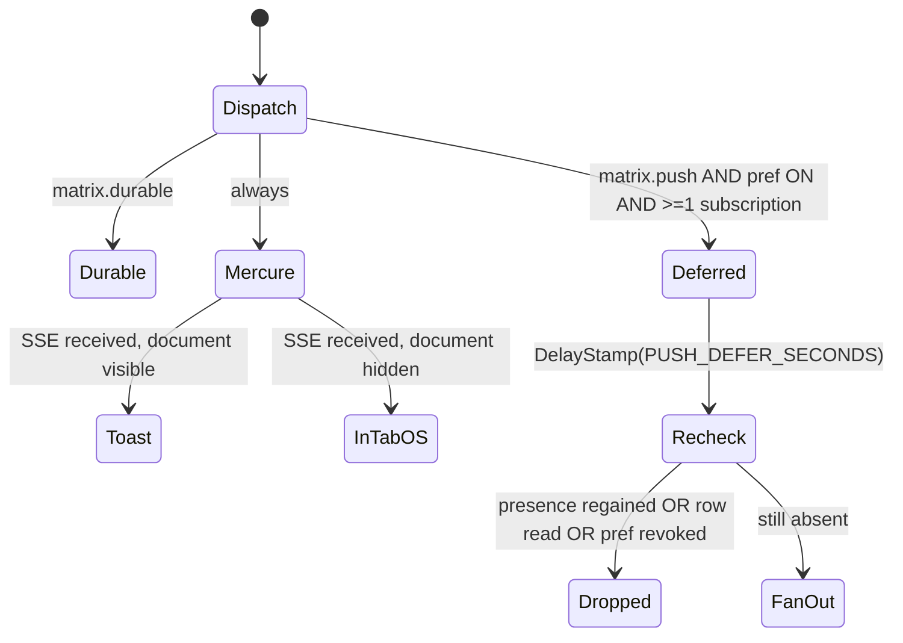

# Multiplayer -- Notifications

> **Status**: specification, not yet implemented. **Contract**: `00-overview.md`
> D5 (full Web Push + VAPID, with an in-tab `Notification` fallback).
>
> **Owns**: the three delivery channels and the rules that choose between them,
> the service worker, VAPID, `PushSubscription` lifecycle, `WebPushSender`, the
> `Notification` entity and inbox, `User.notificationPreferences`, the toast
> module, email.
> **Does not own**: the Mercure transport and `UserEventPayload` shape
> (`02-realtime.md` §2, §4), presence (`02-realtime.md` §6),
> `CorrespondenceNudgeMessage` scheduling (`03-time-control.md` §5), routes and
> the JSON envelope (`09-api-reference.md`), TS module layout (`08-frontend.md`),
> column DDL and migrations (`01-domain-model.md`).

---

## 1. The channel model

### 1.1 Three channels, three disjoint conditions

| Channel | Precondition | Latency | Cost | Survives |
|---|---|---|---|---|
| **Mercure SSE** -- private `user/{userUuid}` | A tab is open, its `EventSource` connected | ~10 ms | one HTTP publish | nothing |
| **In-tab `Notification` API** | Same tab, `document.visibilityState === "hidden"` | ~10 ms + OS centre | zero -- the SSE frame is the trigger | nothing |
| **Web Push** | No tab: closed, browser quit, device asleep | seconds to hours | one encrypted HTTPS request per device to a third party | up to the `TTL` header |

The SSE frame is the only thing the server emits for the first two channels;
whether the browser paints a toast or raises an OS notification is decided
client-side from `document.visibilityState`. The server never guesses.

Web Push differs in kind: it is the only channel that costs a third-party round
trip, the only one that can wake a device, and the only one that can annoy a
user who did not ask. Everything in §1.3 exists to keep it rare.



### 1.2 Decision table

`RT` = context game is `REALTIME` or `UNLIMITED`; `CO` = `CORRESPONDENCE`.
SSE is always yes -- publishing to `user/{uuid}` is one hub call whether or not
anybody listens. The table names PHP enum cases; the wire always carries the
lowercase snake backing value (`your_turn`, `challenge_received`) -- see §6.4.

| `NotificationType` | Ctx | Toast (visible) | In-tab OS (hidden) | Web Push (no tab) | Durable row | Preference key | Default |
|---|---|---|---|---|---|---|---|
| `YOUR_TURN` | RT | no | yes | opt-in, suppressed by N1/N4 | **no** | `push.yourTurnRealtime` | **off** |
| `YOUR_TURN` | CO | yes | yes | yes | yes | `push.yourTurnCorrespondence` | **on** |
| `GAME_FINISHED` | RT | no | yes | no | yes | `push.gameFinishedRealtime` | **off** |
| `GAME_FINISHED` | CO | yes | yes | yes | yes | `push.gameFinishedCorrespondence` | **on** |
| `DRAW_OFFERED` | RT | yes | yes | **never** | no | -- | -- |
| `DRAW_OFFERED` | CO | yes | yes | yes | yes | `push.drawOffered` | **on** |
| `REMATCH_OFFERED` | RT | yes | yes | **never** | no | -- | -- |
| `REMATCH_OFFERED` | CO | yes | yes | yes | yes | `push.rematchOffered` | **on** |
| `SEEK_MATCHED` | -- | yes | yes | **never** | no | -- | -- |
| `CHALLENGE_RECEIVED` | -- | yes | yes | yes | yes | `push.challengeReceived` | **on** |
| `CHALLENGE_ACCEPTED` | -- | yes | yes | yes | yes | `push.challengeAccepted` | **on** |
| `CHALLENGE_DECLINED` | -- | yes | no | no | yes | `push.challengeDeclined` | **off** |
| `FRIEND_REQUEST` | -- | yes | yes | yes | yes | `push.friendRequest` | **on** |
| `FRIEND_ACCEPTED` | -- | yes | no | no | yes | `push.friendAccepted` | **off** |

Three columns need justification.

**No toast for realtime `YOUR_TURN`/`GAME_FINISHED`.** The board already
re-rendered from the `game/{uuid}` `GameStatePayload`. A toast floating over a
board that visibly just changed is noise; the running clock is the notification.

**No durable row for realtime `YOUR_TURN`.** A 1+0 game reaches ~120 plies; one
INSERT per ply per side is 240 rows nobody will read. The general rule: *a
`Notification` row exists only for events whose useful lifetime exceeds one page
view.*

**`SEEK_MATCHED` can never need Web Push.** A `Seek` stays `OPEN` only while its
owner heartbeats every `SEEK_HEARTBEAT_INTERVAL_MS` (10 s) and goes stale after
`SEEK_STALE_AFTER_SECONDS` (25 s) -- see `04-matchmaking.md`. No tab, no seek.
Pushing a matched seek to a device with no listener produces exactly the
pathology the feature exists to avoid: a notification for a game whose clock
started 40 seconds ago.

### 1.3 The never-spam rules

Normative. Each is enforced at a named point, not by convention.

| # | Rule | Enforced in |
|---|---|---|
| **N1** | **Never Web Push a realtime `YOUR_TURN` to a user holding a live SSE connection to that game.** | `SendPushNotificationHandler`, via `PresenceTracker::isPresentOnGame($userId, $gameUuid)` |
| **N2** | Never Web Push something already read. If the event minted a row and `read_at IS NOT NULL` at handling time, drop it. | `SendPushNotificationHandler` |
| **N3** | Re-check the preference at *handling* time, not only at dispatch time. | `SendPushNotificationHandler` |
| **N4** | At most one realtime `YOUR_TURN` push per `(user, game)` per `PUSH_REALTIME_TURN_MIN_INTERVAL_SECONDS` (60). | `WebPushSender`, on `game_player.last_push_at` plus the `Topic` header |
| **N5** | Never Web Push a type marked "never" in §1.2, whatever the preferences say. The matrix beats the toggles; those toggles do not exist. | `NotificationChannelMatrix` (pure, no I/O) |
| **N6** | Never fire the browser permission prompt outside an explicit user gesture. | §5.1 |
| **N7** | A user with zero `push_subscription` rows never enqueues a `SendPushNotificationMessage`. | `NotificationDispatcher` |

### 1.4 Decide the push channel late

Dispatching push synchronously with the move races the SSE frame: the user is
present, the frame is in flight, and the presence row has not been touched since
the last heartbeat. The naive check reads stale presence and pushes anyway. So:

1. `NotificationDispatcher` performs only the cheap monotonic checks (N5, N7,
   dispatch-time preference) and enqueues `SendPushNotificationMessage` with
   `DelayStamp(NotificationLimits::PUSH_DEFER_SECONDS * 1000)`,
   `PUSH_DEFER_SECONDS = 5`.
2. `SendPushNotificationHandler` re-reads preference (N3), presence (N1) and the
   durable row's `read_at` (N2). Any flip in that window kills the push.

Five seconds is chosen against `DISCONNECT_ABANDON_SECONDS = 60`: long enough
for a live client to have received the frame and refreshed presence, short
enough that a genuinely absent user is not kept waiting. `DelayStamp` is the
same mechanism the clock uses (`00-overview.md` D4); the Doctrine transport
implements it via `available_at`.

N2 is the strongest signal available, because `read_at` is set by the *client*
the moment the inbox or the relevant page opens: if the user is reading their
inbox on a laptop, the phone does not buzz.

---

## 2. What the repository lacks

Every claim was established by reading the tree.

### 2.1 Nothing push-related exists

A grep across `assets/`, `public/`, `templates/`, `src/` for
`serviceWorker|ServiceWorker|PushManager|Notification\(|navigator\.serviceWorker|showNotification|requestPermission`
returns **no matches**. The full listing of `public/**` with `.gitignore`
disabled contains `index.php`, `maintenance.html`, `site.webmanifest`, the icon
set, `images/`, `fonts/`, `build/pieces-sprite.svg`,
`build/.vite/entrypoints.json` -- **no `sw.js`**. `composer.json:8-40` has no
push library; `package.json:9-25` has no push tooling. Confirms
`00-overview.md` §3.6.

### 2.2 The manifest is incomplete, and its theme colour is wrong

`public/site.webmanifest:1-21` declares only `name`, `short_name`, `icons`,
`theme_color`, `background_color`, `display`.

| Missing | Consequence |
|---|---|
| `start_url` | Undefined; the installed app opens whatever URL it was installed from. Required for iOS to be useful at all |
| `scope` | Navigation outside the implicit scope opens in in-app browser chrome, not the standalone window |
| `id` | Install identity derives from `start_url`; changing that later creates a *second* installed app instead of updating the first |
| `description`, `orientation` | Empty install prompt; unspecified orientation |

Two defects to fix in the same edit:

- `theme_color` is `#ffffff` (`site.webmanifest:18`) but the app renders dark:
  `<html lang="en" data-theme="dark">` (`templates/base.html.twig:2`) and
  `html { background-color: $keres-bg; }` with `$keres-bg: #010101`
  (`assets/app.scss`). The install splash and title bar flash white.
- **Both** icons are `"purpose": "maskable"` (`site.webmanifest:9`, `:15`) and
  neither is `"any"`. Contexts wanting an unmasked icon must reuse the maskable
  one and crop it twice.

### 2.3 No `theme-color` meta, no PWA capability meta

`templates/base.html.twig:12` has `<meta name="apple-mobile-web-app-title">` and
nothing else PWA-related. Grepping `templates/` and `public/` for
`theme-color|mobile-web-app-capable|apple-mobile-web-app` matches only that line.
There is **no `<meta name="theme-color">` anywhere.**

### 2.4 The completed manifest

Replace `public/site.webmanifest` wholesale:

```json
{
  "id": "/",
  "name": "Keres",
  "short_name": "Keres",
  "description": "Play Keres online: real-time and correspondence games, ratings and friends.",
  "start_url": "/",
  "scope": "/",
  "display": "standalone",
  "orientation": "any",
  "theme_color": "#010101",
  "background_color": "#010101",
  "icons": [
    { "src": "/web-app-manifest-192x192.png", "sizes": "192x192", "type": "image/png", "purpose": "any" },
    { "src": "/web-app-manifest-512x512.png", "sizes": "512x512", "type": "image/png", "purpose": "any" },
    { "src": "/web-app-manifest-192x192.png", "sizes": "192x192", "type": "image/png", "purpose": "maskable" },
    { "src": "/web-app-manifest-512x512.png", "sizes": "512x512", "type": "image/png", "purpose": "maskable" }
  ],
  "shortcuts": [
    { "name": "Play",  "url": "/play" },
    { "name": "Lobby", "url": "/lobby" }
  ]
}
```

`/` is the `index` route (`src/Action/IndexAction.php:21-24`); `/play` is
`new_game` (`src/Action/NewGameAction.php:27-30`); `/lobby` is specified in
`04-matchmaking.md`. Reusing one PNG for both purposes is a deliberate interim:
the icons were authored with a maskable safe zone, so they are conservative but
correct unmasked. A tighter `any` variant is a design task, not a blocker.

### 2.5 Exact additions to `templates/base.html.twig`

Inside ``, after line 13 (`<link rel="manifest" ...>`):

```twig
        <meta name="theme-color" content="#010101"/>
        <meta name="mobile-web-app-capable" content="yes"/>
        <meta name="apple-mobile-web-app-status-bar-style" content="black-translucent"/>
```

And, for authenticated users only, the two values the front end needs -- as
`<body>` data attributes, matching how the board container already receives
`data-game-uuid`/`data-moves` (`assets/typescript/src/app.ts:106,113`):

```twig
<body data-user-uuid="{{ app.user.id }}" data-vapid-public-key="{{ vapid_public_key }}">
```

`vapid_public_key` is a Twig global from a small `App\Twig\NotificationExtension`
reading the `VAPID_PUBLIC_KEY` parameter (§4.3). Anonymous visitors cannot
subscribe, so emitting it for them is pointless.

### 2.6 There is no PSR-18 stack

This blocks §6 and must be resolved before `WebPushSender` can exist.

| Fact | Evidence |
|---|---|
| `symfony/http-client` v7.4.14 **is installed** but is **not a direct dependency** | absent from `composer.json:8-40`; in `composer.lock`, required by `pentatrion/vite-bundle` and `symfony/mercure` |
| It provides `psr/http-client-implementation: 1.0` but **not** `psr/http-factory-implementation` | `vendor/symfony/http-client/composer.json` `provide` block |
| `psr/http-client`, `psr/http-factory`, `psr/http-message` are **not installed** | `vendor/psr/` holds only `cache`, `clock`, `container`, `event-dispatcher`, `link`, `log` |
| `php-http/discovery` is **not installed**, but its Composer plugin is already allow-listed | no `vendor/php-http/`; `composer.json:43` `"php-http/discovery": true` |
| `Psr18Client` exists but hard-fails without those packages | `vendor/symfony/http-client/Psr18Client.php:35-41` throws without `psr/http-client`/`psr/http-factory`; `:63-70` throws when no PSR-17 factory class exists |

**Answer to "must an adapter be added?": yes.** `symfony/http-client` is a
PSR-18 *client* provider but not a PSR-17 *factory* provider, and `Psr18Client`
needs a `ResponseFactoryInterface` it cannot supply itself. See §6.1.

### 2.7 There is no toast system

Grepping `assets/` and `templates/` for `toast|snackbar|is-toast`: no matches.
What exists instead:

- **Server-rendered Bulma flash banners**, `templates/base.html.twig:69-79`:
  `<div class="container mt-4"><div class="notification is-{{ type == 'error' ? 'danger' : type }} is-light">`.
  One render per page load, never dismissible, never client-driven.
- **Blocking `alert()`**, three sites, all in
  `assets/typescript/src/controllers/GameController.ts`: line **168**
  (`'Failed to play move: '`), **187** (`'Failed to decode move stack: '`),
  **194** (`'Failed to undo move: '`).
- **Blocking `confirm()`**, three inline `onsubmit` handlers:
  `templates/actions/new_game.html.twig:48` and **:76** (delete game),
  `templates/actions/play.html.twig:30` (resign).

`alert()` freezes the event loop. With a clock running, a modal alert on a failed
move is a lost game. Replacing those three sites is a prerequisite of time
control, not a nicety -- §9.3.

---

## 3. The service worker

### 3.1 Why the origin root

A worker's default scope is its own script's path. `/build/sw.js` controls
`/build/*` and nothing else: it would never receive a `push` event for the
application, and `clients.matchAll()` would see no windows. A worker at `/sw.js`
gets scope `/` with no configuration.

Scope can be widened past the script's directory only if the response carries
`Service-Worker-Allowed: /` **and** `register()` passes `{ scope: '/' }` -- two
coupled pieces of configuration in two files, buying nothing.

### 3.2 Where the file lives -- decision

**Decision: a hand-maintained `public/sw.js`, plain ES2020, outside the Vite
build.** The rejected alternative is a dedicated Vite input emitting to
`public/sw.js`.

Why the Vite route loses:

| Obstacle | Evidence |
|---|---|
| Vite writes to `public/build`, which is git-ignored. A `public/sw.js` emitted by Vite lands *outside* the ignored directory: either committed (immediately stale) or missing from a clean checkout | `vite.config.js:46` `outDir: 'public/build'`; `.gitignore` pentatrion block, `/public/build/` |
| Redirecting one entry to another `outDir` needs a second config and a second build invocation -- another script in `package.json:4-8` and another `RUN` in `node_builder` | `Dockerfile:34-46` runs exactly one `npm run build` |
| In dev nothing writes `public/` at all: assets come from the Vite dev server, proxied only under the `/build` prefix and only `when@dev`. Registration would 404 in dev and work only in prod -- the worst possible split | `config/routes/pentatrion_vite.yaml:1-4`; `vendor/pentatrion/vite-bundle/src/Controller/ViteController.php:20-41` |
| A TS worker needs `"WebWorker"` in `lib`. The shared config is `lib: ["ES2020","DOM"]`, `include: ["src/**/*"]`; adding `WebWorker` beside `DOM` collides on `self`, `fetch`, `caches`, `addEventListener`, and `npm run type-check` must stay clean per `AGENTS.md` | `assets/typescript/tsconfig.json`; `package.json:7` |

Why plain `public/sw.js` wins: Caddy's `root` is `/app/public` and the rewrite
matcher is `@phpRoute { not path /.well-known/mercure*; not file {path} }`
(`frankenphp/Caddyfile:34,57-61`), so any real file under `public/` is served by
`file_server` (`:66-68`) and never reaches PHP. `public/sw.js` is therefore live
at `/sw.js` identically in dev (bind mount `.:/app`, `compose.yaml:107`) and prod
(`COPY --link --exclude=frankenphp/ . ./`, `Dockerfile:94`), with root scope for
free. The worker imports nothing from the app bundle and must not: it handles
`push` and `notificationclick` only, and by §6.4 the payload carries identifiers,
never board bytes -- so nothing in `assets/typescript/src/utils/boardUtils.ts` is
needed, and the AGENTS.md rule that all codecs live there is respected by the
worker never decoding anything.

Accepted cost: `tsc` never sees it. Mitigation: keep it under 100 lines, no
imports, and cover it with the smoke test in §11.5.

### 3.3 Caddy

No `Service-Worker-Allowed` header is required, because the script sits at the
root. Say so in the Caddyfile so nobody adds one later. Two headers *are* worth
adding, beside the existing `header ?Permissions-Policy "browsing-topics=()"`
(`frankenphp/Caddyfile:55`):

```caddyfile
	# The worker lives at the origin root precisely so it inherits scope "/".
	# Do NOT add Service-Worker-Allowed; it is only for a sub-path worker.
	header /sw.js Cache-Control "no-cache"
	header /site.webmanifest Cache-Control "no-cache"
```

`file_server` emits `Etag`/`Last-Modified` but no `Cache-Control`, so freshness
would otherwise be heuristic [INFERENCE -- from Caddy's documented `file_server`
behaviour; its source is not vendored here]. `no-cache` means "always
revalidate", not "never store": the 304 is cheap and the update check in §3.6
becomes deterministic. The existing `Permissions-Policy` only disables Topics
and does not constrain the Notifications or Push APIs.

### 3.4 Registration

Registration goes in `assets/app.js`, **not** `assets/typescript/src/app.ts`:
`base.html.twig:14-17` renders `vite_entry_link_tags('app')` /
`vite_entry_script_tags('app')` on **every** page, whereas the `play` entry
(`vite.config.js:50`) loads only on the game page. A worker registered from the
board alone would never install for a user who lives in the lobby.

```js
// --- Service worker ---------------------------------------------------------
// Registered on every page. Push subscription is NOT touched here: the
// permission prompt only ever fires from an explicit user gesture (see
// docs/multiplayer/07-notifications.md 5.1).

if ("serviceWorker" in navigator) {
    window.addEventListener("load", () => {
        navigator.serviceWorker.register("/sw.js").catch((e) => {
            console.warn("Service worker registration failed", e);
        });
    });
}
```

Unconditional and side-effect free: no `requestPermission()`, no `subscribe()`,
and `load` rather than `DOMContentLoaded` so it never blocks first paint. A
failure is logged and ignored -- every channel except Web Push still works.

### 3.5 `public/sw.js`

```js
/* Keres service worker. Push delivery only -- no offline caching (see 3.7). */
const SW_VERSION = "keres-sw-1";

self.addEventListener("install", () => self.skipWaiting());
self.addEventListener("activate", (e) => e.waitUntil(self.clients.claim()));

self.addEventListener("push", (event) => {
    let p = null;
    try { p = event.data ? event.data.json() : null; } catch (e) { p = null; }
    if (!p || p.v !== 1) return;                 // unknown envelope: drop silently

    event.waitUntil(self.registration.showNotification(p.title, {
        body: p.body,
        icon: "/web-app-manifest-192x192.png",
        badge: "/favicon-96x96.png",
        tag: p.tag,                              // collapses repeats for one subject
        renotify: p.renotify === true,
        requireInteraction: false,
        timestamp: Math.floor(p.ts / 1000),      // envelope is us; this option is ms
        data: { url: p.url, notificationUuid: p.n || null },
    }));
});

self.addEventListener("notificationclick", (event) => {
    event.notification.close();
    const target = new URL(event.notification.data.url || "/", self.location.origin).href;

    event.waitUntil((async () => {
        const list = await self.clients.matchAll({ type: "window", includeUncontrolled: true });
        const client = list.find((c) => c.url === target)
            || list.find((c) => new URL(c.url).origin === self.location.origin);
        if (client) {
            await client.focus();
            if (client.url !== target && "navigate" in client) await client.navigate(target);
            return;
        }
        await self.clients.openWindow(target);
    })());
});

self.addEventListener("pushsubscriptionchange", (event) => {
    event.waitUntil((async () => {
        const key = event.oldSubscription
            && event.oldSubscription.options
            && event.oldSubscription.options.applicationServerKey;
        if (!key) return;                        // cannot re-subscribe blind; 5.4 path 2 recovers

        const fresh = await self.registration.pushManager.subscribe({
            userVisibleOnly: true, applicationServerKey: key,
        });
        await fetch("/push/subscribe", {
            method: "POST",
            credentials: "same-origin",
            headers: { "Content-Type": "application/json" },
            body: JSON.stringify({
                subscription: fresh.toJSON(),
                oldEndpoint: event.oldSubscription ? event.oldSubscription.endpoint : null,
            }),
        });
    })());
});
```

Three details that are easy to get wrong:

- `includeUncontrolled: true` is mandatory. Tabs opened *before* the worker took
  control are uncontrolled; without it, clicking a notification opens a
  duplicate tab beside the one already showing the game.
- `client.navigate()` is capability-guarded: it exists on `WindowClient` only for
  same-origin targets and is absent in some engines. Falling back to `focus()` on
  the wrong page is a far smaller failure than an unhandled rejection inside
  `waitUntil`.
- `userVisibleOnly: true` is not optional. Chromium rejects a subscription
  without it, and every `push` must show a notification or the permission is
  eventually revoked. Hence there is no "silent push" row in §1.2: on this stack
  there is no such thing.

### 3.6 Versioning and update

`SW_VERSION` is a human marker; the mechanism is byte equality. The browser
refetches `/sw.js` on navigation (at most every 24 h) and installs a new worker
when the bytes differ; `Cache-Control: no-cache` (§3.3) makes that a conditional
GET rather than a heuristic guess. `skipWaiting()` + `clients.claim()` activate
immediately instead of waiting for every tab to close -- safe precisely because
the worker holds no caches and no cross-version state; the only thing an abrupt
swap can interrupt is an in-flight `showNotification`, which the push service
retries within its TTL. Bump `SW_VERSION` on every functional change so
`chrome://serviceworker-internals` and §11.5 can tell which build is live.

### 3.7 No offline caching -- explicit decision

**This iteration adds no `fetch` handler, no `Cache` usage and no offline page.**
The worker exists solely for `push` and `notificationclick`.

An offline shell would have to cache hashed Vite bundles whose names change every
build (`vite.config.js:45-54`), in front of a product whose every screen is
server-rendered Twig against live game state -- and a cached board is a *wrong*
board. There is already a server-side degradation path for total app failure:
`handle_errors 5xx` rewrites to `/maintenance.html`
(`frankenphp/Caddyfile:75-78`), which is honest in a way a stale board is not.

Knowingly accepted consequence: Chromium does not offer an install prompt for a
worker with no `fetch` handler. Installation stays available via the browser's
explicit "Install app" menu item -- the only path iOS offers anyway (§11.1).

---

## 4. VAPID

### 4.1 Key generation

One P-256 keypair per deployment, generated once and never rotated casually:
rotation invalidates every stored subscription, because the push service binds
the endpoint to the application server key presented at subscribe time.

`VAPID::createVapidKeys()` returns
`['publicKey' => <base64url of 65 raw bytes>, 'privateKey' => <base64url of 32 raw bytes>]`
-- 87 and 43 characters. `VAPID::validate()` re-checks exactly those decoded
lengths and additionally requires `subject`.

Ship this as `bin/console app:vapid:generate` in `src/Command/` (matching the
existing `game:play-ai` convention) rather than a `php -r` incantation. It prints
the three env lines and writes nothing: key material never touches the repo.

### 4.2 The three environment variables

| Variable | Value | Read by |
|---|---|---|
| `VAPID_PUBLIC_KEY` | base64url, 87 chars | `WebPushSender`, **and** exposed to the browser (§4.3) |
| `VAPID_PRIVATE_KEY` | base64url, 43 chars | `WebPushSender` only. Never rendered, never logged |
| `VAPID_SUBJECT` | `mailto:no-reply@keres.fr` or `https://playkeres.com` | `WebPushSender`; the JWT `sub` claim, so a push service can contact the operator |

`mailto:no-reply@keres.fr` matches the sender hard-coded at
`src/Service/UserMailer.php:26`. Wire them through the existing global bind
convention (`AGENTS.md`: `$backendApiUrl` receives `BACKEND_API_URL` via the
`bind` in `services.yaml`):

```yaml
# config/services.yaml, services._defaults.bind
    $vapidPublicKey:  '%env(VAPID_PUBLIC_KEY)%'
    $vapidPrivateKey: '%env(VAPID_PRIVATE_KEY)%'
    $vapidSubject:    '%env(VAPID_SUBJECT)%'
```

### 4.3 Getting the public key to the browser

Two paths, both needed. **`GET /push/public-key`** returns
`{"data":{"publicKey":"..."}}` -- unauthenticated (the key is public by
construction), used by the worker's re-subscribe path. **`data-vapid-public-key`
on `<body>`** (§2.5) lets the settings page subscribe inside the click handler
without an async fetch first; that matters because on some engines the prompt
must be requested in the same task as the gesture, and an intervening
`await fetch()` can break the user-activation chain.

The browser needs a `Uint8Array`, not a string:

```ts
export function urlBase64ToUint8Array(base64: string): Uint8Array {
    const padded = (base64 + "=".repeat((4 - (base64.length % 4)) % 4))
        .replace(/-/g, "+").replace(/_/g, "/");
    return Uint8Array.from(atob(padded), (c) => c.charCodeAt(0));
}
```

This is base64url decoding, not an engine wire codec, so it belongs in the
notification module and **not** in `assets/typescript/src/utils/boardUtils.ts`
(AGENTS.md reserves that file for the board/move binary format).

### 4.4 Secret handling, dev versus prod

The app does not parse `.env` files -- `symfony/dotenv` is not installed
(`.env.example:8-9`); every value is a real container environment variable.

| File | Change |
|---|---|
| `.env.example` | A `# -- Web Push (VAPID) --` block documenting all three, commented out, pointing at `bin/console app:vapid:generate`. Dev may leave them blank: `WebPushSender` becomes a logging no-op (§6.2) |
| `compose.yaml` | Three lines in the `x-app-env` anchor (`:38-78`), each `${VAPID_*:-}` so a dev with no keys still boots -- mirroring the OIDC pattern at `:72-77` |
| `deploy/compose.yaml` | Three lines in its env anchor, **without** a default for the private key: a missing prod key must fail loudly, not silently no-op. Add all three to the required list in its header comment and to `deploy/.env.example` beside `MERCURE_JWT_SECRET` (`deploy/.env.example:11`) |
| `Dockerfile` | Add `VAPID_PUBLIC_KEY=`/`VAPID_PRIVATE_KEY=`/`VAPID_SUBJECT=mailto:build@example.invalid` to the build-time placeholder `ENV` block (`:59-78`) so `composer run-script post-install-cmd` warms the container without a live environment, exactly as the OIDC placeholders do |

The private key is a credential of the same class as `MERCURE_JWT_SECRET` and
`APP_SECRET`, which `deploy/README.md:48` already tells the operator to fill in
by hand. It never appears in a template or a log, and `WebPushSender` takes it as
a `#[\SensitiveParameter]` constructor argument.

---

## 5. Subscription lifecycle

### 5.1 The permission rule

**The browser permission prompt is NEVER fired on page load** (N6). It may fire
from exactly two places, both requiring a user gesture in the same task:

1. An explicit **"Enable notifications"** button in settings.
2. A single dismissible **in-app** prompt after the user's first correspondence
   game is created -- rendered as a sticky toast with an "Enable" action. The
   toast is our own UI; the browser prompt fires only if the user clicks Enable.
   Dismissal writes `notificationPreferences.push.promptDismissedAt` and the
   prompt never returns automatically.

The reason is durability, not politeness: `Notification.permission` has no "ask
me later". A `denied` verdict is sticky per origin and in most browsers cannot be
re-prompted from JavaScript at all -- the user must dig into site settings.
Prompting cold on page one converts a future subscriber into a permanently
unreachable one.

Correspondence is the trigger because it is the only mode where push is
load-bearing: a `days_per_move` game is unplayable if you must keep a tab open.
Realtime players are, by construction, looking at the board.

### 5.2 Subscribe

```ts
async function enablePush(vapidPublicKey: string): Promise<"granted" | "denied" | "unsupported"> {
    if (!("serviceWorker" in navigator) || !("PushManager" in window)) return "unsupported";

    const permission = await Notification.requestPermission();   // inside the click handler
    if (permission !== "granted") return "denied";

    const registration = await navigator.serviceWorker.ready;
    const subscription = await registration.pushManager.subscribe({
        userVisibleOnly: true,
        applicationServerKey: urlBase64ToUint8Array(vapidPublicKey),
    });

    await fetch("/push/subscribe", {
        method: "POST", credentials: "same-origin",
        headers: { "Content-Type": "application/json" },
        body: JSON.stringify({ subscription: subscription.toJSON(), oldEndpoint: null }),
    });
    return "granted";
}
```

`subscription.toJSON()` yields `{endpoint, expirationTime, keys:{p256dh, auth}}`.
The server stores `endpoint`, `keys.p256dh`, `keys.auth` and the request
`User-Agent` (truncated to 255) for the device list in settings. Routes and
envelopes: `09-api-reference.md`. `POST /push/subscribe` takes an optional
nullable `oldEndpoint` (max 2048) and is idempotent on `endpoint`.

### 5.3 Storage and the `endpoint` unique constraint

`PushSubscription` per contract: `endpoint text unique`, `p256dh`, `auth_token`,
`content_encoding string(16) default 'aes128gcm'`, `user_agent`, `created_at`,
`last_used_at`, `failure_count int default 0`.

The unique constraint is on `endpoint` **alone**, not `(user_id, endpoint)`, and
that is deliberate: a push endpoint identifies a *browser profile*, not a user.
If two accounts sign in on one browser, the second subscribe must **re-point the
existing row**, or the push service delivers both users' notifications to the
same device. So the handler upserts:

```sql
INSERT INTO push_subscription (user_id, endpoint, p256dh, auth_token, content_encoding,
                               user_agent, created_at, last_used_at, failure_count)
VALUES (:user, :endpoint, :p256dh, :auth, 'aes128gcm', :ua, now(), now(), 0)
ON CONFLICT (endpoint) DO UPDATE
   SET user_id = EXCLUDED.user_id, p256dh = EXCLUDED.p256dh,
       auth_token = EXCLUDED.auth_token, last_used_at = now(), failure_count = 0;
```

`content_encoding` is **stored rather than assumed**, because
`Minishlink\WebPush\Subscription::create()` defaults to the legacy `aesgcm` when
the key is absent (`Subscription.php`,
`const defaultContentEncoding = ContentEncoding::aesgcm`). Building a
`Subscription` from our row without passing `contentEncoding` explicitly silently
downgrades every message to the pre-RFC-8291 encoding. Always pass it.

`POST /push/unsubscribe` deletes by `endpoint` after an ownership check; the
client calls `subscription.unsubscribe()` in the same handler.

### 5.4 Re-subscription after rotation

Browsers rotate endpoints (key expiry, profile repair, storage eviction). Two
recovery paths, because neither suffices alone:

1. **`pushsubscriptionchange`** in the worker (§3.5). Fires on browser-initiated
   rotation; Chromium's event carries `oldSubscription`, so the handler
   re-subscribes with the *same* `applicationServerKey` from
   `oldSubscription.options` and POSTs both endpoints for a single-transaction
   swap. The event is not universally implemented and some engines omit
   `oldSubscription` -- hence the early return and path 2.
2. **Reconciliation on page load.** Whenever `Notification.permission ===
   "granted"`, `assets/app.js` reads `registration.pushManager.getSubscription()`
   and POSTs the endpoint. The §5.3 upsert makes this free when nothing changed.
   This is the only path that recovers a rotation that happened while the browser
   was closed.

Path 2 must **not** call `subscribe()` when `getSubscription()` returns `null` --
that would re-prompt outside a gesture, violating N6. It records the loss and
lets the settings page offer re-enabling.

### 5.5 Multi-device

`PushSubscription` is `OneToMany` from `User`: laptop Chrome, phone Chrome,
installed iOS PWA. Fan-out (§6.3) sends to every non-pruned row. Settings lists
them by `user_agent` and `last_used_at` with a per-device revoke. Nothing
deduplicates by device family -- a user with three browsers who wants one
notification revokes two. The `Notification` `tag` (§6.5) collapses repeats
*within* a device, not across devices.

### 5.6 Pruning and `failure_count` backoff

`MessageSentReport::isSubscriptionExpired()` returns true for exactly **404 and
410** (`MessageSentReport.php`), and those are terminal.

| Report | Action |
|---|---|
| 2xx (`isSuccess()`) | `failure_count = 0`, `last_used_at = now()` |
| **404 / 410** | **DELETE the row immediately.** No backoff, no counter -- the subscription is gone |
| 429, 5xx | `failure_count++`. Do not delete; the service is having a bad day |
| 400, 401, 403 | `failure_count++`, log `error`. Almost always a VAPID misconfiguration rather than a per-subscription fault; if it hits every endpoint in one fan-out, log once at `critical` and stop the batch |
| 413 | Log `error` and drop. An oversized payload is a caller bug; §6.4 prevents it |
| Transport exception (no response) | `failure_count++` |

`failure_count` drives a deterministic backoff, not a retry storm:

```
skip this subscription while  last_used_at + 2^min(failure_count, 6) minutes > now()
delete the subscription when  failure_count >= NotificationLimits::PUSH_MAX_FAILURES (5)
```

Five consecutive non-terminal failures across an hour of backoff is a dead
endpoint that is simply not honest enough to return 410.

---

## 6. Sending

### 6.1 Library and Composer changes

```
composer require minishlink/web-push:^11.0 nyholm/psr7 symfony/http-client
```

`minishlink/web-push` v11.0.0 requires PHP >= 8.2, `ext-curl`, `ext-json`,
`ext-mbstring`, `ext-openssl`, and pulls `php-http/discovery ^1.19`,
`php-http/httplug`, `psr/http-client`, `psr/http-factory`, `psr/http-message`,
`spomky-labs/base64url`, `web-token/jwt-library`. The project runs PHP 8.4 with
`composer.json:9` at `>=8.3`, so the floor is satisfied.

`nyholm/psr7` is the **adapter §2.6 established is missing**: `WebPush` needs a
PSR-18 client plus PSR-17 request and stream factories; `Psr18Client` implements
all three but its constructor needs a `ResponseFactoryInterface` that neither it
nor `symfony/http-client` provides, and it throws when no PSR-17 factory class
exists (`Psr18Client.php:63-70`). `nyholm/psr7` supplies it and is one of the two
implementations `Psr18Client` looks for by name (`Psr18Client.php:16,66-67`).

`symfony/http-client` is promoted to a **direct** requirement. It is currently
transitive via `pentatrion/vite-bundle` and `symfony/mercure`; once
`WebPushSender` depends on it, relying on someone else's dependency graph is a
latent break. `composer.json:43` already allow-lists the `php-http/discovery`
plugin, so the install is non-interactive.

Guzzle is **not** added. `WebPush::flushPooled()` needs an HTTPlug async client
and throws a `LogicException` without one; sequential `flush()` over a handful of
subscriptions inside a Messenger worker is fine, and `php-http/guzzle7-adapter`
would drag a second HTTP stack into an app standardised on `symfony/http-client`.

### 6.2 `Notification\WebPushSender`

```php
namespace App\Service\Notification;

final readonly class WebPushSender
{
    public function __construct(
        private PushSubscriptionRepository $subscriptions,
        private EntityManagerInterface $em,
        private HttpClientInterface $httpClient,          // symfony/http-client
        private LoggerInterface $logger,
        private string $vapidPublicKey,
        #[\SensitiveParameter] private string $vapidPrivateKey,
        private string $vapidSubject,
    ) {}

    /** @return int endpoints that accepted the message */
    public function sendToUser(User $user, PushEnvelope $envelope): int { /* ... */ }
}
```

Construction rules that are not optional:

| Rule | Why |
|---|---|
| **A fresh `WebPush` per call** | It holds a mutable `$notifications` queue and a `$vapidHeaders` cache. Under FrankenPHP worker mode (`00-overview.md` §6: no mutable state across requests) a long-lived instance with a half-flushed queue is a cross-request leak. Constructing one is pure CPU; no I/O until `flush()` |
| **Inject the client; never let discovery run** | `WebPush::__construct` takes `?ClientInterface`, `?RequestFactoryInterface`, `?StreamFactoryInterface` and only falls back to `Psr18ClientDiscovery`/`Psr17FactoryDiscovery` when they are null. Pass `new Psr18Client($this->httpClient->withOptions(['timeout' => 10, 'max_duration' => 15]))` so the request has a real timeout -- landmine 9 in `00-overview.md` is exactly this failure on the engine path and must not recur |
| `setReuseVAPIDHeaders(true)` | The JWT is per push-service origin, valid up to 12 h (`VAPID::getVapidHeaders` caps `exp` at `time() + 43200`). Saves an ES256 signature per extra endpoint on the same service. Safe because the instance dies with the call |
| Leave `setAutomaticPadding()` at its default | §6.4 |
| Empty public or private key -> log `info` once, return `0` | Dev without keys must not throw |

### 6.3 The message and the fan-out

`App\Message\SendPushNotificationMessage(string $userId, string $type, array $payload)`,
routed to `async` in `config/packages/messenger.yaml` -- which today routes only
`ProcessAiMoveMessage` (`:11-13`); the contract's other new messages join it.

Handler:

```
1. user = users->find(userId)                          null -> ack
2. re-read notificationPreferences                     off  -> ack   (N3)
3. payload.notificationUuid row read_at IS NOT NULL    -> ack        (N2)
4. payload.gameUuid AND presence->isPresentOnGame(...)  -> ack        (N1)
5. subs = repo->findActiveForUser(user)   // 5.6 backoff applied in SQL
   empty                                                -> ack        (N7)
6. sent = webPushSender->sendToUser(user, envelope)
7. log info: type, userId, endpoints attempted, endpoints accepted
```

`sendToUser` calls `queueNotification()` per row with the per-type options of
§6.5, then walks `flush()` -- one `MessageSentReport` per request -- applying the
§5.6 table to each. The whole loop runs in the worker container (supervisor,
`messenger:consume async --time-limit=60 --memory-limit=128M`, `numprocs=2` --
`frankenphp/supervisor/messenger-worker.conf:1-4`), never in a web request.

### 6.4 Payload budget: send an ID, not content

The Push API guarantees only **4096 bytes of encrypted body**. From the library
source:

| Component | Bytes | Source |
|---|---|---|
| `aes128gcm` content-coding header: 16 salt + 4 record size + 1 key-id length + 65 ephemeral public key | 86 | `Encryption::getContentCodingHeader()` |
| AES-GCM tag appended to the ciphertext | 16 | `Encryption::deterministicEncrypt()` returns `$encryptedText.$tag` |
| Record delimiter appended before padding | 1 | `Encryption::padPayload()` appends `chr(2)` |
| **Fixed overhead** | **103** | |

So with padding off the JSON ceiling is `4096 - 103 = 3993`.

**The trap:** `Encryption::MAX_PAYLOAD_LENGTH = 4078` is the library's own hard
reject inside `queueNotification()`, and `4078 + 103 = 4181 > 4096`. The
library's ceiling is *above* the guaranteed cap. Never use it as a budget.

Keep the default instead: `$automaticPadding` initialises to
`Encryption::MAX_COMPATIBILITY_PAYLOAD_LENGTH = 2820`, so every plaintext is
padded to 2820 bytes and every encrypted body is exactly `86 + 2820 + 16 = 2922`
bytes -- under the cap and constant-length, which denies a network observer the
ability to infer notification type from size.

**Operative rule: the envelope carries identifiers plus one pre-rendered line of
text. Never content.** No board bytes, no move list, no rating table, no avatar
URL. The client fetches what it needs after the click.

```json
{ "v": 1, "t": "your_turn",
  "title": "Your turn vs. rooksmith",
  "body": "Correspondence - 2 days per move",
  "tag": "tGx8kQ2vRb9nT4hLpW1zYc",
  "url": "/play/0193f1a2-...", "n": "0193f1b7-...", "ts": 1732650000123456 }
```

That is ~200 bytes. Budget **1024**; assert in `WebPushSender` and log `error`
above **2048** -- anything near the padding length is a design error upstream,
not a transport problem. Titles and bodies are rendered server-side (the worker
must not know how to format a game) and truncated to 80 and 140 characters.

Three encoding rules, shared with every other JSON the platform emits
(`02-realtime.md` §4.0):

- **`t` is the lowercase snake_case enum value, not the PHP case name.**
  `NotificationType` is backed by exactly that string, so the `notification.type`
  column, the SSE frame and this envelope carry one identical token with no
  mapping table anywhere. Tables in this file name the PHP cases
  (`CHALLENGE_RECEIVED`); the wire always carries `challenge_received`.
- **`ts` is integer microseconds since epoch**, `(int) $dt->format('Uu')`. The
  service worker divides by 1000 before passing it to `showNotification`, whose
  `timestamp` option is milliseconds (§3.5). That conversion is the only place
  milliseconds appear; do not "fix" it.
- **`n` and `tag` are different things and both travel.** `n` is
  `Notification.uuid` (nullable -- realtime `YOUR_TURN` mints no row, §1.2) and
  is the idempotency and mark-read correlation key. `tag` is a *subject* key
  whose whole job is to collapse repeats (§6.5). Collapsing on a per-event uuid
  would collapse nothing and would kill N4.

### 6.5 TTL, urgency and topic

Per-notification options, third argument of `queueNotification()`. Unset defaults
are TTL `2419200` (4 weeks) and no urgency/topic
(`WebPush::setDefaultOptions()`); four weeks is absurd for a chess clock, so
every type sets its own.

| Type / context | `TTL` (s) | `Urgency` | `Topic` prefix | Why |
|---|---|---|---|---|
| `YOUR_TURN` RT | 300 | `high` | `t` | Worthless once the clock has run |
| `YOUR_TURN` CO | 86400 | `normal` | `t` | One day is the grain of `days_per_move` |
| `CHALLENGE_RECEIVED` | 86400 (`CHALLENGE_TTL_SECONDS`) | `high` | `c` | Dies exactly with the challenge |
| `CHALLENGE_ACCEPTED` | 600 | `high` | `c` | Your clock may already be running |
| `CHALLENGE_DECLINED` | 86400 | `low` | `c` | Informational |
| `FRIEND_REQUEST` | 604800 | `normal` | `f` | No urgency, long life |
| `FRIEND_ACCEPTED` | 604800 | `low` | `f` | Informational |
| `GAME_FINISHED` CO | 604800 | `normal` | `g` | A result keeps for a week |
| `DRAW_OFFERED` CO | 86400 | `normal` | `d` | Dies with the offer |
| `REMATCH_OFFERED` CO | 86400 | `low` | `r` | Dies with the offer |

`Urgency` matters on battery-constrained devices: `low` may be held until the
device next wakes, `high` wakes it. Marking everything `high` is how an app gets
throttled.

**`Topic` has a hard format constraint**: RFC 8030 restricts it to at most 32
base64url characters, so a hyphenated UUID (36 chars) is illegal. Build it as
`<prefix> . $uuid->toBase58()` -- `AbstractUid::toBase58()`
(`vendor/symfony/uid/AbstractUid.php:102`) yields 22 alphanumeric characters, so
23 in total, inside both the length limit and the character set. The push service
replaces any undelivered message with the same topic for the same endpoint, which
is what makes N4 cheap: three plies in a blitz game collapse to one pending
notification. The same string is reused as the client-side `Notification` `tag`
(§3.5), so collapsing behaves identically at the push service and in the OS
notification centre.

### 6.6 Errors, without fighting Messenger's retry

Messenger defaults apply -- `max_retries: 3`, `delay: 1000` ms, `multiplier: 2`,
`jitter: 0.1`
(`vendor/symfony/framework-bundle/DependencyInjection/Configuration.php:1793-1797`);
`config/packages/messenger.yaml` overrides none, and `failure_transport: failed`
catches the exhausted (`:3,8`).

> **`WebPushSender` never throws for a per-subscription failure.** Per-endpoint
> outcomes are data (§5.6), not exceptions. The handler throws only when the
> *whole* attempt is unusable.

| Situation | Behaviour |
|---|---|
| Some endpoints 410, others 201 | Prune the dead, return the accepted count, **ack** |
| All endpoints 5xx / timeout | `failure_count++` each, then **throw `RecoverableMessageHandlingException`** so Messenger retries with backoff |
| 400/401/403 on every endpoint | VAPID misconfigured. Log `critical`, **throw `UnrecoverableMessageHandlingException`** -- retrying a bad signature three times helps nobody and buries the log |
| 413 | Log `error`, **ack**. Retrying re-sends the same oversized payload |
| User deleted, preference off, presence regained | **ack** silently; not a failure |

Note the shape of `flush()`: it is a `\Generator`, and PSR-18 clients throw only
for transport-level faults -- HTTP 4xx/5xx come back as ordinary responses that
`WebPush::createReport()` turns into an unsuccessful `MessageSentReport`. So the
sender must inspect `isSuccess()` and the status code; catching exceptions alone
would treat every 410 as a success.

Because push is at-least-once, `showNotification` with a stable `tag` makes a
duplicate delivery visually idempotent: the second replaces the first.

---

## 7. The `Notification` entity and the notification centre

### 7.1 Why a durable row exists in addition to transient push

Push is best-effort and opt-in; the inbox is neither.

- A user who denied permission, or whose browser has no Push support (§11),
  still has to learn that somebody challenged them.
- Push delivery is unacknowledged; a message can expire inside its TTL and nobody
  will ever know.
- The unread badge is the only affordance that survives a reload and the only one
  a user can go looking for deliberately.
- N2 -- the strongest anti-spam rule in §1.3 -- is implemented by reading
  `read_at`. Without the row there is nothing to read.

It is not a log of everything: §1.2 mints one only for events whose useful
lifetime exceeds one page view.

### 7.2 Write path

`Notification` per contract: `id BIGSERIAL`, `uuid` unique, `user` FK,
`type string(32)`, `payload JSON`, `read_at timestamptz null`, `created_at`,
`INDEX(user_id, read_at, created_at)`.

`NotificationDispatcher` writes the row *before* publishing to Mercure and before
enqueuing the push, so both carry the row's UUID and both correlate back to it.
`payload` holds only what the inbox needs to render a line without a join, built
from the two shared sub-objects defined in `02-realtime.md` §4.0:
`{"actor": PlayerRef|null, "timeControl": TimeControlRef|null, "gameUuid": ...,
"challengeUuid": ..., "url": ...}`, with absent fields as explicit `null` rather
than omitted. Denormalised on purpose -- an opponent who later deletes their
account must not blank out a historical inbox line, and the inbox must never fan
out into N queries. The realtime/correspondence distinction lives in
`payload.timeControl.kind`, not in `type`, because the enum is fixed by contract.
`type` stores the lowercase snake wire value (§6.4), so the column, the SSE
frame and the push envelope are one string.

### 7.3 Unread count and its index

```sql
SELECT count(*) FROM notification WHERE user_id = :user AND read_at IS NULL;
```

`INDEX(user_id, read_at, created_at)` serves this index-only: leading `user_id`
narrows, `read_at` filters. The same index serves the inbox listing
(`WHERE user_id = :user ORDER BY created_at DESC`) and the unread-only listing.

Cap the badge -- `SELECT count(*) FROM (SELECT 1 FROM notification WHERE ... LIMIT 100) x`
and render `99+`; nobody needs an exact 3,000. If the index becomes hot, replace
it with the partial
`CREATE INDEX ... ON notification (user_id, created_at) WHERE read_at IS NULL`,
a fraction of the size -- not needed at launch [INFERENCE].

### 7.4 Endpoints and the nav-bar badge

Routes and envelopes are fixed by `09-api-reference.md`; success is
`{"data": ...}`, failure `{"error":{"code","message","details"}}`.

| Route | Purpose |
|---|---|
| `GET /notifications` | HTML inbox page (Twig, `AbstractController`) |
| `GET /notifications/list` | JSON, paginated with `pagerfanta/pagerfanta` (already direct, `composer.json:17`); `page`, `perPage` (1..50, default 20), `unreadOnly` |
| `GET /notifications/unread-count` | `{"data":{"unread":N}}` |
| `POST /notifications/{uuid}/read` | Marks one row read; 404 if not owned |
| `POST /notifications/read-all` | One `UPDATE ... WHERE user_id = :u AND read_at IS NULL` |
| `POST /notifications/preferences` | §8.3 |

Mark-read is POST, matching the codebase's all-POST mutation convention. The
badge goes in the `navbar-end` block (`templates/base.html.twig:35-63`), a new
`navbar-item` before the avatar item, inside ``:

```twig
<a href="{{ path('notifications') }}" class="navbar-item" aria-label="Notifications">
    <span class="icon"><i class="fa-solid fa-bell" aria-hidden="true"></i></span>
    <span class="tag is-danger is-rounded js-notification-badge"
          hidden>{{ unread_notifications > 99 ? '99+' : unread_notifications }}</span>
</a>
```

`unread_notifications` comes from the same `NotificationExtension` Twig global as
`vapid_public_key` (§2.5), computed lazily so anonymous pages never query. Font
Awesome solid is already imported (`assets/app.js:4`). The badge increments on
`user/{userUuid}` frames carrying a non-null `notificationUuid` (never on
ephemeral ones -- §9.1) and decrements locally on mark-read;
`GET /notifications/unread-count` is the fallback for a browser with no working
`EventSource`, polled at most once a minute and only while visible.

### 7.5 Retention

Read rows older than `NotificationLimits::NOTIFICATION_RETENTION_DAYS` (90) are
deleted by `bin/console app:notifications:prune`, run where the operator runs
`deploy/db-backup.sh`. There is no Symfony Scheduler in this project
(`00-overview.md` §3.6) and this spec does not add one. Unread rows are never
auto-deleted.

---

## 8. Preferences

### 8.1 `User.notificationPreferences` shape

One JSON column (contract: `+notificationPreferences JSON`).

| Key | Default | Channel gated | Applies to |
|---|---|---|---|
| `version` | `1` | -- | Forward-migration marker |
| `push.yourTurnCorrespondence` | `true` | Web Push | `YOUR_TURN`, correspondence |
| `push.yourTurnRealtime` | `false` | Web Push | `YOUR_TURN`, realtime; still subject to N1 and N4 |
| `push.gameFinishedCorrespondence` | `true` | Web Push | `GAME_FINISHED`, correspondence |
| `push.gameFinishedRealtime` | `false` | Web Push | `GAME_FINISHED`, realtime |
| `push.challengeReceived` | `true` | Web Push | `CHALLENGE_RECEIVED` |
| `push.challengeAccepted` | `true` | Web Push | `CHALLENGE_ACCEPTED` |
| `push.challengeDeclined` | `false` | Web Push | `CHALLENGE_DECLINED` |
| `push.friendRequest` | `true` | Web Push | `FRIEND_REQUEST` |
| `push.friendAccepted` | `false` | Web Push | `FRIEND_ACCEPTED` |
| `push.drawOffered` | `true` | Web Push | `DRAW_OFFERED`, correspondence only (realtime is never-push, N5) |
| `push.rematchOffered` | `true` | Web Push | `REMATCH_OFFERED`, correspondence only |
| `push.promptDismissedAt` | `null` | UI | Integer microseconds since epoch (`02-realtime.md` §4.0), never ISO-8601; set when the in-app prompt is dismissed (§5.1) |
| `inTab.osNotifications` | `true` | In-tab `Notification` API | Master switch for the hidden-tab channel |
| `inTab.sound` | `false` | In-tab | A short cue with the toast. Off: unsolicited audio is worse than an unsolicited toast |
| `email.correspondenceNudge` | `true` | Email | §10 |

```json
{ "version": 1,
  "push": { "yourTurnCorrespondence": true, "yourTurnRealtime": false,
            "gameFinishedCorrespondence": true, "gameFinishedRealtime": false,
            "challengeReceived": true, "challengeAccepted": true, "challengeDeclined": false,
            "friendRequest": true, "friendAccepted": false,
            "drawOffered": true, "rematchOffered": true, "promptDismissedAt": null },
  "inTab": { "osNotifications": true, "sound": false },
  "email": { "correspondenceNudge": true } }
```

There is no key for `SEEK_MATCHED`: it has no push row in §1.2 and N5 makes a
toggle meaningless.

### 8.2 Why these defaults

Governing principle: **default ON only where the alternative is the user missing
something they cannot recover.**

| Choice | Justification |
|---|---|
| Correspondence `YOUR_TURN` **ON** | The entire reason D5 exists. A `days_per_move` game with notifications off is a game you lose on time without ever knowing it was your move |
| Realtime `YOUR_TURN` **OFF** | You are already looking at the board; the SSE frame moved the pieces and started your clock. A push is pure noise, and in bullet it is one per second. Left opt-in for the one real case -- walking away mid-15+10 -- where N1 and N4 still apply |
| `CHALLENGE_RECEIVED` **ON** | Expires in `CHALLENGE_TTL_SECONDS` (86400); a missed one is a game that never happened, with no way to catch up |
| `CHALLENGE_ACCEPTED` **ON** | You initiated it; on acceptance a clock starts and you are not there. Highest-regret miss on the list |
| `FRIEND_REQUEST` **ON** | Rare, one per relationship ever, socially awkward to leave hanging |
| `GAME_FINISHED` **ON for correspondence only** | In realtime you watched the mate happen; in correspondence the game may have ended two days after your last move. Same event, opposite information value |
| `CHALLENGE_DECLINED`, `FRIEND_ACCEPTED` **OFF** | Nothing is lost by learning them on the next visit; the inbox row suffices |
| `DRAW_OFFERED`, `REMATCH_OFFERED` **ON, correspondence only** | Both are offers with a deadline, and in correspondence the deadline is days away with nobody watching. In realtime both are never-push (N5): a draw offer answered four minutes later, after the position changed, is worse than no answer |

### 8.3 Resolution

A stored blob may predate any key, so never read the JSON directly:

```php
final readonly class NotificationPreferences
{
    public const DEFAULTS = [ /* the table above */ ];

    public static function fromUser(User $user): self;   // deep-merged over DEFAULTS
    public function isPushEnabled(string $key): bool;    // dot path, default on miss
    public function toJson(): array;                     // only non-default values persisted
}
```

Persist **only values differing from the default**, so changing a default later
moves every user who never touched that toggle. The reader tolerates an absent
`version` (treat as 1). `POST /notifications/preferences` accepts a partial
object, validates every key against the known set (an unknown key is a
`validation_failed` error, not a silent drop), deep-merges, re-persists, and is
the only writer.

`NotificationChannelMatrix` is pure and stateless, satisfying the worker-mode
rule (`00-overview.md` §6) without `kernel.reset`:

```php
public function resolve(NotificationType $type, ?TimeControlKind $kind): ChannelSet;
// ChannelSet { bool toast; bool inTabOs; bool push; bool durable; ?string prefKey; }
```

### 8.4 Backfill

The migration adds `notification_preferences JSONB NOT NULL DEFAULT '{}'::jsonb`.
No data backfill: `{}` deep-merges to the full default set. DDL and ordering
belong to `01-domain-model.md`.

---

## 9. In-tab fallback and the toast system

### 9.1 What the client does with an SSE frame

**Single-source rule: toasts and OS notifications are raised only from
`UserEventPayload` on `user/{userUuid}`, never derived from `GameStatePayload`
on `game/{gameUuid}`.** A tab sitting on the board receives both frames for the
same move; without this rule an implementer double-notifies. `game/{uuid}` moves
pieces and clocks, `user/{uuid}` notifies. It also follows that realtime
`YOUR_TURN` *does* ride `user/{uuid}` (the §1.2 table has SSE yes on every row):
it is the only way a user parked on `/lobby` or `/notifications` learns their
other game moved, since `game/{uuid}` reaches only a tab actually on that board.

On every `UserEventPayload` (shape: `02-realtime.md` §4):

```
badge updates only when the event carries a non-null notificationUuid
if (document.visibilityState === "visible")
    matrix.toast -> toast.show(...)
else
    matrix.inTabOs && prefs.inTab.osNotifications && Notification.permission === "granted"
        -> new Notification(title, {body, tag, icon})
```

`notificationUuid` is `null` for the ephemeral events -- those §1.2 marks
"durable row: no", i.e. realtime `YOUR_TURN`, `SEEK_MATCHED`, and realtime
`DRAW_OFFERED`/`REMATCH_OFFERED`. Two consequences. The badge does **not** move
for them: it counts unread `notification` rows, so incrementing it on a row that
does not exist would drift from the `read-all` UPDATE. And they have no
idempotency key, so the client collapses duplicates on
`(event, data.gameUuid)`, last-write-wins -- safe because an ephemeral event
carries nothing the client cannot re-derive from `game/{gameUuid}`.

`new Notification(...)` -- the page-scoped constructor -- is correct here, not
`registration.showNotification()`: the page is alive, owns the click handler
directly (`onclick` can `window.focus()` and navigate without a
`clients.matchAll()` dance), and works even if the worker failed to register. The
`tag` is the §6.5 string, so a hidden-tab notification and a late-arriving push
for the same subject replace each other instead of stacking.

`document.visibilityState`, not `document.hasFocus()`, is the discriminator: a
visible-but-unfocused tab on a second monitor still shows the board and gets a
toast; only a genuinely hidden tab escalates to the OS.

### 9.2 The toast module

New file `assets/typescript/src/ui/toast.ts`. Vanilla TS, no dependency, no
framework -- per `AGENTS.md`. Module placement: `08-frontend.md`.

```ts
export type ToastKind = "info" | "success" | "warning" | "danger";
export interface ToastAction { label: string; onClick: () => void; }
export interface ToastOptions {
    kind?: ToastKind;            // default "info"
    timeoutMs?: number | null;   // default TOAST_DEFAULT_TIMEOUT_MS (6000); null = sticky
    action?: ToastAction;        // single optional action button
    tag?: string;                // replaces an existing toast with the same tag
}
export function showToast(message: string, options?: ToastOptions): () => void;
export function dismissAllToasts(): void;
```

`showToast` returns its own dismiss function, so a caller can retract a toast --
a sticky "reconnecting..." dismissed when the SSE stream recovers.

**Stacking.** One lazily created container appended to `<body>`, fixed
bottom-right, `z-index` above the board SVG, `pointer-events: none` on the
container and `auto` on each toast so it never blocks a board click. Newest at
the bottom. At most `TOAST_MAX_VISIBLE` (4); a fifth dismisses the oldest.

**Timeout.** `TOAST_DEFAULT_TIMEOUT_MS = 6000`. The timer pauses on `mouseenter`
and `focusin`, resumes on leave, so a toast cannot expire while it is being read
or tabbed through. Sticky toasts must carry an action or a close button.

**Dismissal.** Every toast renders Bulma's `<button class="delete">`. `Escape`
dismisses the newest. Clicking the body does nothing -- accidental dismissal of
an actionable toast is worse than one extra click.

**ARIA.** The container is a `role="region"` landmark holding **two** permanent
live regions, because politeness cannot be reliably changed per message once a
region exists:

```html
<div class="toast-container" role="region" aria-label="Notifications">
  <div class="toast-live" aria-live="polite"    aria-atomic="false"></div>
  <div class="toast-live" aria-live="assertive" aria-atomic="false"></div>
</div>
```

`info`/`success` append to the polite region and carry `role="status"`;
`warning`/`danger` append to the assertive region and carry `role="alert"`.
Action buttons are real `<button>`s, keyboard-reachable in DOM order.

**Markup** mirrors the server-rendered flash at `templates/base.html.twig:73` so
the two are visually identical:

```html
<div class="notification is-danger is-light toast" role="alert">
  <button class="delete" aria-label="Dismiss"></button>
  <span class="toast__message">Move rejected: the position changed.</span>
  <button class="button is-small is-inverted toast__action">Reload</button>
</div>
```

Only `.toast-container`, `.toast`, `.toast__message`, `.toast__action` are new
SCSS in `assets/app.scss`; `notification`, `is-light`, `delete` and `button` come
from the existing `@use 'bulma/sass'` at the top of that file.

### 9.3 Retiring `alert()` and `confirm()`

Not cosmetic: `alert()` blocks the event loop, so the SSE stream stalls while the
user's own clock keeps draining behind a modal that some platforms will not let
them dismiss with the keyboard.

| Site | Replacement |
|---|---|
| `GameController.ts:168` `alert('Failed to play move: ...')` | `showToast(msg, {kind:"danger"})`; the board unlock at `:166` stays |
| `GameController.ts:187` `alert('Failed to decode move stack: ...')` | `showToast(msg, {kind:"danger", timeoutMs:null})` -- a corrupt move stack is unrecoverable and must stay on screen |
| `GameController.ts:194` `alert('Failed to undo move: ...')` | `showToast(msg, {kind:"danger"})` |
| `new_game.html.twig:48`, `:76` `onsubmit="return confirm(...)"` | Bulma modal confirm; these become `POST /play/{uuid}/hide` per `09-api-reference.md` |
| `play.html.twig:30` `onsubmit="return confirm('...resign...')"` | Bulma modal confirm on `POST /play/{uuid}/resign`. A blocking `confirm()` on a resign button with a running clock is the worst instance of the pattern in the codebase |

The confirm modal is a sibling module (`ui/confirm.ts`) returning
`Promise<boolean>`; it is not a toast and is specified in `08-frontend.md`.

### 9.4 Wiring

`assets/app.js` (every page) registers the worker and, for authenticated users,
opens the `user/{userUuid}` SSE stream and routes frames to the toast module and
the badge. The board-specific `game/{uuid}` stream stays in
`assets/typescript/src/app.ts` / `GameController.ts`. Two streams, two concerns;
`02-realtime.md` §2 covers the subscriber-JWT cookie authorising the private
user topic.

---

## 10. Email

**Decision: email is used for exactly one thing -- the correspondence nudge --
gated on `email.correspondenceNudge`, and it requires a real production
`MAILER_DSN` before it is switched on.**

The facts, including a correction to the common assumption: the `null://null`
default is **not** in `config/packages/mailer.yaml`.

| Where | Value |
|---|---|
| `config/packages/mailer.yaml:1-3` | `dsn: '%env(MAILER_DSN)%'` and nothing else |
| `compose.yaml:68` (dev) | `MAILER_DSN: ${MAILER_DSN:-smtp://mailer:1025}` -- the bundled Mailpit container (`compose.yaml:190-204`, UI at `https://mail.${SERVER_NAME}`) |
| `deploy/compose.yaml:85` (prod) | `MAILER_DSN: ${MAILER_DSN:-null://null}`, commented "No-op by default -- set a real DSN in .env to actually send mail" |
| `deploy/.env.example:40-41` | `# MAILER_DSN=` commented out |
| `Dockerfile:71` | `MAILER_DSN=null://null` as a build-time placeholder |

So **email in production is currently a no-op**, and the only existing sender is
`UserMailer::sendResetPasswordMail()` (`src/Service/UserMailer.php:23-37`) with
two bare templates (`templates/email/reset_password.html.twig`, `.txt.twig`) and
no layout.

Why the nudge is in scope rather than out:

- Correspondence is the one mode where the user is *expected* to be away for
  days. Web Push covers "away for hours"; it does not survive a user who cleared
  site data, switched laptops, or never granted permission -- and those users
  still forfeit on time.
- It is the cheapest possible addition: one method on the existing `UserMailer`,
  two templates beside the existing two, and the trigger
  (`CorrespondenceNudgeMessage`) is already in the contract's Messenger list,
  scheduled by `03-time-control.md` §5.
- Nothing else needs email. A challenge expires in 24 h and a friend request has
  no deadline; both are adequately served by the inbox.

| Aspect | Rule |
|---|---|
| Trigger | `CorrespondenceNudgeMessage(gameUuid, expectedMoveCount)`, delivered at `CORRESPONDENCE_NUDGE_FRACTION` (0.5) of the per-move deadline with no move; the `expectedMoveCount` guard makes it a no-op if the player has since moved |
| Threshold | `CORRESPONDENCE` only, and only when remaining time is at least `EMAIL_NUDGE_AFTER_HOURS` (24). A 1-day game gets no email at the 12-hour mark; a 7-day game does |
| Frequency | At most one per `(game, player, move number)`. Never a digest, never a second reminder |
| Gate | `email.correspondenceNudge` (default `true`) plus a working DSN |
| Content | Opponent username, time control, remaining time, a deep link to `/play/{uuid}`, and a one-click link to the preferences page. No board image |
| Sender | `UserMailer::sendCorrespondenceNudge(User, Game)`, `from('no-reply@keres.fr')` matching `UserMailer.php:26`, templates `email/correspondence_nudge.html.twig` and `.txt.twig` matching the existing pair |
| Prod prerequisite | A real `MAILER_DSN` in `deploy/.env`, plus SPF/DKIM on the sending domain. Until then the send is a silent no-op through `null://null` and no code path fails |
| Failure | Never blocks the clock or the move. The handler catches `TransportExceptionInterface`, logs `warning`, and acks |

Explicitly out of scope: welcome mail, digests, marketing, and email for any
notification type other than the nudge.

---

## 11. Privacy, permissions, browser support

### 11.1 Safari and iOS

Safari supports Web Push, but on **iOS and iPadOS the site must first be
installed to the Home Screen**; a Safari tab cannot subscribe. [INFERENCE on
version specifics -- no Apple documentation was consulted from this repo; the
constraint itself is why §2.4 exists.] Three consequences:

1. The manifest must be complete (§2.4). Without `start_url`/`scope`/`id` the
   installed app is not a coherent PWA, and `display: standalone` alone is not
   enough.
2. Settings must detect the case and say so rather than offer a button that
   silently fails: `PushManager` in `window` is false in an iOS Safari tab, so
   the UI renders "Add Keres to your Home Screen to enable notifications" with
   the share-sheet instruction, not a dead toggle.
3. iOS requests permission from inside the installed app, so §5.1's gesture rule
   is doubly binding there.

Detection order, all cheap and client-side:

```
"serviceWorker" in navigator        -> no  : no push at all
"PushManager" in window             -> no  : no push at all (iOS Safari tab)
matchMedia("(display-mode: standalone)").matches || navigator.standalone === true
                                    -> installed PWA
Notification.permission             -> "default" | "granted" | "denied"
```

### 11.2 Permission denied

`denied` is terminal from JavaScript. Settings must show the state plainly
("Blocked by your browser") rather than a toggle that does nothing, link to the
browser's site-settings help rather than attempt a re-prompt, and confirm that
the in-app inbox still works -- because it does. **Never store `denied` as a
preference**: the browser owns that state, and a mirror in
`notificationPreferences` goes stale the moment the user changes it in browser
settings.

Losing permission after subscribing is normal (site data cleared, permission
revoked). The server learns from 404/410 (§5.6) and prunes; the client learns on
the next page-load reconciliation (§5.4 path 2).

### 11.3 Degradation matrix

Each row degrades to the row below. Nothing becomes unusable at any level.

| Capability present | What the user gets | What they lose |
|---|---|---|
| Worker + push granted + tab open | Everything: live board, toasts, OS notifications, push when they leave | Nothing |
| Worker + push granted, no tab | Web Push, then the inbox on return | The live board, obviously |
| Worker registered, push denied | Live board, toasts, inbox, badge | Any notification while the tab is closed. **Correspondence becomes attention-dependent** -- exactly the user the email nudge (§10) exists for |
| No service worker (unsupported, or registration failed) | Live board, toasts, in-tab OS notifications, inbox, badge, email | Web Push |
| No `Notification` API | Live board, toasts, inbox, badge, email | Both OS channels |
| No `EventSource` | Server-rendered pages, inbox, badge on load, polled unread count, email | Everything live; the board falls back to the HTTP move response, which already carries a full `GameStatePayload` (`00-overview.md` §5 P0.4) |
| JavaScript off | Server-rendered pages, flash banners, email | Everything interactive; the board does not work today either |

### 11.4 Privacy

| Concern | Position |
|---|---|
| What leaves the origin | The push endpoint URL is a third-party service (`fcm.googleapis.com`, `updates.push.services.mozilla.com`, `web.push.apple.com`). Storing it associates a Keres account with a browser profile at that vendor. Say so in the settings copy next to the toggle; do not bury it |
| What the vendor can read | Nothing. The payload is encrypted end-to-end with the subscription's `p256dh`/`auth`, which never leave our database and the browser. The vendor sees the endpoint, a constant size (§6.4), `TTL`, `Urgency` and `Topic` -- and `Topic` is a base58 UUID, an opaque identifier, not game state |
| Retention | `push_subscription` rows are deleted on unsubscribe, on 404/410, and after `PUSH_MAX_FAILURES`. Deleting a `User` cascades to their subscriptions and notifications |
| Analytics | Nothing in this chapter adds a beacon |
| `VAPID_SUBJECT` | Published in every JWT and visible to every push service. Use a role address, never a personal one |

### 11.5 Smoke test (the acceptance path)

Under `docker compose up`, using the dev login bypass
(`/dev/login?email=a@example.com`, `AGENTS.md`):

1. Load any page. DevTools > Application > Service Workers shows `sw.js`
   activated with scope `https://app.local.playkeres.com/`. **Scope must be `/`,
   not `/build/`.**
2. Settings > Enable notifications. The prompt appears **only** after the click.
   Grant it: `push_subscription` gains one row with
   `content_encoding = 'aes128gcm'`.
3. As user B, challenge user A. A's tab **focused**: toast + badge, no OS
   notification. A's tab **hidden**: OS notification via the in-tab API. A's tab
   **closed**: Web Push within `PUSH_DEFER_SECONDS`.
4. Click the pushed notification with a tab already open on another page: the
   existing tab focuses and navigates. It must not open a second tab.
5. Realtime game, both tabs open. B moves: A gets a board update and **no push**
   (N1). Close A's tab, B moves: still no push (`push.yourTurnRealtime` defaults
   off). Enable it, close A's tab, B moves: exactly one push.
6. Mark the challenge notification read on the laptop while a phone subscription
   exists: the phone must not buzz (N2).
7. `docker compose exec php bin/console messenger:consume async -vv` shows one
   `SendPushNotificationMessage` per event and zero retries on the happy path.

---

## Open questions

| # | Question | Recommended default |
|---|---|---|
| 1 | **Quiet hours.** Not in the contract, and they need a per-user timezone `User` does not have | Ship without. Add `notificationPreferences.quietHours {enabled, startMinute, endMinute, timezone}` later; the `version` key exists to make that migration free. Correspondence pushes are the only ones frequent enough to matter, and their TTL already tolerates being held |
| 2 | **Does `GamePlayer` need `last_push_at` for N4?** The contract's column list omits it, and adding one is `01-domain-model.md`'s call | Add `game_player.last_push_at timestamptz null`. Deriving the interval from `notification.created_at` cannot work, because realtime `YOUR_TURN` mints no durable row (§1.2). If refused, fall back to the `Topic` header alone, which collapses *undelivered* messages but does not throttle delivered ones |
| 3 | **Is the `theme_color` fix in scope here or in `08-frontend.md`?** | Make it here: one line inside a manifest this chapter rewrites anyway, and shipping a corrected manifest that still flashes white on install would be absurd |
| 4 | **`web-token/jwt-library` weight** -- the full JWT framework for one ES256 signature | Accept it. Hand-rolling ES256 with `openssl_sign` to save a dependency is exactly the crypto shortcut that produces a subtle interop bug with one push vendor and no test to catch it |
| 5 | **Does `promptDismissedAt` belong in `notificationPreferences`?** It is UI state, not a preference | Keep it there. `localStorage` does not follow the user across devices, so the prompt would reappear in every new browser -- precisely the annoyance §5.1 prevents |
| 6 | **Correspondence nudge threshold.** 50% of the deadline is a guess | Ship 50% as `NotificationLimits::CORRESPONDENCE_NUDGE_FRACTION`, one constant to change, and revisit once there is timeout data |
| 7 | **Should `GET /notifications/unread-count` be polled at all?** It exists only as an SSE fallback | Keep it; poll at most once a minute and only while `document.visibilityState === "visible"`. A wrong badge for a user whose `EventSource` is blocked by a corporate proxy is worse than one cheap indexed count per minute |
