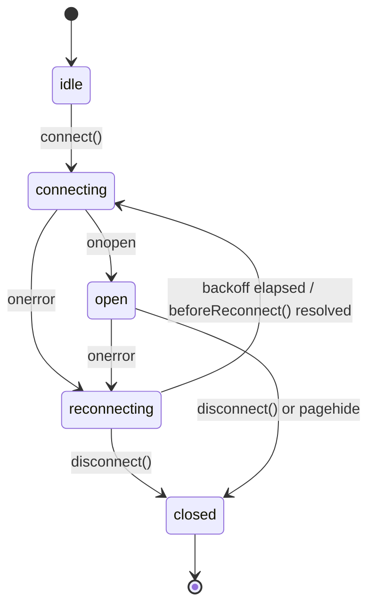

# Frontend: TypeScript architecture, clock rendering, new views

> Elaborates `00-overview.md` for the browser. Payload and topic contracts belong
> to `02-realtime.md`, clock semantics to `03-time-control.md`, routes and the JSON
> envelope to `09-api-reference.md`. This file consumes them.
>
> Stack constraint, unchanged: **vanilla TypeScript, Vite, no framework, no state
> library** (`AGENTS.md:44,221`). Everything below is plain classes and DOM.

## 1. What exists today

Read out of the tree, not remembered.

### 1.1 Three Vite entries, and how a page gets JS

`vite.config.js:47-53` declares exactly three rollup inputs:

| Entry | Input | Loaded by |
|---|---|---|
| `app` | `assets/app.js` | `base.html.twig:14,16`, **every page**, `type="module"`, deferred |
| `play` | `assets/typescript/src/app.ts` | `play.html.twig:75-77` |
| `admin` | `assets/typescript/src/admin.ts` | admin templates |

`assets/app.js` is plain JS: SCSS and FontAwesome imports (`:1-4`), the lightbox
(`:8-45`), a console log (`:47`). No game code, and `tsc` never sees it. Two
conventions this spec reuses: `admin.ts:12-15`, where a controller looks for its
root element and returns early when absent; and
`templates/admin/dashboard.html.twig:86-88` with `admin.ts:16`, where bulk server
state travels as `<script type="application/json" id="...">` read via
`JSON.parse(el.textContent ?? '{}')`. Templates bind to routes by name in
`config/packages/templating.yaml` (resolution at
`vendor/sidus/template-bundle/Event/Subscriber/TemplateSubscriber.php:45-63`), so
a new page is an action returning `array` plus one line of YAML, and file names
are free.

`app.ts`'s `KeresGame` owns the chrome through 15 `getElementById` lookups
(`app.ts:70-84`) and constructs `GameState`, `GameAPI`, `SVGBoardView` and
`GameController`; the controller owns `MercureClient` and all board and network
logic; `utils/boardUtils.ts` holds every binary codec. There is no view layer
between them: `KeresGame` writes DOM directly (`app.ts:344-366` builds the move
table with `createElement`, `:391-398` assigns `innerHTML`).

### 1.2 `GameState` is an imperative bag

202 lines, 13 private fields, getters and setters, **no subscription mechanism**;
the "in-memory reactive state" label at `AGENTS.md:73` is aspirational. Callers
mutate, then separately call render and DOM updates by hand:
`handleMercureUpdate()` does eight mutations (`GameController.ts:47-73`), two
awaits, then a manual `dispatchEvent` (`:76-78`).

### 1.3 The three `window` CustomEvents

The entire cross-component notification surface. All untyped (no `detail`), global
to `window`, never removed.

| Event | Dispatched | Listened | Meaning |
|---|---|---|---|
| `boardStateChanged` | `GameController.ts:78,162,191,390,394` | `app.ts:205-210` | "re-run all four `update*()` chrome functions" |
| `moveSubmitted` | `GameController.ts:163` | `app.ts:213-217` | local submit; drives the hot-seat auto-flip |
| `showUnstackModal` | `GameController.ts:269,313` | `app.ts:200-202` | open the stack chooser |

### 1.4 There is no optimistic local move application

`Board.applyMoveLocally()` (`models/types.ts:128-202`; 75 lines covering move,
unstack, capture, stack, soldier-to-paladin, ballista-to-rook, turn toggle) **has
zero call sites**. A search of `assets/` for `applyMoveLocally` returns exactly one
hit, its own declaration at `types.ts:128`.

Every mutation round-trips. `playMove()` locks, awaits `POST /play/{uuid}/move`,
then sets the board (`GameController.ts:135-141`). `setMoves()` and
`navigateToMoveIndex()` await `api.replayMoves(...)` (`:107`, `:216`), a full engine
replay from move 0 per history step. Then `updatePotentialMoves()` fires **two
more** engine calls: `/api/moves`, and `/api/moves` again with the turn bit inverted
for threats (`:118-123`, `GameAPI.ts:37-49`). A local move therefore costs 3
sequential HTTP calls before the piece visibly moves; a Mercure push costs 2. That
is the latency budget the clock lives inside (§8.3).

This spec **does not** introduce optimistic application: it would put "what does
this move do to the board?" into TypeScript, the exact rules knowledge
`AGENTS.md:31-36` and `00-overview.md` §1 forbid. `applyMoveLocally()` stays dead.

### 1.5 Dead code, and the policy

| Path | Evidence |
|---|---|
| `views/ThreeJSBoardView.ts` (510 lines) | dead, **but type-checked**: `implements IBoardView` at `:49`, matched by `tsconfig.json:21-23` `src/**/*` |
| `utils/spriteLoader.ts` (18 lines) | zero references in `assets/`, `templates/`, `src/`, `vite.config.js` |
| `IBoardView.ts:60-62` `IPieceSpriteLoader` | only declaration |
| `src/pieces.css` | 0 bytes, zero references |
| `boardUtils.ts:34-55` `encodeBoardToHash` / `decodeBoardFromHash` | only declarations; the URL-hash board feature is gone |

**Policy: do not extend dead code, and do not delete it in this work either.** It is
off the multiplayer critical path and removal is a separate reviewable change. One
consequence binds this spec: `ThreeJSBoardView` is compiled by
`npm run type-check`, so **every new `IBoardView` member must be optional**,
following `onDragMove?` and `setCoordinatesVisible?` (`IBoardView.ts:44,49`).

## 2. The three blocking defects

### F1: Mercure is initialised only for AI games

`app.ts:104-110` gates `initializeMercure()` on `this.gameMode === OPPONENT_TYPE_AI`,
where `OPPONENT_TYPE_AI` is the literal `0` (`app.ts:9`). A `HUMAN = 2` game never
opens an `EventSource`, so the opponent's move never arrives and the board is frozen
until reload; this is the client half of the server gate at `SubmitMoveAction.php:68`.
**Fix:** delete the condition. Mercure initialises for **every** game with a UUID,
including hot-seat (the echo is dropped by the `seq` guard, §6.4) and spectators.
`OPPONENT_TYPE_AI`/`_HOTSEAT` (`app.ts:9-10`) become the shared `OPPONENT_TYPE`
const object of §3.1.

### F2: `handleMercureUpdate()` unconditionally unlocks the board

`GameController.ts:72-73` is `this.gameState.setBoardLocked(false)`, commented
"unlock board if it was locked waiting for AI". `boardLocked` is one mutable boolean
(`GameState.ts:19`) written from five places with three unrelated meanings: browsing
history (`:224`), request in flight (`:135,158,166`), AI finished. With two humans,
every push unlocks the board for **both** players.

**Fix.** The lock becomes a derived predicate recomputed after every mutation;
`setBoardLocked()` leaves the public surface and all five call sites go.

```ts
private computeInputLocked(): boolean {
    if (this.status === 'finished')                  return true;
    if (this.submitInFlight)                         return true;   // POST /move pending
    if (!this.isAtLatestMove())                      return true;   // browsing history
    if (this.myColor === null)                       return true;   // spectator
    if (this.locallyFlagged)                         return true;   // §4.5
    if (this.opponentType === OPPONENT_TYPE.HOTSEAT) return false;  // both sides are mine
    return this.sideToMove() !== this.myColor;
}
sideToMove(): Color | null {                 // Board.whiteToMove: types.ts:58
    return this.board === null ? null : (this.board.whiteToMove ? 'white' : 'black');
}
private recomputeLock(): void {              // at the end of every mutation
    const next = this.computeInputLocked();
    if (next !== this.inputLocked) { this.inputLocked = next; this.emit('lock'); }
}
export type LockReason = 'finished' | 'pending' | 'browsing' | 'spectating'
                       | 'flagged' | 'opponent-to-move' | null;  // first matching branch
```

`whiteToMove` is already decoded from byte 81 bit `0x80` of the engine's own format
(`AGENTS.md:110`), so no new rules knowledge enters. The AI case needs no branch:
`myColor` is set and the engine holds the other colour, so "waiting for AI" falls out
for free and `app.ts:321-330`'s three-way status text collapses into §3.3. The reason
is exposed because the causes need different UI (§8.2).

### F3: `data-player-white` cannot express a two-player game

`play.html.twig:20` emits `data-player-white="{{ game.white ? 'true':'false' }}"`,
read at `app.ts:88` and used only at `:118-121` to flip the board. It is backed by
`Game.isWhite`, the column `00-overview.md` §4.1 deletes. No value expresses
"spectator", and none says the other `GamePlayer` row is a different user.

| `#board-container` attribute | Status | Value | Consumer |
|---|---|---|---|
| `data-game-uuid` | keep | UUID | `GameAPI.ts:23`, `GameController` |
| `data-opponent-type` | keep | `0`/`1`/`2` | `app.ts` |
| `data-player-white` | **remove** | | |
| `data-moves` | **remove** | duplicated by the bootstrap payload | |
| `data-viewer-color` | **new** | `white`/`black`/`spectator` | `GameState.myColor` |
| `data-orientation` | **new** | `white`/`black` | initial flip, server-chosen |

`data-viewer-color` derives from the acting user's `GamePlayer` row; hot-seat is
`white`, and orientation then follows move parity exactly as `app.ts:122-126` already
does. `data-orientation` replaces the client-side inference at `app.ts:117-126` so
spectators get a deterministic view and a reload never flips the board under a
player. Everything else moves into one JSON island (§7.3) byte-identical to the
Mercure payload: the frontend expression of `00-overview.md` §3.3 / P0.4.

### F4 (minor, same pass): the meta tag carries a phantom topic

`play.html.twig:7` renders `{{ mercure(url('play', {uuid: game.uuid})) }}`, and
`MercureExtension::mercure()` appends `?topic=<rawurlencoded absolute play URL>`
(`vendor/symfony/mercure/src/Twig/MercureExtension.php:47-60`).
`MercureClient.getMercureUrl()` swallows that whole string (`MercureClient.ts:30-39`)
and appends a **second** `topic=game/{uuid}` (`:50-52`), so every play page subscribes
to two topics, one of which nothing publishes to. **Fix:** the tag moves to
`base.html.twig` and becomes bare `{{ mercure() }}` (hub URL, no topics); the client
owns all `topic` parameters (§6.1).

## 3. State model and reactivity

### 3.1 New types and `GameState` fields

Per `02-realtime.md` §4.0 enums cross the wire as **lowercase snake_case strings**,
so the numeric `PieceColor` never reaches TypeScript. Numeric enums that do (opponent
type) are `as const` objects rather than `enum`: `isolatedModules: true`
(`tsconfig.json:15`) makes `const enum` a liability, and the codebase already uses
bare consts (`app.ts:9-10`).

```ts
// models/types.ts (additions)
export type Color = 'white' | 'black';
export type GameStatus = 'created' | 'ongoing' | 'finished';
export type EndReason = 'none' | 'engine' | 'resignation' | 'timeout'
                      | 'abandonment' | 'draw_agreed' | 'aborted';
export type GameResult = Color | 'draw' | null;
export const OPPONENT_TYPE = {AI: 0, HOTSEAT: 1, HUMAN: 2} as const;
export type OpponentType = typeof OPPONENT_TYPE[keyof typeof OPPONENT_TYPE];
/** Wire sub-objects, defined once in 02-realtime.md §4.0. */
export interface PlayerRef { uuid: string; username: string; rating: number | null; provisional: boolean; }
export interface TimeControlRef { kind: ClockKind; initialSeconds: number | null;
    incrementSeconds: number | null; daysPerMove: number | null; speed: string | null; }
/** View model: PlayerRef plus per-game facts. */
export interface PlayerInfo extends Partial<PlayerRef> { color: Color;
    username: string | null;  // null = engine
    avatarUrl: string | null; isEngine: boolean; isMe: boolean; }
export interface RatingDelta { before: number; after: number; delta: number; }
export interface Offers { draw: Color | null; rematch: Color | null; }
```

Added to `GameState` beside the existing 13 fields: `gameUuid`, `myColor`,
`opponentType`, `players: Record<Color, PlayerInfo>`, `seq`, `status`, `endReason`,
`result`, `clock: ClockSnapshot | null`, `offers`,
`presence: {white: boolean; black: boolean}`,
`rating: Record<Color, RatingDelta> | null`, the derived `inputLocked` /
`lockReason`, and the internal `locallyFlagged`, `submitInFlight`, `connection`.
`rating` is null until the game is both finished and rated; per `06-rating.md`,
Glicko-2 deltas **do not sum to zero** (a newcomer can gain +175 while an established
opponent loses -5), so each side renders from its own payload field and one side's
delta is never derived from the other's.

### 3.2 Reactivity: a typed observer, not window events

**Decision: a minimal typed observer on `GameState`.** Reasons, weighted. First,
`boardStateChanged` means "something changed, re-render everything"; today that is
four functions (`app.ts:205-210`), after this spec it is twelve DOM regions, and
every payload carries a clock, so every payload would rebuild the whole move table
(`app.ts:344-366`, one `createElement` per cell) and both material bars, once per ply
per push. Second, `window` is shared by all Vite entries plus `app.js`, so a `lobby`
page and a `play` page dispatching one name is a latent collision, and `CustomEvent`
gives no type safety on `detail`. Third, listeners are never removed
(`app.ts:200,205,213`), so nothing is disposable.

The 10 Hz clock is **not** among the reasons: it bypasses the observer entirely,
driven by one `requestAnimationFrame` loop calling `ClockView.tick()` directly
(§4.3). The observer carries discrete transitions only.

```ts
export type GameStateKey =
    | 'board' | 'lock' | 'clock' | 'offers' | 'presence' | 'status' | 'rating'
    | 'players' | 'selection' | 'connection' | 'moveSubmitted' | 'unstackPrompt';
export type Unsubscribe = () => void;
subscribe(key: GameStateKey, cb: () => void): Unsubscribe;
private emit(key: GameStateKey): void;   // called from the setters
transaction<T>(fn: () => T): T;          // coalesce a burst: one emit per key, synchronous flush
```

Callbacks take **no argument**; subscribers pull from the getters that already exist.
That keeps the observer at roughly 25 lines with no generic payload map and no change
to the existing style. `applyPayload()` (§6.4) wraps itself in `transaction()`, so a
payload touching board, clock, offers and presence fires four callbacks once each,
after all mutations have landed.

### 3.3 Migration of the three window events

| Old | New |
|---|---|
| the five `dispatchEvent('boardStateChanged')` (`GameController.ts:78,162,191,390,394`) | deleted; `emit('board')` moves **into** `setBoard`/`setMoveList`/`setCurrentMoveIndex` so no caller can forget it |
| `addEventListener('boardStateChanged')` (`app.ts:205-210`) | four subscriptions: `board` for move table, nav buttons and material; `lock` + `status` for the status line |
| `moveSubmitted` (`GameController.ts:163`, `app.ts:213-217`) | `emit('moveSubmitted')`, kept distinct because `board` also fires for *remote* moves and the hot-seat flip must not trigger on those |
| `showUnstackModal` (`GameController.ts:269,313`, `app.ts:200-202`) | `requestUnstackPrompt()` then `emit('unstackPrompt')`; the modal is opened by `utils/dialog.ts` (§9.2), not `classList.add('is-active')` |

After migration `src/` contains **zero** `window.dispatchEvent` and zero
`window.addEventListener` for application events; only `resize`, `visibilitychange`,
`online`/`offline` and `pagehide` remain. `window.__keresDebug`
(`app.ts:31-35,149-173`) is kept and extended (§10).

## 4. Clock rendering

The display must be smooth, must never lie in the player's favour, and must never
assert a result the server has not confirmed (`00-overview.md` §8, invariant 6).

### 4.1 What the server sends, and two invariants

`clock: {kind, whiteMs, blackMs, running, turnStartedAt, deadlineAt}` plus a
top-level `serverTime`. All timestamps are **integer microseconds since epoch**
(`02-realtime.md` §4.0); `1.73e15` is far below `Number.MAX_SAFE_INTEGER`
(`9.007e15`), exact until roughly year 2255, so plain `number` and no `BigInt`.
`whiteMs`/`blackMs` are the values **as of `turnStartedAt`**, with the running side's
figure not pre-decremented, and
`deadlineAt === turnStartedAt + remaining(running) * 1000`. The contract's own
example satisfies it, `1732650180123456 - 1732650000123456 = 180000000 us = 180000 ms
= whiteMs`. `deadlineAt` is therefore the primary anchor: it is the same value
`ClockAdjudicator` compares against (`Game.move_deadline_at`), so client and server
flag on one number. `turnStartedAt + base` is the fallback when it is null.

### 4.2 Clock-offset estimation

The wall clock is untrusted (user-settable, NTP-steppable). `performance.now()` is
monotonic and step-immune, so all clock arithmetic uses it and `Date.now()` never
appears in clock code.

```ts
// models/clock.ts
export const SYNC_WINDOW_MS = 60_000;
export class ClockSync {
    /** @param rttMs supplied only for responses we initiated. */
    ingest(serverTimeUs: number, recvMonotonicMs: number, rttMs?: number): void {
        const serverMs = serverTimeUs / 1000;
        const sample = rttMs === undefined
            ? serverMs - recvMonotonicMs                 // SSE: lower bound
            : serverMs - (recvMonotonicMs - rttMs / 2);  // HTTP: NTP midpoint
        this.samples.push({offset: sample, at: recvMonotonicMs});
        this.samples = this.samples.filter(s => s.at >= recvMonotonicMs - SYNC_WINDOW_MS);
        this.offset = Math.max(...this.samples.map(s => s.offset));
    }
    serverNowMs(): number { return performance.now() + this.offset; }
    offsetMs(): number;
    get sampleCount(): number;
}
```

Why `max` and not a mean: if a payload left the server at server-time `S` and arrived
at local monotonic `R` after transit `D >= 0`, the true offset is `(S - R) + D`, so
`S - R` is a **lower bound**. The maximum over a window is the tightest available
bound and is robust to a single slow delivery in a way a mean is not; the 60 s window
bounds how long one lucky sample can dominate. Samples come from the
`#game-bootstrap` island at parse time (no RTT, loose because it includes HTML
transfer, immediately improved), from `POST /play/{uuid}/move` and
`GET /play/{uuid}/state` (RTT measured by `network/http.ts` bracketing `fetch` with
`performance.now()`), and from every Mercure `onmessage` (no RTT). A payload rejected
by the `seq` guard (§6.4) is still ingested **first**: a stale snapshot's `serverTime`
remains a valid lower bound on server time.

### 4.3 Interpolation and the rAF loop

```ts
export type ClockKind = 'unlimited' | 'realtime' | 'correspondence';
export interface ClockSnapshot { kind: ClockKind; whiteMs: number; blackMs: number;
    running: Color | null; turnStartedAtUs: number | null; deadlineAtUs: number | null; }
/** Mirrors MultiplayerLimits::CLOCK_LAG_COMPENSATION_MS. */
export const DISPLAY_SAFETY_MS = 100;
export function remainingMs(s: ClockSnapshot, side: Color, serverNowMs: number): number {
    const base = side === 'white' ? s.whiteMs : s.blackMs;
    if (s.kind === 'unlimited') return Number.POSITIVE_INFINITY;
    if (s.running !== side) return base;                        // idle side: frozen
    const deadlineMs = s.deadlineAtUs !== null
        ? s.deadlineAtUs / 1000
        : (s.turnStartedAtUs as number) / 1000 + base;
    return Math.max(0, deadlineMs - serverNowMs - DISPLAY_SAFETY_MS);
}
```

`DISPLAY_SAFETY_MS` biases the running clock **pessimistically**. §4.2's offset is a
lower bound on server time, which under-estimates elapsed time and would show the
player *more* time than they have, the one error direction that can cost a game.
Subtracting 100 ms (the magnitude the server credits back per move; see
`03-time-control.md`) makes the display a lower bound on reality: invisible above
10 s where the quantum is a whole second, present exactly where it matters. Applied
only when `isMe`; spectators see the unbiased value.

One `requestAnimationFrame` loop per page drives every clock, because two independent
loops would tear:

```
frame(): now = sync.serverNowMs()
         for (view of views) view.tick(now)
         if (running && !document.hidden) rafId = requestAnimationFrame(frame)
```

`tick()` computes, formats, and **writes the DOM only when the string changed**. That
self-throttles to 1 write/s above 10 s and 10 writes/s below it regardless of the
60 Hz callback rate: formatting 60 short strings per second is free, the DOM write is
what costs.

### 4.4 Display precision

Lichess convention, per side, **floor** everywhere, because rounding up would display
time the player does not have. `formatClock(9_999)` is `0:09.9`;
`formatClock(10_400)` is `0:10`.

| Remaining | Format | Example |
|---|---|---|
| `>= 1 h` | `H:MM:SS` | `1:05:03` |
| `10 s .. 1 h` | `M:SS` | `3:07` |
| `< 10 s` | `M:SS.d` | `0:09.4` |
| `0` | `0:00.0` | |
| corr. `>= 48 h` / `1..48 h` / `< 1 h` | `Nd` / `Nd HH:MM` / `MM:SS` | `3d`, `1d 04:12`, `47:03` |
| `unlimited` | element not rendered | |

The `M:SS.d` band keeps the full `M:SS` skeleton rather than collapsing to a bare
`9.4`, so width never changes; with `font-variant-numeric: tabular-nums` the digits
do not jitter.

```ts
export function formatClock(ms: number, kind: ClockKind): string;
export type Urgency = 'none' | 'low' | 'critical' | 'flagged';
export function urgency(ms: number, kind: ClockKind): Urgency;
// realtime: >30s none | <=30s low | <=10s critical | <=0 flagged
// correspondence: >6h none | <=6h low | <=1h critical | <=0 flagged; unlimited: always none
```

### 4.5 Local zero, and server corrections

On reaching zero, render `0:00.0` and apply `is-flagged`; set `locallyFlagged`, which
locks input with `lockReason = 'flagged'`; set the status line to "Time expired,
waiting for the server". **Do not** set `status`, `result` or `endReason`, and **do
not** stop the other clock: the game ends only when a payload says so
(`00-overview.md` §8, invariants 5 and 6). The one active step is taken only by the
side that did *not* flag:

```
onLocalFlag(flaggedSide):
  if (myColor === null || myColor === flaggedSide) return    // spectator / flagger: passive
  wait CLOCK_EXPIRY_GRACE_MS (500) + random(0..250)
  POST /play/{uuid}/claim-timeout
  if non-2xx, or the returned payload is still 'ongoing': retry once at +2000 ms, then stop
```

`03-time-control.md` D4's delayed Messenger message is the primary mechanism; the
claim is a safety net, idempotent server-side, so a duplicate is harmless.

Corrections follow two rules. **Monotone within a turn:** while `turnStartedAtUs` is
unchanged, `displayed = min(displayedPrev, computed)`, which absorbs offset
re-estimation (which can only push `serverNow` forward, i.e. the clock down) and any
late payload. **Free re-base across a turn:** when `turnStartedAtUs` changes, both
sides re-base without clamping, which is where the Fischer increment legitimately
makes a clock jump up and where the mover absorbs §1.4's three round trips.
`SNAP_THRESHOLD_MS = 250`: a larger within-turn correction is `console.debug`-ed in
dev (bad offset estimate, or a reordered payload) but still applied immediately.
There is no animated slide toward the corrected value; a clock that visibly slides is
worse than one that steps.

### 4.6 Hidden tabs, and urgency

`requestAnimationFrame` does not fire in a background tab, so the loop already stops;
make it explicit and correct on the way back. Interpolation is a pure function of
`serverNowMs()` and the last snapshot, so a tab hidden ten minutes needs no catch-up
loop: the first frame after resume renders the correct value, or `0:00.0` plus §4.5.

| Event | Action |
|---|---|
| `visibilitychange` to hidden | `ticker.stop()`, suspend the urgency `AudioContext` |
| `visibilitychange` to visible | resync (§6.5), then `ticker.flush()` and `start()` |
| `pagehide` | `ticker.stop()`, `mercure.disconnect()`, `sendBeacon` a pending seek cancel |
| `online` | resync and reconnect |

| Urgency band | Visual | Audio |
|---|---|---|
| `low` (<= 30 s) | `.clock.is-low`, amber | none |
| `critical` (<= 10 s) | `.clock.is-critical`, red plus a 1 Hz opacity pulse | 40 ms 880 Hz blip on each whole second, 10 down to 1 |
| `flagged` | `.clock.is-flagged`, desaturated red, no pulse | one 200 ms 220 Hz tone |

Audio constraints, all mandatory: only **my own** clock; only when
`document.hasFocus()`; `AudioContext` created lazily on the first board interaction
(browsers refuse one without a gesture) and suspended when hidden; gated by a mute
toggle in `localStorage` under `keres.sound` (default on), surfaced in the play
controls and account settings. No audio files: one `OscillatorNode` plus `GainNode`,
gain 0.05, 5 ms attack and release to avoid clicks, zero bundle bytes. The pulse is
disabled under `prefers-reduced-motion` (§9.3); the colour is kept.

### 4.7 `ClockView`

```ts
// views/ClockView.ts
export interface ClockViewOptions {
    root: HTMLElement;        // the `.clock` element; role="timer", aria-live="off"
    color: Color;
    isMe: boolean;            // gates audio urgency and DISPLAY_SAFETY_MS
    announcer?: HTMLElement;  // shared polite live region, §9.1
}
export class ClockView {
    constructor(options: ClockViewOptions);
    update(snapshot: ClockSnapshot): void;    // re-base; applies §4.5
    tick(serverNowMs: number): void;          // driven by ClockTicker
    setActive(active: boolean): void;         // this side is to move
    remainingMs(): number;                    // displayed value; Infinity if unlimited
    text(): string;                           // string currently in the DOM
    urgency(): Urgency;
    onFlag(cb: (color: Color) => void): void; // once per turn, on first reaching 0
    setSoundEnabled(enabled: boolean): void;
    dispose(): void;
}
export class ClockTicker {
    constructor(sync: ClockSync);
    add(view: ClockView): void;  remove(view: ClockView): void;
    start(): void;  // idempotent; no-op while document.hidden
    stop(): void;
    flush(): void;  // one synchronous frame, after a payload or on resume
}
```

`ClockView` owns no timer. It is pure `update` plus `tick` plus DOM, drivable from the
console with synthetic times.

## 5. New and modified modules

Layout respects the existing split (`AGENTS.md:65-79`).

```
assets/typescript/src/
  app.ts                    MOD  play entry: F1/F3 fixes, observer wiring
  app-shell.ts              NEW  every page: user SSE, toasts, notification bell
  lobby.ts                  NEW  entry for lobby/friends/profile/challenge/settings/leaderboard
  controllers/
    GameController.ts       MOD  applyPayload(), F2 fix, clocks and panels
    AppShellController.ts   NEW  UserEventClient -> toasts, bell, in-tab notifications
    LobbyController.ts      NEW  seek pool, quick pair, heartbeat
    ChallengeController.ts  NEW  create / accept / decline / cancel, landing page
    FriendsController.ts    NEW  requests, list, block, username search
  models/
    types.ts                MOD  Color, GameStatus, EndReason, OPPONENT_TYPE, PlayerRef
    GameState.ts            MOD  new fields, typed observer, derived lock
    clock.ts                NEW  ClockSync, ClockSnapshot, remainingMs, formatClock, urgency
    payload.ts              NEW  wire types and parsers for the three payloads
    materialDiff.ts         --   unchanged; now called by PlayerPanelView
  network/
    http.ts                 NEW  fetch wrapper: JSON envelope, ApiError, RTT capture
    GameAPI.ts              MOD  uses http.ts; game actions; drops the inline base64 loop
    LobbyAPI.ts             NEW  lobby / challenge / friends / notifications / push
    MercureClient.ts        MOD  multi-topic, payload-agnostic, reconnect state machine
    UserEventClient.ts      NEW  user/{uuid} subscription and event routing
  utils/
    boardUtils.ts           MOD  + decodeBoardFromBase64 (all codecs stay here)
    dialog.ts               NEW  accessible modal: focus trap, ESC, focus restore
    toast.ts                NEW  transient messages
    notifications.ts        NEW  Notification permission and Web Push subscription
    heartbeat.ts            NEW  interval + visibility-aware pinger
    format.ts               NEW  time-control / rating / relative-time labels
  views/
    IBoardView.ts           MOD  + optional setLockReason?()
    SVGBoardView.ts         MOD  implements setLockReason()
    ClockView.ts            NEW  ClockView and ClockTicker (§4.7)
    PlayerPanelView.ts      NEW  identity, rating, presence, material, clock slot
    GameControlsView.ts     NEW  delegated [data-action] bar and confirmations
```

### 5.1 Public interfaces

```ts
// network/http.ts
export class ApiError extends Error {
    readonly code: string;      // snake_case, 09-api-reference.md §9
    readonly status: number;
    readonly details: Record<string, unknown>;
}
export interface RequestOptions { method?: 'GET' | 'POST';
    body?: unknown;             // JSON-encoded unless BodyInit
    signal?: AbortSignal;
    onTiming?: (rttMs: number, receivedAtMs: number) => void;   // feeds ClockSync
}
/** Unwraps {"data": T}; throws ApiError on {"error": {...}} or transport failure. */
export function request<T>(path: string, options?: RequestOptions): Promise<T>;

// models/payload.ts
export interface GameStatePayload {
    type: 'game.state'; gameUuid: string; seq: number;
    board: string; moves: string;                 // base64: 83 bytes / 2N bytes
    status: GameStatus; endReason: EndReason; result: GameResult;
    clock: {kind: ClockKind; whiteMs: number; blackMs: number; running: Color | null;
            turnStartedAt: number | null; deadlineAt: number | null};
    offers: {draw: Color | null; rematch: Color | null};
    presence: {white: boolean; black: boolean};
    rating: Record<Color, RatingDelta> | null;
    serverTime: number;                           // microseconds
}
export type NotificationTypeName =
    | 'challenge_received' | 'challenge_accepted' | 'challenge_declined'
    | 'friend_request' | 'friend_accepted' | 'your_turn' | 'game_finished'
    | 'seek_matched' | 'draw_offered' | 'rematch_offered';
export interface NotificationRow { uuid: string; type: NotificationTypeName;
    payload: Record<string, unknown>; readAt: number | null; createdAt: number; }
export interface UserEventPayload { type: NotificationTypeName;
    notificationUuid: string;   // idempotency key; user/{uuid} carries no seq
    payload: Record<string, unknown>; serverTime: number; }
export interface SeekEventPayload { type: 'seek.open' | 'seek.closed';
    seekUuid: string; seek: SeekSummary | null; serverTime: number; }
export function parseGameState(raw: string | unknown): GameStatePayload;  // throws on mismatch
export function parseUserEvent(raw: string | unknown): UserEventPayload;
export function parseSeekEvent(raw: string | unknown): SeekEventPayload;
export function toClockSnapshot(p: GameStatePayload): ClockSnapshot;
```

`parse*` validate discriminants and field presence and throw on mismatch, because a
malformed push must never half-apply. Base64 decoding is **not** done here:
`payload.ts` calls `decodeBoardFromBase64()` and `decodeMoveListFromBase64()` from
`utils/boardUtils.ts` per `AGENTS.md:116-117`. That deletes the two hand-rolled `atob`
loops at `MercureClient.ts:73-92` and `GameAPI.ts:95-101`, and the inline u16
bit-unpacking at `GameController.ts:51-57` which duplicates `decodePotentialMove`
(`boardUtils.ts:174-181`).

```ts
// network/LobbyAPI.ts   (paths fixed by 09-api-reference.md; that file wins on drift)
export type ColorPreference = 'white' | 'black' | 'random';
export interface TimeControlInput { kind: ClockKind; initialSeconds?: number;
    incrementSeconds?: number; daysPerMove?: number; }
export interface SeekInput extends TimeControlInput { rated: boolean;
    colorPreference: ColorPreference; ratingMin?: number; ratingMax?: number; autoWiden: boolean; }
export interface SeekSummary { uuid: string; player: PlayerRef; timeControl: TimeControlRef;
    rated: boolean; colorPreference: ColorPreference; createdAtUs: number; isMine: boolean; }
export type QuickPairPreset = '1+0' | '3+2' | '5+0' | '10+0' | '15+10' | 'corr1' | 'corr3' | 'corr7';
export interface SeekCreateResult { seek: SeekSummary;
    matched: {gameUuid: string} | null;   // immediate pairing inside the same transaction
    deduped: boolean; }                   // an OPEN seek already existed; not an error
export interface ChallengeInput extends TimeControlInput { username?: string;  // omitted = open link
    rated: boolean; colorPreference: ColorPreference; }
export interface ChallengeSummary { uuid: string; challenger: PlayerRef;
    challenged: PlayerRef | null;         // null = open shareable link
    timeControl: TimeControlRef; rated: boolean; colorPreference: ColorPreference;
    status: 'pending' | 'accepted' | 'declined' | 'canceled' | 'expired';
    url: string; createdAtUs: number; expiresAtUs: number; gameUuid: string | null; }
export interface FriendSummary { id: number; player: PlayerRef; online: boolean;
    status: 'pending' | 'accepted' | 'declined' | 'blocked'; incoming: boolean; }
export class LobbyAPI {
    listSeeks(): Promise<SeekSummary[]>;                                    // GET  /lobby/seeks
    /** 09-api-reference.md §4.2: may pair immediately, and dedupes an existing OPEN seek. */
    createSeek(input: SeekInput): Promise<SeekCreateResult>;                // POST /lobby/seeks
    quickPair(preset: QuickPairPreset, rated: boolean): Promise<SeekCreateResult>;
    heartbeatSeek(uuid: string): Promise<{status: 'open' | 'matched'; gameUuid: string | null;
                                          widenedTo: {min: number; max: number} | null}>;
    cancelSeek(uuid: string): Promise<void>;
    acceptSeek(uuid: string): Promise<{gameUuid: string}>;
    createChallenge(i: ChallengeInput): Promise<{challengeUuid: string; url: string}>;
    listChallenges(): Promise<{incoming: ChallengeSummary[]; outgoing: ChallengeSummary[]}>;
    acceptChallenge(uuid: string): Promise<{gameUuid: string}>;
    declineChallenge(uuid: string): Promise<void>;
    cancelChallenge(uuid: string): Promise<void>;
    listFriends(): Promise<FriendSummary[]>;                                // GET  /friends/list
    requestFriend(username: string): Promise<void>;                         // POST /friends/request
    respondFriend(id: number, accept: boolean): Promise<void>;
    removeFriend(id: number): Promise<void>;
    blockUser(username: string): Promise<void>;
    unblockFriend(username: string): Promise<void>;              // POST /friends/{username}/unblock
    searchPlayers(q: string, signal?: AbortSignal): Promise<PlayerRef[]>;   // GET  /players/search
    unreadCount(): Promise<number>;                                         // GET  /notifications/unread-count
    listNotifications(page?: number): Promise<NotificationRow[]>;           // GET  /notifications/list
    markRead(uuid: string): Promise<{unread: number}>;                      // POST /notifications/{uuid}/read
    markAllRead(): Promise<void>;
    savePreferences(prefs: Record<string, boolean>): Promise<void>;
    pushPublicKey(): Promise<string>;                                       // GET  /push/public-key
    subscribePush(sub: PushSubscriptionJSON): Promise<void>;
    unsubscribePush(endpoint: string): Promise<void>;
}

// network/UserEventClient.ts
export class UserEventClient {
    constructor(userUuid: string);
    start(): void; stop(): void;
    on(type: NotificationTypeName, cb: (e: UserEventPayload) => void): Unsubscribe;
    onAny(cb: (e: UserEventPayload) => void): Unsubscribe;
    onStateChange(cb: (s: ConnectionState) => void): Unsubscribe;
    readonly state: ConnectionState;
}
```

The user topic carries **no `seq`** (`02-realtime.md`), so duplicate suppression uses
`notificationUuid` against a bounded LRU of the last 200 ids. That is the same uuid
the Web Push `tag` uses, so a push and an in-tab event for one notification collapse
into a single visible message.

```ts
// views/PlayerPanelView.ts
export class PlayerPanelView {
    constructor(root: HTMLElement, options: {color: Color; announcer?: HTMLElement});
    setPlayer(info: PlayerInfo): void;
    setPresence(online: boolean, lastSeenMs: number | null): void;
    setToMove(toMove: boolean): void;
    setOffer(offer: 'draw' | 'rematch' | null): void;
    setMaterial(html: string): void;            // from materialDiff.renderMaterialHTML()
    setRatingDelta(delta: RatingDelta | null): void;
    clock(): ClockView;
    dispose(): void;
}
// views/GameControlsView.ts
export type GameAction = 'resign' | 'abort' | 'claim-timeout'
    | 'offer-draw' | 'accept-draw' | 'decline-draw'
    | 'offer-rematch' | 'accept-rematch' | 'decline-rematch'
    | 'flip' | 'toggle-threats' | 'toggle-coords' | 'undo' | 'ask-engine' | 'return-to-live';
export class GameControlsView {
    constructor(root: HTMLElement);
    onAction(cb: (a: GameAction, button: HTMLButtonElement) => void): void;  // one delegated listener
    setAvailability(state: Partial<Record<GameAction, boolean>>): void;
    setPending(a: GameAction, pending: boolean): void;
    setLabel(a: GameAction, label: string): void;
    dispose(): void;
}
```

The panel absorbs `#material-top`/`#material-bottom` (`play.html.twig:13,21`,
`app.ts:83-84`); the orientation logic at `app.ts:387-398` moves to whoever owns the
two panels and still keys off `isBoardFlipped()`. `GameControlsView` replaces the
eight `getElementById` plus eight `addEventListener` pairs at `app.ts:75-82,187-197`
with one delegated listener over `[data-action]`.

```ts
// utils/toast.ts
export type ToastLevel = 'info' | 'success' | 'warning' | 'danger';
export interface ToastOptions { level?: ToastLevel;   // default 'info'
    timeoutMs?: number;                               // default 6000; 0 = sticky
    action?: {label: string; href?: string; onClick?: () => void};
    key?: string; }                                   // same key replaces instead of stacking
export function toast(message: string, options?: ToastOptions): () => void;  // returns dismiss
export function clearToasts(): void;

// utils/notifications.ts   (companion to 07-notifications.md)
export type PermissionState = 'default' | 'granted' | 'denied' | 'unsupported';
export function permission(): PermissionState;
export function requestPermission(): Promise<PermissionState>;
export function isPushSupported(): boolean;
export function currentSubscription(): Promise<PushSubscriptionJSON | null>;
export function subscribePush(vapidPublicKey: string): Promise<PushSubscriptionJSON>;
export function unsubscribePush(): Promise<boolean>;
/** In-tab fallback; no-ops unless permission === 'granted' and document.hidden. */
export function notifyInTab(title: string, o: {body: string; tag: string; url?: string}): void;

// utils/dialog.ts
export interface DialogOptions { root: HTMLElement; labelledBy: string;
    onClose?: (reason: 'escape' | 'backdrop' | 'action') => void; initialFocus?: HTMLElement; }
export class Dialog { constructor(options: DialogOptions);
    open(): void; close(reason?: 'escape' | 'backdrop' | 'action'): void;
    readonly isOpen: boolean; dispose(): void; }
export function confirmDialog(o: {title: string; body: string;
    confirmLabel: string; danger?: boolean}): Promise<boolean>;

// utils/heartbeat.ts
export class Heartbeat {
    constructor(o: {intervalMs: number; beat: () => Promise<void>;
        pauseWhenHidden?: boolean; onError?: (e: unknown) => void});
    start(): void; stop(): void; beatNow(): Promise<void>; }

// utils/format.ts
export function formatTimeControl(tc: TimeControlRef): string;      // "3+2", "7 days", "Unlimited"
export function formatRating(rating: number | null, provisional: boolean): string;  // "1523?", "-"
export function formatRatingDelta(d: RatingDelta | null): string;   // "+8", "-11", ""
export function relativeTime(epochMs: number): string;              // "3 min ago"
export function speedIcon(category: string): string;                // FontAwesome class

// controllers/* - uniform shape, each guarded by root presence (admin.ts:12-15)
export class LobbyController     { constructor(api: LobbyAPI, root: HTMLElement);
                                   init(): Promise<void>; dispose(): void; }
export class ChallengeController { constructor(api: LobbyAPI, root: HTMLElement); /* idem */ }
export class FriendsController   { constructor(api: LobbyAPI, root: HTMLElement); /* idem */ }
export class AppShellController  { constructor(userUuid: string);
                                   init(): void; dispose(): void; }
```

`Heartbeat` is used twice, with **different** constants. The seek beat runs at
`SEEK_HEARTBEAT_INTERVAL_MS` (10 000). The in-game presence beat
(`POST /play/{uuid}/presence`) runs at `DISCONNECT_ABANDON_SECONDS / 6`, also 10 s
but a distinct constant, **only while the tab is visible**, and it is
`pauseWhenHidden: true`. Its 200 body carries the current `{presence: {white, black}}`
pair (`09-api-reference.md` §4.4), so the client learns its opponent's state from its
own beat without waiting for an SSE frame; feed that straight into `emit('presence')`.

**`LobbyController`**, spelled out because the signature hides it: render the seek
table from `GET /lobby/seeks` and keep it live from `lobby/seeks` (`seek.open`
inserts, `seek.closed` removes); own at most one of *my* seeks; run a `Heartbeat`
while it is open; render the widening window as a countdown derived from
`QUICK_PAIR_WINDOW_BASE + QUICK_PAIR_WIDEN_PER_SECOND * elapsed`, clamped to
`QUICK_PAIR_WINDOW_MAX` and **display only** since the server does the real widening
(`04-matchmaking.md`); cancel on `pagehide` via `navigator.sendBeacon`; navigate to
`/play/{uuid}` when the heartbeat or a `seek_matched` user event returns a game.
**`AppShellController`**: subscribe `user/{uuid}`; map each `NotificationTypeName` to
a toast plus, when `document.hidden`, an in-tab `Notification` (`07-notifications.md`
owns the push path and the preference matrix); maintain the bell badge from
`GET /notifications/unread-count`, decrementing locally on read.

## 6. `MercureClient` generalisation

### 6.1 Multi-topic, payload-agnostic

Today the class is hard-wired: one topic built from a game UUID
(`MercureClient.ts:50`), one `GameUpdate` shape decoded inline (`:95-103`), one dedup
rule.

```ts
export type ConnectionState = 'idle' | 'connecting' | 'open' | 'reconnecting' | 'closed';
export interface MercureOptions {
    topics: string[];                        // 1..n, appended as repeated `topic` params
    onMessage: (raw: string, event: MessageEvent) => void;
    onStateChange?: (state: ConnectionState) => void;
    beforeReconnect?: () => Promise<void>;   // refresh cookie + resync before retrying
}
export class MercureClient {
    static hubUrl(): string;                 // meta[name=mercure-url], hub only, no topics (F4)
    constructor(options: MercureOptions);
    connect(): void; disconnect(): void;
    readonly state: ConnectionState;
    readonly topics: readonly string[];
}
```

The class no longer knows what a game is: it hands up the raw `event.data` string,
and callers apply the matching `parse*` from `models/payload.ts`.

### 6.2 Three instances, not one multiplexed subscription

| Instance | Topics | Owner | Lifetime |
|---|---|---|---|
| game | `game/{uuid}` | `GameController` | the play page |
| user | `user/{uuid}` (private) | `AppShellController` | the whole session, every page |
| lobby | `lobby/seeks` | `LobbyController` | the lobby page |

`topics: string[]` exists because the hub accepts repeated `topic` parameters, but
these three stay separate deliberately: lifetimes differ (the user subscription
outlives any page), resync actions differ (§6.5), and `EventSource` offers no
per-topic demultiplexing, so a merged stream would have to be re-split on the payload
`type` discriminator, reintroducing by hand the separation the transport already
provides.

### 6.3 Connection lifecycle



The browser's own `EventSource` retry handles transient blips. Once
`readyState === CLOSED` the browser has given up, and the client reconnects with
**full-jitter** backoff, base 1 s, cap 30 s:
`delay = random(0, min(30_000, 1000 * 2 ** attempt))`.

**An expired subscriber cookie is fatal, not degrading.** The hub returns 401 when a
JWT is present but expired, even with `anonymous` on (`02-realtime.md` §3), so a
long-lived tab loses even public game updates, and the cookie is `HttpOnly` so JS
cannot read its expiry. Two required countermeasures: a timer-driven silent refresh
at 50 % of the 12 h JWT lifetime, where any authenticated request re-issues it
through the `kernel.response` listener so the refresh is a plain
`GET /notifications/unread-count`; and, on the **first** `onerror` after a healthy
`open`, one immediate refresh-and-retry before entering backoff.

`onStateChange` drives a chip: `open` renders nothing, `reconnecting` an amber
"Reconnecting..." pill, three consecutive failures a sticky `danger` toast with a
Reload action. On a live clock, silently losing updates is worse than a visible
warning.

### 6.4 `seq` dedup replaces `lastTimestamp`

`MercureClient.lastTimestamp` (`:19,64-69`) is deleted. Dedup moves up to
`GameController`, because the authoritative sequence arrives over **three** transports
and one guard must cover all of them.

```ts
private lastSeq = -1;
applyPayload(p: GameStatePayload, source: 'bootstrap' | 'http' | 'sse'): boolean {
    this.sync.ingest(p.serverTime, performance.now());   // always: a valid time bound
    if (p.seq <= this.lastSeq) return false;             // contract: drop seq <= lastSeq
    this.lastSeq = p.seq;
    this.state.transaction(() => { /* board, clock, offers, presence, status, rating */ });
    return true;
}
```

`seq === Game.version` (`00-overview.md` §8, invariants 8 and 9), so ordering is total
and free. Consequences: the HTTP move response and the Mercure echo of that move carry
the **same** `seq`, whichever lands first wins, and that is what makes F1's
unconditional subscription safe in hot-seat; presence transitions bump `Game.version`
server-side (`02-realtime.md`), so an opponent going offline arrives as an ordinary
payload with a fresh `seq` and needs no separate channel; and a gap
(`seq > lastSeq + 1`) is not an error, since every payload is a full snapshot, but it
emits one `console.debug` in dev so gaps stay observable.

### 6.5 Resync, not replay

`02-realtime.md` specifies `transport local` and a mandatory HTTP resync: **do not
depend on `Last-Event-ID`.** Replaying stale full snapshots is waste, and replaying
`user/{uuid}` on reconnect would re-fire `your_turn` and `challenge_received` toasts
the user already dismissed. On every reconnect, on `visibilitychange` to visible after
more than 5 s hidden, and on `online`:

| Subscription | Resync | Then |
|---|---|---|
| game | `GET /play/{uuid}/state` with `If-None-Match: "<lastSeq>"` | 304 means nothing changed; on 200, `applyPayload(p, 'http')` and `ticker.flush()` |
| user | `GET /notifications/unread-count` | badge only, no toasts |
| lobby | `GET /lobby/seeks` | replace the table wholesale |

The resync is issued **before** the `EventSource` re-opens, so anything arriving during
the gap is either older (dropped by `seq`) or newer (applied normally). The 304 branch
is safe to trust: `09-api-reference.md` §4.4 defines the `ETag` on `GET .../state` as
the **post-adjudication** `seq`, and adjudication bumps `Game.version` whenever it
finalises a game, so a flag-fall that happened while the tab was disconnected always
changes the ETag and forces the 200. A 304 therefore means genuinely nothing changed,
never "a result you have not seen yet". See `02-realtime.md` §6.

## 7. Vite entries, pages, and the Twig/TS contract

### 7.1 Entries: add exactly one

| Entry | Input | Pages |
|---|---|---|
| `app` | `assets/app.js` | every page; now also `import './typescript/src/app-shell';` |
| `play` | `assets/typescript/src/app.ts` | play |
| `lobby` | `assets/typescript/src/lobby.ts` | lobby, friends, profile, challenge, settings, leaderboard |
| `admin` | `assets/typescript/src/admin.ts` | admin |

**The app shell folds into `app` rather than getting its own entry.** The user topic,
toasts and the bell must run everywhere, and `app.js` is already loaded everywhere as
a deferred module (`base.html.twig:14,16`); importing a TS module from it puts the
shell under `tsc` (`tsconfig.json:21-23` covers `src/**/*`, while `app.js` itself stays
invisible to `tsc`). The cost is that login, error and feedback pages parse it too,
mitigated by returning immediately when `<meta name="user-uuid">` is absent. A separate
entry would save a few KB on anonymous pages at the price of a conditional block in
`base.html.twig` that every future page must remember to include, a worse failure mode.

**The five social pages share one `lobby` entry.** They share `LobbyAPI`, `dialog`,
`toast`, `format` and the username autocomplete; five entries would duplicate those or
force manual `manualChunks` tuning. One entry with five root-element guards keeps
`vite.config.js:47-53` at four lines and lets Rollup's automatic shared-chunk
extraction handle the `app`/`play`/`lobby` overlap. The cost is that the profile page
downloads the seek table, not worth a build knob at this scale.

### 7.2 Templates

Each needs one line in `config/packages/templating.yaml`, keyed by route name
(existing entries at `:2-20`).

| Template | Route | Content |
|---|---|---|
| `actions/new_game.html.twig` | `new_game` (`/play`, `NewGameAction.php:27-31`) | **repurposed**, §7.4 |
| `actions/play.html.twig` | `play` | **changed**, §7.5 |
| `actions/lobby.html.twig` | `lobby` | quick-pair presets (1+0 bullet, 3+2 blitz, 5+0 blitz, 10+0 rapid, 15+10 rapid per `06-rating.md`, no preset yields classical, plus 1/3/7-day correspondence), the live seek table, a custom-seek form |
| `actions/friends.html.twig` | `friends` | accepted friends with presence dots, incoming and outgoing requests, username search, block list |
| `actions/profile.html.twig` | `player_profile` (`GET /@/{username}`, with `/@/{username}/games` for the paginated history) | identity, the five rating pools with `?` provisional markers (D1), W/L/D counts, paginated history (`pagerfanta`), Challenge and Add-friend |
| `actions/account_settings.html.twig` | `settings_profile` | username (changeable once, `00-overview.md` §4.4), notification-preference matrix, push toggle, clock-sound toggle |
| `actions/challenge.html.twig` | `challenge_show` | terms and challenger identity; Accept/Decline for the challenged, Cancel plus copy-link for the challenger, "log in to accept" for an anonymous visitor on an open link |
| `actions/leaderboard.html.twig` | `leaderboard` | top N per category; last phase (`00-overview.md` §2.1) |
| `partials/_player_panel.html.twig`, `_clock.html.twig` | | one panel and one clock; the panel is included twice by `play.html.twig` |
| `partials/_notification_bell.html.twig`, `_toast_host.html.twig` | | included from `base.html.twig` (navbar-end, and before `</body>`) |
| `partials/_seek_row.html.twig` | | first paint of a seek row; TS clones it for live inserts |

### 7.3 Bootstrap islands

One `<script type="application/json">` per JS-driven page, using the `admin-stats`
pattern (`templates/admin/dashboard.html.twig:86-88`).

| Id | Page | Shape |
|---|---|---|
| `game-bootstrap` | play | `{payload: GameStatePayload, players: {white: PlayerInfo, black: PlayerInfo}, timeControl: TimeControlRef, viewer: {color, userUuid, isParticipant, canManage}, links: {rematch, profileWhite, profileBlack}}` |
| `lobby-bootstrap` | lobby | `{presets: [...], myRatings: Record<string, number \| null>, mySeek: SeekSummary \| null}` |
| `challenge-bootstrap` | challenge | `{challenge: ChallengeSummary, role: 'challenger'\|'challenged'\|'visitor'}` |
| `friends-bootstrap` | friends | `{friends: FriendSummary[]}` |

`payload` is **the same `GameStatePayload`** the Mercure publisher emits, from the same
`GameStatePayloadBuilder`. First paint and every update therefore share one code path,
`applyPayload()`, with `source: 'bootstrap'`.

### 7.4 `new_game.html.twig` becomes the player home

It currently doubles as the authenticated homepage (`IndexAction.php:26-28` redirects
`/` here, `base.html.twig:37` points at it): a two-field form (`:14-32`) plus two flat
`owner`-scoped lists (`NewGameAction.php:64`, `findAllActiveByOwner`). Route name and
path stay, because too many links point at them; the content becomes four blocks.
**Play**: *Quick pair* into `/lobby`, *Play a friend* opening the challenge dialog,
*Play the engine* keeping the existing form reduced to `AI` and `HOTSEAT` and gaining
the time-control fields. **Your turn**: games where `sideToMove === my colour`, sorted
by `move_deadline_at` ascending, showing opponent, time control and remaining time,
which is the correspondence entry point. **Waiting for opponent**: the complement.
**Recently finished**: result, rating delta, rematch link.

All lists are `GamePlayer`-scoped rather than `owner`-scoped, and paginated with
`pagerfanta`. `game.white` (`:51,79`) and the `AI`/`HOTSEAT`/`Unknown` ladder
(`:53-59,81-87`) are replaced by the opponent's username and a speed icon. Delete
(`:48-50,76-78`) becomes Hide (`POST /play/{uuid}/hide`, backed by
`GamePlayer.hiddenAt`), because one participant cannot delete a shared game.

### 7.5 `play.html.twig` changes

| Change | Detail |
|---|---|
| meta tag | `mercure-url` moves to `base.html.twig` and loses its topic (F4) |
| `#board-container` | attributes per §2/F3 |
| bootstrap | new `#game-bootstrap` island |
| player panels | `_player_panel.html.twig` twice as `#player-panel-top` and `#player-panel-bottom`: identity, rating, presence dot, material bar, clock |
| material bars | `#material-top`/`#material-bottom` (`:13,21`) move inside the panels |
| clocks | `<div class="clock" role="timer" aria-live="off" data-clock data-color="white">--:--</div>` |
| offers | Offer draw / Accept / Decline and Rematch buttons, shown per `GameState.offers` |
| Switch Sides | **removed**: `:23-25` renders it for AI only and it calls `flipBoard()` (`app.ts:242-245`), a *view* flip and not a side switch. Replaced by a mode-independent Flip board, `data-action="flip"` |
| Undo | **removed for multiplayer** (D8): `:28` becomes ``. `GameController.undoMove()` (`:179-196`) and `GameAPI.undoMove()` (`:155-170`) stay for AI and hot-seat, but the endpoint now answers a `GameStatePayload` instead of the bare base64 string, so `undoMove()` returns `Promise<GameStatePayload>` and feeds `applyPayload(p, 'http')` |
| Resign | `:29-33`'s inline form plus `onsubmit="return confirm(...)"` becomes `data-action="resign"` plus `confirmDialog()` |
| Abort | new; shown while total plies `< RATED_MIN_PLIES * 2` (fewer than 4), the same window `POST /play/{uuid}/abort` enforces, and `status !== 'finished'` |
| return-to-live | new; visible only while `lockReason === 'browsing'` |
| status line | `#status` (`:14`) keeps its id; text now driven by the §3.3 subscriptions |
| connection chip | new `#connection-chip` beside `#status` |
| announcers | new `#clock-announcer` and `#turn-announcer` (§9.1) |
| unstack modal | `:58-72` gains `role="dialog" aria-modal="true" aria-labelledby="unstack-title"`, driven by `Dialog` |

### 7.6 Complete `data-*` contract

| Selector | Attribute | Values | Read by |
|---|---|---|---|
| `#board-container` | `data-game-uuid` | UUID | `GameAPI.ts:23`, `GameController` |
| | `data-opponent-type` | `0`/`1`/`2` | `app.ts` |
| | `data-viewer-color` | `white`/`black`/`spectator` | `app.ts` (new) |
| | `data-orientation` | `white`/`black` | `app.ts` (new) |
| `#game-bootstrap` | | JSON island | `app.ts` |
| `[data-clock]` | `data-color` | `white`/`black` | `ClockView` |
| `[data-panel]` | `data-color` | `white`/`black` | `PlayerPanelView` |
| `[data-action]` | value | the `GameAction` union | `GameControlsView` |
| `#connection-chip` | `data-state` | `ConnectionState`, written by TS | CSS |
| `#lobby-root` | `data-user-uuid` | UUID | `LobbyController` |
| `#lobby-bootstrap` | | JSON island | `LobbyController` |
| `[data-preset]` | `data-preset` | `1+0`,`3+2`,`5+0`,`10+0`,`15+10`,`corr1`,`corr3`,`corr7` | `LobbyController` |
| | `data-rated` | `true`/`false` | `LobbyController` |
| `[data-seek]` | `data-seek-uuid` | UUID | `LobbyController` |
| `#challenge-root` | `data-challenge-uuid` | UUID | `ChallengeController` |
| | `data-role` | `challenger`/`challenged`/`visitor` | `ChallengeController` |
| `[data-friendship]` | `data-friendship-id` | integer | `FriendsController` |
| `#profile-root` | `data-username`, `data-is-self` | string, `true`/`false` | `FriendsController` |
| `#account-root` | `data-push-registered` | `true`/`false` | account settings init |
| `#push-toggle` | `data-vapid-key` | base64url | `utils/notifications.ts` |
| `#notification-bell` | `data-unread` | integer | `AppShellController` |
| `meta[name=mercure-url]` | `content` | hub URL, **no topics** | `MercureClient.hubUrl()` |
| `meta[name=user-uuid]` | `content` | UUID, only when authenticated | `app-shell.ts` guard |

**Removed:** `#board-container[data-player-white]`, `#board-container[data-moves]`.

## 8. The board view

Do not redesign the renderer. Three findings, two small additions.

### 8.1 `TileHighlight` is not extended for check

The union is `'selected' | 'potential' | 'hovered' | 'threat' | 'last_move'`
(`IBoardView.ts:52-55`), rendered by a 5-arm switch (`SVGBoardView.ts:398-419`).
**No check state is added.** "Is the king in check?" is rules knowledge, and the
83-byte format has exactly four flag bits, `0x80` whiteToMove, `0x40` gameOver, `0x20`
whiteWins, `0x10` draw (`AGENTS.md:110`), none of which is check. Deriving it in
TypeScript would put rules in the platform, forbidden by `AGENTS.md:31-36` and
`00-overview.md` §1, and the engine protocol does not change for multiplayer.
**The union is unchanged.** `last_move` already covers what multiplayer needs: it is
driven by `getLastMove()` (`GameController.ts:330-334`, `GameState.ts:158-164`)
reading the move list, which a remote push updates, so the opponent's move is
highlighted with no change at all.

### 8.2 The not-your-turn affordance

There is none today: when locked, `handleTileClick`, `handleDragMove` and `playMove`
silently `return` (`GameController.ts:131,248,304`) and nothing on screen says why.
Add one optional member per §1.5 - `setLockReason?(reason: LockReason): void` on
`IBoardView` - which `SVGBoardView` implements as one class on the container:

| Reason | Class | Rendering |
|---|---|---|
| `null` | | normal |
| `'opponent-to-move'` | `board--waiting` | `cursor: default`; `pointer-events: none` on the pieces group; **no dimming** |
| `'browsing'` | `board--browsing` | `filter: grayscale(0.35)`; the return-to-live button appears |
| `'pending'` | `board--pending` | `cursor: progress` |
| `'flagged'` | `board--flagged` | as waiting, plus the flagged clock is red |
| `'finished'` / `'spectating'` | `board--inert` | `pointer-events: none`, no filter |

No opacity change for `opponent-to-move`: with a live clock the board is watched
continuously, and a board dimmed for half the game is fatiguing. The strong visual
goes to `browsing`, because that is the one lock a click can undo.
`pointer-events: none` applies to the pieces group only and not the SVG root, so
hover-to-inspect (`SVGBoardView.ts:697-711,728`) keeps working; reading the board is
never locked.

### 8.3 The diff render already handles frequent pushes

Confirmed at `SVGBoardView.ts:290-305`: after the first render, `render()` diffs the
incoming 83 bytes against `currentBoardData` and calls `updatePieceAtIndex()` only for
changed indices. A normal move touches two cells, so a push costs two
`removePiecesAtIndex` and up to four `createElementNS`. A full recreate happens only on
first render or an orientation change (`:280-288`). **No change needed.**

Two caveats, noted not fixed. `updateOverlays()` resets all 81 overlays before applying
highlights (`:381-387`) and is called on every hover (`GameController.ts:289,297`), so
it already runs at mouse-move frequency and a clock tick never calls it; fine as is.
The real per-push cost is `updatePotentialMoves()`'s two engine round trips (§1.4), so
**change** it to fetch potential moves only when `!inputLocked` (a locked board draws
no hover or click affordance) and threats only when `showThreats && !inputLocked`. In a
two-human game that removes both calls from the non-mover's client on every ply,
halving engine load per game.

## 9. Accessibility and responsiveness

### 9.1 Clock announcements

A `role="timer"` element changing ten times a second must never be a live region.
Clocks carry `aria-live="off"` plus a static `aria-label` ("White clock") so the value
can be queried on demand. Announcements go through two dedicated regions in
`play.html.twig`, `#clock-announcer` and `#turn-announcer`, both
`class="is-sr-only" role="status" aria-live="polite" aria-atomic="true"`.

| Trigger | Region | Text |
|---|---|---|
| my clock crosses 60/30/10 s | clock | "1 minute remaining" / "30 seconds remaining" / "10 seconds remaining" |
| my clock crosses 5 s | clock, `assertive` for that message | "5 seconds" |
| flag | clock (assertive) | "Time expired" |
| side to move changes | turn | "Your move" / "Opponent to move" |
| game ends | turn (assertive) | "Game over. White wins by resignation." |
| offer received | turn | "Opponent offers a draw" |

Thresholds fire once per turn (keyed on `turnStartedAtUs`), never repeat, and never
fire for the opponent's clock.

### 9.2 Keyboard operability

Every dialog goes through `utils/dialog.ts`: `role="dialog" aria-modal="true"` with
`aria-labelledby`; focus moves to `initialFocus` on open and back to the invoker on
close; Tab and Shift+Tab cycle within; ESC closes with reason `escape`, which for a
challenge or draw dialog means **decline** and never accept; a backdrop click closes
with reason `backdrop`, matching `app.ts:181-184`. This fixes the unstack modal, which
today has no ARIA attributes, no focus management and no ESC handler
(`play.html.twig:58-72`; the codebase's only ESC handler is the lightbox's at
`app.js:42-44`).

`window.confirm()` is not used for game actions: it cannot be styled, cannot be
dismissed by an incoming Mercure update, and blocks the rAF loop, freezing the clock
display while open. The existing `onsubmit="return confirm(...)"` handlers
(`play.html.twig:30`, `new_game.html.twig:48,76`) become `confirmDialog()`. Board
keyboard access is **out of scope**: the SVG board has no `tabindex`, no roving focus
and no keyboard move entry today. See §11.

### 9.3 Mobile layout and reduced motion

`.game-container` is `max-width: 1200px; padding: 1rem` (`app.scss:469-473`) and
`.material-top-row` is a flex row (`:163-169`). Two panels plus two clocks must fit
360 px without pushing the board below the fold.

| Breakpoint | Layout |
|---|---|
| `>= 1024px` | board centred, panels full width above and below, move history in the existing 300 px column (`app.scss:475-479`) |
| `769..1023px` | as above, move history below the board |
| `< 769px` | panel becomes `grid-template-columns: 1fr auto`: identity and material left (material wraps and truncates), clock right at `1.5rem`. Control bar scrolls horizontally. Move history collapses into `<details>` |

Clocks use `font-variant-numeric: tabular-nums` and a fixed `min-width` per format band
so a digit change never reflows the panel, and panels declare `contain: layout style`
so a clock repaint cannot invalidate board layout. Reflow at 10 Hz is both expensive
and visually intolerable.

```scss
@media (prefers-reduced-motion: reduce) {
  .clock.is-critical { animation: none; }   // keep the red, drop the pulse
  .toast             { animation: none; transition: none; }
  .presence-dot      { animation: none; }
}
```

Reduced motion does **not** mute the audio urgency cue: that is a separate preference
with its own toggle (§4.6), and silently removing an audible warning from a user who
asked for less animation would be a regression, not an accommodation.

## 10. Type-checking discipline

`npm run type-check` is `tsc --noEmit -p assets/typescript/tsconfig.json`
(`package.json:7`), run in the node container (`AGENTS.md:167`), and must stay at zero
errors (`AGENTS.md:222`). There is no test runner: `package.json:4-8` has exactly
`dev`, `build`, `type-check`. **This spec adds none.**

| Setting | Location | Consequence |
|---|---|---|
| `strict: true` | `tsconfig.json:10` | no implicit `any`; every DOM lookup is `HTMLElement \| null` and must be narrowed, not `!`-asserted the way `app.ts:70-84` does |
| `lib: ["ES2020","DOM"]` | `:5-8` | `Array.prototype.at`, `Object.hasOwn`, `structuredClone` and `AbortSignal.timeout` are **not typed**: use `arr[arr.length-1]`, `in`, manual clones, `AbortController` plus `setTimeout`. `Notification`, `PushManager`, `PushSubscriptionJSON`, `EventSource` and `AudioContext` are all in `lib.dom.d.ts` |
| `target: ES2020` | `:3` | a syntax constraint only; downlevelling is automatic, and the restriction above is about the *lib* |
| `isolatedModules: true` | `:15` | type-only imports and re-exports must be `import type` / `export type`; forget it and the build breaks, not just the check |
| `include: src/**/*` | `:21-23` | `ThreeJSBoardView.ts` is compiled, so new `IBoardView` members are optional (§1.5, §8.2) |
| `noEmit: false`, `outDir: ./dist` | `:16-17` | harmless because the script passes `--noEmit`; a bare `tsc -p` would litter `assets/typescript/dist/`. Noted, not changed |

No `as any`, no `@ts-expect-error`, no `lib` bump smuggled in with a feature.

Verification without tests uses the automation surface at `app.ts:31-35,149-173`,
already documented as such ("used by Playwright/browser-console test agents",
`app.ts:13-14`). Extend `KeresDebugApi` with:

```ts
getMyColor(): Color | null;
getLockReason(): LockReason;
getSeq(): number;
getClock(): {whiteMs: number; blackMs: number; running: Color | null;
             offsetMs: number; samples: number};
getConnection(): ConnectionState;
/** Resolves once a payload with seq >= n is applied; rejects on timeout. */
waitForSeq(n: number, timeoutMs?: number): Promise<void>;
```

Two-human verification uses the dev login bypass with two emails in two browser
contexts (`GET /dev/login?email=...`, `AGENTS.md:185-193`): open one game in both,
drive A with `playMove`, then assert in B that `getSeq()` advanced, `getLockReason()`
went from `'opponent-to-move'` to `null`, and `getClock().running` switched sides, all
without touching SVG geometry. `10-delivery-plan.md` owns the acceptance criteria; this
is the mechanism.

## 11. Open questions

| # | Question | Recommended default |
|---|---|---|
| 1 | Premoves. Not requested, and unvalidatable client-side without rules knowledge: a premove would have to be *submitted* on the opponent's move and rejected server-side if illegal. | **Out of scope**, but record it as a known gap in `10-delivery-plan.md`, since bullet play is materially worse without them. |
| 2 | Board keyboard navigation and move entry (§9.2). | Out of scope here; raise as its own accessibility ticket. Multiplayer does not worsen it, it makes it more visible. |
| 3 | The 3-round-trip move latency of §1.4 dominates on a bullet clock. Fixing it means the move response returning the potential-move list, an engine-proxy change. | Ship as is with §8.3's gating, then measure. If p95 exceeds ~250 ms on 1+0, escalate to `09-api-reference.md` for a combined response. |
| 4 | Does `GET /play/{uuid}/state` re-issue the Mercure subscriber cookie? §6.3 assumes any authenticated response through the `kernel.response` listener does. | Assume yes, and have `02-realtime.md` confirm the listener is not scoped to a route subset. |
| 5 | Service-worker file location: Vite hashes emitted assets, but a service worker needs a stable root path for root scope. | Hand-write `public/sw.js`, register with `{scope: '/'}`, and do **not** make it a Vite entry. `07-notifications.md` owns its contents. |
| 6 | Correspondence presets (1/3/7 days) all map to the single `CORRESPONDENCE` pool, so the lobby cannot filter "3-day games" by category. | Filter client-side on `TimeControlRef.daysPerMove`; do not add a category. |
