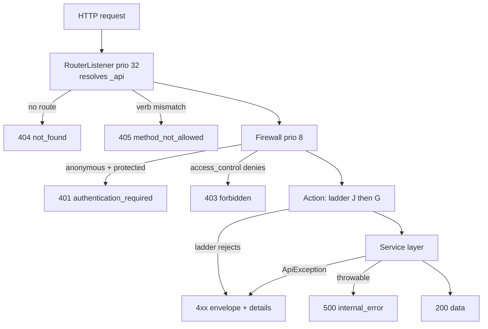

# Multiplayer -- API Reference

> **Status**: specification, not yet implemented.
> **Scope**: the consolidated HTTP interface. Every route the platform serves
> today, every route this spec adds, the single JSON envelope they share, the
> authorization matrix, rate limits, CSRF/CORS posture, the error-code
> catalogue, and the unchanged binary wire formats.
>
> This file elaborates `00-overview.md` and must not contradict it. Where a
> sibling chapter owns the *behaviour* behind an endpoint, this file owns its
> *interface* and points at the sibling: `03-time-control.md` for clock
> semantics, `04-matchmaking.md` for pairing, `05-social.md` for friendship and
> challenge state machines, `06-rating.md` for Glicko-2, `07-notifications.md`
> for push delivery, `08-frontend.md` for the client that consumes all of this.

**How to read this file.** Section 1 is the "what exists" audit -- every claim
there is cited to `path:line`. Sections 2, 5, 8, 9 and 10 are cross-cutting
contracts. Section 3 is the route index; section 4 is the per-endpoint
reference behind it; section 6 is authorization; section 7 is rate limiting.
Preconditions are given in *evaluation order* and every one names its exact
HTTP status and machine-readable `code`.

---

## 1. Existing route inventory

Routes are loaded from three places: attribute routing over `src/Action/`
(`config/routes.yaml:1-5`), the Sidus admin route loader
(`config/routes/admin.yaml:1-3` -> `AdminRouteLoader::load()`
`vendor/sidus/admin-bundle/Routing/AdminRouteLoader.php:43-47`), and dev-only
YAML imports.

### 1.1 Application routes (attribute-routed)

| Route name | Methods | Path | Controller (`path:line`) | Authorization today | Response | Verdict |
|---|---|---|---|---|---|---|
| `index` | GET | `/` | `src/Action/IndexAction.php:21-29` | anonymous | 302 -> `new_game` | **MODIFIED** -- redirect target becomes `lobby` |
| `new_game` | GET, POST | `/play` | `src/Action/NewGameAction.php:27-31` | `access_control ^/play` = `ROLE_USER` | HTML \| 302 | **MODIFIED** -- `new Game($user, ...)` + `setIsWhite()` (`NewGameAction.php:46-53`) both die with `owner`/`isWhite`; construction moves to `GameFactory` |
| `play` | *any* | `/play/{uuid}` | `src/Action/PlayAction.php:26-29` | `ROLE_USER` + `GameVoter::ACCESS` (`PlayAction.php:38`) | HTML (Twig via `sidus/template-bundle`) | **MODIFIED** -- pin `methods: ['GET']`, pin the `uuid` requirement, swap to `GAME_VIEW`, drop the AI-only auto-move gate (`PlayAction.php:41-52`) |
| `submit_move` | POST | `/play/{uuid}/move` | `src/Action/SubmitMoveAction.php:37-41` | `ROLE_USER` + `GameVoter::ACCESS` (`:53`) | JSON, bespoke shape (`:111-124`) | **MODIFIED** -- envelope + `GameStatePayload`; turn check generalised (landmines 1, 2) |
| `undo_move` | POST | `/play/{uuid}/undo` | `src/Action/UndoMoveAction.php:29-33` | `ROLE_USER` + `GameVoter::ACCESS` (`:45`) | **raw base64, `text/html`** (`:78`) | **MODIFIED** -- restricted to `AI`/`HOTSEAT` per D8; response becomes the envelope |
| `resign_game` | POST | `/play/{uuid}/resign` | `src/Action/ResignGameAction.php:25-29` | `ROLE_USER` + `GameVoter::ACCESS` (`:38`) | 302 -> `new_game` | **MODIFIED** -- becomes JSON; `setWhiteWins(!$game->isWhite())` (`:45`) is unimplementable without `isWhite` |
| `delete_game` | POST | `/play/{uuid}/delete` | `src/Action/DeleteGameAction.php:25-29` | `ROLE_USER` + `GameVoter::ACCESS` (`:38`) | 302 -> `new_game` | **REMOVED** -- one participant must not soft-delete a shared game; replaced by per-side `game_hide` |
| `login` | GET | `/login` | `src/Action/LoginAction.php:28` | anonymous | HTML | UNCHANGED |
| `oidc_login` | GET | `/login/{provider}` | `src/Action/LoginAction.php:41` | anonymous | 302 to IdP | UNCHANGED |
| `oidc_login_check` | GET | `/auth/callback` | `src/Action/LoginAction.php:64` | anonymous; never reached (`:68`) | -- | UNCHANGED |
| `login_check` | POST | `/login_check` | `src/Action/LoginAction.php:71` | anonymous; never reached (`:75`) | -- | UNCHANGED |
| `logout` | GET | `/logout` | `src/Action/LoginAction.php:78` | anonymous; never reached (`:82`) | 302 -> `STATIC_SITE_URL` | **MODIFIED** -- a `LogoutEvent` listener must clear the Mercure subscriber cookie (contract, Mercure section) |
| `register` | GET, POST | `/register` | `src/Action/RegisterAction.php:32` | anonymous | HTML \| 302 | **MODIFIED** -- `new User($email)` (`:48`) must allocate `username` (P0.1) |
| `lost_password` | GET, POST | `/login/lost-password` | `src/Action/LostPasswordAction.php:37` | anonymous | HTML \| 302 | UNCHANGED |
| `reset_password` | GET, POST | `/login/reset-password` | `src/Action/ResetPasswordAction.php:33` | anonymous | HTML \| 302 | UNCHANGED |
| `feedback` | GET, POST | `/feedback` | `src/Action/FeedbackAction.php:27-31` | `#[IsGranted('ROLE_USER')]` (`:26`) + `access_control` | HTML \| 302 | UNCHANGED |
| `api_contact` | POST, OPTIONS | `/api/contact` | `src/Action/Api/ContactAction.php:25-29` | anonymous; CORS; `contact_limiter` (`:50-53`) | JSON `{success}` / `{error}` | UNCHANGED -- see 2.7, explicitly exempt |
| `api_moves` | POST | `/api/moves` | `src/Action/Api/MovesAction.php:15-19` | anonymous | binary (proxied) | UNCHANGED |
| `api_replay_moves` | POST | `/api/replay-moves` | `src/Action/Api/ReplayMovesAction.php:15-19` | anonymous | binary (proxied) | UNCHANGED |
| `admin_dashboard` | GET | `/admin` | `src/Action/Admin/DashboardAction.php:19` | `access_control ^/admin` = `ROLE_ADMIN` | HTML | UNCHANGED |
| `admin_opening_explorer` | GET | `/admin/opening-explorer` | `src/Action/Admin/OpeningExplorerAction.php:30` | `ROLE_ADMIN` | HTML | UNCHANGED |
| `admin_opening_tree_api` | GET | `/admin/api/opening-tree` | `src/Action/Admin/Api/OpeningTreeAction.php:26` | `ROLE_ADMIN` | JSON `{children}` / `{error}` (`:32,35-37`) | **MODIFIED** -- envelope migration (Phase 5); client at `assets/typescript/src/admin/openingExplorer.ts:60` |
| `admin_opening_stats_api` | GET | `/admin/api/opening-stats` | `src/Action/Admin/Api/OpeningStatsAction.php:28` | `ROLE_ADMIN` | JSON `{children,stats}` / `{error}` (`:35,38-41`) | **MODIFIED** -- envelope migration (Phase 5); client at `openingExplorer.ts:69` |

### 1.2 Sidus admin routes (generated)

Route names are `sidus_admin.{AdminCode}.{actionCode}`
(`vendor/sidus/admin-bundle/Model/Action.php:83-86`); paths are
`prefix + action path` (`Action.php:71-80`). Neither `config/admin/User.yaml`
nor `config/admin/Feedback.yaml` sets `methods`, and the config default is `[]`
(`vendor/sidus/admin-bundle/DependencyInjection/Configuration.php:113`), so all
four answer **any** HTTP verb.

| Route name | Methods | Path | Controller | Authorization | Response | Verdict |
|---|---|---|---|---|---|---|
| `sidus_admin.User.list` | *any* | `/admin/users/` | `src/Action/Admin/UserListAction.php:34` (`config/admin/User.yaml:12-15`) | `ROLE_ADMIN` | HTML datagrid | **MODIFIED** -- its DQL joins `g.owner` and `g.isWhite` five times (`UserListAction.php:52-56`); both columns are removed by P0.2 |
| `sidus_admin.User.read` | *any* | `/admin/users/read/{id}` | `src/Action/Admin/UserReadAction.php:28` (`User.yaml:16-19`) | `ROLE_ADMIN` | HTML | **MODIFIED** -- `AdminStatsRepository::getUserStats()/getUserGames()` are owner-scoped; must become `GamePlayer`-scoped |
| `sidus_admin.Feedback.list` | *any* | `/admin/feedback/` | `Sidus\AdminBundle\Action\ListAction` (`config/admin/Feedback.yaml:5-6,13-14`) | `ROLE_ADMIN` | HTML datagrid | UNCHANGED |
| `sidus_admin.Feedback.edit` | *any* | `/admin/feedback/edit/{id}` | `Sidus\AdminBundle\Action\EditAction` | `ROLE_ADMIN` | HTML \| 302 | UNCHANGED |

`config/routes/security.yaml:1-3` imports `security.route_loader.logout`, which
wires the logout listener onto `firewalls.main.logout.path: logout`
(`config/packages/security.yaml:30-32`). It exposes no path of its own beyond
the `logout` route above. UNCHANGED.

### 1.3 Dev-only routes

| Route name | Methods | Path | Target | Loaded when | Verdict |
|---|---|---|---|---|---|
| `dev_login` | GET | `/dev/login?email=` | `App\Action\DevLoginAction::check` (`config/routes/dev/dev_login.yaml:6-9`); intercepted by `DevLoginAuthenticator` before the controller runs (`src/Action/DevLoginAction.php:9-25`) | `kernel.environment == dev` | **MODIFIED** -- first-hit user creation must allocate a `username` (P0.1), otherwise every agent/dev session has a null public handle |
| `_pentatrion_vite` | GET | `/build/*` | `@PentatrionViteBundle` (`config/routes/pentatrion_vite.yaml:1-4`) | dev | UNCHANGED |
| `_profiler_vite` | GET | `/_profiler/vite` | `Pentatrion\ViteBundle\Controller\ProfilerController::info` (`pentatrion_vite.yaml:6-9`) | dev | UNCHANGED |
| `_errors` | GET | `/_error/*` | `@FrameworkBundle` errors routing (`config/routes/framework.yaml:1-4`) | dev | UNCHANGED |

### 1.4 Client call sites that do not resolve today

`assets/typescript/src/network/GameAPI.ts:110` fetches
`${backendUrl}/engine-move` -- i.e. `/api/engine-move`. No PHP route with that
path exists (`src/Action/Api/` declares only `/api/moves`,
`/api/replay-moves`, `/api/contact`); the engine's own endpoint is
`engine-move-game` (`src/Engine/EngineApi.php:31,33`). `getEngineMove()` is
reachable from `GameController.ts:175`. This spec adds no route for it: the
dead path is deleted client-side, see `08-frontend.md`.

---

## 2. The JSON envelope

### 2.1 What ships today

Three mutually incompatible shapes, all in production:

| Shape | Emitted by | Example |
|---|---|---|
| `{"error": "<message>"}` | `SubmitMoveAction.php:48,55,62,71,80,89`; `OpeningTreeAction.php:32`; `OpeningStatsAction.php:35`; `ContactAction.php:46,53` | `{"error":"Not your turn"}` |
| `{"success": false, "error": "<message>"}` | `UndoMoveAction.php:39-42,46-49,53-56` | `{"success":false,"error":"Game not found"}` |
| raw base64 body, **`Content-Type: text/html`** | `UndoMoveAction.php:78` -- `new Response(base64_encode(...))` with no content-type override | `AAECAw==` |

The third is the worst of the three: the success path of a JSON-ish endpoint
returns an untyped string, and `GameAPI.undoMove()` consumes it with
`response.text()` (`GameAPI.ts:169`) while its *error* path parses
`response.json()` (`:165`). Two codecs on one endpoint.

Note also that `SubmitMoveAction.php:89` already smuggles a machine-readable
code (`concurrent_move`) through the human-readable `error` string. The
envelope below makes that field-level distinction explicit instead of
accidental.

### 2.2 The envelope

Exactly one shape for every endpoint in section 3, and for the migrated
endpoints in 2.7.

**Success** -- HTTP 200 (or 201 where stated):

```json
{ "data": { }  }
```

```json
{ "data": [ ], "meta": { "page": 1, "perPage": 20, "total": 137, "pages": 7 } }
```

- `data` is REQUIRED and is an object, an array, or `null`. Never a scalar.
- `meta` is present **iff** the endpoint paginates (pagerfanta, per
  `00-overview.md` section 6). Keys are exactly `page`, `perPage`, `total`,
  `pages`.
- No other top-level key exists. There is no `success` boolean: HTTP status
  carries that, and a redundant flag is what produced shape 2 above.

**Error** -- any 4xx or 5xx:

```json
{ "error": { "code": "not_your_turn",
             "message": "It is not your turn to move.",
             "details": { "state": { } } } }
```

- `code` is REQUIRED, `snake_case`, drawn from the closed set in section 9. It
  is the **only** field a client may branch on.
- `message` is REQUIRED, English, for logs and developers. **Never render it to
  a player**; the client maps `code` to a localised string.
- `details` is REQUIRED but MAY be `null`. Its shape is fixed per `code` and
  documented in section 9.

**Rule G1.** Any 4xx raised by an endpoint under `/play/{uuid}/*` MUST set
`details.state` to a full `GameStatePayload`. The client feeds it through the
same seq-guarded reducer as a Mercure frame (drop if `seq <= lastSeq`), so a
rejected action never costs a second round trip to resync. `03-time-control.md`
section 9 relies on this for `flagged` and `clock_not_expired`.

**Rule G2.** The envelope wraps, it does not replace. The Mercure frame on
`game/{uuid}` is the bare `GameStatePayload` object -- SSE has no HTTP status
to carry, so it has no envelope. The HTTP body is `{"data": <the identical
GameStatePayload>}`. The *payload* is one shape, as the contract requires; the
envelope is transport framing. Clients unwrap `.data` on HTTP and use the frame
directly on SSE, then call one reducer.

Byte-identity is guaranteed by construction, not by convention: one
`GameStatePayloadBuilder`, one `encode()` with fixed `json_encode` flags, and
then `JsonResponse::fromJsonString('{"data":'.$json.'}')` -- so the substring
under `data` is literally the same string handed to the hub. Re-encoding the
payload a second time for the HTTP path is what re-opens the drift of
`00-overview.md` section 3.3. See `02-realtime.md` section 5.2.

**Rule G3 -- scalar encoding inside `data` and `details`.** Defined once in
`02-realtime.md` section 4.0 and binding on every HTTP body in this file, not
only on Mercure frames. Restated here as a lookup table, not re-derived:

| Kind | On the wire | Never |
|---|---|---|
| Enum | lowercase `snake_case` **string** of the case name -- `GameEndReason::ABANDONMENT` -> `"abandonment"`, `SpeedCategory::CORRESPONDENCE` -> `"correspondence"`, `NotificationType::CHALLENGE_RECEIVED` -> `"challenge_received"` | the int backing value |
| Timestamp | integer **microseconds** since epoch, `(int) $dt->format('Uu')` | ISO-8601, milliseconds, float |
| Binary | base64 (section 10.4) | hex, byte arrays |
| Not applicable | JSON `null`, field always present | omitting the key |
| Player reference | `PlayerRef {uuid, username, rating, provisional}` | an ad-hoc subset |
| Time control | `TimeControlRef {kind, initialSeconds, incrementSeconds, daysPerMove, speed}` | flattening the four fields into the parent |

`PlayerRef` and `TimeControlRef` are the shared sub-objects of
`02-realtime.md` section 4.0; every seek, challenge, notification and profile
body in sections 4.1-4.6 embeds them verbatim rather than re-listing their
fields. This also means the `createdAt`/`expiresAt`/`readAt` fields shown in
those sections are integers, not strings.

### 2.3 HTTP status mapping

| Status | Used for | `code` examples |
|---|---|---|
| 200 | Every successful read and every successful mutation, including no-op idempotent replays | -- |
| 201 | A new externally addressable resource was created and its UUID is returned | -- |
| 204 | **Never used.** An empty body defeats the envelope; return `{"data":null}` with 200 | -- |
| 302 | HTML actions only (form post-redirect-get, login entry point). **Never from a JSON endpoint** -- that is exactly the failure section 2.6 exists to prevent | -- |
| 304 | Conditional GET on a read-only JSON endpoint that sends `ETag`, when the client's `If-None-Match` matches. Body is empty by definition, which is legal here because there is no envelope to defeat -- the client reuses its cached one. Currently applies only to `game_state` (ETag is the `seq`) | -- |
| 400 | The request is malformed independently of any state | `malformed_json`, `invalid_uuid`, `invalid_move_data` |
| 401 | No authenticated session | `authentication_required` |
| 403 | Authenticated, but the voter or a relationship denies | `forbidden`, `blocked` |
| 404 | The addressed resource does not exist, or exists and must not be disclosed | `game_not_found`, `user_not_found` |
| 405 | Route matched, verb did not | `method_not_allowed` |
| 409 | Well-formed and authorized, but conflicts with current state | `not_your_turn`, `game_finished`, `seek_unavailable` |
| 410 | The resource existed and has permanently lapsed | `challenge_expired`, `seek_expired` |
| 415 | Body present with an unacceptable `Content-Type` | `unsupported_media_type` |
| 422 | Syntactically valid, semantically invalid payload | `validation_failed`, `cannot_challenge_self` |
| 429 | Rate limiter rejected | `rate_limited` |
| 500 | Unhandled server fault | `internal_error` |
| 502 / 504 | Rust engine unreachable / timed out | `upstream_unavailable`, `upstream_timeout` |
| 503 | A required capability is not configured | `push_not_configured` |

404-vs-403 rule: if disclosing existence is itself information, return 404. A
private AI game belonging to someone else is `game_not_found`, not `forbidden`.
A multiplayer game you are not a participant of is world-viewable
(`00-overview.md` section 4.3), so its mutating endpoints correctly return 403.

### 2.4 Validation-error detail format

```json
{ "error": {
    "code": "validation_failed",
    "message": "Request payload failed validation.",
    "details": { "violations": [
      { "field": "initialSeconds", "constraint": "range",
        "message": "This value should be between 15 and 10800." },
      { "field": "colorPreference", "constraint": "choice",
        "message": "The value you selected is not a valid choice." }
    ] } } }
```

- `field` is `ConstraintViolation::getPropertyPath()` with the leading
  `[`/trailing `]` of an `Assert\Collection` path stripped, so
  `[initialSeconds]` renders as `initialSeconds`. Nested paths keep dots.
- `constraint` is the violating constraint's class short name, snake_cased
  (`NotBlank` -> `not_blank`, `Range` -> `range`, `Choice` -> `choice`,
  `Regex` -> `regex`, `Length` -> `length`). The raw
  `ConstraintViolation::getCode()` UUID is never exposed.
- `violations` preserves validator order and is never empty when this code is
  returned.

Validation follows `00-overview.md` section 6: **inline constraints, no
`#[Assert\*]` entity attributes, no `validation.yaml`**. JSON endpoints cannot
use a `FormType`, so they declare an inline `Assert\Collection` in the action
and hand it to `ValidatorInterface`. `config/packages/validator.yaml` needs no
change (auto-mapping stays off).

### 2.5 The shared helpers

Two new classes. `App\Model\ApiErrorCode` owns the code-to-status mapping so no
call site can invent a status; `App\Http\ApiResponse` owns serialisation.

```php
namespace App\Model;

enum ApiErrorCode: string
{
    case AUTHENTICATION_REQUIRED = 'authentication_required';
    case NOT_YOUR_TURN           = 'not_your_turn';
    // ... the full section 9 catalogue

    public function httpStatus(): int
    {
        return match ($this) {
            self::AUTHENTICATION_REQUIRED => 401,
            self::NOT_YOUR_TURN           => 409,
            // ...
        };
    }
}
```

```php
namespace App\Http;

final readonly class ApiResponse
{
    /** @param array<string,mixed>|list<mixed>|null $data */
    public static function ok(array|null $data, ?array $meta = null): JsonResponse;
    public static function created(array $data): JsonResponse;      // 201
    public static function error(
        ApiErrorCode $code,
        string $message,
        ?array $details = null,
    ): JsonResponse;                                                 // status from $code
    /** @param ConstraintViolationListInterface $violations */
    public static function validation(ConstraintViolationListInterface $v): JsonResponse; // 422
}
```

Every response `ApiResponse` builds carries
`AbstractSessionListener::NO_AUTO_CACHE_CONTROL_HEADER => true`, generalising
what `SubmitMoveAction.php:122` already does for the one endpoint that has it
today. Without it, a started session makes Symfony stamp
`Cache-Control: private, must-revalidate` on every JSON body, including the
public lobby and profile reads. *[INFERENCE: the existing single use carries no
comment; the generalisation is deduced from its placement on the only
session-backed JSON success path.]*

`ApiResponse` is not a service: it is static, stateless, and therefore safe
under FrankenPHP worker mode by construction (`00-overview.md` section 6).
Adding `src/Http/` requires one new row in the `AGENTS.md` directory table --
tracked in `10-delivery-plan.md`.

### 2.6 The `_api` route flag

Symfony's default denial paths render HTML, which is precisely the trap
`00-overview.md` section 6 warns about. Verified: the firewall entry point
returns `new RedirectResponse($this->router->generate('login'))`
(`src/Security/MultiProviderOidcAuthenticator.php:100-105`). An anonymous
`POST /play/{uuid}/move` under `access_control` would therefore answer **302 to
an HTML login page**, and `GameAPI.submitMove()` would try to `response.json()`
it (`GameAPI.ts:87`).

Every JSON route declares `defaults: ['_api' => true]`. Routing resolves before
the firewall -- `RouterListener` is `KernelEvents::REQUEST` priority 32
(`vendor/symfony/http-kernel/EventListener/RouterListener.php:178`), the
firewall is priority 8
(`vendor/symfony/security-bundle/EventListener/FirewallListener.php:59-62`,
`vendor/symfony/security-http/Firewall.php:115`) -- so the flag is readable by
all three consumers:

| Consumer | Registration | Behaviour when `_api` is true |
|---|---|---|
| `App\Security\JsonAwareEntryPoint` | decorates `MultiProviderOidcAuthenticator` as `firewalls.main.entry_point` | 401 `authentication_required` instead of 302 |
| `App\Security\JsonAccessDeniedHandler` | `firewalls.main.access_denied_handler` | 403 `forbidden` envelope instead of the HTML error page |
| `App\Http\ApiExceptionListener` | `#[AsEventListener(KernelEvents::EXCEPTION)]` in `src/Event/` | maps `App\Http\ApiException` -> its envelope; `MethodNotAllowedHttpException` -> 405; `NotFoundHttpException` -> 404 `not_found`; anything else -> 500 `internal_error` with the throwable logged, never leaked |



### 2.7 Migration of existing endpoints

**Recommendation: yes, migrate -- with one deliberate exemption.**

| Endpoint | Migrate? | Phase | Note |
|---|---|---|---|
| `submit_move` | yes | **P0.4** | It already returns the drifting payload of `00-overview.md` section 3.3. The `GameStatePayloadBuilder` change and the envelope change touch the same lines; splitting them means editing `getResponse()` twice |
| `undo_move` | yes | **P0.4** | Same client module (`GameAPI.ts:155-170`); its `text/html` base64 success path must die with the shape it belongs to |
| `resign_game` | yes | Phase 2 | Ships with `GameLifecycleManager` and the rest of the in-game action set |
| `admin_opening_tree_api`, `admin_opening_stats_api` | yes | Phase 5 | Admin-only, two client call sites (`openingExplorer.ts:60,69`), zero urgency. Migrating them removes the last `{error: string}` producer inside the app |
| `api_contact` | **no -- exempt** | -- | Its consumer is the external marketing site over CORS (`STATIC_SITE_URL`, `config/packages/nelmio_cors.yaml:10`), which this repo cannot deploy in lockstep. Changing the shape breaks a client we do not control. It keeps `{success:true}` / `{error:"..."}` and is the single documented exception |

---

## 3. New route table

### 3.0 Conventions for every new route

Restating `00-overview.md` section 6 with the operational detail an
implementer needs:

| Rule | Value |
|---|---|
| Verbs | **GET for reads, POST for every mutation.** No PUT/PATCH/DELETE. Matches the existing `POST /play/{uuid}/delete`, keeps `nelmio_cors.yaml:5` (`GET, POST, OPTIONS`) untouched, and avoids method-override middleware |
| Method declaration | Always explicit: `methods: ['GET']` or `['POST']`. Never omitted -- an omitted `methods` answers every verb, as `play` does today |
| Entry point | `public function __invoke(...)`, one action per file, `#[AsController]`, attribute routing |
| JSON actions | Bare `readonly class`, **never** `extends AbstractController`; inject `Symfony\Bundle\SecurityBundle\Security`; return `ApiResponse::*` |
| HTML actions | `extends AbstractController`, return `array` (Twig via `sidus/template-bundle`, mapped in `config/packages/templating.yaml`) or `RedirectResponse` |
| Route defaults | JSON routes declare `defaults: ['_api' => true]` (section 2.6) |
| UUID params | `requirements: ['uuid' => Requirement::UUID]` on every `{uuid}`. Without it `/play/history` would collide with `/play/{uuid}` |
| Username params | `requirements: ['username' => '[A-Za-z0-9_-]{3,32}']`, matching `00-overview.md` section 4.4 |
| Namespaces | `App\Action\{Lobby,Challenge,Social,Game,Notification,Push,Profile}\` |
| Request content type | `application/json` for JSON bodies; `application/octet-stream` for `submit_move` only. Bodiless POSTs send no `Content-Type` |

### 3.1 Lobby and matchmaking -- `App\Action\Lobby\`

| Route name | Method | Path | Controller | Authorization | Limiter | Request | Response |
|---|---|---|---|---|---|---|---|
| `lobby` | GET | `/lobby` | `LobbyPageAction` | `PUBLIC_ACCESS` | -- | -- | HTML |
| `lobby_seeks` | GET | `/lobby/seeks` | `SeekListAction` | `PUBLIC_ACCESS` | -- | -- | JSON list |
| `lobby_seek_create` | POST | `/lobby/seeks` | `SeekCreateAction` | `ROLE_USER` | `seek_create` | `application/json` | JSON |
| `lobby_seek_quick` | POST | `/lobby/seeks/quick` | `SeekQuickPairAction` | `ROLE_USER` | `seek_create` | `application/json` | JSON |
| `lobby_seek_heartbeat` | POST | `/lobby/seeks/{uuid}/heartbeat` | `SeekHeartbeatAction` | `ROLE_USER` + owner | `seek_heartbeat` | -- | JSON |
| `lobby_seek_cancel` | POST | `/lobby/seeks/{uuid}/cancel` | `SeekCancelAction` | `ROLE_USER` + owner | `seek_create` | -- | JSON |
| `lobby_seek_accept` | POST | `/lobby/seeks/{uuid}/accept` | `SeekAcceptAction` | `ROLE_USER` | `seek_create` | -- | JSON |

### 3.2 Challenges -- `App\Action\Challenge\`

| Route name | Method | Path | Controller | Authorization | Limiter | Request | Response |
|---|---|---|---|---|---|---|---|
| `challenge_list` | GET | `/challenge` | `ChallengeListAction` | `ROLE_USER` | -- | -- | JSON |
| `challenge_create` | POST | `/challenge` | `ChallengeCreateAction` | `ROLE_USER` | `challenge_create` | `application/json` | JSON, 201 |
| `challenge_show` | GET | `/challenge/{uuid}` | `ChallengePageAction` | `PUBLIC_ACCESS` | -- | -- | HTML |
| `challenge_accept` | POST | `/challenge/{uuid}/accept` | `ChallengeAcceptAction` | `CHALLENGE_RESPOND` | `social_action` | -- | JSON |
| `challenge_decline` | POST | `/challenge/{uuid}/decline` | `ChallengeDeclineAction` | `CHALLENGE_RESPOND` | `social_action` | -- | JSON |
| `challenge_cancel` | POST | `/challenge/{uuid}/cancel` | `ChallengeCancelAction` | `CHALLENGE_CANCEL` | `social_action` | -- | JSON |

### 3.3 Friends and players -- `App\Action\Social\`

| Route name | Method | Path | Controller | Authorization | Limiter | Request | Response |
|---|---|---|---|---|---|---|---|
| `friends` | GET | `/friends` | `FriendsPageAction` | `ROLE_USER` | -- | -- | HTML |
| `friends_list` | GET | `/friends/list` | `FriendListAction` | `ROLE_USER` | -- | -- | JSON |
| `friend_request` | POST | `/friends/request` | `FriendRequestAction` | `ROLE_USER` | `friend_request` | `application/json` | JSON, 201 |
| `friend_accept` | POST | `/friends/{username}/accept` | `FriendAcceptAction` | `ROLE_USER` + addressee | `social_action` | -- | JSON |
| `friend_decline` | POST | `/friends/{username}/decline` | `FriendDeclineAction` | `ROLE_USER` + addressee | `social_action` | -- | JSON |
| `friend_remove` | POST | `/friends/{username}/remove` | `FriendRemoveAction` | `ROLE_USER` + either side | `social_action` | -- | JSON |
| `friend_block` | POST | `/friends/block` | `FriendBlockAction` | `ROLE_USER` | `social_action` | `application/json` | JSON |
| `friend_unblock` | POST | `/friends/{username}/unblock` | `FriendUnblockAction` | `ROLE_USER` + blocker | `social_action` | -- | JSON |
| `user_search` | GET | `/players/search` | `UserSearchAction` | `ROLE_USER` | `friend_search` | -- | JSON |

### 3.4 In-game actions -- `App\Action\Game\`

`{uuid}` is the game UUID throughout. Existing routes marked *(existing)* keep
their route name and path.

| Route name | Method | Path | Controller | Authorization | Limiter | Request | Response |
|---|---|---|---|---|---|---|---|
| `game_state` | GET | `/play/{uuid}/state` | `GameStateAction` | `GAME_VIEW` | -- | -- | JSON |
| `submit_move` *(existing)* | POST | `/play/{uuid}/move` | `SubmitMoveAction` | `GAME_PARTICIPATE` | `move_submit` | `application/octet-stream`, 2 bytes | JSON |
| `game_resign` *(existing, renamed from `resign_game`)* | POST | `/play/{uuid}/resign` | `ResignGameAction` | `GAME_PARTICIPATE` | `game_action` | -- | JSON |
| `game_abort` | POST | `/play/{uuid}/abort` | `AbortGameAction` | `GAME_PARTICIPATE` | `game_action` | -- | JSON |
| `game_claim_timeout` | POST | `/play/{uuid}/claim-timeout` | `ClaimTimeoutAction` | `GAME_PARTICIPATE` | `game_action` | -- | JSON |
| `game_presence` | POST | `/play/{uuid}/presence` | `GamePresenceAction` | `GAME_PARTICIPATE` | `presence_ping` | -- | JSON |
| `game_draw_offer` | POST | `/play/{uuid}/draw/offer` | `DrawOfferAction` | `GAME_PARTICIPATE` | `game_action` | -- | JSON |
| `game_draw_accept` | POST | `/play/{uuid}/draw/accept` | `DrawAcceptAction` | `GAME_PARTICIPATE` | `game_action` | -- | JSON |
| `game_draw_decline` | POST | `/play/{uuid}/draw/decline` | `DrawDeclineAction` | `GAME_PARTICIPATE` | `game_action` | -- | JSON |
| `game_rematch_offer` | POST | `/play/{uuid}/rematch/offer` | `RematchOfferAction` | `GAME_PARTICIPATE` | `game_action` | -- | JSON |
| `game_rematch_accept` | POST | `/play/{uuid}/rematch/accept` | `RematchAcceptAction` | `GAME_PARTICIPATE` | `game_action` | -- | JSON, 201 |
| `game_rematch_decline` | POST | `/play/{uuid}/rematch/decline` | `RematchDeclineAction` | `GAME_PARTICIPATE` | `game_action` | -- | JSON |
| `game_hide` | POST | `/play/{uuid}/hide` | `HideGameAction` | `GAME_MANAGE` | `game_action` | -- | JSON |
| `game_unhide` | POST | `/play/{uuid}/unhide` | `UnhideGameAction` | `GAME_MANAGE` | `game_action` | -- | JSON |
| `undo_move` *(existing)* | POST | `/play/{uuid}/undo` | `UndoMoveAction` | `GAME_PARTICIPATE` | `game_action` | -- | JSON |

### 3.5 Notifications -- `App\Action\Notification\`

| Route name | Method | Path | Controller | Authorization | Limiter | Request | Response |
|---|---|---|---|---|---|---|---|
| `notifications` | GET | `/notifications` | `NotificationPageAction` | `ROLE_USER` | -- | -- | HTML |
| `notifications_list` | GET | `/notifications/list` | `NotificationListAction` | `ROLE_USER` | -- | -- | JSON, paginated |
| `notifications_unread_count` | GET | `/notifications/unread-count` | `UnreadCountAction` | `ROLE_USER` | -- | -- | JSON |
| `notification_read` | POST | `/notifications/{uuid}/read` | `NotificationReadAction` | `ROLE_USER` + owner | `notification_read` | -- | JSON |
| `notifications_read_all` | POST | `/notifications/read-all` | `NotificationReadAllAction` | `ROLE_USER` | `notification_read` | -- | JSON |
| `notification_preferences` | POST | `/notifications/preferences` | `NotificationPreferencesAction` | `ROLE_USER` | `social_action` | `application/json` | JSON |

### 3.6 Web Push -- `App\Action\Push\`

| Route name | Method | Path | Controller | Authorization | Limiter | Request | Response |
|---|---|---|---|---|---|---|---|
| `push_public_key` | GET | `/push/public-key` | `PushPublicKeyAction` | `ROLE_USER` | -- | -- | JSON |
| `push_subscribe` | POST | `/push/subscribe` | `PushSubscribeAction` | `ROLE_USER` | `push_subscribe` | `application/json` | JSON |
| `push_unsubscribe` | POST | `/push/unsubscribe` | `PushUnsubscribeAction` | `ROLE_USER` | `push_subscribe` | `application/json` | JSON |

### 3.7 Profile, settings, leaderboard -- `App\Action\Profile\`

The `/@/` prefix namespaces the entire username space so a handle can never
collide with a top-level route; see `05-social.md`. There is no `/player/*`
alias -- no profile page has ever existed (`00-overview.md` section 3.6), so
there is no legacy URL to redirect from.

| Route name | Method | Path | Controller | Authorization | Limiter | Request | Response |
|---|---|---|---|---|---|---|---|
| `profile` | GET | `/@/{username}` | `ProfilePageAction` | `PUBLIC_ACCESS` | -- | -- | HTML |
| `profile_games` | GET | `/@/{username}/games` | `ProfileGamesAction` | `PUBLIC_ACCESS` | -- | -- | JSON, paginated |
| `settings_profile` | GET, POST | `/settings/profile` | `ProfileSettingsAction` | `ROLE_USER` | `username_change` | form | HTML \| 302 |
| `leaderboard` | GET | `/leaderboard/{category}` | `LeaderboardAction` | `PUBLIC_ACCESS` | -- | -- | HTML |

---

## 4. Per-endpoint detail

### 4.0 Standard precondition ladders

Every endpoint runs ladder **J**. Endpoints under `/play/{uuid}/*` then run
ladder **G**. Per-endpoint sections list only what comes *after* the ladders,
in evaluation order.

**Ladder J -- every JSON endpoint**

| # | Check | Failure |
|---|---|---|
| J1 | Route matched with the declared verb | 405 `method_not_allowed` |
| J2 | If a body is expected: `Content-Type` is the declared one | 415 `unsupported_media_type` |
| J3 | If JSON body: `json_decode` succeeds and yields an array | 400 `malformed_json` |
| J4 | Authenticated (unless the route is `PUBLIC_ACCESS`) | 401 `authentication_required` |
| J5 | The endpoint's limiter accepts one token, keyed on `User::getId()` | 429 `rate_limited`, `details.retryAfter` seconds |
| J6 | Inline `Assert\Collection` validates the decoded body | 422 `validation_failed`, `details.violations` |

**Ladder G -- endpoints under `/play/{uuid}/*`**, after J

| # | Check | Failure |
|---|---|---|
| G1 | `{uuid}` parses as a UUID (enforced by `Requirement::UUID`, so a miss is a routing miss) | 404 `not_found` |
| G2 | `GameRepository::findByUuid()` returns a row **with `deletedAt IS NULL`** -- the missing predicate is the P0.2 bug fix (`src/Repository/GameRepository.php:23-30`, landmine 5) | 404 `game_not_found` |
| G3 | The endpoint's voter attribute is granted (section 6.1) | 403 `forbidden` |
| G4 | For mutating endpoints: `ClockAdjudicator::adjudicate()` runs (idempotent, `00-overview.md` invariant 7) and may finish the game | -- |
| G5 | For mutating endpoints: the game is not finished | 409 `game_finished` |

`receivedAt` is captured on the first line of `__invoke`, before J1, so no
precondition rejection costs the caller clock time (`03-time-control.md`
section 5).

### 4.1 Lobby and matchmaking

Behaviour, pairing algorithm and widening are owned by `04-matchmaking.md`;
this is the wire contract.

**Shared seek body** (`lobby_seek_create`):

| Field | Type | Constraints | Required |
|---|---|---|---|
| `kind` | string | `unlimited` \| `realtime` \| `correspondence` | yes |
| `initialSeconds` | int\|null | 15..10800; required iff `kind=realtime`, else must be null | conditional |
| `incrementSeconds` | int\|null | 0..180; required iff `kind=realtime`, else null | conditional |
| `daysPerMove` | int\|null | one of 1, 3, 7; required iff `kind=correspondence`, else null | conditional |
| `rated` | bool | must be `false` when `kind=unlimited` | yes |
| `colorPreference` | string | `white` \| `black` \| `random` | yes |
| `ratingMin` | int\|null | 400..3000, `<= ratingMax`; null iff `autoWiden` | no |
| `ratingMax` | int\|null | 400..3000 | no |
| `autoWiden` | bool | default `false`; mutually exclusive with an explicit window | no |

**Cross-field time-control rule, shared by `POST /lobby/seeks`,
`POST /lobby/seeks/quick` and `POST /challenge`.** The per-field constraints
above are checked at J6 and fail as `validation_failed`. The *combination* is
checked immediately after and fails as 422 `invalid_time_control`, with
`details.reason` naming the broken pairing: `realtime` without both
`initialSeconds` and `incrementSeconds`; `correspondence` without
`daysPerMove`; `unlimited` with any of the three set; `realtime` carrying
`daysPerMove`; `correspondence` carrying either realtime field. This is a
distinct code from `unrated_time_control`, which is specifically
`rated: true` on an `unlimited` control. Owned jointly with `05-social.md`
(challenge precondition C5) and `04-matchmaking.md`.

| Endpoint | Extra preconditions (ordered) | 200 `data` | Side effects | Idempotence |
|---|---|---|---|---|
| `GET /lobby/seeks` | none. Anonymous callers get the pool with `mine:false` on every row | `{"seeks":[{"uuid","username","rating","provisional","kind","initialSeconds","incrementSeconds","daysPerMove","speedCategory","rated","colorPreference","ratingMin","ratingMax","createdAt","mine"}]}` filtered to `status=OPEN` and `lastHeartbeatAt > now - SEEK_STALE_AFTER_SECONDS` | none | pure read |
| `POST /lobby/seeks` | (1) `rated=true` requires `kind != unlimited` -> 422 `unrated_time_control`. (2) The caller already has an `OPEN` seek -> **not an error**: return 200 with the existing seek and `deduped:true`. (3) Immediate pairing attempt inside the pairing transaction | `{"seek":{...},"matched":null\|{"gameUuid":"..."},"deduped":false}` | writes `seek`; on immediate match also `game` + 2x `game_player` and `seek.status=MATCHED`; dispatches `ExpireSeekMessage(seekUuid)` with `DelayStamp(SEEK_TTL_SECONDS*1000)`; on match dispatches `CheckClockExpiryMessage`; publishes `lobby/seeks` and, on match, `user/{opponentUuid}` | dedupe rule (2) makes a double-submit idempotent |
| `POST /lobby/seeks/quick` | body is `{"preset":"1+0"\|"3+2"\|"5+0"\|"10+0"\|"15+10"\|"corr1"\|"corr3"\|"corr7"}`; unknown value -> 422 `validation_failed`. Equivalent to `POST /lobby/seeks` with `autoWiden=true`, `colorPreference=random`, no explicit window, `rated=true` | same as above | same as above | same as above |
| `POST /lobby/seeks/{uuid}/heartbeat` | (1) seek exists -> 404 `seek_not_found`; (2) `seek.user === caller` -> 403 `forbidden`; (3) `status=OPEN` -> 409 `seek_unavailable` unless `status=MATCHED`, which returns 200 with the `gameUuid`; (4) not past `expiresAt` -> 410 `seek_expired` | `{"status":"open"\|"matched","gameUuid":null\|"...","widenedTo":{"min":1350,"max":1650}}` | updates `seek.last_heartbeat_at`; **re-runs the pairing attempt**, so this can create a game exactly as `POST /lobby/seeks` does | yes -- repeated calls converge; pairing is single-consumption (`00-overview.md` invariant 12) |
| `POST /lobby/seeks/{uuid}/cancel` | (1) 404 `seek_not_found`; (2) owner -> 403 `forbidden`; (3) `status=MATCHED` -> 409 `seek_already_matched` with `details.gameUuid`; (4) already `CANCELED` -> 200 no-op | `{"seek":{"uuid","status":"canceled"}}` | `seek.status=CANCELED`; publishes `lobby/seeks` | yes |
| `POST /lobby/seeks/{uuid}/accept` | (1) 404 `seek_not_found`; (2) `seek.user === caller` -> 409 `cannot_accept_own_seek`; (3) blocked in either direction -> 403 `blocked`; (4) status not `OPEN` or expired -> 409 `seek_unavailable` / 410 `seek_expired`; (5) caller's rating outside the seek window -> 409 `rating_out_of_range` | `{"gameUuid":"..."}` | `seek.status=MATCHED`, `seek.matched_game_id`; `game` + 2x `game_player`; dispatches `CheckClockExpiryMessage` (realtime) or `CorrespondenceNudgeMessage`; publishes `lobby/seeks` and `user/{seekOwnerUuid}` | single-consumption: the second caller loses the `FOR UPDATE SKIP LOCKED` race and gets 409 `seek_unavailable` |

### 4.2 Challenges

State machine and blocking rules: `05-social.md`.

**`POST /challenge` body**: the shared seek body of 4.1 minus `ratingMin`,
`ratingMax`, `autoWiden`, plus `username` (string\|null; null creates an open
shareable link).

| Endpoint | Extra preconditions (ordered) | Success `data` | Side effects | Idempotence |
|---|---|---|---|---|
| `GET /challenge` | none | `{"incoming":[Challenge],"outgoing":[Challenge]}`, both filtered to `status=PENDING` and not expired | none | pure read |
| `POST /challenge` (201) | (1) `username === caller` -> 422 `cannot_challenge_self`; (2) `username` given and unknown -> 404 `user_not_found`; (3) blocked either direction -> 403 `blocked`; (4) a `PENDING` challenge already exists between the pair -> 409 `challenge_already_pending`; (5) caller has more than 20 outstanding -> 409 `too_many_challenges`; (6) `rated=true` with `kind=unlimited` -> 422 `unrated_time_control` | `{"challenge":{"uuid","url","challenged","status":"pending","expiresAt", ...timeControl}}` | writes `challenge`; dispatches `ExpireChallengeMessage(uuid)` with `DelayStamp` of `CHALLENGE_TTL_SECONDS` (directed) or `OPEN_CHALLENGE_TTL_SECONDS` (open link); writes a `CHALLENGE_RECEIVED` `notification` and dispatches `SendPushNotificationMessage`; publishes `user/{challengedUuid}` | no -- guarded by (4) |
| `GET /challenge/{uuid}` | 404 `challenge_not_found`. Renders for anonymous visitors so a shared link works before login | HTML | none | pure read |
| `POST /challenge/{uuid}/accept` | (1) 404 `challenge_not_found`; (2) `CHALLENGE_RESPOND` -> 403 `forbidden`; (3) expired -> 410 `challenge_expired`; (4) status `ACCEPTED`/`DECLINED`/`CANCELED` -> 409 `challenge_already_accepted` / `challenge_declined` / `challenge_canceled`; (5) blocked -> 403 `blocked`; (6) open link and caller is the challenger -> 409 `cannot_accept_own_challenge` | `{"gameUuid":"..."}` | `challenge.status=ACCEPTED`, `responded_at`, `game_id`; `game` + 2x `game_player`; clock messages as in 4.1; `CHALLENGE_ACCEPTED` notification + push; publishes `user/{challengerUuid}` | single transaction, single consumption (invariant 12). A replay after success returns 409 `challenge_already_accepted` with `details.gameUuid` so the client can still navigate |
| `POST /challenge/{uuid}/decline` | (1)-(4) as accept | `{"challenge":{"uuid","status":"declined"}}` | `status=DECLINED`, `responded_at`; `CHALLENGE_DECLINED` notification; publishes `user/{challengerUuid}` | replay -> 409 `challenge_declined` |
| `POST /challenge/{uuid}/cancel` | (1) 404; (2) `CHALLENGE_CANCEL` -> 403 `forbidden`; (3) already resolved -> the matching 409/410 | `{"challenge":{"uuid","status":"canceled"}}` | `status=CANCELED`; publishes `user/{challengedUuid}` when directed | replay -> 409 `challenge_canceled` |

### 4.3 Friends and players

| Endpoint | Extra preconditions (ordered) | Success `data` | Side effects | Idempotence |
|---|---|---|---|---|
| `GET /friends/list` | none | `{"friends":[{"username","online","lastSeenAt","ratings":{...}}],"incoming":[...],"outgoing":[...],"blocked":["username"]}` | none | pure read |
| `POST /friends/request` (201) | body `{"username": string}`. (1) `username === caller` -> 422 `cannot_block_self`'s sibling `cannot_request_self`; (2) unknown -> 404 `user_not_found`; (3) either side blocked -> 403 `blocked`; (4) an `ACCEPTED` row exists -> 409 `friendship_exists`; (5) a `PENDING` row exists from the caller -> 200 no-op; (6) a `PENDING` row exists from the *other* side -> auto-accept and return `status:"accepted"` | `{"friendship":{"username","status":"pending"\|"accepted"}}` | writes/updates `friendship`; `FRIEND_REQUEST` (or `FRIEND_ACCEPTED`) notification + push; publishes `user/{addresseeUuid}` | yes via (5)/(6) |
| `POST /friends/{username}/accept` | (1) unknown user -> 404 `user_not_found`; (2) no `PENDING` row addressed to the caller -> 404 `friendship_not_found`; (3) already `ACCEPTED` -> 200 no-op | `{"friendship":{"username","status":"accepted"}}` | `status=ACCEPTED`, `responded_at`; `FRIEND_ACCEPTED` notification + push; publishes `user/{requesterUuid}` | yes |
| `POST /friends/{username}/decline` | as accept, (3) already `DECLINED` -> 200 no-op | `{"friendship":{"username","status":"declined"}}` | `status=DECLINED`, `responded_at` | yes |
| `POST /friends/{username}/remove` | (1) 404 `user_not_found`; (2) no `ACCEPTED` row on either side -> 404 `friendship_not_found` | `{"removed":true}` | deletes the `friendship` row | yes -- a second call returns 404 `friendship_not_found`, which the client treats as success |
| `POST /friends/block` | body `{"username": string}`. (1) self -> 422 `cannot_block_self`; (2) unknown -> 404 `user_not_found` | `{"blocked":true}` | upserts `friendship` to `BLOCKED` with the caller as `requester`; cancels every `PENDING` challenge between the pair | yes |
| `POST /friends/{username}/unblock` | (1) 404 `user_not_found`; (2) no `BLOCKED` row with the caller as `requester` -> 404 `friendship_not_found` | `{"blocked":false}` | deletes the row | yes |
| `GET /players/search?q=` | `q` string, trimmed length >= 3 -> else 422 `search_prefix_too_short`; `limit` int 1..20 default 10 | `{"players":[{"username","rating","provisional","online"}]}` -- prefix match on `LOWER(username)`, blocked users excluded, caller excluded | none | pure read |

### 4.4 In-game actions

Clock arithmetic, adjudication and abandonment: `03-time-control.md`.
Lifecycle transitions: `GameLifecycleManager`. Every response `data` below is a
full `GameStatePayload` unless stated otherwise, and every publish is one
`GameStatePayload` to `game/{uuid}` with `seq == Game.version`
(`00-overview.md` invariant 8).

#### `GET /play/{uuid}/state` -- `game_state`

Resync after a dropped SSE connection, and the initial state for a spectator.
Ladder J (no J5/J6, no body) then G1-G3 with `GAME_VIEW`; G4 runs in its lazy
read-only form -- if adjudication finds a fallen flag it finalises the game and
the returned payload already reflects it. No G5.

`data` is the `GameStatePayload`. Anonymous callers get `presence` and `clock`
in full (both players can see them anyway) but never `rating` before the game
is finished. Pure read apart from the lazy adjudication write; idempotent.

The response carries `ETag: "<seq>"`. A request whose `If-None-Match` matches
the **post-adjudication** `seq` gets **304** with an empty body -- the only
bodiless response in this spec, and the reason `game_state` needs no rate
limiter (Open question 5).

The ordering is load-bearing, not incidental: adjudication runs first, then the
payload and the `ETag` are both derived from the resulting snapshot. Compute
the `ETag` before adjudication and a client polling with the `seq` it already
holds gets a 304 for a game it has just lost on time -- the endpoint would
silently withhold the one state change the client is polling for. Whenever
adjudication finalises the game it necessarily bumps `Game.version`, so the
`ETag` differs and the 200 is forced.

Stated as the guarantee a client may rely on: **a 304 means genuinely nothing
changed -- never "a result you have not seen yet".** A resync after a dropped
connection can therefore treat 304 as a no-op without a second unconditional
fetch, including the case where the flag fell *during* the disconnect. This is
the one branch where a naive conditional-GET implementation would swallow a
game-over. Consumed by `08-frontend.md` section 6.5.

`ApiResponse` sets `NO_AUTO_CACHE_CONTROL_HEADER`, so the `ETag` is not fought
by an automatic `Cache-Control: private, must-revalidate`; the endpoint
additionally sends `Cache-Control: no-cache` so a conditional request is always
revalidated rather than served from the browser cache.

#### `POST /play/{uuid}/move` -- `submit_move` (MODIFIED)

Body: exactly 2 bytes, `application/octet-stream`. `MoveData` rejects any other
length (`src/Model/MoveData.php:13-15`).

Evaluation order, mirroring `03-time-control.md` sections 5 and 9:

| # | Check | Failure |
|---|---|---|
| 1 | `receivedAt = microtime` -- before everything | -- |
| 2 | G2 game lookup | 404 `game_not_found` |
| 3 | G3 `GAME_PARTICIPATE` | 403 `forbidden` |
| 4 | `Content-Type: application/octet-stream` | 415 `unsupported_media_type` |
| 5 | `new MoveData($request->getContent())` | 400 `invalid_move_data` |
| 6 | Game not already finished on entry | 409 `game_finished` |
| 7 | `ClockAdjudicator::adjudicate()` | -- |
| 8 | Adjudication did not just end the game (either direction) | 409 `flagged` |
| 9 | It is the acting participant's colour | 409 `not_your_turn` |
| 10 | Engine round trip (`GameEngine::applyMove()`) | 502 `upstream_unavailable` / 504 `upstream_timeout` |
| 11 | Locked transaction re-validates 6, 8, 9 against the row it just locked | same three codes |

Checks 6, 8 and 9 are each reachable **twice** -- once as a cheap unlocked
pre-check and once post-lock against the locked row. Same code, same body; the
post-lock repetition is not redundant, it is the only one that is race-free.
`concurrent_move` (409) stays in the catalogue but should never fire once
`03-time-control.md` section 6 replaces the optimistic scheme
(`SubmitMoveAction.php:87-92`, landmine 3); clients keep the retry-once handler
until that lands.

Side effects: `game_move` + `board_position`/`move` tree rows via
`BoardTreeManager`; `game.clock_turn_started_at`, `move_deadline_at`,
`game_player.clock_ms_remaining`; `game.version` increment. Dispatches
`CheckClockExpiryMessage(gameUuid, expectedMoveCount, deadlineAtMicros)` with a
`DelayStamp`, `ProcessAiMoveMessage` for AI games (`SubmitMoveAction.php:95-102`),
`CorrespondenceNudgeMessage` for correspondence. Publishes `game/{uuid}`; on a
finishing move also `user/{uuid}` for both players. **Not idempotent** -- a
resubmitted identical move is a second ply; the client's `seq` guard plus check
9 make a double-submit fail with `not_your_turn`.

**`seq` is not readable from the managed entity until P0.7 lands.** The
non-terminal branch of `GameEngine::applyMove()` reads `$expectedVersion` once
(`src/Engine/GameEngine.php:41`), then bumps the column with
`UPDATE game SET version = version + 1 WHERE id = :id AND version = :version`
(`:66-76`) and never writes the new value back to the in-memory `Game` -- there
is no `setVersion()` call and no `refresh()` on that path (landmine 3). So
`$game->getVersion()` still returns the pre-move value after every non-finishing
move. Since `seq == Game.version`
(`00-overview.md` invariant 9), serialising the response or the Mercure frame
from that stale value emits a repeated `seq`, the client's `seq <= lastSeq`
guard drops it, and the opponent's board silently freezes. `GameStatePayload`
construction is therefore blocked on P0.7 collapsing the two lock paths -- P0.4
cannot ship before it. Raised by `02-realtime.md`; the same constraint applies
to every endpoint in 4.4, not just this one.

#### The lifecycle endpoints

All take no body, all run ladder J (no J2/J3/J6) then G, all return a
`GameStatePayload`, all publish one `game/{uuid}` frame plus `user/{uuid}` for
both human players when they finish the game.

| Endpoint | Extra preconditions (ordered) | Terminal state written | Idempotence |
|---|---|---|---|
| `POST .../resign` | none beyond G | `gameOverAt`, `endReason=RESIGNATION`, `whiteWins = (resigner is black)`, `draw=false`; `RatingUpdater` runs in the same transaction if rated | replay -> 409 `game_finished` |
| `POST .../abort` | (1) total plies `>= RATED_MIN_PLIES * 2` -> 409 `abort_not_allowed` | `gameOverAt`, `endReason=ABORTED`, `whiteWins=false`, `draw=false`; never rated (`06-rating.md`) | replay -> 409 `game_finished` |
| `POST .../claim-timeout` | (1) `TimeControlKind::UNLIMITED` -> 409 `clock_not_expired`; (2) the *opponent's* clock has not passed zero plus `CLOCK_EXPIRY_GRACE_MS` -> 409 `clock_not_expired` | `endReason=TIMEOUT`, winner is the claimant | yes -- funnels into `ClockAdjudicator::adjudicate()` (invariant 7); a claim on an already-adjudicated game returns 200 with the finished payload, not 409 |
| `POST .../draw/offer` | (1) opponent is the engine -> 409 `forbidden_in_ai_game`; (2) an offer from the caller is outstanding -> 409 `draw_offer_outstanding`; (3) the caller withdrew an offer under 30 s ago -> 409 `draw_offer_cooldown`; (4) an offer from the *opponent* is outstanding -> treated as accept | `draw_offered_by_color = caller`; `DRAW_OFFERED` notification + push | (2) makes replay a no-op error |
| `POST .../draw/accept` | (1) no outstanding offer -> 409 `no_draw_offer`; (2) the outstanding offer is the caller's own -> 409 `no_draw_offer` | `gameOverAt`, `endReason=DRAW_AGREED`, `draw=true`, `whiteWins=false`; rating applied if rated | replay -> 409 `game_finished` |
| `POST .../draw/decline` | (1) no outstanding offer from the opponent -> 409 `no_draw_offer` | `draw_offered_by_color = null` | replay -> 409 `no_draw_offer` |
| `POST .../rematch/offer` | (1) game **not** finished -> 409 `rematch_not_available`; (2) `endReason=ABORTED` -> 409 `rematch_not_available`; (3) opponent is the engine -> 409 `forbidden_in_ai_game`; (4) already offered by the caller -> 200 no-op; (5) the game finished more than 10 minutes ago -> 409 `rematch_offer_stale` | `rematch_offered_by_color`; `REMATCH_OFFERED` notification + push | yes via (4) |
| `POST .../rematch/accept` (201) | (1) no outstanding offer from the opponent -> 409 `no_rematch_offer`; (2) stale -> 409 `rematch_offer_stale` | creates a **new** `game` with colours swapped and the same time control; `data` is `{"gameUuid":"..."}`, *not* a `GameStatePayload`; publishes `game/{oldUuid}` with `offers.rematch` cleared and `user/{opponentUuid}` | single consumption; replay -> 409 `no_rematch_offer` |
| `POST .../rematch/decline` | (1) no outstanding offer -> 409 `no_rematch_offer` | `rematch_offered_by_color = null` | replay -> 409 `no_rematch_offer` |
| `POST .../presence` | none beyond G. Runs every `DISCONNECT_ABANDON_SECONDS / 6` = 10 s per player per open game while the tab is visible -- six beats of margin before the abandonment grace period expires. It does **not** reuse `SEEK_HEARTBEAT_INTERVAL_MS`, which governs the seek pool, not games. **Two behaviours, see the note below the table** | heartbeat path: `game_player.last_seen_at`, `user.last_seen_at` via `PresenceTracker`, no lock, nothing on `game` dirtied, no publish. Transition path only: an explicit `game.version` bump and exactly one `game/{uuid}` frame | yes |
| `POST .../hide` | G3 uses `GAME_MANAGE`; (1) game not finished -> 409 `game_not_finished` | `game_player.hidden_at` for the **caller's row only**; `data` is `{"hidden":true}`; **no Mercure publish** -- this is private to one side | yes |
| `POST .../unhide` | G3 uses `GAME_MANAGE` | `game_player.hidden_at = null`; `data` is `{"hidden":false}` | yes |
| `POST .../undo` | (1) `opponentType` is `HUMAN` -> 409 `undo_not_available` (D8); (2) no moves -> 409 `no_moves_to_undo` (today: 400 at `UndoMoveAction.php:53-56`) | unchanged behaviour for AI/HOTSEAT (`UndoMoveAction.php:59-76`); `data` becomes the `GameStatePayload` instead of the bare base64 string at `:78` | no |

**`POST /play/{uuid}/presence` is edge-triggered, and the two paths must not be
collapsed.** Resolved jointly with `03-time-control.md` section 8.1 and
`02-realtime.md` section 6.2; all three files state this identically.

| Path | When | Locking | Writes | Publishes | Response |
|---|---|---|---|---|---|
| Heartbeat | every call (the common case) | **none** | `game_player.last_seen_at`, `user.last_seen_at` | nothing | 200 `{"data":{"presence":{"white":true,"black":false}}}` |
| Transition | only when the boolean `presence` pair actually flips | `LockMode::PESSIMISTIC_WRITE` on the `game` row | the above, plus an explicit `UPDATE game SET version = version + 1`, then **`EntityManager::refresh($game)`** | exactly one `GameStatePayload` on `game/{uuid}` with the new `seq` | same 200 body |

Three rules behind that table:

1. **The heartbeat takes no lock.** At one call per player per open game every
   10 s it is the highest-frequency write in the system; queueing it behind a
   move transaction would make it report a disconnect that never happened.
2. **`refresh()` after the bump is not optional.** Without it the in-memory
   `Game` still holds the pre-bump version and the published frame carries a
   `seq` the client has already seen and will drop -- reinventing exactly the
   staleness that P0.7 exists to kill (see the `seq` note under
   `POST /play/{uuid}/move`). This is the single line most likely to be
   omitted in implementation.
3. **The response is 200 with the envelope, not 204.** Section 2.3 forbids 204
   outright, and the body closes a real gap rather than merely being tidier.
   The `game/{uuid}` frame is edge-triggered, so between two transitions no
   frame arrives *by construction* -- a client that joined mid-game, missed the
   last transition, or reconnected without re-reading `/state` would have no
   presence source at all. Returning
   `{"data":{"presence":{"white":true,"black":false}}}` on every beat makes each
   player's own heartbeat a presence read, for a few dozen bytes on a 10 s
   interval.

Presence detection lives on this path and nowhere else. In particular
`GET /play/{uuid}/state` is a **read** and must stay free of the transition
write: `GameStatePayloadBuilder::build()` may observe a stale `last_seen_at`
and report `presence:false`, but it must never perform the flip. A read
endpoint that bumped `seq` would perturb the very sequence a resyncing client
is aligning on. The one write `game_state` is permitted is the lazy clock
adjudication mandated by D4, and its result is folded into the payload and the
`ETag` before either is emitted.

`forbidden_in_ai_game` covers draw and rematch offers in `AI`/`HOTSEAT` games:
there is no counterparty to consent, and hot-seat is one human on both sides.

### 4.5 Notifications and push

`07-notifications.md` owns delivery, VAPID and preference semantics.

| Endpoint | Parameters / body | Extra preconditions | Success `data` | Side effects | Idempotence |
|---|---|---|---|---|---|
| `GET /notifications/list` | `page` int >=1 default 1; `perPage` int 1..50 default 20; `unreadOnly` bool default false | none | `{"notifications":[{"uuid","type","payload","readAt","createdAt"}]}` plus `meta` | none | pure read |
| `GET /notifications/unread-count` | -- | none | `{"unread": 3}` | none | pure read; SSE fallback only, the live path is `user/{uuid}` |
| `POST /notifications/{uuid}/read` | -- | (1) row exists and belongs to the caller -> else 404 `notification_not_found`; (2) already read -> 200 no-op | `{"unread": 2}` | `notification.read_at` | yes |
| `POST /notifications/read-all` | -- | none | `{"unread": 0}` | one `UPDATE ... WHERE user_id = ? AND read_at IS NULL` | yes |
| `POST /notifications/preferences` | `{"<NotificationType>": {"push": bool, "inTab": bool}, ...}`; unknown keys -> 422 `validation_failed` | none | `{"preferences": {...}}` -- the full merged map | `user.notification_preferences` (JSON column) | yes -- full replace of the named keys, absent keys keep their value |
| `GET /push/public-key` | -- | (1) `VAPID_PUBLIC_KEY` unset -> 503 `push_not_configured` | `{"publicKey":"<base64url>"}` | none | pure read |
| `POST /push/subscribe` | `{"endpoint": string<=2048, "keys":{"p256dh": string, "auth": string}, "contentEncoding": "aes128gcm"\|"aesgcm", "oldEndpoint": string\|null}` | (1) 503 `push_not_configured`; (2) missing/oversized keys -> 422 `push_subscription_invalid` | `{"subscribed":true}` | upserts `push_subscription` on the `endpoint` unique index, resetting `failure_count` to 0 and stamping `last_used_at`; when `oldEndpoint` is present, deletes that row **in the same transaction** (this is the `pushsubscriptionchange` path -- no separate route) | yes, by the unique endpoint |
| `POST /push/unsubscribe` | `{"endpoint": string}` | none -- an unknown endpoint is a no-op | `{"subscribed":false}` | deletes the row if it belongs to the caller | yes |

### 4.6 Profile, settings, leaderboard

| Endpoint | Parameters | Extra preconditions | Success | Side effects | Idempotence |
|---|---|---|---|---|---|
| `GET /@/{username}` | -- | (1) unknown username -> 404 (HTML error page, not the envelope -- this is an HTML action) | HTML: five rating rows from `user_rating`, provisional markers, recent games | none | pure read |
| `GET /@/{username}/games` | `page` >=1 default 1; `perPage` 1..50 default 20; `status` `all`\|`in_progress`\|`finished` default `all`; `includeHidden` bool default false | (1) unknown username -> 404 `user_not_found`; (2) `includeHidden=true` while `username` is not the authenticated caller -> 403 `forbidden` | `{"games":[{"uuid","opponent","color","result","endReason","speedCategory","rated","ratingDelta","movesCount","createdAt","gameOverAt"}]}` plus `meta`. Rows with `game_player.hidden_at` set for the profile owner are excluded unless `includeHidden` and self | none | pure read |
| `GET\|POST /settings/profile` | Symfony form (`UsernameChangeType`), real CSRF token via `config/packages/csrf.yaml` | (1) username taken -> form error `username_taken`; (2) reserved word -> `username_reserved`; (3) the one allowed change is used -> `username_already_changed` | HTML \| 302 back to `settings_profile` | `user.username`, `user.username_changed_at` | no |
| `GET /leaderboard/{category}` | `category` in `bullet\|blitz\|rapid\|classical\|correspondence` -- the lowercased `SpeedCategory` case name, never the int (rule G3); a miss is a routing 404, not `validation_failed`. `page` >=1 | none | HTML: top N by rating with `deviation <= GLICKO_PROVISIONAL_RD`, paginated. **A pool with zero qualifying rows renders "no rated games yet" at 200 -- never a 404.** `classical` will legitimately stay empty for a long time: no quick-pair preset classifies there (1+0 bullet, 3+2 and 5+0 blitz, 10+0 and 15+10 rapid, per `06-rating.md`), so it is reachable only from a custom seek or challenge | none | pure read |

### 4.7 Modified existing endpoints not covered above

| Endpoint | Change |
|---|---|
| `index` (`GET /`) | Redirect target moves from `new_game` to `lobby` (`IndexAction.php:28`) |
| `new_game` (`GET\|POST /play`) | The form loses `playerSide`->`setIsWhite()` (`NewGameAction.php:47-53`) and gains `ColorPreference` plus time control. Construction goes through `GameFactory` (P0.2). The in-progress/finished lists (`:64,71-72`) move from `findAllActiveByOwner()` to a `GamePlayer`-scoped, pagerfanta-paginated query. Only `AI` and `HOTSEAT` games are creatable here; `HUMAN` games come from the lobby or a challenge |
| `play` (`GET /play/{uuid}`) | `methods: ['GET']` and a UUID requirement added; `GameVoter::ACCESS` -> `GAME_VIEW`, so `denyAccessUnlessGranted` (`PlayAction.php:38`) now admits anonymous spectators on `HUMAN` games; the AI auto-move dispatch (`:41-52`) keeps its `OpponentType::AI` guard but stops being the only path that reaches Mercure; the template receives clock, presence and both usernames |
| `logout` | A `LogoutEvent` listener clears the Mercure subscriber cookie set by the `kernel.response` listener (contract, Mercure section) |
| `register`, `dev_login` | Must allocate `User.username` on creation (P0.1) |
| `sidus_admin.User.list`, `sidus_admin.User.read` | Owner-scoped DQL rewritten against `GamePlayer` (see 1.2) |
| `admin_opening_tree_api`, `admin_opening_stats_api` | Envelope migration only; query parameters, semantics and the `position`/`ply` validation (`OpeningTreeAction.php:31-33`, `OpeningStatsAction.php:34-36`) are unchanged, but the ad-hoc `400` becomes 422 `validation_failed` |

---

## 5. Binary vs JSON boundary

The split already in the codebase is correct and this spec does not move it.

| Concern | Prefix | Content type | Auth | Stateful? | Implementation |
|---|---|---|---|---|---|
| Stateless engine proxying | `/api/*` | `application/octet-stream` in and out | anonymous | no | `AbstractForwardToApiAction::forward()` strips the `/api` prefix by regex and re-issues the request against `BACKEND_API_URL` with the raw body (`src/Action/Api/AbstractForwardToApiAction.php:19-42`) |
| Marketing-site contact form | `/api/contact` | JSON | anonymous, CORS, rate limited | no (sends mail) | `ContactAction` -- the one JSON endpoint under `/api/` |
| Stateful game and platform state | `/play/*`, `/lobby/*`, `/challenge/*`, `/friends/*`, `/players/*`, `/notifications/*`, `/push/*`, `/@/*`, `/leaderboard/*`, `/settings/*` | JSON (plus the 2-byte move body) | session | yes | This document |

Consequences, stated so nobody re-litigates them:

- **No new endpoint changes the 83-byte board format or the 2-byte move
  format.** `BoardData` still rejects anything but 83 bytes
  (`src/Model/BoardData.php:23,32-34`) and `MoveData` still requires **exactly
  2 bytes** (`src/Model/MoveData.php:9,13-15`). `submit_move` keeps a raw
  2-byte `application/octet-stream` request body; only its *response* changes.
- No clock, rating, colour, username or presence value ever crosses `/api/*`.
  `MovesData::toBinary()` (`src/Model/MovesData.php:35-44`) is a plain
  concatenation of 2-byte moves and stays that way.
- Base64 exists only inside JSON bodies, because JSON has no byte type. The
  bytes it carries are byte-identical to what the engine returned.
- No new route is added under `/api/`, so `config/packages/nelmio_cors.yaml`
  is **unchanged** (section 8).

---

## 6. Authorization

### 6.1 `GameVoter`, rewritten

Today the whole voter is one line:
`$user instanceof User && $user === $subject->getOwner()`
(`src/Security/Voter/GameVoter.php:36`), with a docblock that states outright
*"There is no second human player to grant access to."* (`:12-18`). Both go.

```php
final class GameVoter extends Voter
{
    public const string VIEW        = 'GAME_VIEW';
    public const string PARTICIPATE = 'GAME_PARTICIPATE';
    public const string MANAGE      = 'GAME_MANAGE';

    protected function supports(string $attribute, mixed $subject): bool
    {
        return $subject instanceof Game
            && \in_array($attribute, [self::VIEW, self::PARTICIPATE, self::MANAGE], true);
    }

    protected function voteOnAttribute(string $attribute, mixed $subject, TokenInterface $token): bool
    {
        $user = $token->getUser();
        $member = $user instanceof User && $subject->hasPlayer($user);

        return match ($attribute) {
            self::VIEW        => null === $subject->getDeletedAt()
                                 && (OpponentType::HUMAN === $subject->getOpponentType() || $member),
            self::PARTICIPATE => null === $subject->getDeletedAt() && $member,
            self::MANAGE      => $member,
        };
    }
}
```

| Attribute | Rule | Anonymous | Rationale |
|---|---|---|---|
| `GAME_VIEW` | not soft-deleted **and** (`opponentType === HUMAN` **or** membership) | granted on `HUMAN` games | `game/{uuid}` is already world-readable (`00-overview.md` sections 3.4, 4.3); AI and hot-seat games stay private |
| `GAME_PARTICIPATE` | not soft-deleted **and** membership | never | required by every mutating game endpoint |
| `GAME_MANAGE` | membership, **ignoring `deletedAt`** | never | hide/unhide must keep working on a game the system soft-deleted, otherwise a participant loses access to their own archive row |

`Game::hasPlayer(User $u)` is `$this->players->exists(fn (_, GamePlayer $p) => $u === $p->getUser())`. Hot-seat
is a single user holding both rows, so membership is true for both colours --
correct, because the unique constraint is `(game_id, color)` not
`(game_id, user_id)` (`00-overview.md` section 4.1).

Every current `GameVoter::ACCESS` call site is rewritten:
`PlayAction.php:38` -> `GAME_VIEW`; `SubmitMoveAction.php:53`,
`UndoMoveAction.php:45`, `ResignGameAction.php:38` -> `GAME_PARTICIPATE`;
`DeleteGameAction.php:38` disappears with its action. The `ACCESS` constant is
deleted outright -- no alias, no deprecation shim.

### 6.2 `ChallengeVoter`, new

```php
final class ChallengeVoter extends Voter
{
    public const string RESPOND = 'CHALLENGE_RESPOND';
    public const string CANCEL  = 'CHALLENGE_CANCEL';
}
```

| Attribute | Rule |
|---|---|
| `CHALLENGE_RESPOND` | `$user instanceof User` **and** (`challenge.challenged === $user` **or** (`challenge.challenged === null` **and** `challenge.challenger !== $user`)) |
| `CHALLENGE_CANCEL` | `$user instanceof User` **and** `challenge.challenger === $user` |

**The voter checks identity only.** Status, expiry and blocking are
*preconditions*, not authorization, because a voter can only return yes/no and
would collapse `challenge_expired` (410), `challenge_already_accepted` (409)
and `blocked` (403) into one indistinguishable 403. See the ordered ladders in
4.2.

### 6.3 `security.yaml` additions

`access_control` is evaluated top-down, **first match wins**, and each `path`
is an unanchored regex. Two ordering hazards are load-bearing here: the public
`/play` carve-outs must precede the `^/play` catch-all, and `^/@/` must be
written with the trailing slash so it cannot swallow a future `/@handle` form.

```yaml
    access_control:
        - { path: ^/admin, roles: ROLE_ADMIN }

        # Public game viewing (00-overview.md section 4.3). GET only; the voter
        # still decides, and denies AI/hot-seat games to non-participants.
        - { path: '^/play/[^/]+$',       roles: PUBLIC_ACCESS, methods: [GET] }
        - { path: '^/play/[^/]+/state$', roles: PUBLIC_ACCESS, methods: [GET] }
        - { path: ^/play, roles: ROLE_USER }

        - { path: ^/feedback, roles: ROLE_USER }

        # A shared challenge link must render before login.
        - { path: '^/challenge/[^/]+$', roles: PUBLIC_ACCESS, methods: [GET] }
        - { path: ^/challenge, roles: ROLE_USER }

        - { path: '^/lobby$',        roles: PUBLIC_ACCESS, methods: [GET] }
        - { path: '^/lobby/seeks$',  roles: PUBLIC_ACCESS, methods: [GET] }
        - { path: ^/lobby, roles: ROLE_USER }

        - { path: ^/friends,       roles: ROLE_USER }
        - { path: ^/players/,      roles: ROLE_USER }
        - { path: ^/notifications, roles: ROLE_USER }
        - { path: ^/push,          roles: ROLE_USER }
        - { path: ^/settings,      roles: ROLE_USER }

        - { path: '^/@/',        roles: PUBLIC_ACCESS }
        - { path: ^/leaderboard, roles: PUBLIC_ACCESS }
```

Also under `firewalls.main`:

```yaml
            entry_point: App\Security\JsonAwareEntryPoint
            access_denied_handler: App\Security\JsonAccessDeniedHandler
```

`JsonAwareEntryPoint` decorates `MultiProviderOidcAuthenticator` and delegates
to its existing `start()` (`src/Security/MultiProviderOidcAuthenticator.php:100-105`)
for every request without `_api` (section 2.6). HTML behaviour is unchanged.

### 6.4 Authorization matrix

Columns are the acting principal. "Related" means: the owner of the seek /
subscription / notification, the challenged party, the friendship
counterparty, or -- for `/play/*` -- a `GamePlayer` of that game. "To move"
narrows that to the participant whose colour it is. `ROLE_ADMIN` inherits
`ROLE_USER` (`config/packages/security.yaml:5-6`) and receives **no** extra
game privileges: admins read the admin section, they do not play other
people's games.

`allow` = 200-class reachable. `403` / `401` / `404` / `409` = the exact
rejection.

| Endpoint | anonymous | authenticated, unrelated | related / participant | participant to move | ROLE_ADMIN |
|---|---|---|---|---|---|
| `GET /lobby` | allow | allow | allow | allow | allow |
| `GET /lobby/seeks` | allow | allow | allow | allow | allow |
| `POST /lobby/seeks` | 401 | allow | allow | allow | allow |
| `POST /lobby/seeks/quick` | 401 | allow | allow | allow | allow |
| `POST /lobby/seeks/{uuid}/heartbeat` | 401 | 403 | allow | allow | 403 unless owner |
| `POST /lobby/seeks/{uuid}/cancel` | 401 | 403 | allow | allow | 403 unless owner |
| `POST /lobby/seeks/{uuid}/accept` | 401 | allow | 409 `cannot_accept_own_seek` | allow | allow |
| `GET /challenge` | 401 | allow (own list) | allow | allow | allow |
| `POST /challenge` | 401 | allow | allow | allow | allow |
| `GET /challenge/{uuid}` | allow | allow | allow | allow | allow |
| `POST /challenge/{uuid}/accept` | 401 | 403 (directed) / allow (open link) | allow | allow | 403 unless challenged |
| `POST /challenge/{uuid}/decline` | 401 | 403 | allow | allow | 403 unless challenged |
| `POST /challenge/{uuid}/cancel` | 401 | 403 | allow (challenger) | allow | 403 unless challenger |
| `GET /friends`, `GET /friends/list` | 401 | allow (own) | allow | allow | allow |
| `POST /friends/request`, `/friends/block` | 401 | allow | allow | allow | allow |
| `POST /friends/{username}/accept\|decline` | 401 | 404 `friendship_not_found` | allow (addressee) | allow | 404 unless addressee |
| `POST /friends/{username}/remove` | 401 | 404 `friendship_not_found` | allow (either side) | allow | 404 unless a party |
| `POST /friends/{username}/unblock` | 401 | 404 `friendship_not_found` | allow (blocker) | allow | 404 unless blocker |
| `GET /players/search` | 401 | allow | allow | allow | allow |
| `GET /play` (`new_game`) | 401 | allow | allow | allow | allow |
| `GET /play/{uuid}` | allow on `HUMAN`, 403 on `AI`/`HOTSEAT` | allow on `HUMAN`, 403 otherwise | allow | allow | same as unrelated |
| `GET /play/{uuid}/state` | allow on `HUMAN`, 403 otherwise | allow on `HUMAN`, 403 otherwise | allow | allow | same as unrelated |
| `POST /play/{uuid}/move` | 401 | 403 | 409 `not_your_turn` | allow | 403 unless participant |
| `POST /play/{uuid}/resign` | 401 | 403 | allow | allow | 403 unless participant |
| `POST /play/{uuid}/abort` | 401 | 403 | allow (within window) | allow | 403 unless participant |
| `POST /play/{uuid}/claim-timeout` | 401 | 403 | allow | allow | 403 unless participant |
| `POST /play/{uuid}/presence` | 401 | 403 | allow | allow | 403 unless participant |
| `POST /play/{uuid}/draw/*` | 401 | 403 | allow | allow | 403 unless participant |
| `POST /play/{uuid}/rematch/*` | 401 | 403 | allow | allow | 403 unless participant |
| `POST /play/{uuid}/hide\|unhide` | 401 | 403 | allow (own side only) | allow | 403 unless participant |
| `POST /play/{uuid}/undo` | 401 | 403 | allow on `AI`/`HOTSEAT`, 409 `undo_not_available` on `HUMAN` | same | 403 unless participant |
| `GET /notifications`, `/notifications/list`, `/unread-count` | 401 | allow (own) | allow | allow | allow |
| `POST /notifications/{uuid}/read` | 401 | 404 `notification_not_found` | allow | allow | 404 unless owner |
| `POST /notifications/read-all`, `/preferences` | 401 | allow (own) | allow | allow | allow |
| `GET /push/public-key` | 401 | allow | allow | allow | allow |
| `POST /push/subscribe`, `/push/unsubscribe` | 401 | allow (own) | allow | allow | allow |
| `GET /@/{username}` | allow | allow | allow | allow | allow |
| `GET /@/{username}/games` | allow (public rows) | allow (public rows) | allow (+ own hidden) | allow | allow (public rows) |
| `GET\|POST /settings/profile` | 401 | allow (own) | allow | allow | allow |
| `GET /leaderboard/{category}` | allow | allow | allow | allow | allow |
| `/admin*`, `sidus_admin.*` | 401 | 403 | 403 | 403 | allow |
| `/api/moves`, `/api/replay-moves`, `/api/contact` | allow | allow | allow | allow | allow |
| `GET /dev/login` (dev env only) | allow | allow | allow | allow | allow |

---

## 7. Rate limiting

`config/packages/rate_limiter.yaml` declares exactly one limiter today
(`contact_limiter`, sliding window 3 per hour). Below is the full replacement
file.

**Naming rule, verified in source.** `framework.rate_limiter.<name>` registers
the service `limiter.<name>` and an autowiring alias built by camelising
`<name>.limiter`
(`vendor/symfony/framework-bundle/DependencyInjection/FrameworkExtension.php:3462,3492-3495`
-> `ContainerBuilder::registerAliasForArgument()`
`vendor/symfony/dependency-injection/ContainerBuilder.php:1489` ->
`Target::getParsedName()`
`vendor/symfony/dependency-injection/Attribute/Target.php:38`). So a limiter
named `contact_limiter` autowires as `$contactLimiterLimiter` -- the stutter
that forced the explicit binding at `config/services.yaml:28-33`. **New
limiters therefore carry no `_limiter` suffix**: `seek_create` autowires
cleanly as `$seekCreateLimiter` and needs zero `services.yaml` wiring.
Type-hint `RateLimiterFactoryInterface`, not `RateLimiterFactory` -- the latter
alias is deprecated since 7.3 (same file, `:3497-3499`).

```yaml
framework:
    rate_limiter:
        # Existing. Keeps its name (and its explicit bind in services.yaml)
        # because api_contact is exempt from every change in this spec.
        contact_limiter:  { policy: 'sliding_window', limit: 3,  interval: '1 hour' }

        move_submit:      { policy: 'token_bucket', limit: 60, rate: { interval: '1 second', amount: 10 } }
        game_action:      { policy: 'token_bucket', limit: 30, rate: { interval: '10 seconds', amount: 5 } }
        presence_ping:    { policy: 'fixed_window', limit: 60,  interval: '1 minute' }
        seek_create:      { policy: 'token_bucket', limit: 10, rate: { interval: '1 minute', amount: 5 } }
        seek_heartbeat:   { policy: 'fixed_window', limit: 30,  interval: '1 minute' }
        challenge_create: { policy: 'sliding_window', limit: 30, interval: '1 hour' }
        social_action:    { policy: 'sliding_window', limit: 60, interval: '1 hour' }
        friend_request:   { policy: 'sliding_window', limit: 20, interval: '1 day' }
        friend_search:    { policy: 'sliding_window', limit: 30, interval: '1 minute' }
        notification_read:{ policy: 'fixed_window', limit: 120, interval: '1 minute' }
        push_subscribe:   { policy: 'sliding_window', limit: 10, interval: '1 hour' }
        username_change:  { policy: 'sliding_window', limit: 3,  interval: '1 day' }
```

| Limiter | Consumed in | Key | Why this number |
|---|---|---|---|
| `move_submit` | `SubmitMoveAction`, after G3 | `User::getId()` | A 1+0 bullet game is ~2 moves/second at worst; 10/s sustained with a 60 burst absorbs premove flurries and still caps a scripted flood |
| `game_action` | every lifecycle action in 3.4 except move/presence | `User::getId()` | Resign/abort/draw/rematch are human-paced; 5 per 10 s is generous, 30 burst survives a rage-click |
| `presence_ping` | `GamePresenceAction` | `User::getId()` | Heartbeat interval is `DISCONNECT_ABANDON_SECONDS / 6` = 10 s -> 6/min intended per open game; 60/min leaves 10x headroom for a player with several tabs open on different games |
| `seek_create` | `SeekCreateAction`, `SeekQuickPairAction`, `SeekCancelAction`, `SeekAcceptAction` | `User::getId()` | Create/cancel churn is the cheapest way to spam the lobby topic |
| `seek_heartbeat` | `SeekHeartbeatAction` | `User::getId()` | `SEEK_HEARTBEAT_INTERVAL_MS` = 10 s -> 6/min intended; 30/min covers duplicate tabs. Also the pressure valve named in `00-overview.md` section 7 |
| `challenge_create` | `ChallengeCreateAction` | `User::getId()` | Directed challenges are a notification and a push per call; 30/hour is well above any honest use |
| `social_action` | challenge accept/decline/cancel, friend accept/decline/remove/block/unblock, notification preferences | `User::getId()` | One catch-all for low-frequency social mutations |
| `friend_request` | `FriendRequestAction` | `User::getId()` | Friend spam is the classic harassment vector; 20/day is the hard stop |
| `friend_search` | `UserSearchAction` | `User::getId()` | A prefix search over `LOWER(username)` is a user-enumeration oracle; 30/min makes scraping impractical without hurting typeahead |
| `notification_read` | `NotificationReadAction`, `NotificationReadAllAction` | `User::getId()` | Bulk-marking is a write per row; 120/min bounds it |
| `push_subscribe` | `PushSubscribeAction`, `PushUnsubscribeAction` | `User::getId()` | Subscription churn only happens on permission change or `pushsubscriptionchange` |
| `username_change` | `ProfileSettingsAction` on POST | `User::getId()` | The change is once per account anyway; this bounds failed attempts probing `username_taken` |

Consumption follows the existing pattern at `ContactAction.php:50-53`:
`$limiter = $this-><name>Limiter->create($key); if (!$limiter->consume(1)->isAccepted()) { ... }`.
Two differences: the key is `(string) $user->getId()` rather than the client IP
(every limited endpoint above requires authentication, and an IP key would
punish shared NATs), and the rejection returns
`ApiResponse::error(ApiErrorCode::RATE_LIMITED, ...)` with
`details.retryAfter` from `RateLimit::getRetryAfter()`, plus a `Retry-After`
header.

**Worker-mode note.** Limiter state lives in the `cache.rate_limiter` pool,
which inherits the `app` adapter -- filesystem by default
(`config/packages/cache.yaml:6-7`). That is shared across the FrankenPHP
workers of one container but **not** across containers. With `numprocs=2`
workers in one container the limits above hold; the day the app scales to more
than one PHP container, the pool must move to a shared backend or the effective
limit multiplies by the container count. That is the same trigger condition
class as `00-overview.md` section 7.

---

## 8. CSRF and CORS

### 8.1 CORS

`config/packages/nelmio_cors.yaml:9-10` scopes CORS to `^/api/` only, with
`allow_methods: [GET, POST, OPTIONS]` and origin from `CORS_ALLOW_ORIGIN`.

| Path | Inside `^/api/`? | Why |
|---|---|---|
| `/api/moves`, `/api/replay-moves` | yes | Stateless binary proxying; no session, nothing to steal |
| `/api/contact` | yes | Deliberately cross-origin -- the marketing site posts here |
| Every new endpoint in section 3 | **no** | All session-authenticated and state-changing. Keeping them out of the CORS block means no origin can even preflight them, which is a free layer of defence |

`nelmio_cors.yaml` is therefore **unchanged**. The POST-only mutation
convention (3.0) also guarantees that if an endpoint ever *did* move under
`/api/`, the existing `allow_methods` list would still cover it.

### 8.2 CSRF

Established facts:

- Symfony forms already have real CSRF protection, stateless, with token ids
  `submit`, `authenticate`, `logout` (`config/packages/csrf.yaml:4-11`), and
  `form_login` sets `enable_csrf: true` (`config/packages/security.yaml:27`).
- **The JSON endpoints have none.** `SubmitMoveAction` and `UndoMoveAction`
  read no token.
- The session cookie is `SameSite=Lax`: `config/packages/framework.yaml:22-23`
  sets only `cookie_domain`, and the FrameworkBundle default for
  `cookie_samesite` is `lax`
  (`vendor/symfony/framework-bundle/DependencyInjection/Configuration.php:788`).

**Decision: no CSRF token on JSON endpoints. `SameSite=Lax` plus a mandatory
non-simple `Content-Type`.** This is `00-overview.md` section 6's stated
posture, made enforceable:

1. `SameSite=Lax` means the session cookie is not sent on a cross-site POST at
   all. The classic `<form method=post action=...>` on an attacker page is
   unauthenticated.
2. Every mutating JSON endpoint **requires** `Content-Type: application/json`
   (or `application/octet-stream` for `submit_move`) and returns 415
   `unsupported_media_type` otherwise -- ladder J2. An HTML form can only emit
   `application/x-www-form-urlencoded`, `multipart/form-data` or `text/plain`,
   so it cannot reach the handler even in Chrome's "Lax-allowing-unsafe"
   window, where a cookie younger than two minutes *is* sent on a top-level
   cross-site POST. Bodiless POSTs (most lifecycle endpoints) instead require
   the request to carry `Sec-Fetch-Site: same-origin`, or `Origin` matching the
   app origin when `Sec-Fetch-*` is absent; a mismatch is 403 `forbidden`.
3. A token would need either server-side state (unwanted under worker mode) or
   a double-submit cookie, and would buy nothing over 1 + 2 for a same-origin
   SPA-less client.

**Named residual risk.** `session.cookie_domain` is a *parent* domain
(`framework.yaml:15-23` explains why: the logout redirect to `STATIC_SITE_URL`
needs it). SameSite treats every `*.playkeres.com` host as same-site, so a
compromised or user-content sibling subdomain would defeat mechanism 1;
mechanism 2 still holds because such an attacker can run `fetch()` and set any
content type, but they could also read the app origin's responses via CORS only
if we allowed it -- and we do not. **Trigger to revisit:** the first time any
untrusted or user-supplied content is served from a `*.playkeres.com` host,
adopt an `X-CSRF-Token` header validated with Symfony's stateless CSRF, adding
one entry to `csrf.yaml`'s `stateless_token_ids`. Recorded here so the decision
is evidence-driven rather than re-argued.

The HTML actions in section 3 (`settings_profile`, and the existing form
actions) keep normal Symfony form CSRF. Nothing about them changes.

---

## 9. Error-code catalogue

Closed set. `App\Model\ApiErrorCode` (section 2.5) is the single source of the
status column; no call site may pass a status explicitly.

### 9.1 Transport and generic

| `code` | HTTP | Meaning | Client reaction |
|---|---|---|---|
| `method_not_allowed` | 405 | Route matched, verb did not | Bug. Log, do not retry |
| `unsupported_media_type` | 415 | Missing or wrong `Content-Type` on a body-bearing request | Bug. Log, do not retry |
| `malformed_json` | 400 | Body is not a JSON object | Bug. Log, do not retry |
| `invalid_uuid` | 400 | A UUID path or body parameter did not parse | Bug. Log, do not retry |
| `validation_failed` | 422 | `details.violations` per 2.4 | Render field errors inline; do not retry unchanged |
| `authentication_required` | 401 | No session | Redirect to `/login`, preserving the current URL |
| `forbidden` | 403 | A voter or an origin check denied | Show "not allowed"; refresh the view -- the state is likely stale |
| `not_found` | 404 | Generic missing resource | Navigate away |
| `rate_limited` | 429 | Limiter rejected; `details.retryAfter` in seconds, `Retry-After` header set | Back off for `retryAfter`, then retry once |
| `internal_error` | 500 | Unhandled fault; `details` is always null | Show a generic error; retry once after a delay |
| `upstream_unavailable` | 502 | Rust engine unreachable | Show "engine unavailable"; retry with backoff; do **not** mark the game lost |
| `upstream_timeout` | 504 | Engine exceeded its timeout | As above |

### 9.2 Game

Every code below carries `details.state` (rule G1).

| `code` | HTTP | Meaning | Client reaction |
|---|---|---|---|
| `game_not_found` | 404 | No such game, or soft-deleted, or a private game not yours | Navigate to the lobby |
| `game_finished` | 409 | The game was already over on entry | Apply `details.state`; the UI settles on the final position |
| `game_not_finished` | 409 | `hide` on a live game | Refresh the list |
| `not_your_turn` | 409 | Wrong colour to move | Apply `details.state`, unlock nothing |
| `invalid_move_data` | 400 | Body was not exactly 2 bytes (`MoveData.php:13-15`) | Bug. Log; resync from `details.state` |
| `concurrent_move` | 409 | **Reserved.** The optimistic-lock collision at `SubmitMoveAction.php:87-92`. Should stop firing once `03-time-control.md` section 6 lands | Retry the move exactly once, then resync |
| `flagged` | 409 | Adjudication ended the game on time before this action | Apply `details.state`; show the flag result |
| `clock_not_expired` | 409 | `claim-timeout` while the opponent still has time, or on an untimed game | Apply `details.state`; hide the claim button |
| `abort_not_allowed` | 409 | Abort window closed (`RATED_MIN_PLIES` reached) | Hide the abort button; offer resign |
| `undo_not_available` | 409 | Undo attempted in a `HUMAN` game (D8) | Bug -- the button must not render there |
| `no_moves_to_undo` | 409 | Undo on an empty move list | Disable the button |
| `draw_offer_outstanding` | 409 | The caller already has an offer pending | No-op; keep showing "offer pending" |
| `draw_offer_cooldown` | 409 | Re-offer within the withdrawal cooldown; `details.retryAfter` seconds | Disable the button for `retryAfter` |
| `no_draw_offer` | 409 | Accept/decline with nothing outstanding from the opponent | Clear the offer UI from `details.state` |
| `rematch_not_available` | 409 | Rematch on a live or aborted game | Hide the button |
| `rematch_offer_stale` | 409 | The rematch window has closed | Hide the button; offer a fresh challenge |
| `no_rematch_offer` | 409 | Accept/decline with nothing outstanding | Clear the offer UI |
| `forbidden_in_ai_game` | 409 | Draw or rematch offer in an `AI`/`HOTSEAT` game | Bug -- the button must not render there |

### 9.3 Matchmaking

| `code` | HTTP | Meaning | Client reaction |
|---|---|---|---|
| `seek_not_found` | 404 | No such seek | Refresh the lobby |
| `seek_unavailable` | 409 | Seek is no longer `OPEN` (matched by someone else, or canceled) | Refresh the lobby; do not retry |
| `seek_already_matched` | 409 | Cancel raced a pairing; `details.gameUuid` is set | Navigate into the game |
| `seek_expired` | 410 | Past `expires_at` | Drop it from the list; offer to re-create |
| `cannot_accept_own_seek` | 409 | Accepting your own seek | Bug -- `mine` is in the list payload |
| `rating_out_of_range` | 409 | Caller's rating is outside the seek's window | Grey the seek out |

### 9.4 Social

| `code` | HTTP | Meaning | Client reaction |
|---|---|---|---|
| `challenge_not_found` | 404 | No such challenge | Navigate away |
| `challenge_expired` | 410 | Past `expires_at` | Remove from the list |
| `challenge_already_accepted` | 409 | Already accepted; `details.gameUuid` set | Navigate into the game |
| `challenge_declined` | 409 | Already declined | Remove from the list |
| `challenge_canceled` | 409 | Withdrawn by the challenger | Remove from the list |
| `challenge_already_pending` | 409 | A pending challenge already exists between the pair | Show the existing one |
| `cannot_challenge_self` | 422 | `username` is the caller | Bug |
| `cannot_accept_own_challenge` | 409 | Opening your own share link | Show "this is your own link" |
| `too_many_challenges` | 409 | More than 20 outstanding. Not a rate window -- an outstanding-count cap | Prompt to cancel some |
| `unrated_time_control` | 422 | `rated: true` with `kind: unlimited` | Bug -- the form must disable it |
| `invalid_time_control` | 422 | The `kind`/`initialSeconds`/`incrementSeconds`/`daysPerMove` combination is incoherent; `details.reason` names the broken pairing. Shared by seek creation, quick pair and challenge creation (section 4.1) | Bug -- the form must not allow the combination |
| `blocked` | 403 | One party has blocked the other. Raised by challenge create/accept and seek accept alike | Show "unavailable"; never disclose which direction |
| `user_not_found` | 404 | Unknown username | Show "no such player" |
| `cannot_request_self` | 422 | Friend request to yourself | Bug |
| `cannot_block_self` | 422 | Block yourself | Bug |
| `friendship_exists` | 409 | Already friends | Refresh the list |
| `friendship_not_found` | 404 | No matching friendship row | Treat remove/unblock as already done; refresh |
| `search_prefix_too_short` | 422 | `q` shorter than 3 characters after trimming | Do not fire the request below 3 characters |

### 9.5 Notifications, push, profile

| `code` | HTTP | Meaning | Client reaction |
|---|---|---|---|
| `notification_not_found` | 404 | No such notification for this user | Refresh the list |
| `push_not_configured` | 503 | VAPID keys absent from the environment | Hide the push toggle; fall back to in-tab notifications |
| `push_subscription_invalid` | 422 | Malformed endpoint or keys | Re-run `serviceWorker.pushManager.subscribe()` once |
| `username_taken` | 409 | Handle is in use (case-insensitive) | Show the field error |
| `username_reserved` | 409 | Handle collides with the reserved-word list | Show the field error |
| `username_already_changed` | 409 | The one allowed change is spent | Disable the field |

---

## 10. Wire-format appendix -- UNCHANGED

Reproduced for reference only. **Nothing in this specification alters any byte
of any format below.** Source of truth: `src/Model/BoardData.php` and
`AGENTS.md` (Binary Wire Format).

### 10.1 Board -- 83 bytes

`BoardData::BOARD_DATA_SIZE = 9 * 9 + 2` (`src/Model/BoardData.php:23`), and
the constructor throws `InvalidArgumentException('Invalid board data size')` on
any other length (`:32-34`).

| Bytes | Width | Content |
|---|---|---|
| 0..80 | 81 | The 9x9 board, one byte per square. Piece encoding is owned by the engine; PHP never interprets it. `getPositionData()` returns exactly this slice (`:44-47`) and it is the dedup key for `BoardPosition` |
| 81 | 1 | Flag byte, read via `unpack('C', $data[81])` (`:36`) |
| 82 | 1 | `movesWithoutCapture`, `ord($data[82])` (`:41`), uint8, the 50-move counter |

Flag byte, byte 81:

| Mask | Bit | Property | Source |
|---|---|---|---|
| `0x80` | 7 | `whiteToMove` | `BoardData.php:37` |
| `0x40` | 6 | `gameOver` | `:38` |
| `0x20` | 5 | `whiteWins` | `:39` |
| `0x10` | 4 | `draw` | `:40` |
| `0x0F` | 3..0 | unused | `BoardData.php:17` |

### 10.2 Move -- 2 bytes

| Property | Value |
|---|---|
| Size | `MoveData::MOVE_DATA_SIZE = 2`, enforced exactly (`src/Model/MoveData.php:9,13-15`) |
| Content | Opaque to PHP. The only client-side decode lives in `assets/typescript/src/utils/boardUtils.ts` and must stay there (landmine 10) |
| Observed layout | The TypeScript decoder reads `from = u16 & 0x7F`, `to = (u16 >> 7) & 0x7F`, `unstack = (u16 >> 14) & 0x1` (`assets/typescript/src/network/GameAPI.ts:124-126`), little-endian `Uint16Array`. This is renderer knowledge, not platform knowledge |

### 10.3 Move list

`MovesData::toBinary()` is a plain concatenation of the 2-byte moves in order
(`src/Model/MovesData.php:35-44`), so a game of N plies is exactly 2N bytes.
Both engine endpoints take that blob as the request body: `/replay-moves`
returns 83 bytes, `/engine-move-game` returns 2 bytes (`AGENTS.md`,
`src/Engine/EngineApi.php:31,33`).

### 10.4 Base64 conventions

| Rule | Value |
|---|---|
| Alphabet | Standard RFC 4648, `+` and `/`, `=` padding -- PHP `base64_encode()` and JS `atob()`/`btoa()`. Not URL-safe |
| Where it appears | Only inside JSON bodies, because JSON has no byte type: `GameStatePayload.board` (83 bytes -> 112 chars), `GameStatePayload.moves` (2N bytes), and `admin_opening_explorer`'s `rootPositionData` (81 bytes, `src/Action/Admin/OpeningExplorerAction.php:40`) |
| Where it must never appear | Anywhere under `/api/*`. That path is raw `application/octet-stream` end to end (`AbstractForwardToApiAction.php:29-33`) |
| Decoding | Client-side decoding lives in `boardUtils.ts` only. The ad-hoc `atob` loop currently inlined at `GameAPI.ts:95-99` moves there as part of `08-frontend.md` |

---

## Open questions

| # | Question | Recommended default |
|---|---|---|
| 1 | Should `index` (`GET /`) redirect to `lobby` or keep redirecting to `new_game` (`IndexAction.php:28`)? It is a product call, not a technical one, and it changes the first thing every visitor sees | **Redirect to `lobby`.** The lobby is the multiplayer front door and links to `new_game` for AI/hot-seat. If the lobby is empty on launch day this looks worse than the current form, so gate the switch on the phase that ships the lobby, not earlier |
| 2 | `GET /challenge` returns JSON while `GET /challenge/{uuid}` returns HTML, on the same prefix. Slightly surprising | **Keep it.** The alternative is `/challenge/list`, which then collides conceptually with the `{uuid}` space. Documented here is enough |
| 3 | Bodiless POSTs cannot be defended by the `Content-Type` rule (8.2 mechanism 2) and fall back to `Sec-Fetch-Site`/`Origin`. Is that acceptable for `resign`/`abort`? | **Yes**, given `SameSite=Lax` already blocks the cross-site cookie. If it ever feels thin, the cheapest fix is to require a `{"confirm":true}` JSON body on the destructive three (`resign`, `abort`, `hide`), which pulls them under mechanism 2 |
| 4 | The 20-outstanding-challenge cap behind `too_many_challenges` is invented here, not in the contract | **20.** Low enough to bound notification spam, high enough that no honest user meets it. `05-social.md` may override; if it does, this table follows |
| 5 | Should `GET /play/{uuid}/state` be rate limited? It is public and cheap, but it is also the resync path a broken client could hammer | **No limiter -- the `ETag`/`If-None-Match` pair on `seq` (section 4.4) makes a hammering client cost one 304 each.** Specified, not deferred. If the ETag path is dropped during implementation, a `state_read` fixed-window limiter of 60/minute keyed on client IP becomes mandatory, because this is the one limited-surface endpoint reachable anonymously |
| 6 | `sidus_admin.*` routes answer every HTTP verb (1.2), because `config/admin/User.yaml` and `config/admin/Feedback.yaml` set no `methods` and the bundle default is `[]` (`Configuration.php:113`). `sidus_admin.Feedback.edit` is therefore a state-changing action reachable by GET | Add `methods: [GET]` to `User.yaml`'s `list`/`read` and `methods: [GET, POST]` to `Feedback.yaml`'s `list`/`edit`. Both files, four actions. Flagged for `10-delivery-plan.md`, not fixed by this spec -- it is a pre-existing issue, not one this spec introduces |
