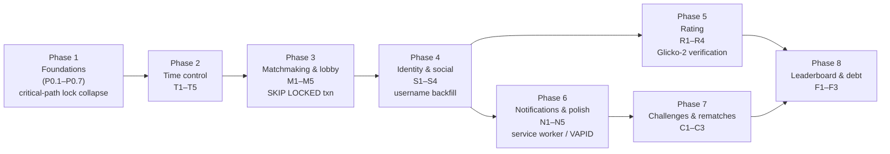

# Multiplayer — Delivery Plan

> The contract is `00-overview.md`. This file is the path from "now" to "the
> contract holds", in an order that is actually buildable, with acceptance gates
> that are actually checkable. It is the last chapter and the only one that may
> restate decisions made elsewhere for sequencing purposes.

## 0. How to read this plan

The work is organised into **eight phases**. Each phase has a single goal, a
list of deliverables drawn from the sibling chapters, a set of **gating
acceptance tests** that must pass before the next phase begins, and a list of
files touched. Phases are ordered so that no phase depends on a later one and
every load-bearing prerequisite (the P0 items in `00-overview.md` §5) lands
before anything that uses it.

The single hardest-won sequencing finding, surfaced independently by three
chapters (`02-realtime.md` §6, `03-time-control.md` §6,
`09-api-reference.md` key findings), is restated here because it dictates the
internal order of Phase 1:

> **P0.7 must precede P0.4.** `GameEngine::applyMove()` bumps `game.version`
> with a raw `UPDATE` and never writes the new value back to the managed entity
> (`src/Engine/GameEngine.php:66-76`); `$version` has no setter
> (`src/Entity/Game.php:47-49,168-171`). If `seq = Game.version` (invariant 9)
> is read before the two lock paths are collapsed, the payload for every
> non-terminal move carries `version - 1`, the client's `seq <= lastSeq` guard
> drops it, and **the opponent's board freezes silently on the very first
> move.** Worse, TimeControl proved the raw `UPDATE` then matches zero rows
> (the `flush()` already consumed the version) and **every non-terminal move
> throws** the moment any clock field lands on `Game`. The collapse is not a
> cleanup task; it is a functional prerequisite for the builder.

## 1. Pre-flight constants and amendments

Two constant-block amendments to `00-overview.md` §contract are required before
implementation, collected here so a single edit settles them:

| Constant | Value | Origin |
|---|---|---|
| `LEADERBOARD_MIN_GAMES` | `20` | `06-rating.md` Open question 2 |
| `LEADERBOARD_ACTIVE_DAYS` | `90` | `06-rating.md` Open question 2, justified by the RD-only retirement being ~547 days (§4.4) |

These are product knobs and must not be literals buried in a repository; they
are added to `MultiplayerLimits` in the same migration as the rating columns.

A one-line note is added to `00-overview.md` §4.4 recording the
`username_changed_at` storage column (accepted by `01-domain-model.md`).

No other open question amends the contract; the rest are implementation choices
owned by their chapter and listed in §9.

---

## Phase 1 — Foundations (the P0 block)

**Goal.** The platform can hold a two-human game: identity, schema, access
control, a single authoritative payload, and human moves that publish to Mercure
correctly. No new player-facing features yet; every existing AI and hot-seat
flow keeps working.

**Ordered deliverables** (top is a hard prerequisite of those below it):

1. **P0.7 — collapse the optimistic-lock scheme.** Read `03-time-control.md`
   §6 and `01-domain-model.md` §6.4. Drop the hand-rolled
   `UPDATE game SET version = version + 1` branch
   (`src/Engine/GameEngine.php:66-76`). Drop SERIALIZABLE isolation on the move
   path. Take `LockMode::PESSIMISTIC_WRITE` on the game row at transaction start;
   rely on Doctrine's native `#[ORM\Version]`. Set `lock_timeout` to 3 s. The
   HTTP 409 `concurrent_move` response is retained; `LockTimeoutException` now
   maps to it instead of `OptimisticLockException`/`RetryableException`.
   *This lands first because $game->getVersion() is correct afterwards.*

2. **P0.1 — usernames.** `01-domain-model.md` §6.1 + `05-social.md` §1.
   Migration `Version…090000` adds `user.username` (+ `username_changed_at`,
   `last_seen_at`, `notification_preferences`), backfills the derived handle,
   creates `uniq_user_username_lower`. Runtime: `UsernameGenerator` runs the
   same algorithm on first OIDC/dev-login/user-register. One-time change
   endpoint stub (settings page lands in Phase 4).
   - Sub-acceptance: the `LEAST`/`GREATEST` friendship index immutability
     check (`05-social.md` Open question 3) is run as a throwaway `CREATE INDEX`
     on a dev DB here; if it fails, `FriendshipManager` falls back to the
     `SELECT … FOR UPDATE` path and `01-domain-model.md` §4.7 is amended.

3. **P0.2 — `GamePlayer`; remove `owner`/`isWhite`.** `01-domain-model.md`
   §6.2–6.4. Two migrations: first the irreversible purge of ownerless
   pre-2026-03-27 games (`Version…091000`), then the `game_player` table +
   `created_by_id` + drop of `owner_id`/`is_white` (`Version…092000`).
   `GameFactory` becomes the sole constructor of `game` + two `game_player`
   rows. `GameRepository::findByUuid` now filters `deletedAt IS NULL` (fixes
   the existing bug). Hot-seat is two rows, same user, both colours.

4. **P0.3 — rewrite `GameVoter`.** Three attributes
   (`GAME_VIEW`/`GAME_PARTICIPATE`/`GAME_MANAGE`), per `00-overview.md` §4.3
   and `09-api-reference.md` §6. Also: narrow the `security.yaml:36`
   `{ path: ^/play, roles: ROLE_USER }` rule to `^/play/new`
   (`04-matchmaking.md` key decision), so multiplayer games become
   anonymously viewable and AI/hot-seat stay owner-only.

5. **P0.4 — `GameStatePayloadBuilder`.** `02-realtime.md` §5.
   One builder, byte-identical payloads in both the HTTP response and the
   Mercure publish. **Depends on P0.7** (see §0). The existing two divergent
   construction sites (`SubmitMoveAction` and `GameUpdatePublisher`) both
   delegate to it.

6. **P0.5 — human moves publish to Mercure; turn enforcement generalised.**
   Remove the `OpponentType::AI` gate from `SubmitMoveAction` (turn check +
   the `ProcessAiMoveMessage` dispatch) and from `PlayAction`. Turn
   enforcement becomes "is the acting participant the one whose colour is to
   move" via `GameVoter::GAME_PARTICIPATE` + parity. `SubmitMoveAction`
   calls `GameUpdatePublisher::publishGameState()` after commit.
   `GameController.handleMercureUpdate()` replaces its unconditional
   `setBoardLocked(false)` with the lock predicate from
   `08-frontend.md` §2 (derived: finished | submit-in-flight |
   history-browsing | spectator | side-to-move ≠ my-colour).
   `app.ts` removes the `OPPONENT_TYPE_AI` gate on `initializeMercure()`.

7. **P0.6 — private Mercure topics + subscriber JWT.** `02-realtime.md`
   §3. A `kernel.response` listener issues the Mercure authorization cookie
   via `Authorization::setCookie()` with the user's topic selectors;
   `config/packages/mercure.yaml` gains an explicit `jwt.subscribe` claim;
   Caddy keeps `anonymous` (public game topic still works); the logout handler
   clears the cookie. `user/{uuid}` and `lobby/seeks` topics are declared but
   **unused until Phases 3 and 5**.

**Gating acceptance (all must pass before Phase 2):**

- `G1` Two browsers logged in as different dev-login users can see each
  other's move arrive live over Mercure. Verify: log `seq` client-side,
  confirm it increments by 1 per move and never repeats.
- `G2` A human move does **not** 500 when the engine round-trips in >100 ms;
  the clock-equivalent timing is captured at controller entry (the
  `$receivedAt` hook from `03-time-control.md` §2 is in place even though no
  clock reads it yet).
- `G3` `composer cs:check` clean; `docker compose exec node npm run type-check`
  returns zero errors.
- `G4` Existing AI and hot-seat games still play end-to-end (the
  `window.__keresDebug` automation hook at `app.ts:149-172` covers this).
- `G5` `game_player` has exactly two rows per game and exactly one
  `user_id IS NULL` row iff `opponent_type_value = 0` — the three
  verification queries in `01-domain-model.md` §6.3 each return `0`.
- `G6` An anonymous visitor can `GET /play/{humanGameUuid}` and sees the
  board; the same visitor `GET /play/{aiGameUuid}` is denied (404, per the
  404-vs-403 rule in `09-api-reference.md` §2.5).

## Phase 2 — Time control

**Goal.** A real-time human-vs-human game runs a correct server-authoritative
clock, flags in real time without polling, and adjudicates fairly under
concurrency, disconnect, and worker outage.

**Deliverables:**

- `ClockManager`, `ClockAdjudicator`
  (`03-time-control.md` §1, §4–§5). The `$receivedAt` capture in
  `SubmitMoveAction` from P0.5/G2 now actually charges the clock.
- `game.time_control_kind` / `initial_seconds` / `increment_seconds` /
  `days_per_move` / `speed_category` / `clock_turn_started_at` /
  `move_deadline_at` columns + the custom `TimestampTzMicroType` DBAL type
  (`01-domain-model.md` §2.3, §6.4) — `timestamptz(6)` for the two anchors.
- `CheckClockExpiryMessage` + handler, dispatched with `DelayStamp` per
  move; the lazy adjudication on every authenticated read; the explicit
  `POST /play/{uuid}/claim-timeout` endpoint.
- `GameLifecycleManager::abort()` and the 30 s first-move clamp
  (`03-time-control.md` §7). Aborted games are unrated by construction
  (invariant 3 clause 4; `06-rating.md` §6.1 clause 4).
- The correspondence deadline path and `CorrespondenceNudgeMessage`
  (`03-time-control.md` §9) are implemented but **not exposed** in the UI
  until Phase 6.
- `appveyor`: `idx_game_move_deadline` partial index.

**Gating acceptance:**

- `T1` A 1+0 game: the side to move lets the clock hit zero; the delayed
  message fires within `CLOCK_EXPIRY_GRACE_MS` and the game ends as
  `endReason = timeout`; the opponent's clocked-remaining is unchanged.
- `T2` Two moves submitted <100 ms apart: the second is accepted at 100 ms
  of elapsed clock (lag compensation), not the full wall-clock delta.
- `T3` Kill the worker container mid-game; the delayed message is stranded
  in `messenger_messages`; on the next authenticated read of the game
  (heartbeat or page load), the lazy path adjudicates and publishes. The
  game ends correctly. (This is the `03-time-control.md` §10 degradation
  matrix.)
- `T4` Two tabs race a move on the same game: the loser gets 409
  `concurrent_move` (now from `LockTimeoutException`); the client surfaces
  it and re-syncs.
- `T5` A game aborted before ply 4 has `endReason = aborted`,
  `gameOverAt` set, and no `GamePlayer.ratingAfter` is ever written.

## Phase 3 — Matchmaking & lobby

**Goal.** A player can quick-pair and join a rated real-time game; the lobby
is live; pairings are race-free on Postgres.

**Deliverables:**

- `seek` table + migration (`01-domain-model.md` §6.5), `SeekMatcher`,
  the `SELECT … FOR UPDATE SKIP LOCKED` pairing transaction
  (`04-matchmaking.md` §3.4–§3.5), `ExpireSeekMessage`.
- The lobby endpoints (`09-api-reference.md` §3.1):
  `GET /lobby`, `GET /lobby/seeks`, `POST /lobby/seeks`,
  `POST /lobby/seeks/quick` (presets `1+0`/`3+2`/`5+0`/`10+0`/`15+10` and
  the correspondence `corr1`/`corr3`/`corr7`), heartbeat, cancel, accept.
- `security.yaml`: `/lobby` is public; the seek-creating/mutating routes
  require `ROLE_USER`.
- Rate limiters `seek_create`/`seek_accept`/`seek_heartbeat`/`lobby_read`
  (no `_limiter` suffix — `09-api-reference.md` §7 finding on the autowire
  alias), declared in `rate_limiter.yaml`.
- The `lobby/seeks` Mercure topic and `SeekEventClient`/`LobbyController`
  on the frontend (`08-frontend.md` §5).
- Quick-pair buttons emit real-time seeks only; `auto_widen` is forced true
  for `REALTIME` and false for `UNLIMITED`/`CORRESPONDENCE`
  (`04-matchmaking.md` §1.3 — correspondence cannot widen because the
  seeker's tab is closed).
- `lobby/seeks` SSE goes live (P0.6's private-topic mechanism made it
  public-by-default; the cookie does not need widening for it).

**Gating acceptance:**

- `M1` One player posts `3+2`; nobody is in the pool; the seek appears in
  a second browser's lobby list within one heartbeat.
- `M2` Two players quick-pair 3+2 within 200 rating points: both are
  dropped into the same game; both `seek.status = MATCHED`; exactly one
  `game` row + two `game_player` rows exist.
- `M3` Two players 1000 points apart both quick-pair: they do **not** pair
  for ~16 s (`w(t) >= 1000` ⇒ `t >= 16`), then they do.
- `M4` All ten races in `04-matchmaking.md` §7 are reproduced in a
  Playwright two-browser harness; none produces a double game, a zombie
  seek, or a 500.
- `M5` `seek_one_open_per_user`: a second `POST /lobby/seeks` from the
  same user returns the existing seek with `deduped:true` (per
  `09-api-reference.md` §4.1 precondition 2), not a 409.

## Phase 4 — Identity & social foundations

**Goal.** Usernames are usable, profiles exist, friendships work, blocking is
honoured by matchmaking.

**Deliverables:**

- `User.username_changed_at` one-time-change endpoint at
  `/settings/profile` (`05-social.md` §1.7, `09-api-reference.md` §4.7).
- `friendship` table + migration (`01-domain-model.md` §6.6),
  `FriendshipManager`, the friends endpoints
  (`GET /friends`, `POST /friends/request`, accept/decline/remove/block/
  unblock), the `ChallengeVoter`.
- `/players/search?q=` prefix search with the enumeration policy from
  `05-social.md` §2 (username-only, no email oracle). The
  `RegisterAction.php:45-46` email-enumeration leak is fixed in this phase
  (`05-social.md` Open question 5): generic success flash + "account
  already exists" email on collision.
- `GET /@/{username}` profile page and `GET /@/{username}/games`
  paginated history (`05-social.md` §9, `08-frontend.md` §7). No profile
  page existed at all before this phase.
- The `user/{uuid}` Mercure topic goes live (P0.6 declared it; this phase
  publishes `friend_request`/`friend_accepted`/`challenge_*` to it).
- `SeekMatcher`'s compatibility predicate consults the block anti-join
  (`05-social.md` §4.4, already in the `01-domain-model.md` §5 SQL).
- Account settings page (`/settings/profile`) with notification-preference
  matrix stub (preferences are stored but no push subsystem exists yet).

**Gating acceptance:**

- `S1` User A sends a friend request to B; B sees it in `user/{b}` SSE
  within 1 s; B accepts; A sees `friend_accepted`.
- `S2` A blocks B; A then quick-pairs in a pool where B has an open seek;
  B's seek is never returned to A and vice versa (reproduce the race-free
  anti-join in `M4` harness).
- `S3` Searching `/players/search?q=nonexistent` returns an empty list,
  not a 404; searching by email returns empty (email is not a username).
- `S4` `GET /@/{username}` renders the five rating rows as `?` (no rated
  games yet exist) and a paginated, empty game history, not a 500.

## Phase 5 — Rating

**Goal.** Rated real-time games produce correct Glicko-2 updates, visible
after the game.

**Deliverables:**

- `user_rating` table + migration (`01-domain-model.md` §6.7),
  `Glicko2Calculator` (pure, Doctrine-free), `RatingUpdater` with lazy RD
  inflation on both read (pairing) and update (finish).
- `GameFactory` sets `game.rated` from the originating seek; the rated
  predicate (invariant 3) is enforced at finish by `RatingUpdater`.
- `GamePlayer.ratingBefore`/`ratingDeviationBefore`/`ratingAfter`/
  `provisionalBefore` written exactly once at the `gameOverAt` transition,
  inside that transaction (invariant 4).
- `GameStatePayload.rating` populated post-finish and only when rated
  (`02-realtime.md` §4).
- `LEADERBOARD_MIN_GAMES`/`LEADERBOARD_ACTIVE_DAYS` in `MultiplayerLimits`.
- Profile and settings pages now show real ratings.

**Gating acceptance:**

- `R1` Reproduce `06-rating.md` §2.5 worked example A as a unit test
  against `Glicko2Calculator`; the four-decimal outputs match the paper's
  `1464.06 / 151.52 / 0.05999` (the chapter's self-verification already
  confirms this; the test fixtures are in the chapter).
- `R2` A rated game between a provisional (1500/350) player and an
  established (1800/60) player: the provisional moves ~±150, the
  established moves ~±5; deltas do **not** sum to zero
  (`06-rating.md` finding on per-game approximation).
- `R3` A player inactive for 30 rating periods (210 days): their displayed
  rating is unchanged numerically but the `?` provisional marker
  reappears (RD crossed 110 via lazy inflation — §4).
- `R4` An aborted game and a timeout at ply 2 both leave every
  `GamePlayer.ratingAfter` NULL (invariant 3 clauses 4/5).

## Phase 6 — Notifications & social polish

**Goal.** Browser notifications work (in-tab and Web Push), the toast system
replaces `alert()`/`confirm()`, draw offers and rematches work, correspondence
is exposed, presence indicators render.

**Deliverables:**

- `push_subscription` + `notification` tables + migrations
  (`01-domain-model.md` §6.8–§6.9).
- `minishlink/web-push` v11.0.0 and `nyholm/psr7` added to `composer.json`
  (the PSR-17 factory gap from `07-notifications.md` §2).
- `public/sw.js` hand-written at origin root (not a Vite entry),
  `Service-Worker-Allowed` header in the Caddyfile, the completed
  `site.webmanifest`, `<meta name="theme-color">` in `base.html.twig`
  (`07-notifications.md` §2–§3, `08-frontend.md` §7 open question 5).
- VAPID env vars; `/push/public-key`, `/push/subscribe`, `/push/unsubscribe`.
- `SendPushNotificationMessage` + `WebPushSender`; the anti-annoyance rules
  N1–N7, especially never Web-Push a realtime `your_turn` to a live SSE
  connection.
- `utils/toast.ts` replacing the three `alert()` sites in
  `GameController.ts` and the `confirm()` sites in play/new_game templates.
- Draw offers (`POST /play/{uuid}/draw/{offer,accept,decline}`,
  `05-social.md` §7, `Game.draw_offered_by_color`), rematch offers
  (`POST /play/{uuid}/rematch/{offer,accept,decline}`, `05-social.md` §6).
- The `user/{uuid}` SSE client (`UserEventClient`,
  `08-frontend.md` §5), wiring the notification inbox, unread badge, and
  notification-centre page.
- Correspondence presets exposed in the lobby (`corr1`/`corr3`/`corr7`);
  correspondence `your_turn` nudges fire via Web Push + email (the
  `MAILER_DSN` from `deploy/compose.yaml` must be real for email;
  `07-notifications.md` §10).
- `PresenceTracker` and in-game presence rendering
  (`PlayerPanelView`, `08-frontend.md` §5); `GamePlayer.last_seen_at`
  heartbeat via `/play/{uuid}/presence`.
- `ClockView` (`08-frontend.md` §4) goes live with `ClockSync` offset
  estimation and `requestAnimationFrame` interpolation; rejects
  self-declaration of a local flag (`T1` already covers the server side).
- `game_player.last_push_at` column added as per
  `07-notifications.md` Open question 2 (the realtime `YOUR_TURN`
  notification mints no durable row, so the interval cannot be derived
  from `notification.created_at`).

**Gating acceptance:**

- `N1` Grant notification permission from a settings-page gesture (never
  on load: `07-notifications.md` §5). Background a correspondence game;
  receive a Web Push "your turn"; clicking it focuses the existing tab or
  opens the game.
- `N2` A realtime `your_turn` is **never** Web-Pushed while the player's
  game-page SSE is connected; it is not even minted as a `Notification`
  row.
- `N3` The toast system renders an incoming challenge from a second user
  across both tab states (focused + backgrounded).
- `N4` A draw offer renders on both clients; accepting ends the game as
  `endReason = draw_agreed` with both `GamePlayer.ratingAfter` written
  (draw = 0.5 each); the 6-ply cooldown blocks a re-offer.
- `N5` The opponent's presence dot goes "offline" within
  `SEEK_HEARTBEAT_INTERVAL_MS` of tab close; the clock does not pause
  (`03-time-control.md` §8.2) and the game continues.

## Phase 7 — Challenges & rematches fully wired

**Goal.** Directed challenges and open shareable links work end-to-end,
including the friend-invite flow that was the original ask.

**Deliverables:**

- `challenge` table + migration (`01-domain-model.md` §6.6),
  `ChallengeManager`, `ChallengeVoter`.
- `POST /challenge`, accept/decline/cancel endpoints
  (`09-api-reference.md` §3.2); `GET /challenge/{uuid}` landing page
  (`08-frontend.md` §7) with the anonymous/open-link states from
  `05-social.md` §5.
- `ExpireChallengeMessage` with the two TTLs
  (`CHALLENGE_TTL_SECONDS` / `OPEN_CHALLENGE_TTL_SECONDS`).
- The friend-invite path: a profile-page "Challenge" button creates a
  directed challenge; `challenge_received` is pushed over `user/{uuid}`
  and, when Phase 6 has landed, Web-Pushed if the recipient is away.
- Rematch accept creates a new game with colours swapped and the same
  time control (`05-social.md` §6).

**Gating acceptance:**

- `C1` An open challenge link opened by an anonymous visitor renders
  "log in to accept"; once logged in, the accept transaction creates
  exactly one game and flips the challenge to `ACCEPTED` (invariant 12).
- `C2` The same open link clicked by a third user after acceptance
  returns 410 `challenge_expired` (mapped, not a 404).
- `C3` A rematch offer accepted by the opponent produces a new game with
  inverted colours and byte-identical time control; the old game is
  unaffected and immutable (invariant 5).

## Phase 8 — Leaderboard & final polish

**Goal.** The last in-scope lichess feature ships, the known small debts are
paid, and the spec's invariants are enforced as tests.

**Deliverables:**

- `GET /leaderboard/{category}` (`09-api-reference.md` §3.8) with the
  `LEADERBOARD_MIN_GAMES` + `LEADERBOARD_ACTIVE_DAYS` filters; empty pools
  render "no rated games yet" at 200, never 404 (notably `classical`, which
  no quick-pair preset reaches — `06-rating.md` Open question 5).
- A `30+0` (or similar) quick-pair preset is **evaluated** here, not
  added by default. The `classical` pool is intentionally sparse; adding a
  preset is a product call, deferred.
- **`EngineApi` HTTP timeout.** `03-time-control.md` Open question 7
  flagged a hung engine request pinning a FrankenPHP thread. Add a
  `framework.http_client` config with a bounded timeout for the engine
  client (`09-api-reference.md` maps non-200 to `upstream_unavailable`/
  `upstream_timeout`). The clock is unaffected (§2.2 charges nobody for
  engine time) but the server no longer wedges.
- The dead `/api/engine-move` client call (`GameAPI.ts:110`, for which no
  route exists — `09-api-reference.md` key finding) is deleted; the
  `ask-engine` button already routes through the move-submission path.
- The dead `src/Event/GameUpdateEvent.php` is deleted (confirmed undispatched;
  `02-realtime.md` §7 recommends deletion over wiring).
- Sidus admin routes answer every verb; the state-changing
  `sidus_admin.Feedback.edit` is constrained to POST/GET (preferably POST)
  (`09-api-reference.md` key finding). Out of strict scope but a one-line
  fix that closes a CSRF-adjacent hole opened by the same work.

**Gating acceptance (final):**

- `F1` Every invariant in `00-overview.md` §8 has a passing assertion or
  test. The chapter-level enforcement points in `01-domain-model.md` §8
  become the test catalogue; the residual "service-only" rows each get a
  behavioural test that fails on the obvious violation.
- `F2` The full multiplayer smoke: dev-login as two users in two
  browsers, one quick-pairs 3+2, the other matches, a game plays to
  mate, both see the rating delta on their profiles, the winner receives
  a `game_finished` notification, the loser can rematch, the rematch
  inverts colours, a `30+0` game is findable in the classical leaderboard
  once one exists. End-to-end, no framework, no manual DB edits.
- `F3` `composer cs:check` clean; `npm run type-check` zero errors;
  `doctrine:migrations:migrate --dry-run` applies the eight migrations in
  order with no drift on a fresh schema.

---

## 2. Effort and risk map

| Phase | Risk | Mitigation (where it lives) |
|---|---|---|
| 1 | The lock collapse breaks an existing AI flow | P0.7 is behaviour-preserving for the no-clock case; gated by G3/G4 |
| 1 | `created_by_id NOT NULL` fails on ownerless games | The purge migration (§6.2) runs first and asserts the count is 0; it is separately irreversible |
| 1 | Postgres rejects `LEAST`/`GREATEST` over `uuid` in the friendship index | Verified in P0.1 sub-acceptance; fallback is the `SELECT … FOR UPDATE` path |
| 2 | The clock and the optimistic lock collide | Resolved by P0.7 landing in the same phase as clocks |
| 2 | A stranded clock message with the worker down | T3 reproduces it; the lazy read path is the safety net |
| 3 | Pairing races produce a double game or a zombie seek | All ten races in `04-matchmaking.md` §7 are acceptance tests (M4) |
| 4 | The `username` backfill collides case-insensitively | The DO-block dedupe in `01-domain-model.md` §6.1 converges |
| 5 | The Glicko-2 math is implemented wrong | R1 transcribes the paper's own example as the test |
| 6 | Web Push is silently broken on iOS Safari | N1 covers a real device; the degradation matrix in `07-notifications.md` §11 makes the fallback explicit |
| 7 | An open link is accepted twice | C2 reproduces the post-accept state |
| 8 | The classical pool is empty and looks broken | F2 accepts the "no rated games yet" 200 as correct |

## 3. What is deliberately not in this plan

- **Premoves** (`08-frontend.md` Open question 1). Bullet play is
  materially worse without them, but they require server-side legality
  validation on submission, which is engine work. Recorded here; built
  only if 1+0 p95 exceeds ~250 ms (Open question 3).
- **Anti-cheat / engine-use detection.** Named as a known gap in
  `00-overview.md` §2.1; not solvable on a gameplay-agnostic platform
  without heuristics that belong to their own spec.
- **In-game chat, tournaments, spectating UX.** Out per §2.1; games are
  viewable but no spectator affordances are built.
- **Vacation/pause for correspondence** (`03-time-control.md` §9).
- **A "friends-only challenges" account gate** (`05-social.md` Open
  question 9).
- **Redis.** Postgres-only by D7; `00-overview.md` §7 names the exact
  thresholds that would force a switch.

## 4. Consolidated open-questions register

Every open question raised across the nine chapters, resolved to its
disposition. The contract (`00-overview.md`) is amended only where this table
says so; everything else is an implementation choice owned by its chapter.

| # | Source | Question | Disposition |
|---|---|---|---|
| 1 | `01` | `timestamptz(6)` custom DBAL type | **Add `App\Doctrine\Types\TimestampTzMicroType`** — stock Doctrine hard-codes precision 0 on Postgres |
| 2 | `01` | Pre-existing ownerless games block `created_by_id NOT NULL` | **Purge migration** (Phase 1, P0.2); irreversible, asserted |
| 3 | `01` | `OwnerRepository::findByProviderAndProviderId` is dead | Delete in Phase 1 cleanup (it would throw if called) |
| 4 | `01` | `AdminStatsRepository` `COUNT(DISTINCT g.owner)` and the hot-seat double-count trap | Rewritten to `COUNT(DISTINCT g.id)` over a `game_player` join (Phase 1 P0.2) |
| 5 | `02` | Mercure hub transport defaults to Bolt, so Last-Event-ID replay works in dev by accident only | Specify mandatory HTTP resync on reconnect; rely on `GET /play/{uuid}/state` |
| 6 | `02` | `user/{uuid}` as a topic *selector* matches every user (RFC 6570) | Build the JWT claim with explicit topic strings, never string interpolation — a total auth bypass otherwise |
| 7 | `02` | The hub is injected with the generic `http_client` and has no timeout | Scope a dedicated client config with a bounded timeout for publishes; a wedged hub must not stall a committed move |
| 8 | `03` | Is `RATED_MIN_PLIES` per side or total? | **Per side** (`min(whitePlies, blackPlies) >= 2`, total >= 4); agreed by Rating and adopted via `Game::hasReachedRatedPlyFloor()` |
| 9 | `03` | Does White's clock run during the 30 s first-move window? | **Yes** — one anchor, one formula, no special case |
| 10 | `03` | Engine HTTP timeout? | **Yes**, Phase 8 (the clock is safe without it; a wedged request still pins a thread) |
| 11 | `03` | Presence-transition `version` bump | Explicit `UPDATE … version + 1` under the lock, written back via `em->refresh()`; no schema change |
| 12 | `04` | Correspondence seeks cannot auto-widen | `auto_widen` forced false for `CORRESPONDENCE`/`UNLIMITED` |
| 13 | `04` | `last_heartbeat_at` is deliberately unindexed | Adopted; HOT updates, fillfactor 70 |
| 14 | `04` | Correspondence seek TTL | Use `SEEK_TTL_SECONDS` for realtime, `CHALLENGE_TTL_SECONDS` for correspondence; a dedicated `CORRESPONDENCE_SEEK_TTL_SECONDS` is a future amendment if the smell bites |
| 15 | `05` | `RegisterAction` discloses email registration | Fix in Phase 4: generic success + "account already exists" email |
| 16 | `05` | `LEAST`/`GREATEST` over `uuid` in friendship index | Verify with a throwaway `CREATE INDEX` in P0.1; fallback is `SELECT … FOR UPDATE` in `FriendshipManager` |
| 17 | `05` | Hot-seat games on the profile list | Visible on self-view, hidden on public view |
| 18 | `06` | `40` multiplier in `estimated = initial + 40*increment` | Keep; re-tune only with measured Keres game-length data |
| 19 | `06` | `LEADERBOARD_MIN_GAMES` / `LEADERBOARD_ACTIVE_DAYS` | **Added to `MultiplayerLimits`** (§1 of this file) |
| 20 | `06` | No `rating_deviation_after` stored | Not added; the four contracted columns suffice |
| 21 | `06` | Glicko VOs namespace | `App\Model\Glicko\*` per AGENTS.md's Model-VO rule |
| 22 | `06` | Multi-accounting across two networked sessions | Out of scope; an anti-abuse layer, not a predicate hole |
| 23 | `07` | `notification_preferences` JSON vs JSONB | **JSON**, matching the existing `"user".roles` column (`01-domain-model.md` §4.1 justification); the `version` key is reserved for additive schema growth |
| 24 | `07` | `game_player.last_push_at` column | **Added** in Phase 6 (needed for N4 — realtime `YOUR_TURN` mints no durable row) |
| 25 | `07` | Quiet hours | Ship without; add `notificationPreferences.quietHours` later via the reserved `version` key |
| 26 | `07` | Correspondence nudge fraction | Ship 50% as `NotificationLimits::CORRESPONDENCE_NUDGE_FRACTION` |
| 27 | `07` | `GET /notifications/unread-count` polling | Allowed at most once/minute while visible; SSE fallback for proxy-blocked clients |
| 28 | `08` | Premoves | Out of scope; recorded here, revisited only if 1+0 p95 > ~250 ms |
| 29 | `08` | Service worker file location | Hand-written `public/sw.js`, not a Vite entry |
| 30 | `08` | Correspondence category filter | Client-side on `TimeControlRef.daysPerMove`; no new category |
| 31 | `09` | Rate-limiter autowire alias suffix | New limiters drop the `_limiter` suffix (no `services.yaml` bind needed) |
| 32 | `09` | JSON endpoints return 302+HTML to anonymous callers | Resolved by the `_api` route flag + decorated entry point + `kernel.exception` listener |
| 33 | `09` | SameSite cookie_domain is a parent domain — sibling-subdomain CSRF risk | Named as explicit trigger to adopt an `X-CSRF-Token` header; ship SameSite=Lax + Sec-Fetch-Site/Origin checks for now |
| 34 | `09` | Dead `GameAPI.ts:110 /api/engine-move` call | Delete in Phase 8 |
| 35 | `09` | Sidus admin routes answer every verb incl. GET-mutations | Constrain the state-changing Feedback edit to POST in Phase 8 |
| 36 | `09` | `UndoMoveAction` returns raw base64 as `text/html` | Migrate to the unified envelope returning `GameStatePayload` (consistent with the move response) |
| 37 | `09` | `GameAPI.ts:110` references no extant route | Same as #34 |

## 5. What an implementer does first

1. Read `00-overview.md` §0 end to end.
2. Implement P0.7 from `03-time-control.md` §6 — the single change that
   unblocks everything else.
3. Run the Phase 1 gating tests G1–G6.
4. Then proceed phases in order; each phase's gating block is the only
   thing that decides whether the next may begin.

The spec is complete. The contract holds at every phase boundary.